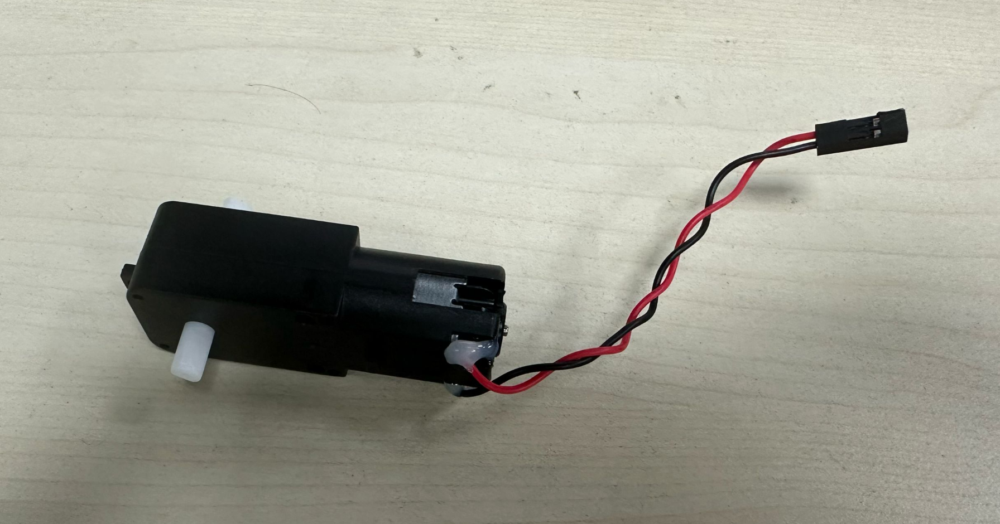
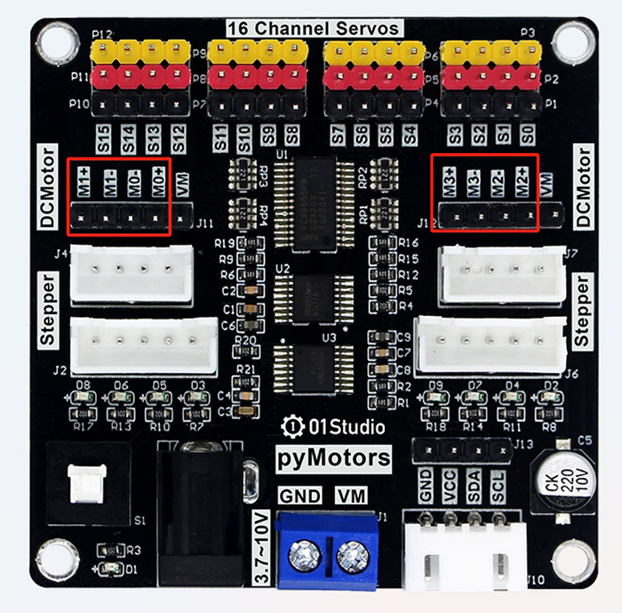
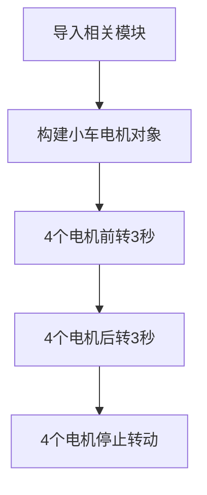
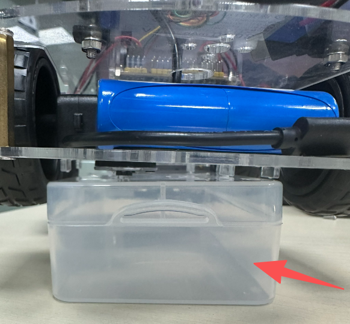
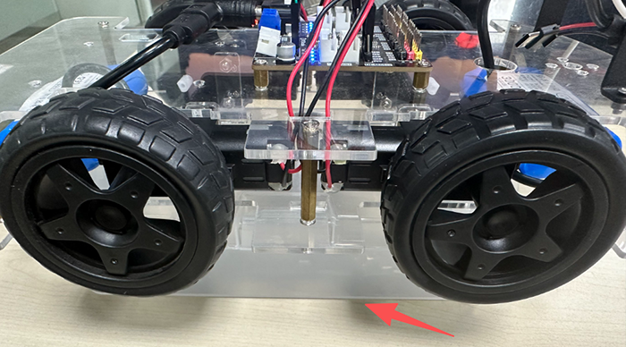
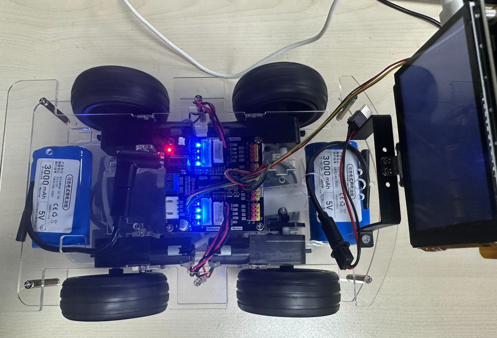

# 小车电机控制

## 前言

本机教程使用的直流电机为常用的TT马达，2个引脚，支持正转和反转，常用于智能小车等场景。



## 实验目的

学习K230控制小车直流电机。

## 实验讲解

直流电机本质通过2个引脚施加电压控制正反转，通过PWM调速。下图是一个电压为5V在不同占空比下等效电压示意图。**占空比越大，等效电压越高，电机转动速度就越快。**


小车使用的pyMotors电机模块最大支持4路直流减速电机。M0到M3接口，+表示正，-表示负。



## Motors对象

直流电机的microppython驱动库已经封装好，位于motor.py和pca9685.py ,只需要在主函数初始化I2C2和调用即可。

### 构造函数

```python
from motor import Motors

...

m=Motors(i2c) 
```
构建4路直流电机对象。

### 使用方法

```python
m.speed(index, value=0)
```
电机控制函数。

- `index`: 值为 0~3 ，表示4个直流电机的编号；
- `value`: 速度值。范围：-4095~4095，正负表示转向，绝对值越大速度越快；

<br></br>

运行前需要将 motor.py和pca9685.py 文件发送到CanMV U盘 `sdcard`根目录。

代码编写流程如下：



## 参考代码

```python
'''
# Copyright (c) [2025] [01Studio]. Licensed under the MIT License.

实验名称：小车电机控制
实验平台：01Studio CanMV K230
说明：同时控制4路直流减速电机
'''

from machine import I2C,FPIOA
from motor import Motors
import time

#将GPIO11,12配置为I2C2功能
fpioa = FPIOA()
fpioa.set_function(11, FPIOA.IIC2_SCL)
fpioa.set_function(12, FPIOA.IIC2_SDA)

i2c = I2C(2) #构建I2C对象
#print(i2c.scan())

#构建4路直流电机对象
m=Motors(i2c)

#直流电机对象使用用法，详情参看motor.py文件
#
#m.speed(index, value=0)
#index: 0~3表示4路直流电机
#value: 速度。-4095~4095，正负表示转向，绝对值越大速度越大


#前进
m.speed(0,3000) #直流电机0正转，速度0~4095,4095表示最快速度
m.speed(1,3000)
m.speed(2,3000)
m.speed(3,3000)

time.sleep(3)

#后退
m.speed(0,-3000) #直流电机0反转，速度0~-4095,-4095表示反转最快速度
m.speed(1,-3000)
m.speed(2,-3000)
m.speed(3,-3000)

time.sleep(3)

#制动停止,速度值为0
m.speed(0, 0) 
m.speed(1, 0)
m.speed(2, 0)
m.speed(3, 0)

```

## 调试技巧

为了方便调试，避免电机转动导致小车跑动，可以在小车底盘下方放置一个尺寸合适的盒子，将轮胎撑起，然后做相关调试。






## 实验结果

将资料包示例代码配套的 motor.py和pca9685.py 库文件发送到CanMV U盘 sdcard根目录。


运行代码，可以看到小车的4个轮子前进，后退，停止。




