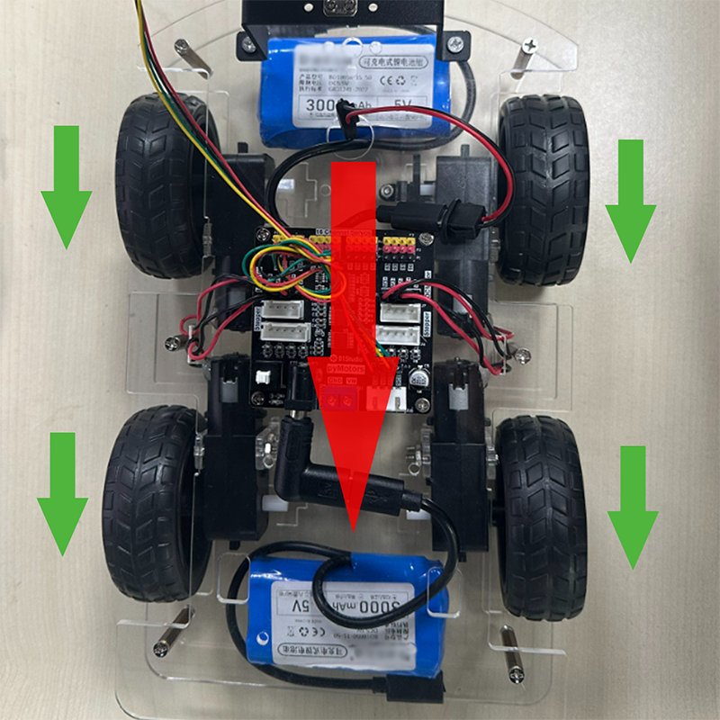
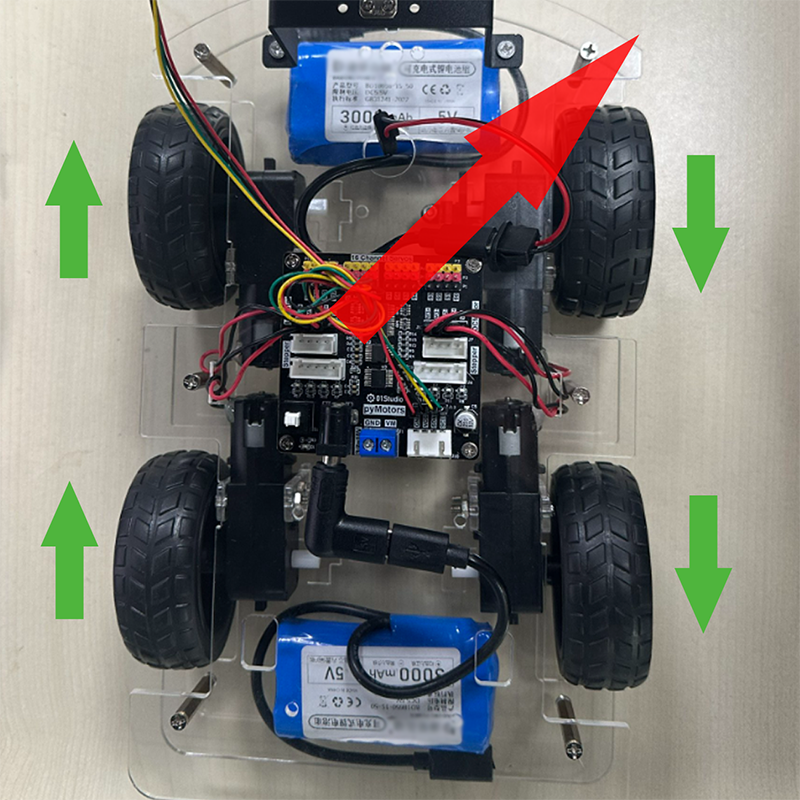
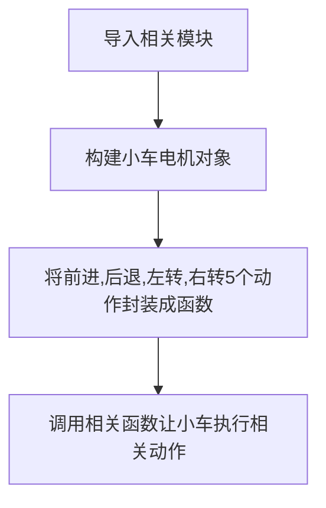
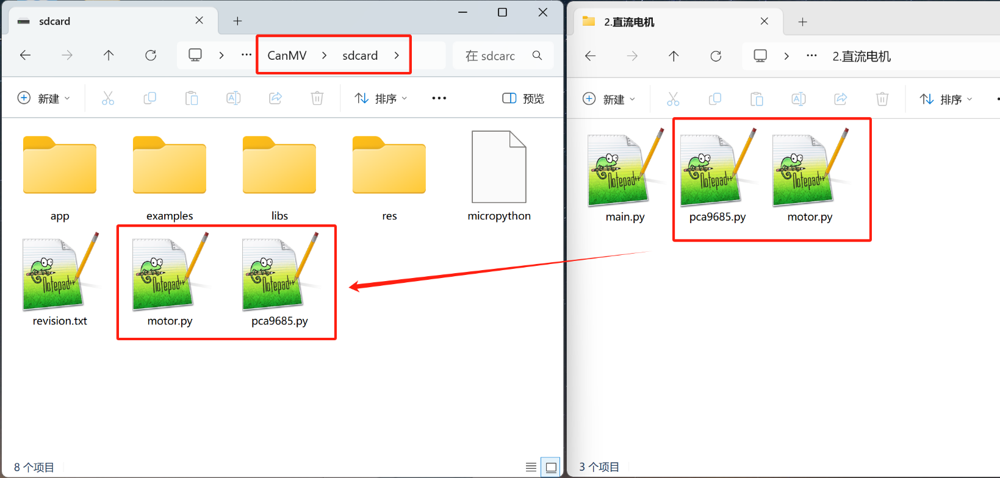
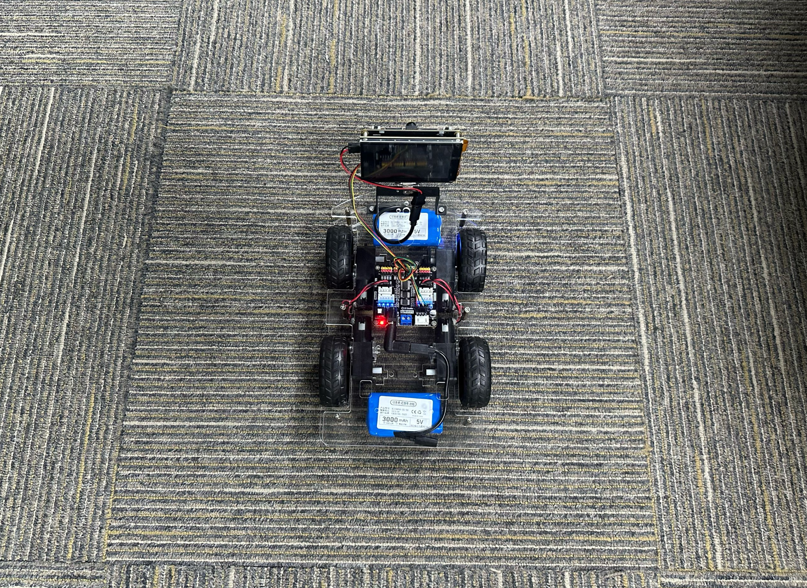

# 小车动作

## 前言

上一节我们学习了电机的控制，这节来学习小车的各类动作控制，如前进、后退、左转、右转。

## 实验目的

学习K230控制小车执行各种动作。

## 实验讲解

上一节我们学习了电机的控制方法，实现了对电机正转、反转、停止和转速的控制。这款小车底盘由4个电机组成，每个电机可以独立控制，通过不同的方向和速度可以实现小车的**前进、后退、左转、右转**功能。 这种控制方式称为**差速控制**小车。

- 前进

当4个电机同时正转（向前转）时，小车前进。电机的速度越大小车的前进速度越快。


- 后退

当4个电机同时反转（向后转）时，小车后退。电机的速度越大小车的后退速度越快。



- 左转

当左侧2个电机（M0,M1）反转（向后转），右侧2个电机（M2,M3）正转（向前转），小车左转。两侧电机的速度相差越大小车的转弯角度越大。


- 右转

当左侧2个电机（M0,M1）正转（向前转），右侧2个电机（M2,M3）反转（向后转），小车右转。两侧电机的速度相差越大小车的转弯角度越大。。




## Motors对象

直流电机的microppython驱动库已经封装好，位于motor.py和pca9685.py ,只需要在主函数初始化I2C2和调用即可。

### 构造函数

```python
from motor import Motors

...

m=Motors(i2c) 
```
构建4路直流电机对象。

### 使用方法

```python
m.speed(index, value=0)
```
电机控制函数。

- `index`: 值为 0~3 ，表示4个直流电机的编号；
- `value`: 速度值。范围：-4095~4095，正负表示转向，绝对值越大速度越快；

<br></br>

运行前需要将 motor.py和pca9685.py 文件发送到CanMV U盘 `sdcard`根目录。

代码编写流程如下：



## 参考代码

```python
'''
# Copyright (c) [2025] [01Studio]. Licensed under the MIT License.

实验名称：小车动作控制
实验平台：01Studio CanMV K230 + 小车底盘
'''

from machine import I2C,FPIOA
from motor import Motors
import time

#将GPIO11,12配置为I2C2功能
fpioa = FPIOA()
fpioa.set_function(11, FPIOA.IIC2_SCL)
fpioa.set_function(12, FPIOA.IIC2_SDA)

i2c = I2C(2) #构建I2C对象
#print(i2c.scan())

#构建4路直流电机对象
m=Motors(i2c)

#直流电机对象使用用法，详情参看motor.py文件
#
#m.speed(index, value=0)
#index: 0~3表示4路直流电机
#value: 速度。-4095~4095，正负表示转向，绝对值越大速度越大

#前进
def forward():

    m.speed(0,3000) #直流电机0正转，速度0~4095,4095表示最快速度
    m.speed(1,3000)
    m.speed(2,3000)
    m.speed(3,3000)

#后退
def backward():

    m.speed(0,-3000) #直流电机0反转，速度0~-4095,-4095表示反转最快速度
    m.speed(1,-3000)
    m.speed(2,-3000)
    m.speed(3,-3000)

#左转
def turn_left():

    m.speed(0,-3000)
    m.speed(1,-3000)
    m.speed(2,3000)
    m.speed(3,3000)

#右转
def turn_right():

    m.speed(0,3000)
    m.speed(1,3000)
    m.speed(2,-3000)
    m.speed(3,-3000)

#停止
def stop():

    m.speed(0,0) #直流电机0停止
    m.speed(1,0)
    m.speed(2,0)
    m.speed(3,0)

forward() #前进
time.sleep(3)

backward() #后退
time.sleep(3)

turn_left() #左 转
time.sleep(3)

turn_right() #右转
time.sleep(3)

stop()
```

## 调试技巧

为了方便调试，避免电机转动导致小车跑动，可以在小车底盘下方放置一个尺寸合适的盒子，将轮胎撑起，然后做相关调试。


## 实验结果

将资料包示例代码配套的 motor.py和pca9685.py 库文件发送到CanMV U盘 sdcard根目录。



将代码以main.py发送到开发板[离线运行](../getting_start/run_offline.md), 然后放置在底面，使用前面的锂电池给K230上电，可以看到小车一次完成前进，后退，左转，右转动作。




