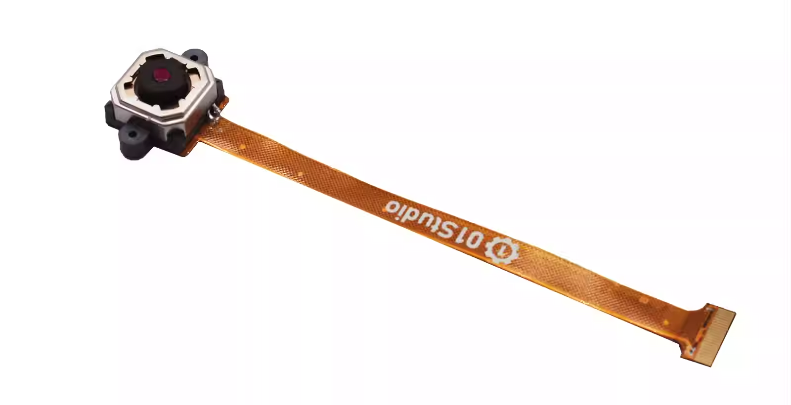
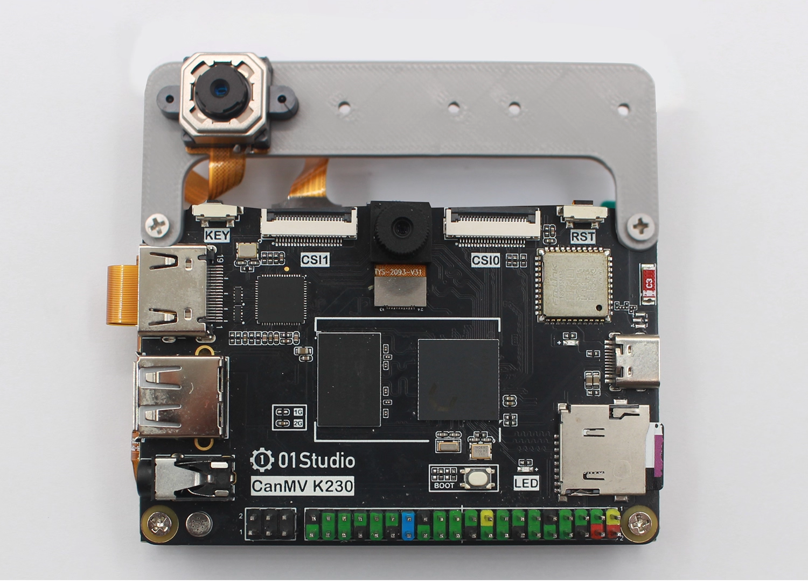
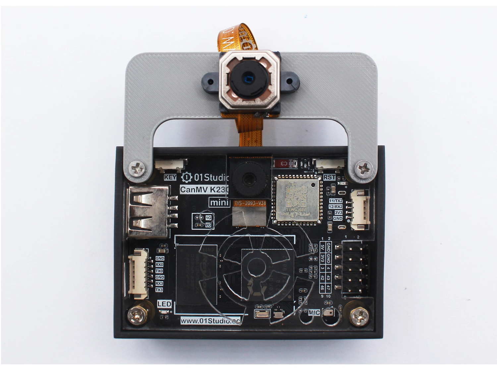

# 配件安装使用

本节介绍01Studio CanMV K230相关配件模块的安装和使用方法。

## 散热片

散热片能帮助CanMV K230更加有效散热，特别在高温的环境下实现稳定工作。安装也是很简单，将散热片底部的3M胶撕开，对准K230和内存芯片的丝印框贴上即可。由于散热片具有导电性，注意安装过程中不要与电路板其它元件（电容、电阻）接触到，避免发生短路。

- CanMV K230

- CanMV K230 mini

## 亚克力保护板

亚克力的底板的作用是避免PCB底部跟其它金属物体接触短路，避免焊脚刮花桌面，同时底部产生了空间也提升了散热效果。

CanMV K230亚克力底板安装方法非常简单，撕掉亚克力保护膜，中间嵌套铜柱，上下两端分别用M2.5螺丝拧紧即可。

## 外壳

外壳的作用是能完全包裹并有效保护开发板。用户有需要可选购：[点击购买>>](https://item.taobao.com/item.htm?id=891004844771)

:::tip 提示
CanMV K230 和CanMV K230 mini组装方法一样。
:::

- CanMV K230

- CanMV K230 mini

**下面是组装教程：**

先确认有以下东西:

- 01Studio CanMV K230主板 x1
- 外壳 x1
- 亚克力顶盖 x1
- 亚克力底板x1
- M2.5*8+3 单通铜柱 x4
- M2.5*4 双通铜柱 x4
- M2.5*5 十字平头螺丝 x8

第1步：将两款铜柱按下图所示安装到4个孔，拧紧：

然后将板子从下到上装进外壳：

撕开顶盖透明亚克力的保护膜：

使用螺丝固定到顶部：

底盖亚力克同样这么操作：

至此，组装完成：

背面也可以安装mipi显示屏，先将屏从开发板背面组装好，再放进外壳，拧上顶盖即可。

## 散热扇

顶盖可加装散热扇，注意风扇螺丝是从下往上安装。两款开发板安装方式一样。

CanMV K230散热扇电源线接到下图所示红黑排针，5V供电。

 
CanMV K230 mini散热扇电源线接到下图所示排针，可以选择使用5V供电或3.3V供电，3.3V供电更安静（风扇引线黑色为GND，红色为电源正极）。

## MIPI显示屏

### 3.5寸mipi屏

[点击购买>>](https://item.taobao.com/item.htm?id=822563446455)

:::tip Tips
由于上电后LCD背光默认关闭，所以看起来没有现象。需要烧录镜像后运行LCD相关代码才能看到LCD点亮，可运行画图代码进行测试 [**画图例程>>**](../machine_vision/draw.md#参考代码)
:::

#### 功能介绍

#### 产品参数

|  产品参数 |
|  :---:  | ---  |
| 分辨率  | 800 x 480（Pixel） |
| 接口 | MIPI 2lane|
| 显示驱动IC  | ST7701S | 
| 触摸面板  | FT53xx（电容触摸） |
| 工作温度  | -20℃ ~ 70℃ |

|  外观规格 |
|  :---:  | ---  |
| 尺寸  | 87 x 56 mm |
| 重量  | 52克 |

### 2.4寸mipi屏

[点击购买>>](https://item.taobao.com/item.htm?id=915067380212)

:::tip Tips
由于上电后LCD背光默认关闭，所以看起来没有现象。需要烧录镜像后运行LCD相关代码才能看到LCD点亮，可运行画图代码进行测试 [**画图例程>>**](../machine_vision/draw.md#参考代码)
:::

#### 功能介绍

#### 产品参数

|  产品参数 |
|  :---:  | ---  |
| 分辨率  | 640 x 480（Pixel） |
| 接口 | MIPI 2lane|
| 显示驱动IC  | ST7701S | 
| 触摸面板  | CST128（电容触摸） |
| 工作温度  | -20℃ ~ 70℃ |

|  外观规格 |
|  :---:  | ---  |
| 尺寸  | 60.3 x 42.7 mm |
| 重量  | 26.7克 |

### 组装说明

使用配套的31P排线可将CanMV K230开发板和3.5寸MIPI屏连接起来。**排线金手指触点均朝下插入，如下图所示：**

插入后下压锁紧卡扣：

组装后可以同向使用：

也可以通过螺柱固定在开发板背面使用：

### 显示屏延长线

套件标配的LCD排线为6cm，有需要可以选购更长的排线。长度10cm或15cm。[**点击购买>>**](https://item.taobao.com/item.htm?id=864471680683)

## 摄像头

### GC2093
01科技CanMV K230开发板标配GC2093摄像头（可视角70°），可以额外购买140°广角镜头版本。[**点击购买>>**](https://item.taobao.com/item.htm?id=841926094725)

|  产品参数 |
|  :---:  | ---  |
| 感光芯片  | GC2093 |
| 像素 | 1920X1080（1080P） |
| 视场角  | 70° (140°可选购) | 
| 接口  | 24P接口 |

|  外观规格 |
|  :---:  | ---  |
| 尺寸  | 总长17mm |

### 摄像头延长线

标配GC2093摄像头可使用FPC延长线延长。24P，长度15cm。[**点击购买>>**](https://item.taobao.com/item.htm?id=843993980296)

### GC2093（手动调焦）

可以通过手动旋转镜头调整焦距，实现不同距离拍照时更好的清晰度。[**点击购买>>**](https://item.taobao.com/item.htm?id=947782638904)

#### 产品参数

|  产品参数 |
|  :---:  | ---  |
| 感光芯片  | GC2093 |
| 像素 | 1920X1080（K230 AI应用最大支持1080P）|
| 镜头  | 可手动调焦 |
| 视场角  | 100° 无畸变 | 
| 接口  | 22P-0.5mm FPC |

|  外观规格 |
|  :---:  | ---  |
| 总长  | 10cm |

#### 使用说明

CanMV K230可以通过CSI0、CSI1接口外接此摄像头。[多路摄像头接口使用教程>>](../machine_vision/camera.md#多路摄像头接口使用)

CanMV K230 mini可以通过CSI0接口外接此摄像头，教程和代码一样。

### GC2093（自动对焦）

GC2093 AF(自动对焦)摄像头为01Studio CanMV K230开发板配件，可通过代码实现AF(自动对焦）和指定对焦位置模式。
，实现不同距离拍照时更好的清晰度。[**点击购买>>**](https://item.taobao.com/item.htm?id=1016829180701)

#### 产品参数

|  产品参数 |
|  :---:  | ---  |
| 感光芯片  | GC2093 |
| 像素 | 1920X1080（K230 AI应用最大支持1080P）|
| 帧率 | 60FPS |
| 镜头  | 电动调焦 |
| 焦距  | 4.3mm |
| 视场角  | D73°/H65°/V40° | 
| 接口  | 22P-0.5mm FPC |

|  外观规格 |
|  :---:  | ---  |
| 总长  | 10cm |

#### 使用说明

CanMV K230可以通过CSI0、CSI1接口外接此摄像头。[多路摄像头接口使用教程>>](../machine_vision/camera.md#多路摄像头接口使用)

CanMV K230 mini可以通过CSI0接口外接此摄像头，教程和代码一样。

#### 自动对接代码

[自动对接参考代码>>](../machine_vision/camera.md#af自动对焦摄像头)

### OV5647

[**点击购买>>**](https://item.taobao.com/item.htm?id=833993249110)

CanMV K230可以通过CSI0、CSI1接口外接此摄像头。[多路摄像头接口使用教程>>](../machine_vision/camera.md#多路摄像头接口使用)

CanMV K230 mini可以通过CSI0接口外接此摄像头，教程和代码一样。

#### 产品参数

|  产品参数 |
|  :---:  | ---  |
| 感光芯片  | OV5647 |
| 像素 | 500万（K230 AI应用最大支持1080P）|
| 视场角  | 72° / 120° | 
| 接口  | 22P-0.5mm FPC |

|  外观规格 |
|  :---:  | ---  |
| 尺寸  | 6cm/15cm/30cm 长度可选 |

## USB转以太网卡

可选配件，适用于有需要使用以太网连接的场景。[点击购买>>](https://item.taobao.com/item.htm?id=822775353673)

[以太网有线连接使用教程](../network/ethernet.md)

## CM-K230 WiFi模块

此WiFi模块为CM-K230开发套件专用。通讯接口是SDIO，2.4G频段。[点击购买>>](https://item.taobao.com/item.htm?id=1008808103706)

## MIPI转HDMI模块

CanMV K230 mipi没有板载mipi转HDMI芯片，但可以通过使用配套的MIPI转HDMI模块实现HDMI显示。[点击购买>>](https://item.taobao.com/item.htm?id=914232335854)

## USB迷你音箱

USB迷你音箱可通过开发板USB供电，使用3.5mm音频接口。实现音频播放功能。[**点击购买>>**](https://item.taobao.com/item.htm?id=999081698146)

## 音频转接线

CanMV K230 mipi 可以通过配套的音频转接线实现转出标准的3.5mm音频接口（母）。以便连接音箱等音频播放设备。[点击购买>>](https://item.taobao.com/item.htm?id=914588414214)

