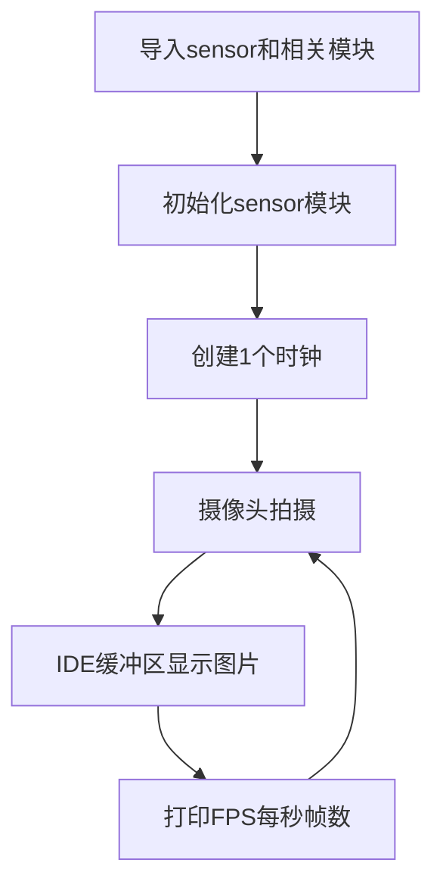

# 摄像头

## 前言
从前面的基础实验我们熟悉了K230基于MicroPython的编程方法，但那可以说是只发挥了K230冰山一角的性能应用，摄像头是整个机器视觉应用的基础。今天我们就通过示例代码来看看CanMV K230是如何使用摄像头的。

## 实验目的
学习K230摄像头使用。

## 实验讲解

在CanMV IDE中打开 <u>零一科技（01Studio）CanMV K230开发套件配套资料\02-例程源码\2.机器视觉\1.摄像头应用</u> 目录下的camera.py文件。


打开后发现编辑框出现了相关代码，我们可以先直接跑一下代码看看实验现象，连接CanMV K230，点击运行，可以发右图上方出现了摄像头实时采集的图像。


CanMV K230使用camera模块实现摄像头采集图像功能，K230硬件支持3路sensor输入（CSI接口），每个sensor设备均可独立完成图像数据采集捕获处理，并可以同时输出3路图像数据。如下图：


sensor 0，sensor 1，sensor 2表示三个图像传感器；Camera Device 0，Camera Device 1，Camera Device 2表示三个sensor设备；output channel 0，output channel 1，output channel 2表示sensor设备的三个输出通道。三个图像传感器可以通过软件配置映射到不同的sensor 设备。


## Sensor对象

### 构造函数
```python
from media.sensor import * #导入sensor模块，使用摄像头相关接口

sensor = Sensor(id,[width, height, fps])
```
构建摄像头对象。目前支持摄像头型号有：GC2093、OV5647
- `id`: CSI输入号。
    - `0` : CSI0；
    - `1` : CSI1；
    - `2` : CSI2；默认值，开发板上的摄像头。

- `width`: 可选参数，sensor采集图像宽度。默认1920；
- `height`: 可选参数，sensor采集图像高度。默认1080；
- `fps`: 可选参数，sensor最大帧率。默认30；

### 使用方法

```python
sensor.reset()
```
复位和初始化摄像头。

<br></br>

```python
sensor.set_framesize(framesize = FRAME_SIZE_INVAILD, [width, height],chn = CAM_CHN_ID_0, alignment=0, **kwargs)
```
设置每个通道的图像输出尺寸。

- `framesize`: 通道图像输出尺寸。下面列出一些常用尺寸。自定义尺寸可以通过`[width, height]`参数设置，如:** width=800, height=480** 。注意`framesize`和 `[width,  height]`只使用其中一种方式设置。
    - `sensor.QQVGA` : 320x240
    - `sensor.QVGA` : 320x240
    - `sensor.VGA` : 640x480;
    - `Sensor.FHD` : 1920x1080;
    - `Sensor.HD` : 1280x720;

- `chn`: 通道编号。每个摄像头设备有3个通道。
    - `CAM_CHN_ID_0` : 通道0；
    - `CAM_CHN_ID_1` : 通道1；
    - `CAM_CHN_ID_2` : 通道2；

<br></br>

```python
sensor.set_pixformat(pixformat, chn = CAM_CHN_ID_0)
```
设置图像像素格式。
- `pixformat`: 格式。
    - `sensor.GRAYSCALE` : 灰度图像，每像素8位（1字节），处理速度快。
    - `sensor.RGB565` : 每像素为16位（2字节），5位用于红色，6位用于绿色，5位用于蓝色，处理速度比灰度图像要慢。
    - `sensor.RGB888` 
    - `sensor.RGBP888` 
    - `sensor.YUV420SP` 

- `chn`: 通道编号。每个摄像头设备有3个通道。
    - `CAM_CHN_ID_0` : 通道0；
    - `CAM_CHN_ID_1` : 通道1；
    - `CAM_CHN_ID_2` : 通道2；

<br></br>

```python
sensor.set_hmirror(enable)
```
设置摄像头画面水平镜像。
- `enable`: 格式。
    - `1` : 开启水平镜像；
    - `0` : 关闭水平镜像。

<br></br>

```python
sensor.set_vflip(enable)
```
设置摄像头画面垂直翻转。
- `enable`: 格式。
    - `1` : 开启垂直翻转；
    - `0` : 关闭垂直翻转。

**提示：通过设置摄像头的水平镜像和垂直翻转组合可以实现任意画面变换。**

<br></br>

```python
sensor.run()
```
启动摄像头。

<br></br>


```python
sensor.snapshot()
```
使用相机拍摄一张照片，并返回 image 对象。


更多用法请阅读: [CanMV K230官方文档](https://www.kendryte.com/k230_canmv/zh/main/api/mpp/K230_CanMV_Sensor%E6%A8%A1%E5%9D%97API%E6%89%8B%E5%86%8C.html#)

## clock对象

我们再来看看本例程用于计算FPS（每秒帧数）的clock模块。

### 构造函数
```python
clock=time.clock()
```
构建一个时钟对象。

### 使用方法
```python
clock.tick()
```
开始追踪运行时间。

<br></br>

```python
clock.fps()
```
停止追踪运行时间，并返回当前FPS（每秒帧数）。**在调用该函数前始终首先调用 clock.tick() 。**

<br></br>

本节还有缓冲区图像显示代码，会在下一节会详细讲解，本节主要讲述摄像头使用。我们来看看代码的编写流程图：




## 参考代码

```python
'''
实验名称：摄像头使用
实验平台：01Studio CanMV K230
说明：实现摄像头图像采集显示
'''

import time, os, sys

from media.sensor import * #导入sensor模块，使用摄像头相关接口
from media.display import * #导入display模块，使用display相关接口
from media.media import * #导入media模块，使用meida相关接口

sensor = Sensor() #构建摄像头对象
sensor.reset() #复位和初始化摄像头
sensor.set_framesize(Sensor.FHD) #设置帧大小FHD(1920x1080)，默认通道0
sensor.set_pixformat(Sensor.RGB565) #设置输出图像格式，默认通道0

#使用IDE缓冲区输出图像,显示尺寸和sensor配置一致。
Display.init(Display.VIRT, sensor.width(), sensor.height(), to_ide=True)

MediaManager.init() #初始化media资源管理器

sensor.run() #启动sensor

clock = time.clock()

while True:

    ################
    ## 这里编写代码 ##
    ################
    clock.tick()

    img = sensor.snapshot() #拍摄一张图

    Display.show_image(img) #显示图片

    print(clock.fps()) #打印FPS
```

## 实验结果

:::tip 提示
CanMV K230 和 CanMV K230 mini板载摄像头默认接在CSI2接口（上面代码默认接口）。如果使用CM-K230核心板套件，请将也摄像头接在CSI2接口。

:::

点击运行代码，可以看到在右边显示摄像头实时拍摄情况，下方则显示RGB颜色直方图。


点击左下角串口终端，可以看到实时显示当前的FPS(每秒帧数)值约为30帧。


通过本实验，我们了解了摄像头sensor模块以及时间time模块的原理和应用，可以看到CanMV将摄像头功能封装成sensor模块，用户不必关注底层代码编可以轻松使用。

## 多路摄像头接口使用

01科技 CanMV K230除了CSI2接口标配的GC2093（60FPS）摄像头外，还可以通过CSI0、CSI1接口外接摄像头。外接摄像头目前支持型号:

- GC2093（1080P 60FPS）。10cm长度。可手动调焦镜头（100°无畸变） [**点击购买>>**](https://item.taobao.com/item.htm?id=947782638904)
- OV5647（1080P 30FPS）。6cm/15cm/30cm 3款长度可选。 [**点击购买>>**](https://item.taobao.com/item.htm?id=833993249110)

**CanMV K230 支持CSI0（2lane）和CSI1(2lane)两路扩展。**


**CanMV K230 mini 支持CSI0（4lane，兼容2lane）1路扩展。**


**CM-K230核心板套件 CSI0（2lane）和CSI1(2lane)两路扩展。**


使用方法很简单，只需要在上面示例代码基础上在初始化时候配置`id`参数即可，id默认值为2。

### CSI0接口
```python
    ...
    sensor = Sensor(id=0) #id=0表示使用CSI0接口上的摄像头
    ...
```
### CSI1接口

```python
    ...
    sensor = Sensor(id=1) #id=1表示使用CSI1接口上的摄像头
    ...
```

### 3路摄像头同时显示图像代码

:::tip 提示
当前支持3路摄像头同时显示图像，但不支持同时使用AI视觉。
:::

CanMV K230 [层概念>>](https://www.kendryte.com/k230_canmv/zh/main/en/api/mpp/K230_CanMV_Display_Module_API_Manual.html#bind-layer)

```python
'''
# Copyright (c) [2025] [01Studio]. Licensed under the MIT License.

实验名称：3路摄像头同时采集图像
实验平台：01Studio CanMV K230
说明：实现摄像头图像采集显示
'''

import time, os, sys

from media.sensor import * #导入sensor模块，使用摄像头相关接口
from media.display import * #导入display模块，使用display相关接口
from media.media import * #导入media模块，使用meida相关接口

#默认摄像头GC2093
sensor2 = Sensor(id=2) #构建摄像头对象
sensor2.reset() #复位和初始化摄像头
sensor2.set_framesize(width = 960, height = 540) #设置帧大小
sensor2.set_pixformat(Sensor.RGB565) #设置输出图像格式，默认通道0

#CSI1接口
sensor1 = Sensor(id=1) #构建摄像头对象
sensor1.reset() #复位和初始化摄像头
sensor1.set_framesize(width = 960, height = 540) #设置帧大小
sensor1.set_pixformat(Sensor.YUV420SP) #设置输出图像格式
bind_info = sensor1.bind_info(x = 960, y = 0)
Display.bind_layer(**bind_info, layer = Display.LAYER_VIDEO1) #输出通道1

#CSI0接口
sensor0 = Sensor(id=0) #构建摄像头对象
sensor0.reset() #复位和初始化摄像头
sensor0.set_framesize(width = 960, height = 540) #设置帧大小FHD(1920x1080)，默认通道0
sensor0.set_pixformat(Sensor.YUV420SP) #设置输出图像格式
bind_info = sensor0.bind_info(x = 0, y = 540)
Display.bind_layer(**bind_info, layer = Display.LAYER_VIDEO2) #输出通道2

#使用IDE缓冲区输出图像,显示尺寸和sensor配置一致。
Display.init(Display.LT9611, to_ide = True)

MediaManager.init() #初始化media资源管理器

sensor2.run() #启动sensor
sensor1.run() #启动sensor
sensor0.run() #启动sensor

clock = time.clock()

while True:

    ################
    ## 这里编写代码 ##
    ################
    clock.tick()

    img = sensor2.snapshot() #拍摄一张图
    Display.show_image(img) #显示图片

    print(clock.fps()) #打印FPS
```

### 实验结果


## AF(自动对焦)摄像头

:::tip 提示
下面AF摄像头代码需要使用 2026-1-20（v1.4-41以上版本）镜像。
:::

### 自动对焦模式

自动调焦摄像头可以通过下面代码来实现总调焦

```python
'''
实验名称：AF(自动对焦)摄像头使用
实验平台：01Studio CanMV K230 / CanMV K230 mini
说明：实现自动对焦摄像头图像采集显示
'''

import time, os, sys

from media.sensor import * #导入sensor模块，使用摄像头相关接口
from media.display import * #导入display模块，使用display相关接口
from media.media import * #导入media模块，使用meida相关接口

sensor = Sensor(id=0) #构建摄像头对象,将AF摄像头接到CSI0接口
sensor.reset() #复位和初始化摄像头
sensor.set_framesize(Sensor.FHD) #设置帧大小FHD(1920x1080)，默认通道0
sensor.set_pixformat(Sensor.RGB565) #设置输出图像格式，默认通道0

sensor.auto_focus(True) # 开启自动对焦

#使用IDE缓冲区输出图像,显示尺寸和sensor配置一致。
Display.init(Display.VIRT, sensor.width(), sensor.height(), to_ide=True)

MediaManager.init() #初始化media资源管理器

sensor.run() #启动sensor

clock = time.clock()

while True:

    ################
    ## 这里编写代码 ##
    ################
    clock.tick()

    img = sensor.snapshot() #拍摄一张图

    Display.show_image(img) #显示图片
    
    print("当前对焦位置:", sensor.focus_pos()) # 获取当前对焦位置

    print(clock.fps()) #打印FPS
```

相对于普通摄像头，主要增加了下面代码：

```python

...

sensor.auto_focus(True) # 开启自动对焦

...
    
    print("当前对焦位置:", sensor.focus_pos()) # 获取当前对焦位置

...

```

### 设置固定对焦位置模式

除了上面的自动对焦模式，你也可以通过代码指定对焦位置。

注意需要注释掉自动对焦那行代码`#sensor.auto_focus(True)`，参考代码如下

```python
'''
实验名称：AF(自动对焦)摄像头使用--固定对焦位置
实验平台：01Studio CanMV K230 / CanMV K230 mini
说明：实现自动对焦摄像头图像采集显示
'''

import time, os, sys

from media.sensor import * #导入sensor模块，使用摄像头相关接口
from media.display import * #导入display模块，使用display相关接口
from media.media import * #导入media模块，使用meida相关接口

sensor = Sensor(id=0) #构建摄像头对象,将AF摄像头接到CSI0接口
sensor.reset() #复位和初始化摄像头
sensor.set_framesize(Sensor.FHD) #设置帧大小FHD(1920x1080)，默认通道0
sensor.set_pixformat(Sensor.RGB565) #设置输出图像格式，默认通道0

#sensor.auto_focus(True) # 开启自动对焦

#使用IDE缓冲区输出图像,显示尺寸和sensor配置一致。
Display.init(Display.VIRT, sensor.width(), sensor.height(), to_ide=True)

MediaManager.init() #初始化media资源管理器

sensor.run() #启动sensor

clock = time.clock()

sensor.focus_pos(300) #设置对焦位置，取值范围0-1023

while True:

    ################
    ## 这里编写代码 ##
    ################
    clock.tick()

    img = sensor.snapshot() #拍摄一张图

    Display.show_image(img) #显示图片
    
    print("当前对焦位置:", sensor.focus_pos()) # 获取当前对焦位置

    print(clock.fps()) #打印FPS

```

相对于普通摄像头，主要增加了下面代码：

```python

...

sensor.focus_pos(300) #设置对焦位置，取值范围0-1023

...
    
    print("当前对焦位置:", sensor.focus_pos()) # 获取当前对焦位置

...

```