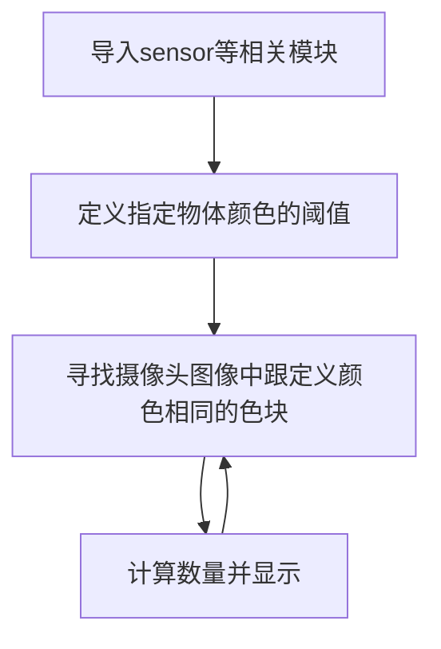

# 物体计数（相同颜色）

## 前言
通过上一节颜色识别我们看到可以识别出色块的数量，这节我们就基于上一节颜色识别来学习如何识别指定颜色的物体，计算其数量。

## 实验目的
通过编程实现CanMV K230识别程序预先设定的颜色，计算物体的数量。

## 实验讲解

find_blobs用法在上一节**颜色识别**已经讲解过，这里重复一下。主要是基于LAB颜色模型（每个颜色都是用一组LAB阈值表示，有兴趣的用户可以自行查阅相关模型资料）。其位于image模块下，因此我们直接将拍摄到的图片进行处理即可，那么我们像以往一样像看一下本实验相关对象和函数说明，具体如下：


## find_blobs对象

### 构造函数
```python
image.find_blobs(thresholds[, invert=False[, roi[, x_stride=2[, y_stride=1[, area_threshold=10
                 [, pixels_threshold=10[, merge=False[, margin=0[, threshold_cb=None[, 
                 merge_cb=None]]]]]]]]]])
```
查找图像中指定的色块。返回image.blog对象列表；参数说明：
- `thresholds`: 必须是元组列表。 [(lo, hi), (lo, hi), ..., (lo, hi)] 定义你想追踪的颜色范围。 对于灰度图像，每个元组需要包含两个值 - 最小灰度值和最大灰度值。 仅考虑落在这些阈值之间的像素区域。 对于RGB565图像，每个元组需要有六个值(l_lo，l_hi，a_lo，a_hi，b_lo，b_hi) - 分别是LAB L，A和B通道的最小值和最大值。
- `area_threshold`: 若色块的边界框区域小于此参数值，则会被过滤掉；
- `pixels_threshold`: 若色块的像素数量小于此参数值，则会被过滤掉；
- `merge`: 若为True,则合并所有没有被过滤的色块；
- `margin`: 调整合并色块的边缘。

### 使用方法

以上函数返回image.blob对象列表。

```python
blob.rect()
```
返回一个矩形元组（x,y,w,h）,如色块边界。可以通过索引[0-3]来获得这些值。

<br></br>

```python
blob.cx()
```
返回色块(int)的中心x位置。可以通过索引[5]来获得这个值。

<br></br>

```python
blob.cy()
```
返回色块(int)的中心y位置。可以通过索引[6]来获得这个值。

<br></br>

更多用法请阅读官方文档：<br></br>
https://www.kendryte.com/k230_canmv/zh/main/api/openmv/image.html#find-blobs

<br></br>

## 获取颜色阈值

针对不同颜色的物体我们如何获取它的阈值呢？这里以黄色的跳线帽为例来讲解。


先使用 [摄像头](../../machine_vision/camera.md)代码采集物体图像，在IDE右上角缓冲区点击“**禁用**”将要识别的物体确认下来：


点击 **工具—机器视觉—阈值编辑器** 。


在弹出的对话框选择“帧缓冲区”。


通过调整下方6个LAB值，使得物体颜色在右边为白色，其余背景为黑色。（需要花费一点时间，找到临界值效果更佳。）


记录颜色的LAB值，在后面代码中使用。


学会了找色块函数和颜色阈值获取方法后，我们可以理清一下编程思路，代码编写流程如下：



## 参考代码

### CanMV K230 + 3.5寸mipi屏

```python
'''
实验名称：物体计数
实验平台：01Studio CanMV K230 + 3.5寸mipi屏
说明：物体计数（相同颜色物体）
教程：wiki.01studio.cc
'''

import time, os, sys

from media.sensor import * #导入sensor模块，使用摄像头相关接口
from media.display import * #导入display模块，使用display相关接口
from media.media import * #导入media模块，使用meida相关接口

thresholds = [(18, 72, -13, 31, 18, 83)] #黄色跳线帽阈值

sensor = Sensor() #构建摄像头对象
sensor.reset() #复位和初始化摄像头
sensor.set_framesize(width=800, height=480) #设置帧大小为LCD分辨率(800x480)，默认通道0
sensor.set_pixformat(Sensor.RGB565) #设置输出图像格式，默认通道0

Display.init(Display.ST7701, width=800, height=480, to_ide=True) #同时使用3.5寸mipi屏和IDE缓冲区显示图像，800x480分辨率
#Display.init(Display.VIRT, sensor.width(), sensor.height()) #只使用IDE缓冲区显示图像

MediaManager.init() #初始化media资源管理器

sensor.run() #启动sensor

clock = time.clock()

while True:

    ################
    ## 这里编写代码 ##
    ################
    clock.tick()

    img = sensor.snapshot()
    blobs = img.find_blobs([thresholds[0]])

    if blobs: #画框显示
        for b in blobs:
            tmp=img.draw_rectangle(b[0:4])
            tmp=img.draw_cross(b[5], b[6])

    #显示计算信息
    img.draw_string_advanced(0, 0, 30, 'FPS: '+str("%.3f"%(clock.fps()))+'       Num: '
                             +str(len(blobs)), color = (255, 255, 255))

    Display.show_image(img)

    print(clock.fps()) #打印FPS

```


### CanMV K230 mini + 2.4寸mipi屏

```python
'''
实验名称：物体计数
实验平台：01Studio CanMV K230 mini + 2.4寸mipi屏
说明：物体计数（相同颜色物体）
教程：wiki.01studio.cc
'''

import time, os, sys

from media.sensor import * #导入sensor模块，使用摄像头相关接口
from media.display import * #导入display模块，使用display相关接口
from media.media import * #导入media模块，使用meida相关接口

thresholds = [(18, 72, -13, 31, 18, 83)] #黄色跳线帽阈值

sensor = Sensor(width=1280, height=960) #构建摄像头对象
sensor.reset() #复位和初始化摄像头
sensor.set_framesize(width=640, height=480) #设置帧大小为2.4寸屏分辨率(640x480)，默认通道0
sensor.set_pixformat(Sensor.RGB565) #设置输出图像格式，默认通道0

Display.init(Display.ST7701, width=640, height=480, to_ide=True) #同时使用3.5寸mipi屏和IDE缓冲区显示图像，800x480分辨率
#Display.init(Display.VIRT, sensor.width(), sensor.height()) #只使用IDE缓冲区显示图像

MediaManager.init() #初始化media资源管理器

sensor.run() #启动sensor

clock = time.clock()

while True:

    ################
    ## 这里编写代码 ##
    ################
    clock.tick()

    img = sensor.snapshot()
    blobs = img.find_blobs([thresholds[0]])

    if blobs: #画框显示
        for b in blobs:
            tmp=img.draw_rectangle(b[0:4])
            tmp=img.draw_cross(b[5], b[6])

    #显示计算信息
    img.draw_string_advanced(0, 0, 30, 'FPS: '+str("%.3f"%(clock.fps()))+'       Num: '
                             +str(len(blobs)), color = (255, 255, 255))

    Display.show_image(img)

    print(clock.fps()) #打印FPS

```

## 实验结果

在IDE中运行代码，这里尝试识别多个跳线帽，可以看到准确度非常高：

待识别物体：


识别结果：


