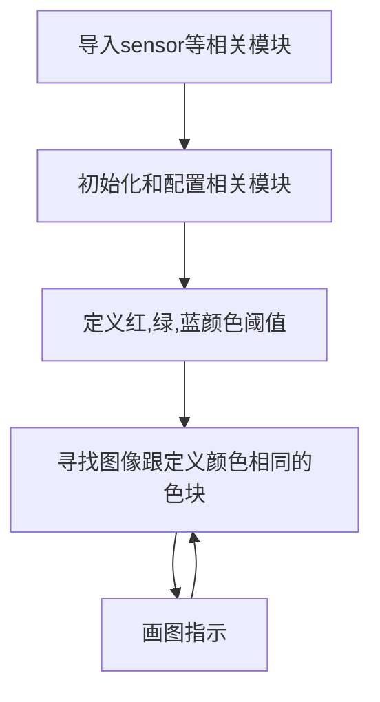

# 单一颜色识别

## 前言
我们活在一个色彩斑斓的世界里。本节我们来学习机器视觉中的颜色识别。我们会预先设定颜色阈值，如红、绿、蓝。这样K230摄像头采集图像后就能自动识别了。

## 实验目的
通过编程实现CanMV K230识别程序预先设定的颜色色块，分别是红、绿、蓝三种颜色。

## 实验讲解

CanMV集成了RGB565颜色块识别find_blobs函数，主要是基于LAB颜色模型（每个颜色都是用一组LAB阈值表示，有兴趣的用户可以自行查阅相关模型资料）。其位于image模块下，因此我们直接将拍摄到的图片进行处理即可，那么我们像以往一样像看一下本实验相关对象和函数说明，具体如下：


## find_blobs对象

### 构造函数
```python
image.find_blobs(thresholds[, invert=False[, roi[, x_stride=2[, y_stride=1[, area_threshold=10
                 [, pixels_threshold=10[, merge=False[, margin=0[, threshold_cb=None[, 
                 merge_cb=None]]]]]]]]]])
```
查找图像中指定的色块。返回image.blog对象列表；参数说明：
- `thresholds`: 必须是元组列表。 [(lo, hi), (lo, hi), ..., (lo, hi)] 定义你想追踪的颜色范围。 对于灰度图像，每个元组需要包含两个值 - 最小灰度值和最大灰度值。 仅考虑落在这些阈值之间的像素区域。 对于RGB565图像，每个元组需要有六个值(l_lo，l_hi，a_lo，a_hi，b_lo，b_hi) - 分别是LAB L，A和B通道的最小值和最大值。
- `area_threshold`: 若色块的边界框区域小于此参数值，则会被过滤掉；
- `pixels_threshold`: 若色块的像素数量小于此参数值，则会被过滤掉；
- `merge`: 若为True,则合并所有没有被过滤的色块；
- `margin`: 调整合并色块的边缘。

### 使用方法

以上函数返回image.blob对象。

```python
blob.rect()
```
返回一个矩形元组（x,y,w,h）,如色块边界。可以通过索引[0-3]来获得这些值。

<br></br>

```python
blob.cx()
```
返回色块(int)的中心x位置。可以通过索引[5]来获得这个值。

<br></br>

```python
blob.cy()
```
返回色块(int)的中心y位置。可以通过索引[6]来获得这个值。

<br></br>

更多用法请阅读[官方文档](https://www.kendryte.com/k230_canmv/zh/main/api/openmv/image.html#find-blobs)

<br></br>

了解了找色块函数应用方法后，我们可以理清一下编程思路，代码编写流程如下：



## 参考代码

### CanMV K230 + 3.5寸mipi屏

```python
'''
实验名称：单一颜色识别
实验平台：01Studio CanMV K230 + 3.5寸mipi屏
教程：wiki.01studio.cc
'''

import time, os, sys

from media.sensor import * #导入sensor模块，使用摄像头相关接口
from media.display import * #导入display模块，使用display相关接口
from media.media import * #导入media模块，使用meida相关接口

# 颜色识别阈值 (L Min, L Max, A Min, A Max, B Min, B Max) LAB模型
# 下面的阈值元组是用来识别 红、绿、蓝三种颜色，当然你也可以调整让识别变得更好。
thresholds = [(30, 100, 15, 127, 15, 127), # 红色阈值
              (30, 100, -64, -8, 50, 70), # 绿色阈值
              (0, 40, 0, 90, -128, -20)] # 蓝色阈值

sensor = Sensor() #构建摄像头对象
sensor.reset() #复位和初始化摄像头
sensor.set_framesize(width=800, height=480) #设置帧大小为LCD分辨率(800x480)，默认通道0
sensor.set_pixformat(Sensor.RGB565) #设置输出图像格式，默认通道0

Display.init(Display.ST7701, width=800, height=480, to_ide=True) #同时使用3.5寸mipi屏和IDE缓冲区显示图像，800x480分辨率
#Display.init(Display.VIRT, sensor.width(), sensor.height()) #只使用IDE缓冲区显示图像

MediaManager.init() #初始化media资源管理器

sensor.run() #启动sensor

clock = time.clock()

while True:

    ################
    ## 这里编写代码 ##
    ################
    clock.tick()

    img = sensor.snapshot() #拍摄一张图片

    blobs = img.find_blobs([thresholds[0]]) # 0,1,2分别表示红，绿，蓝色。

    if blobs:

        for b in blobs: #画矩形和箭头表示
            tmp=img.draw_rectangle(b[0:4], thickness = 4)
            tmp=img.draw_cross(b[5], b[6], thickness = 2)


    img.draw_string_advanced(0, 0, 30, 'FPS: '+str("%.3f"%(clock.fps())), color = (255, 255, 255))

    Display.show_image(img) #显示图片

    print(clock.fps()) #打印FPS
```

### CanMV K230 mini + 2.4寸mipi屏

```python
'''
实验名称：单一颜色识别
实验平台：01Studio CanMV K230 mini + 2.4寸mipi屏
教程：wiki.01studio.cc
'''

import time, os, sys

from media.sensor import * #导入sensor模块，使用摄像头相关接口
from media.display import * #导入display模块，使用display相关接口
from media.media import * #导入media模块，使用meida相关接口

# 颜色识别阈值 (L Min, L Max, A Min, A Max, B Min, B Max) LAB模型
# 下面的阈值元组是用来识别 红、绿、蓝三种颜色，当然你也可以调整让识别变得更好。
thresholds = [(30, 100, 15, 127, 15, 127), # 红色阈值
              (30, 100, -64, -8, 50, 70), # 绿色阈值
              (0, 40, 0, 90, -128, -20)] # 蓝色阈值

sensor = Sensor(width=1280, height=960) #构建摄像头对象
sensor.reset() #复位和初始化摄像头
sensor.set_framesize(width=640, height=480) #设置帧大小为2.4寸屏分辨率(640x480)，默认通道0
sensor.set_pixformat(Sensor.RGB565) #设置输出图像格式，默认通道0

Display.init(Display.ST7701,width=640, height=480, to_ide=True) #同时使用3.5寸mipi屏和IDE缓冲区显示图像，800x480分辨率
#Display.init(Display.VIRT, sensor.width(), sensor.height()) #只使用IDE缓冲区显示图像

MediaManager.init() #初始化media资源管理器

sensor.run() #启动sensor

clock = time.clock()

while True:

    ################
    ## 这里编写代码 ##
    ################
    clock.tick()

    img = sensor.snapshot() #拍摄一张图片

    blobs = img.find_blobs([thresholds[0]]) # 0,1,2分别表示红，绿，蓝色。

    if blobs:

        for b in blobs: #画矩形和箭头表示
            tmp=img.draw_rectangle(b[0:4], thickness = 4)
            tmp=img.draw_cross(b[5], b[6], thickness = 2)


    img.draw_string_advanced(0, 0, 30, 'FPS: '+str("%.3f"%(clock.fps())), color = (255, 255, 255))

    Display.show_image(img) #显示图片

    print(clock.fps()) #打印FPS
```

## 实验结果

在CanMV IDE中运行代码，代码默认检测的是红色，用户可以自行修改find_blobs()参数的阈值数组编号来切换识别颜色，如下：

**红色识别：**

原图：


实验结果：


本节学习了通过MicroPython编程在CanMV K230上实现单种颜色识别。本实验主要是基于LAB颜色模型来判断。有兴趣的小伙伴可以自行查阅LAB模块相 关资料，再结合打印threshold查看其元组数据来深入学习，还有就是可以找多种不规则形状的颜色物体对比学习。