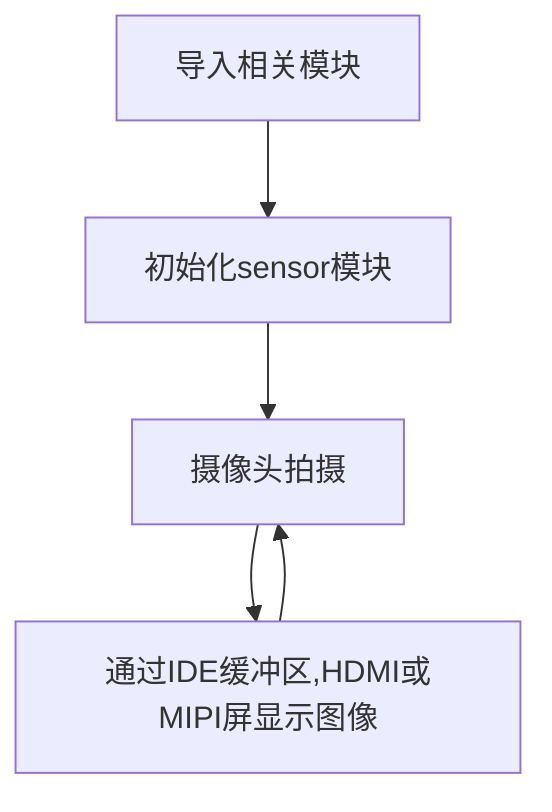

# 图像3种显示方式

## 前言

在摄像头拍摄图像后我们需要观察图像，这就涉及如何显示的问题，目前CanMV K230支持3种显示方式。分别是：IDE缓冲区显示、外接HDMI显示器或MIPI显示屏。

## 实验目的

编程实现摄像头图像的3种不同显示方式。

## 实验讲解

01Studio CanMV K230开发板目前有3种图像显示方式，各有特点：

- `IDE缓冲区显示`：性价比最高，图像质量有一定下降，但能满足大部分场合调试使用。最大支持1920x1080分辨率。
- `HDMI`：外接HDMI显示屏，清晰度最高。最大支持1920x1080分辨率。
- `MIPI显示屏`：外接01Studio 3.5寸（800x480）或2.4寸(640x480)MiPi显示屏，可以一体化组装，适合离线部署调试使用。

以上显示方式均集成在 Display Python API。用户只需要简单修改代码即可实现不同方式显示。

## Display对象

### 构造函数
```python
from media.display import * 
```
导入Display模块，即可使用Display相关API接口。

### 使用方法

```python
Display.init(type = None, width = None, height = None, osd_num = 1, to_ide = False, fps = None)
```
初始化Display模块。

- `type`: 显示设备类型。
    - `VIRT` : IDE缓冲区显示；
    - `LT9611` : HDMI显示；
    - `ST7701` : mipi显示屏。

- `width`: 可选参数，显示图像宽度；

- `height`: 可选参数，显示图像高度；

- `to_ide`: 同时在IDE显示，仅用于设置为HDMI或MIPI屏显示时使用:
    - `True` : 同步显示；
    - `False` : 不显示。

<br></br>

```python
Display.show_image(img, x = 0, y = 0, layer = None, alpha = 255, flag = 0)
```
显示图像。

- `img`: 显示的图像，可以通过创建图像或者摄像头采集。

- `x`: 起始横坐标；

- `y`: 起始纵坐标。

<br></br>

```python
Display.deinit()
```
注销Display模块。必须在`MediaManager.deinit()`之前, 在`sensor.stop()`之后调用。

<br></br>

更多用法请阅读: [CanMV K230官方文档](https://www.kendryte.com/k230_canmv/zh/main/api/mpp/K230_CanMV_Display%E6%A8%A1%E5%9D%97API%E6%89%8B%E5%86%8C.html#)


熟悉Display API用法后，我们来看看代码的编写流程图：




## IDE缓冲区显示

### 参考代码

```python
'''
实验名称：图像3种显示方式
实验平台：01Studio CanMV K230
说明：实现摄像头图像采集通过IDE、HDMI和MIPI屏显示
'''

import time, os, sys

from media.sensor import * #导入sensor模块，使用摄像头相关接口
from media.display import * #导入display模块，使用display相关接口
from media.media import * #导入media模块，使用meida相关接口

sensor = Sensor() #构建摄像头对象
sensor.reset() #复位和初始化摄像头
sensor.set_framesize(Sensor.FHD) #设置帧大小FHD(1920x1080)，缓冲区和HDMI用,默认通道0
#sensor.set_framesize(width=800,height=480) #设置帧大小800x480,LCD专用,默认通道0
sensor.set_pixformat(Sensor.RGB565) #设置输出图像格式，默认通道0

#################################
## 图像3种不同显示方式（修改注释实现）
#################################

Display.init(Display.VIRT, sensor.width(), sensor.height(), to_ide=True) #通过IDE缓冲区显示图像
#Display.init(Display.LT9611, to_ide=True) #通过HDMI显示图像
#Display.init(Display.ST7701, to_ide=True) #通过01Studio 3.5寸mipi显示屏显示图像

MediaManager.init() #初始化media资源管理器

sensor.run() #启动sensor

clock = time.clock()

while True:

    ####################
    ## 这里编写主要代码
    ####################
    clock.tick()

    img = sensor.snapshot() #拍摄一张图

    Display.show_image(img) #显示图片

    print(clock.fps()) #打印FPS
```

### 实验结果

点击运行代码，可以看到在IDE右边显示摄像头实时拍摄图像。


## HDMI显示器显示

将参考代码中的代码改成LT9611 :
```python
    #################################
    ## 图像3种不同显示方式（修改注释实现）
    #################################

    #Display.init(Display.VIRT, sensor.width(), sensor.height(), to_ide=True) #通过IDE缓冲区显示图像
    Display.init(Display.LT9611 ,to_ide=True) #通过HDMI显示图像
    #Display.init(Display.ST7701 ,to_ide=True) #通过01Studio 3.5寸mipi显示屏显示图像

```

### 参考代码

```python
'''
实验名称：图像3种显示方式
实验平台：01Studio CanMV K230
说明：实现摄像头图像采集通过IDE、HDMI和MIPI屏显示
'''

import time, os, sys

from media.sensor import * #导入sensor模块，使用摄像头相关接口
from media.display import * #导入display模块，使用display相关接口
from media.media import * #导入media模块，使用meida相关接口

sensor = Sensor() #构建摄像头对象
sensor.reset() #复位和初始化摄像头
sensor.set_framesize(Sensor.FHD) #设置帧大小FHD(1920x1080)，缓冲区和HDMI用,默认通道0
#sensor.set_framesize(width=800,height=480) #设置帧大小800x480,LCD专用,默认通道0
sensor.set_pixformat(Sensor.RGB565) #设置输出图像格式，默认通道0

#################################
## 图像3种不同显示方式（修改注释实现）
#################################

#Display.init(Display.VIRT, sensor.width(), sensor.height(), to_ide=True) #通过IDE缓冲区显示图像
Display.init(Display.LT9611, to_ide=True) #通过HDMI显示图像
#Display.init(Display.ST7701, to_ide=True) #通过01Studio 3.5寸mipi显示屏显示图像

MediaManager.init() #初始化media资源管理器

sensor.run() #启动sensor

clock = time.clock()

while True:

    ####################
    ## 这里编写主要代码
    ####################
    clock.tick()

    img = sensor.snapshot() #拍摄一张图

    Display.show_image(img) #显示图片

    print(clock.fps()) #打印FPS
```

### 实验结果
通过HDMI线连接到HDMI显示器：


运行代码，可以看到HDMI显示摄像头采集图像, 最大支持1080p：


## 3.5寸mipi显示屏显示

使用3.5寸mipi显示屏显示图像需要修改2个地方：

将摄像头采集分辨率改成800x480以下：
```python
    #sensor.set_framesize(Sensor.FHD) #设置帧大小FHD(1920x1080)，缓冲区和HDMI用,默认通道0
    sensor.set_framesize(width=800,height=480) #设置帧大小800x480,LCD专用,默认通道0
    sensor.set_pixformat(Sensor.RGB565) #设置输出图像格式，默认通道0
```

将参考代码中的代码改成ST7701 :
```python
    #################################
    ## 图像3种不同显示方式（修改注释实现）
    #################################

    #Display.init(Display.VIRT, sensor.width(), sensor.height(), to_ide=True) #通过IDE缓冲区显示图像
    #Display.init(Display.LT9611, to_ide=True) #通过HDMI显示图像
    Display.init(Display.ST7701, to_ide=True) #通过01Studio 3.5寸mipi显示屏显示图像

```
### 参考代码
```python
'''
实验名称：图像3种显示方式
实验平台：01Studio CanMV K230 + 3.5寸mipi屏
说明：实现摄像头图像采集通过IDE、HDMI和MIPI屏显示
'''

import time, os, sys

from media.sensor import * #导入sensor模块，使用摄像头相关接口
from media.display import * #导入display模块，使用display相关接口
from media.media import * #导入media模块，使用meida相关接口

sensor = Sensor() #构建摄像头对象
sensor.reset() #复位和初始化摄像头
#sensor.set_framesize(Sensor.FHD) #设置帧大小FHD(1920x1080)，缓冲区和HDMI用,默认通道0
sensor.set_framesize(width=800,height=480) #设置帧大小800x480,LCD专用,默认通道0
sensor.set_pixformat(Sensor.RGB565) #设置输出图像格式，默认通道0

#################################
## 图像3种不同显示方式（修改注释实现）
#################################

#Display.init(Display.VIRT, sensor.width(), sensor.height(), to_ide=True) #通过IDE缓冲区显示图像
#Display.init(Display.LT9611, to_ide=True) #通过HDMI显示图像
Display.init(Display.ST7701, to_ide=True) #通过01Studio 3.5寸mipi显示屏显示图像

MediaManager.init() #初始化media资源管理器

sensor.run() #启动sensor

clock = time.clock()

while True:

    ####################
    ## 这里编写主要代码
    ####################
    clock.tick()

    img = sensor.snapshot() #拍摄一张图

    Display.show_image(img) #显示图片

    print(clock.fps()) #打印FPS

```

### 实验结果

通过排线连接01Studio 3.5寸mipi屏：


运行代码，可以看到mipi屏上显示摄像头采集图像，最大支持800x480：


## 2.4寸mipi显示屏显示

由于2.4寸mipi显示屏分辨率为640x480, 显示图像需要修改几个地方：

- 摄像头默认是1920x1080(16:9),因此建议初始化时修改成1280x960(4:3)避免图像畸变,因为2.4寸屏比例也是4:3（640x480）；

- 将拍摄帧大小改为640x480以下；

- Display.init()函数务必添加 **width=640, height=480** 参数。

```python
    sensor = Sensor(width=1280, height=960) #构建摄像头对象，将摄像头长宽设置为4:3
    sensor.reset() #复位和初始化摄像头
    #sensor.set_framesize(Sensor.FHD) #设置帧大小FHD(1920x1080)，缓冲区和HDMI用,默认通道0
    sensor.set_framesize(width=640,height=480) #2.4寸设置帧大小640x480,LCD专用,默认通道0
    sensor.set_pixformat(Sensor.RGB565) #设置输出图像格式，默认通道0
```

将参考代码中的代码改成ST7701 :
```python
    #################################
    ## 图像3种不同显示方式（修改注释实现）
    #################################

    #Display.init(Display.VIRT, sensor.width(), sensor.height(), to_ide=True) #通过IDE缓冲区显示图像
    #Display.init(Display.LT9611, to_ide=True) #通过HDMI显示图像
    Display.init(Display.ST7701, width=640, height=480, to_ide=True) #ST7701默认分辨率为800x480,使用2.4寸需改为640x480,否则无法显示

```
### 参考代码
```python
'''
实验名称：图像3种显示方式
实验平台：01Studio CanMV K230 + 2.4寸mipi屏
说明：实现摄像头图像采集通过IDE、HDMI和MIPI屏显示
'''

import time, os, sys

from media.sensor import * #导入sensor模块，使用摄像头相关接口
from media.display import * #导入display模块，使用display相关接口
from media.media import * #导入media模块，使用meida相关接口

sensor = Sensor(width=1280, height=960) #构建摄像头对象
sensor.reset() #复位和初始化摄像头
#sensor.set_framesize(Sensor.FHD) #设置帧大小FHD(1920x1080)，缓冲区和HDMI用,默认通道0
sensor.set_framesize(width=640,height=480) #2.4寸设置帧大小640x480,LCD专用,默认通道0
sensor.set_pixformat(Sensor.RGB565) #设置输出图像格式，默认通道0

#################################
## 图像3种不同显示方式（修改注释实现）
#################################

#Display.init(Display.VIRT, sensor.width(), sensor.height(), to_ide=True) #通过IDE缓冲区显示图像
#Display.init(Display.LT9611, to_ide=True) #通过HDMI显示图像
Display.init(Display.ST7701, width=640, height=480, to_ide=True) #ST7701默认分辨率为800x480,使用2.4寸需改为640x480,否则无法显示

MediaManager.init() #初始化media资源管理器

sensor.run() #启动sensor

clock = time.clock()

while True:

    ####################
    ## 这里编写主要代码
    ####################
    clock.tick()

    img = sensor.snapshot() #拍摄一张图

    Display.show_image(img) #显示图片

    print(clock.fps()) #打印FPS

```

### 实验结果

通过排线连接01Studio 2.4寸mipi屏。运行代码，可以看到mipi屏上显示摄像头采集图像，最大支持640x480：

