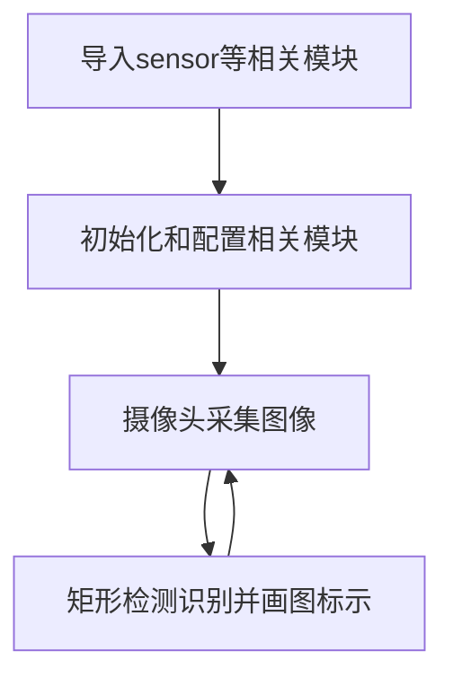

# 矩形检测

## 前言
本节学习的是对图像中的矩形进行检测识别。

## 实验目的
通过编程实现CanMV K230对图像中的矩形进行检测识别，并画图指示。

## 实验讲解

CanMV集成了矩形识别find_rects函数，位于image模块下，因此我们直接将拍摄到的图片进行处理即可，那么我们像以往一样像看一下识别函数相关说明，具体如下：

## find_rects对象

### 构造函数
```python
image.find_rects([roi=Auto, threshold=10000])
```
矩形识别函数。返回一个image.rect矩形对象列表。

参数说明：
- `roi`: 识别区域（x,y,w,h），未指定则默认整张图片。
- `threshold`: 阈值。返回大于或等于threshold的矩形，调整识别可信度。

### 使用方法

直接调用该函数。（大部分参数使用默认即可，**不支持压缩图像和bayer图像**）

更多用法请阅读官方文档：<br></br>
https://www.kendryte.com/k230_canmv/zh/main/api/openmv/image.html#find-rects

<br></br>

编程思路如下：



## 参考代码

```python
'''
实验名称：矩形检测
实验平台：01Studio CanMV K230
教程：wiki.01studio.cc
说明：推荐使用320x240以下分辨率，分辨率过大会导致帧率下降。
     通过修改lcd_width和lcd_height参数值选择3.5寸或2.4寸mipi屏。
'''

import time, os, sys

from media.sensor import * #导入sensor模块，使用摄像头相关接口
from media.display import * #导入display模块，使用display相关接口
from media.media import * #导入media模块，使用meida相关接口

#3.5寸mipi屏分辨率定义
lcd_width = 800
lcd_height = 480

'''
#2.4寸mipi屏分辨率定义
lcd_width = 640
lcd_height = 480
'''

sensor = Sensor(width=1280, height=960) #构建摄像头对象
sensor.reset() #复位和初始化摄像头
sensor.set_framesize(width=320, height=240) #设置帧大小为LCD分辨率(800x480)，默认通道0
sensor.set_pixformat(Sensor.RGB565) #设置输出图像格式，默认通道0

Display.init(Display.ST7701, width=lcd_width, height=lcd_height, to_ide=True) #同时使用mipi屏和IDE缓冲区显示图像
#Display.init(Display.VIRT, sensor.width(), sensor.height()) #只使用IDE缓冲区显示图像

MediaManager.init() #初始化media资源管理器

sensor.run() #启动sensor

clock = time.clock()

while True:

    ################
    ## 这里编写代码 ##
    ################
    clock.tick()

    img = sensor.snapshot() #拍摄一张图片

    # `threshold` 需要设置一个比价大的值来过滤掉噪声。
    #这样在图像中检测到边缘亮度较低的矩形。矩形
    #边缘量级越大，对比越强…

    for r in img.find_rects(threshold = 10000):
        img.draw_rectangle(r.rect(), color = (255, 0, 0),thickness=2) #画矩形显示
        for p in r.corners(): img.draw_circle(p[0], p[1], 5, color = (0, 255, 0))#四角画小圆形
        print(r)

    #Display.show_image(img) #显示图片

    #显示图片，仅用于LCD居中方式显示
    Display.show_image(img, x=round((lcd_width-sensor.width())/2),y=round((lcd_height-sensor.height())/2))

    print(clock.fps()) #打印FPS
```

## 实验结果

在CanMV IDE中运行代码，检测识别结果如下：

**原图：**


**实验结果：**


