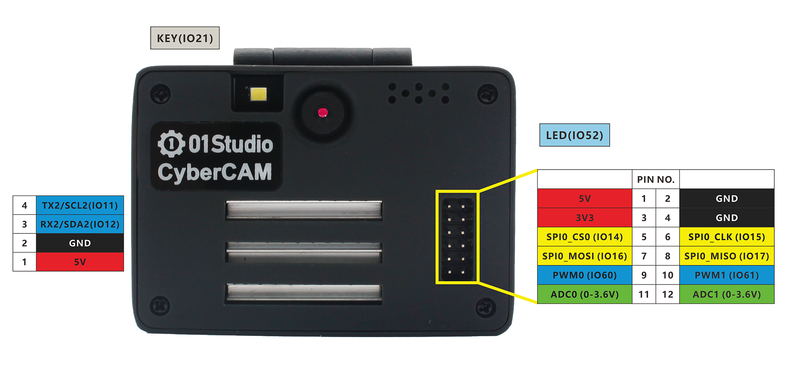
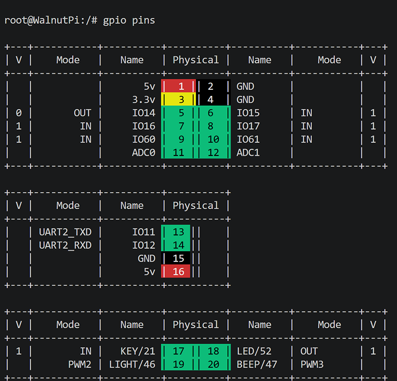

# GPIO介绍

我们先来介绍一下01科技CyberCAM K230的GPIO，也就是常用的I/O（输入输出引脚）、UART(串口)、I2C、SPI、PWM、ADC等功能。CyberCAM K230不仅是一款强大的AI视觉开发板，也能实现各类单片机的GPIO功能，熟悉GPIO相关功能说明对关于本章基础实验的学习有很大帮助。

下图是01科技CyberCAM K230开发板的GPIO的引脚图：



从上面表格和图例可以看到，GPIO和传统的单片机开发相似，除了普通IO口外，也有I2C、串口（UART）等总线接口，以及电源输出供电引脚（3.3V和5V）。可以外接各类传感器和模块，相关内容在后面教程都会涉及。

通过下面指令可以查询CyberCAM K230的GPIO引脚信息和状态：

```bash
gpio pins
```



### 电源引脚

- 5V：

除了TYPE-C供电，CyberCAM 12Pin GPIO中的5V和2个GND引脚，以及左侧PH2.0-4P接口的5V和GND都可以接入电源（5V）到5V引脚给开发板供电。

:::danger 警告
请勿使用超过5V的电源给开发板供电，可能导致烧坏。
:::

- 3V3

CyberCAM 12Pin GPIO中的3V3和2个GND引脚, 可以作为电源输出给外界传感器供电，最大输出电流为600mA。

### 普通IO

除了电源引脚和2个ADC引脚外，所有IO口都可以配置为输入/输出引脚使用。IO电平为3.3V。

**部分引脚有其它复用功能，具体如下：**

### PWM

- PWM0（GPIO60）
- PWM1（GPIO61）

### UART 

- UART2
    - TX2（GPIO11）
    - RX2（GPIO12）

### I2C

- I2C2
    - SCL2(GPIO11)
    - SDA2(GPIO12)

### SPI 
- SPI0
    - MOSI (GPIO16)
    - MISO (GPIO17)
    - SCLK (GPIO15)
    - CS0 (GPIO14)

### ADC

**请勿超出测量量程!**

- ADC0（背面预留焊盘，量程0-3.6V）
- ADC1（背面预留焊盘，量程0-3.6V）

### 其它外设

- LED
    - GPIO52

- 按键
    - GPIO21

- 补光灯
    - GPIO46（PWM2）

- 蜂鸣器
    - GPIO47（PWM3）

- 六轴IMU

    **I2C1**

    - SCL1(GPIO40)
    - SDA1(GPIO41)


