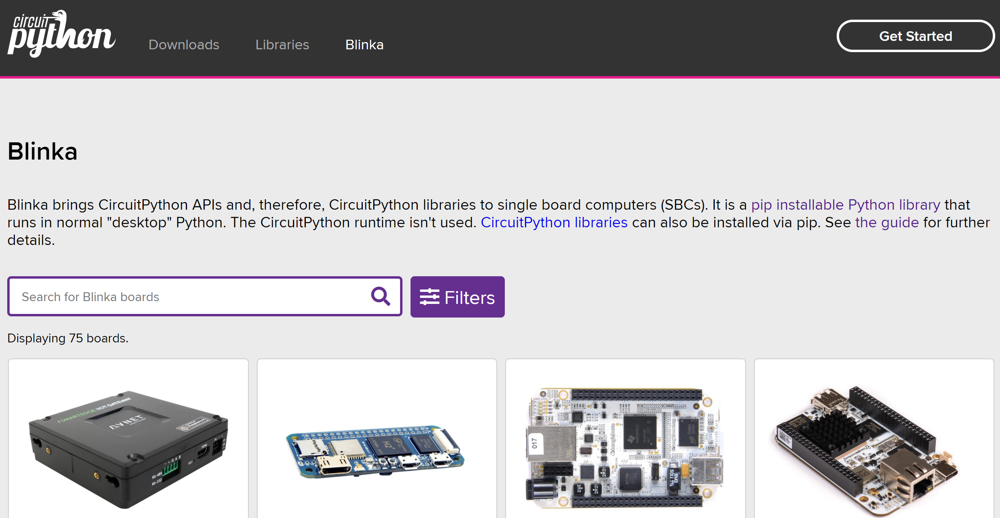
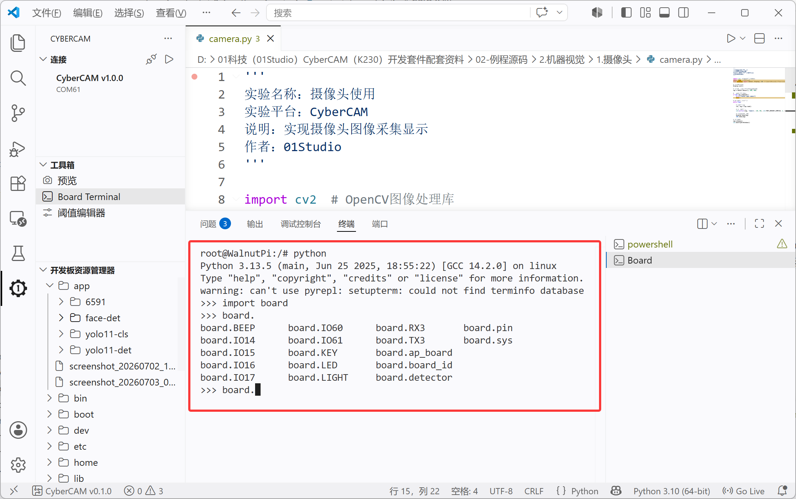

# GPIO Python库

在MCU领域我们可以使用MicroPython或CircuitPython做Python嵌入式编程，而在Linux板卡中，有这么一个开源项目，由adafruit发起，名字叫Blinka，旨在Linux板卡上实现GPIO类嵌入式编程的通用Python库。目前Blinka已经支持树莓派、Jetson Nano等众多市面的Linux开发板。

开源项目：https://circuitpython.org/blinka 



简单来说，通过安装Blinka库后，就可以轻松使用Python库来玩转各类开发板GPIO外设了。CyberCAM使用的核桃派Linux系统已经预装了Blinka GPIO 库。

我们可以在Linux终端通过python指令查看引脚编号。

在终端输入`python`进入Python交互：
```bash
python
```

然后输入：
```python
import board
```
再输入：
```python
board.
```
按键盘Tab键即可补全看到所有核桃派Python库引脚名称。



这在后面的实验会用到。