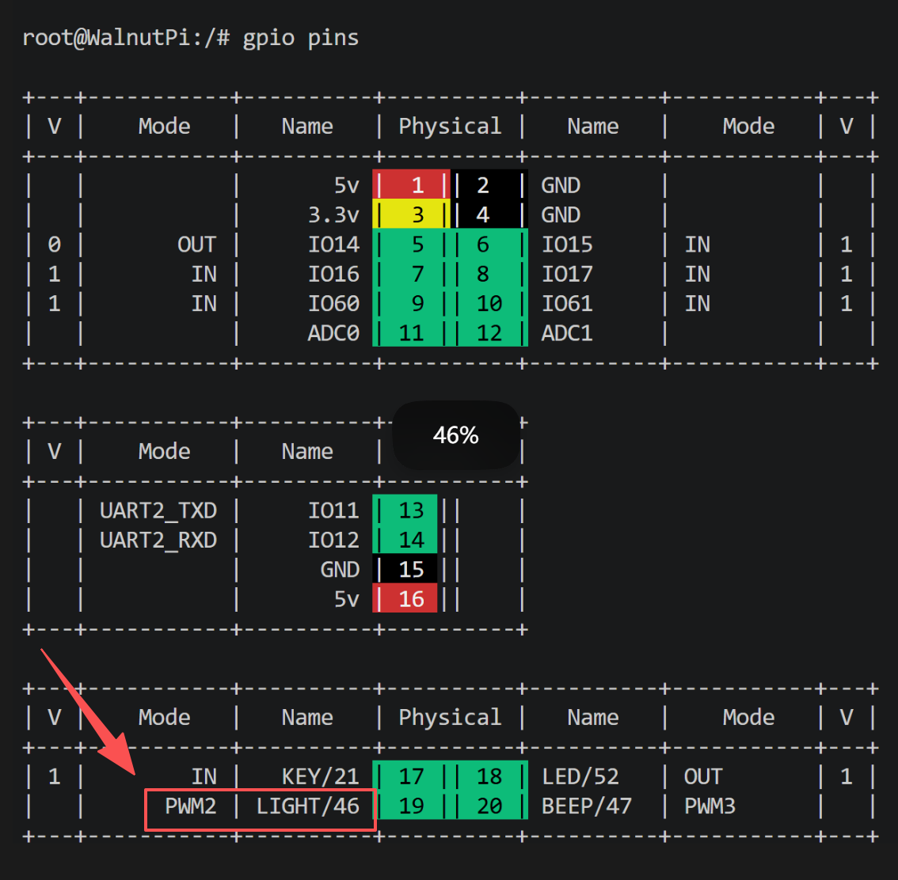
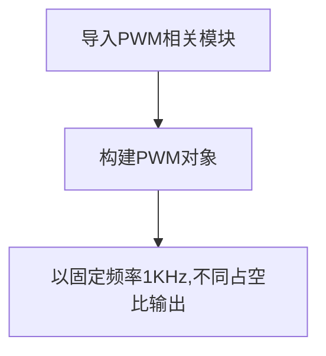

# PWM（补光灯）

## 前言
PWM（脉冲宽度调制）就是一个特定信号输出，主要用于输出不同频率、占空比（一个周期内高电平出现时间占总时间比例）的方波。以实现固定频率或平均电压输出。


## 实验目的
通过输出特定频率和不同占空比的PWM信号，控制灯光明暗变化。

## 实验讲解

PWM输出不同的占空比相当于输出不同的电压，从而实现补光灯的明暗变化。通过`gpio pins`命令可以查看CyberCAM K230的PWM引脚信息和状态。



:::tip 提示
CyberCAM K230芯片内部有2路PWM，每路有3个通道。PWM0、PWM1、PWM2为第1路PWM，PWM3、PWM4、PWM5为第2路PWM。每路PWM的频率输出是相同的，占空比可以单独设置。

也就是说当屏幕背光PWM5使用时（系统默认开启），PWM3蜂鸣器无法使用硬件PWM，可以使用软件PWM模拟输出。
:::

- IO60 PWM0
- IO61 PWM1
- IO46 PWM2 (补光灯)
- IO47 PWM3 (蜂鸣器)
- IO25 PWM5 (屏幕背光)


我们这里使用`periphery`的PWM库实现。这个封装好的Python PWM API非常简单易用。

## PWM对象

### 构造函数
```python
pwm = periphery.PWM(chip, channerl)
```
构建PWM对象
- `chip` ：PWM芯片编号，CyberCAM K230有2路，取值0~1。

    - `0`: PWM0、PWM1、PWM2
    - `1`: PWM3、PWM4、PWM5

- `channel` ：通道编号，取值0~2；

    - `0`: PWM0（chip=0）; PWM3（chip=1）。
    - `1`: PWM1（chip=0）; PWM4（chip=1）。
    - `2`: PWM2（chip=0）; PWM5（chip=1）。


### 使用方法
```python
pwm.frequency = value
```
设置pwm频率。

<br></br>

```python
pwm.duty_cycle = value
```
设置占空比。范围[0-1]表示占空比0%~100%，如0.5表示50%。

<br></br>

```python
pwm.enable()
```
使能PWM。

<br></br>

```python
pwm.disable()
```
禁用PWM。

<br></br>

```python
pwm.close()
```
关闭PWM。

<br></br>

更多用法请阅读官方文档：<br></br>
https://python-periphery.readthedocs.io/en/latest/pwm.html



## 参考代码

```python
'''
'''
实验名称：PWM(补光灯)
实验平台：CyberCAM
作者：01Studio
说明：通过调节PWM占空比来控制补光灯的亮度
'''

from periphery import PWM
import time

pwm = PWM(0,2) #第0路2通道表示 PMW2，即补光灯 
pwm.frequency = 1000 #频率1KHz

pwm.enable() #使能PWM

#占空比0.1,亮度10%
pwm.duty_cycle = 0.1
time.sleep(2)

#占空比0.5,亮度50%
pwm.duty_cycle = 0.5
time.sleep(2)

#占空比0.9,亮度90%
pwm.duty_cycle = 0.9
time.sleep(2)

pwm.disable() #禁用PWM
pwm.close() #关闭PWM
```

## 实验结果

运行代码，可以看到补光灯的亮度依次变化。

