# UART（串口通讯）

## 前言
串口是应用广泛的通讯接口，很多工控产品、无线透传模块都是使用串口来收发指令和传输数据，这样用户就可以在无须考虑底层实现原理的前提下将各类串口功能模块灵活应用起来。你也可以可以通过串口跟其它开发通讯实现数据交互，如STM32、ESP32、Arudio等。

## 实验目的
编程实现串口收发数据。

## 实验讲解

CyberCAM左侧预留了一路串口，UART2, 即IO11--TX2, IO12--RX2。

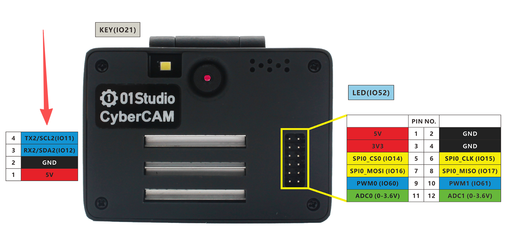 

:::danger 警告
CyberCAM UART配套线材的红色线为5V，注意请勿外接给3.3V的设备供电。
:::

## 开启串口2

先执行下方指令检查一下串口2的开启情况：
```bash
gpio pins
```

出现下图表示开启成功：

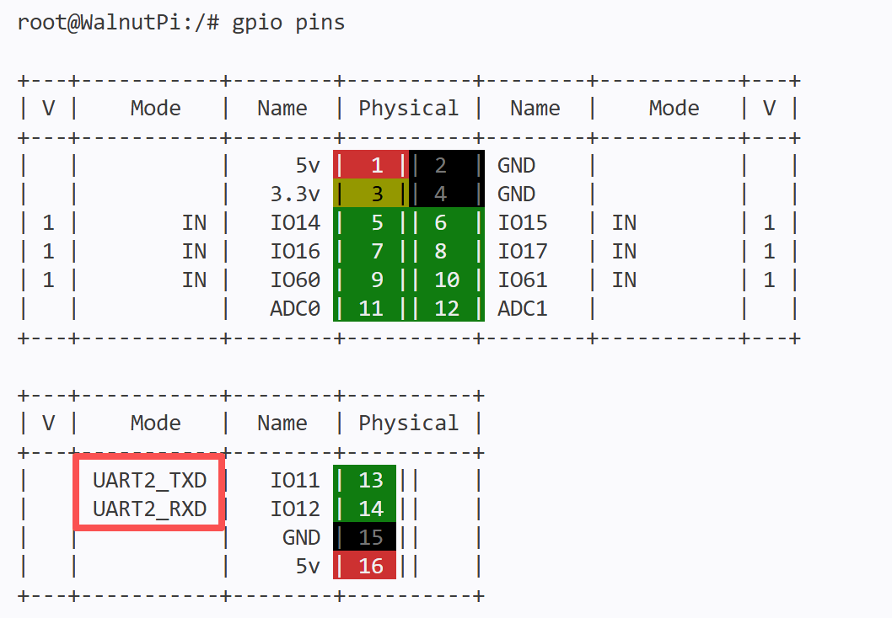 


如果没有，需要在终端输入下面指令开启：
```bash
sudo set-device enable uart2
```

重启开发板：
```bash
sudo reboot
```

重启后再次执行`gpio pins`指令检查确认已经开启即可。

## Serial对象

CyberCAM串口通讯可以使用linux系统自带的Serial标准库编程。具体介绍如下：

### 构造函数
```python
serial.Serial(“dev”,baudrate)
```
构建UART对象
- `”dev”` :设备号，CyberCAM的uart2是”/dev/ttyS2”；
- `baudrate` :串口波特率，可以设置为常用的9600、115200等。

### 使用方法
```python
Serial.inWaiting()
```
返回串口接收并存放在缓冲区的字符个数，int型。可以用来判断是否有接收到数据。

<br></br>

```python
Serial.read(num)
```
读取数据，返回字节字符串。
- `num` ：读取字符数量。

<br></br>

```python
Serial.write(b'str')
```
发送数据，要求格式为字节字符串。
- `b'str'` ：发送内容。

<br></br>

更多Serial的python用法，请看官方文档：
https://pyserial.readthedocs.io/en/latest/pyserial_api.html#module-serial

了解了UART对象用法后，我们可以用一个USB转TTL工具，配合电脑上位机【串口助手】来跟CyberCAM进行串口通信。这类工具大同小异，**需要注意的是如果带3.3V和5V电平切换的，需要将跳线帽打到3.3V，因为CyberCAM的GPIO电平是3.3V的。**

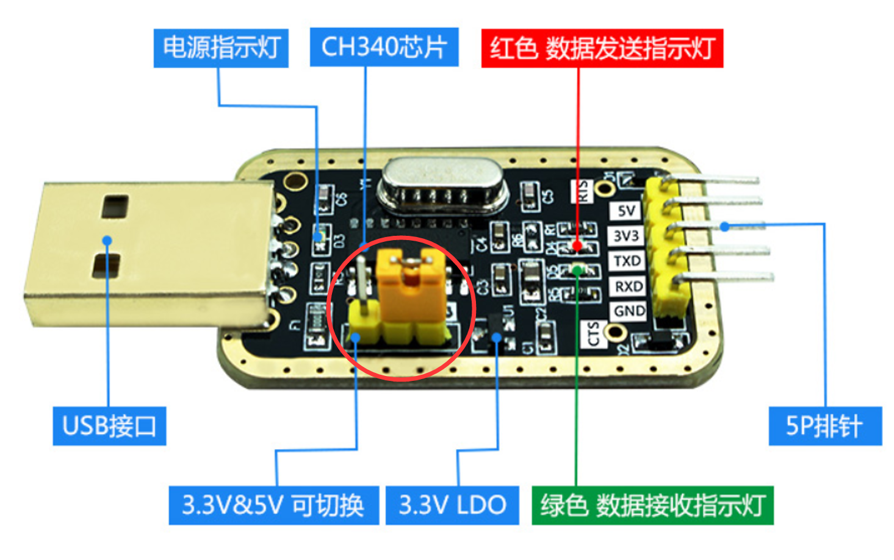 

本实验我们使用UART2，也就是TX2(IO11)和RX2(IO12)，接线示意图如下：**（3.3V可以不用接）**

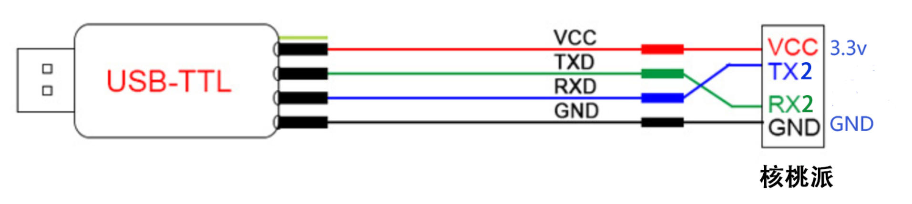 


在本实验中我们可以先初始化串口，然后给串口发去一条信息，这样PC机的串口助手就会在接收区显示出来，然后进入循环，当CyberCAM检测到有数据可以接收时候就将数据接收并打印，并通过终端打印显示。代码编写流程图如下：

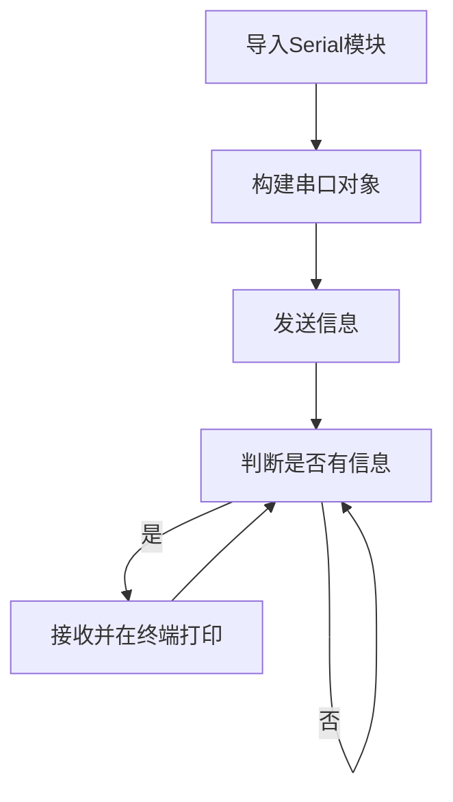

## 参考代码

```python
'''
实验名称：UART(串口通讯)
实验平台：CyberCAM
'''

#导入相关模块
import serial,time

# 配置串口
com = serial.Serial("/dev/ttyS2", 115200)

#发送提示字符
com.write(b'Hello WalnutPi!')

while True:

    # 获得接收缓冲区字符个数 int
    count = com.inWaiting()
    
    if count != 0: #收到数据
        
        # 读取内容并打印
        recv = com.read(count)
        print(recv)
        
        #发回数据
        com.write(recv)
        
        # 清空接收缓冲区
        com.flushInput()
        
    # 延时100ms,接收间隔
    time.sleep(0.1)
```

## 实验结果

终端输入下面指令确认UART2开启情况：
```bash
gpio pins
```

出现下图表示开启成功：

 

如没开启请按前面内容打开：[开启串口2](#开启串口2)

使用USB转TTL工具链接CyberCAM和电脑。**可以使用配套的4P线，只接GND地线和黄绿串口2根线即可，红线不要接，因为是5V。**

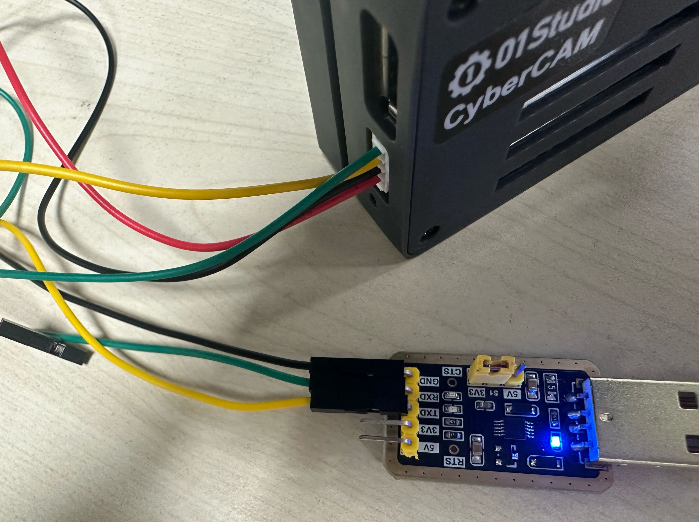 

电脑打开串口助手，选择USB转TTL对应的COM，波特率115200。点击打开，等待接收数据：

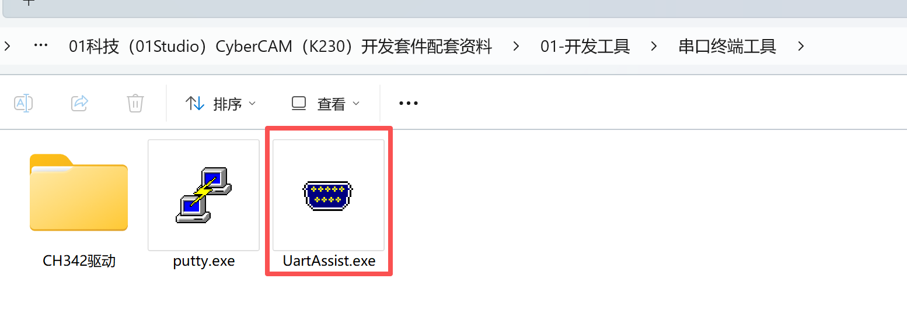 

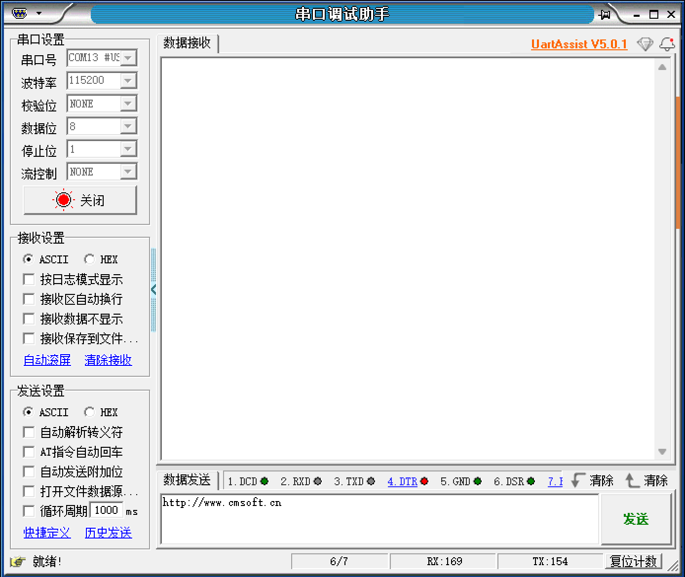 

IDE运行代码后可以看到电脑串口助手接收到信息：

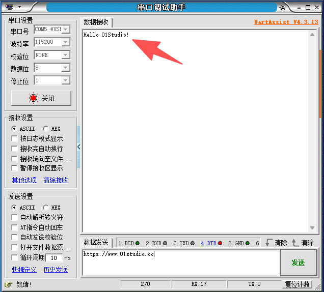 

在串口助手发送栏输入信息，点击发送，可以看到thonny下方终端打印接收到的数据（CyberCAM开发板接收到的数据）：

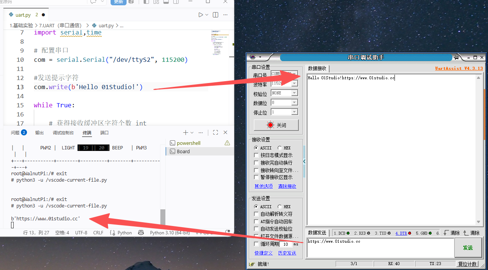 


串口数据收发应用非常广泛，除了本例程跟电脑通讯外，还可以跟其它单片机开发板或者串口模块设备通讯。

## 跟其它单片机开发板串口接线

先保证其它单片机开发板的串口电平是3.3V。常见的STM32、ESP32、Arduino和树莓派等都是3.3V IO电平。接线需要共地（GND连接在一起）。RX和TX交叉接线。

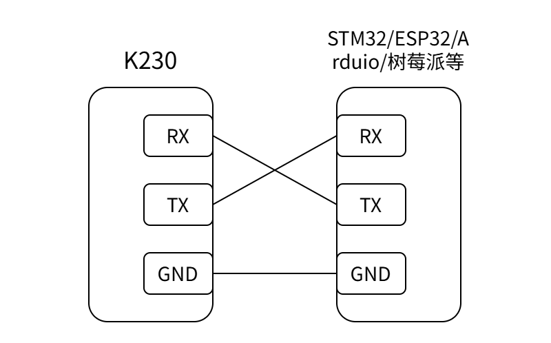 

:::danger 警告
CyberCAM UART口的红线为5V，注意请勿外接给3.3V的设备供电。
:::