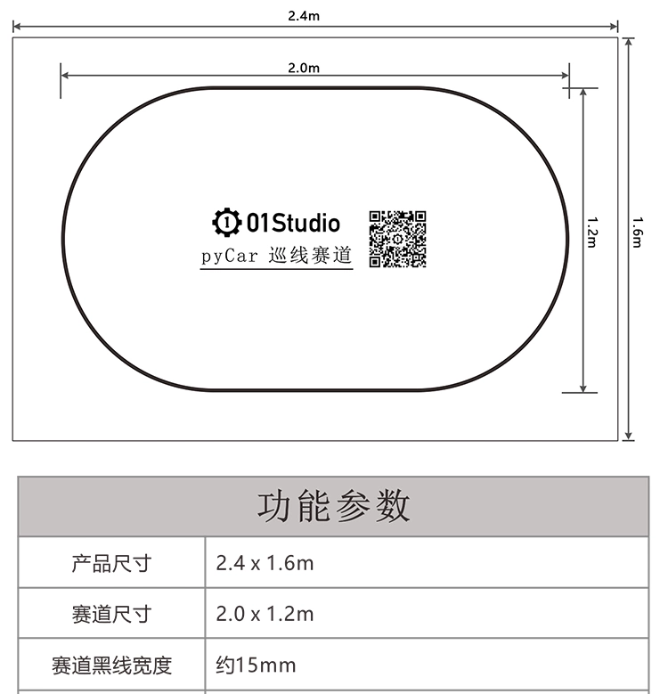
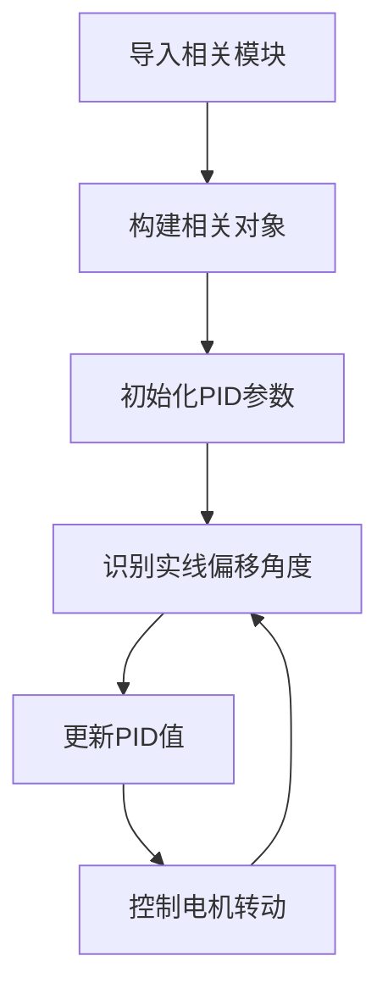
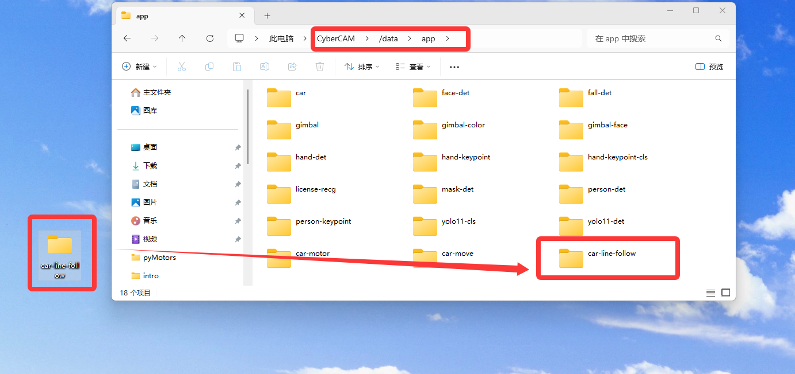
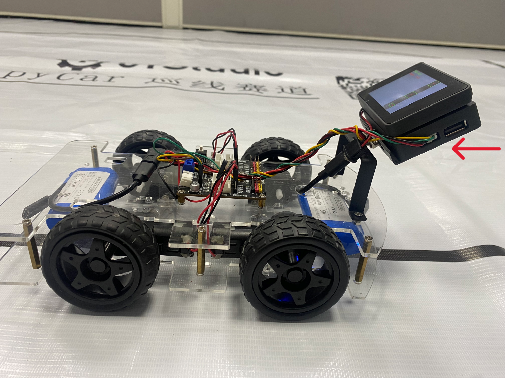
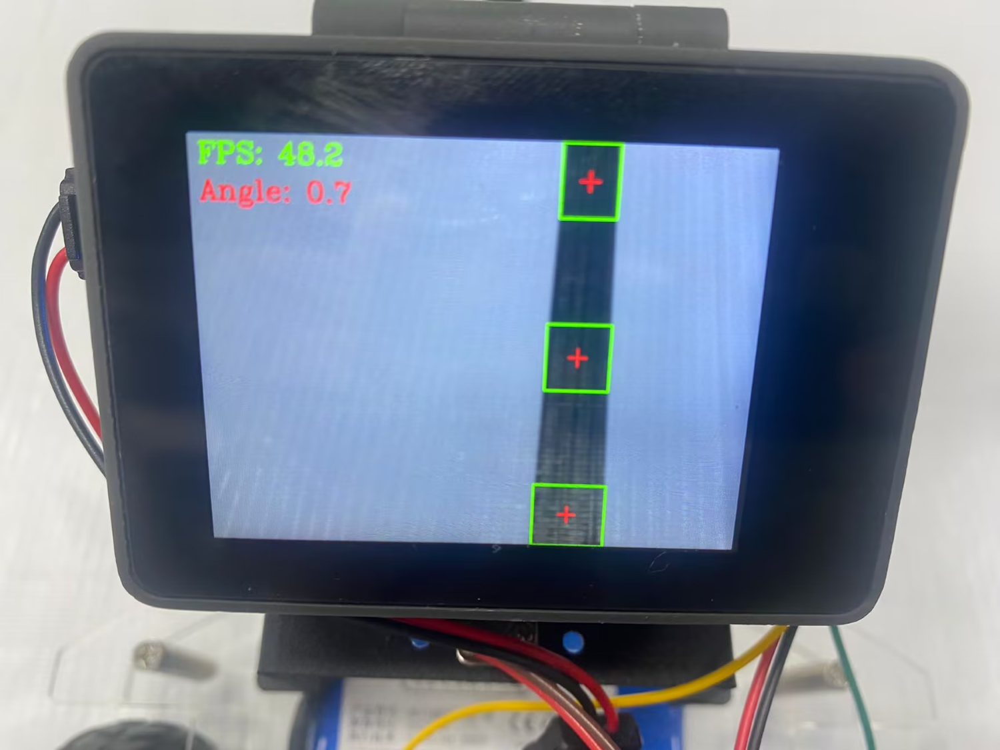
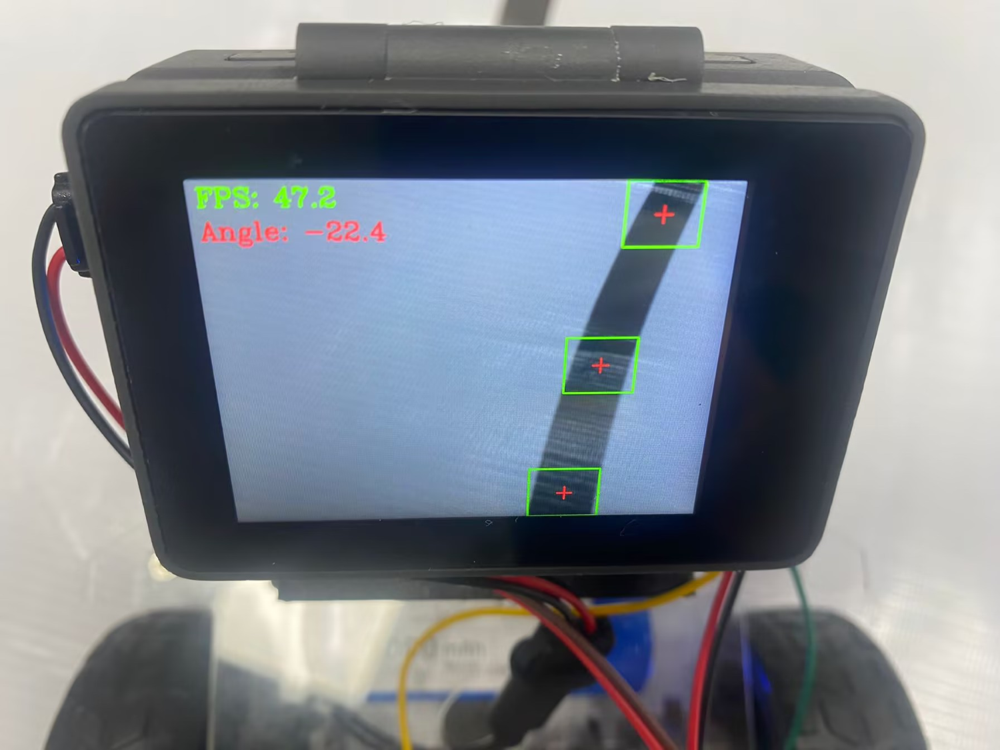
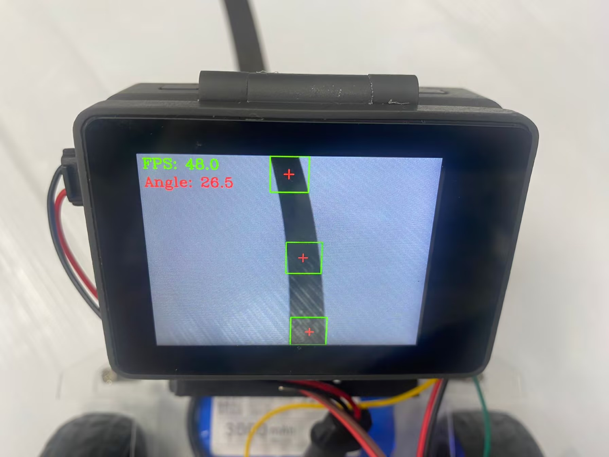

# 巡线小车

## 前言

本节我们结合前面机器视觉的机器人巡线（实线）、PID控制原理相关知识来实现小车巡线行驶。


## 实验目的

编程实现CyberCAM K230视觉巡线小车。

## 实验讲解

本节的巡线案例是基于颜色识别中的机器人巡线案例，原理是根据摄像头采集到的图像直线与中心偏离的位置计算出偏离角度。然后再通过PID算法让小车始终沿着黑线行驶。

本实验使用01Studio巡线赛道 [**点击购买>>**](https://item.taobao.com/item.htm?id=663173309335)，自己有类似的赛道也可以使用。




本实验用的其它相关教程请参考下方链接，这里不再重复：

- <a href="../machine_vision/color_recognition/line_follow" target="_blank">机器人巡线（实线）>></a>

- <a href="../gimbal/pid" target="_blank">PID控制原理 >></a>

## 开启I2C2

I2C2 与 UART2 复用同一组引脚，在同一时间只能选择其中一种功能使用，系统默认启用 UART2。

先执行下方指令检查一下I2C2的开启情况：
```bash
gpio pins
```

出现下图表示开启成功：


如果没有，需要在终端输入下面指令开启：
```bash
sudo set-device enable i2c2
```

重启开发板：
```bash
sudo reboot
```

重启后再次执行`gpio pins`指令检查确认已经开启即可。

代码编写流程如下：



## 参考代码

```python
'''
实验名称：CyberCAM K230巡线小车
实验平台：01Studio CyberCAM K230 + 小车底盘
'''
import time,busio,board,sys,os,cv2, math
import numpy as np
from walnutpi import Sensor, Display, direction, IDE

# 优先当前文件夹下相对路径（app离线部署）
local_lib_path = "./lib"
system_lib_path = "/data/app/car-line-follow/lib"

# 判断优先使用哪个路径
if os.path.exists(os.path.join(local_lib_path, "adafruit_motor")) or os.path.exists(os.path.join(local_lib_path, "adafruit_pca9685")):
    target_path = os.path.abspath(local_lib_path)
# 使用系统绝对路径（IDE运行调试）
elif os.path.exists(os.path.join(system_lib_path, "adafruit_motor")) or os.path.exists(os.path.join(system_lib_path, "adafruit_pca9685")):
    target_path = system_lib_path
else:
    raise FileNotFoundError("文件缺失，请检查当前路径与系统路径下的文件是否存在。")

# 将找到的路径插入到 sys.path 最前面（确保优先加载它）
sys.path.insert(0, target_path)

from adafruit_pca9685 import PCA9685
from adafruit_motor import motor

# 初始化显示屏
Display.init()

# 初始化摄像头，分辨率640x480
cap = Sensor.Sensor(640, 480)

# 检查摄像头是否打开
if not cap.isOpened():
    print("Cannot open camera")
    exit()

#获取当前显示屏方向，0表示默认，2表示180度翻转。
lcd_dir=direction.get_lcd() 
#print(lcd_dir) 

# 判断显示屏是否翻转，如果翻转，则设置显示旋转180°，摄像头同时设置为前置模式（水平镜像）
if lcd_dir == 2: #翻转了
    Display.set_rotation(2)
    cap.set_hmirror(1)

# ========== FPS计算 ==========
frame_count = 0       # 帧数计数器
start_time = time.time()
fps = 0.0

#构建I2C对象
i2c = busio.I2C(board.SCL2, board.SDA2)

#构建PCA9685对象
pca = PCA9685(i2c, address=0x40)
#设置pwm输出频率
pca.frequency = 100


#构建4小车4个电机对象
motor0 = motor.DCMotor(pca.channels[0], pca.channels[1])
motor1 = motor.DCMotor(pca.channels[3], pca.channels[2])
motor2 = motor.DCMotor(pca.channels[5], pca.channels[4])
motor3 = motor.DCMotor(pca.channels[6], pca.channels[7])


# =========================================================
# 图像参数
# =========================================================

IMAGE_WIDTH = 640
IMAGE_HEIGHT = 480

# 黑线灰度范围
BLACK_MIN = 0
BLACK_MAX = 70

# ROI：(x, y, width, height, weight)
# 图像下方权重最大，因为下方黑线距离小车更近
ROIS = [
    (0, 400, 640, 80, 0.50),
    (0, 200, 640, 80, 0.30),
    (0,   0, 640, 80, 0.20),
]

# 上下 ROI 横向差对控制中心的影响
HEADING_GAIN = 0.60

# 计算出的黑线中心向左移动，产生持续左转修正
RIGHT_DRIFT_BIAS_PX = 80

# 连通域过滤条件
MIN_PIXELS = 150
MIN_WIDTH = 5
MIN_HEIGHT = 5

# =========================================================
# 电机参数
# =========================================================

# pca通道pwm输出的范围为 0～4095
MAX_PWM = 4095

# 默认前进速度
MOVE_SPEED = 1400

# PID 输出转换为 PWM 修正量时的倍率
PID_PWM_SCALE = 600

# 经过当前接线测试，负值表示前进
FORWARD_SIGN = -1.0

# =========================================================
# PID 控制器
# =========================================================

class PID:
    def __init__(self, p=0.05, i=0.0, d=0.001):
        self.kp = p
        self.ki = i
        self.kd = d

        self.target = 0.0
        self.error = 0.0
        self.last_error = 0.0
        self.integral = 0.0
        self.output = 0.0

    def update(self, current_value):
        self.error = self.target - current_value

        # 偏差小于 2° 时不修正
        if abs(self.error) < 2:
            self.last_error = self.error
            return 0.0

        self.integral += self.error
        derivative = self.error - self.last_error

        self.output = (
            self.kp * self.error
            + self.ki * self.integral
            + self.kd * derivative
        )

        self.last_error = self.error
        return self.output

    def set_target(self, target):
        self.target = target
        self.error = 0.0
        self.integral = 0.0
        self.last_error = 0.0

x_pid = PID(p=0.05, i=0.0, d=0.001)
x_pid.set_target(0.0)

def clamp(value, minimum, maximum):
    """将数值限制在指定范围内。"""
    return max(minimum, min(value, maximum))


def pwm_to_throttle(pwm_value):
    """
    将 Motors.speed() 使用的 0～4095，
    转换为 DCMotor.throttle 使用的 0.0～1.0。
    """
    pwm_value = clamp(pwm_value, 0, MAX_PWM)

    throttle = pwm_value / MAX_PWM

    return FORWARD_SIGN * throttle


def set_drive(left_pwm, right_pwm):
    """设置左右两侧电机速度。"""

    left_throttle = pwm_to_throttle(left_pwm)
    right_throttle = pwm_to_throttle(right_pwm)

    motor0.throttle = left_throttle
    motor1.throttle = left_throttle

    motor2.throttle = right_throttle
    motor3.throttle = right_throttle


def stop():
    """刹车停止四个电机。"""

    motor0.throttle = 0.0
    motor1.throttle = 0.0
    motor2.throttle = 0.0
    motor3.throttle = 0.0


# 先确保电机停止
stop()
time.sleep(0.3)

# 形态学处理内核
open_kernel = np.ones((3, 3), dtype=np.uint8)
close_kernel = np.ones((5, 5), dtype=np.uint8)

# 持续采集和显示图像
while True:

    # 读取图像帧
    ret, img = cap.read()

    # 转换为灰度图
    gray = cv2.cvtColor(img, cv2.COLOR_BGR2GRAY)

    centroid_sum = 0.0

    # 只累计实际检测到黑线的 ROI 权重
    detected_weight_sum = 0.0

    blob_detected = False

    # 用于绘制不同 ROI 中检测到的中心点
    detected_points = []

    roi_center_x_list = [None, None, None]
    
    for roi_index, roi in enumerate(ROIS):

        roi_x, roi_y, roi_w, roi_h, weight = roi

        # 取出 ROI 灰度图
        gray_roi = gray[
            roi_y:roi_y + roi_h,
            roi_x:roi_x + roi_w
        ]

        # 提取灰度值 0～95 的黑色区域
        mask = cv2.inRange(gray_roi, BLACK_MIN, BLACK_MAX)

        # 去除小噪声
        mask = cv2.morphologyEx(mask, cv2.MORPH_OPEN, open_kernel)

        # 连接黑线中较小的断裂
        mask = cv2.morphologyEx(mask, cv2.MORPH_CLOSE, close_kernel)

        # 连通域检测
        num_labels, labels, stats, centroids = cv2.connectedComponentsWithStats(mask, connectivity=8, ltype=cv2.CV_16U)
        
        largest_label = -1
        largest_pixels = 0

        # 从 1 开始，0 是背景
        for label_index in range(1, num_labels):

            pixels = int(stats[label_index, cv2.CC_STAT_AREA])
            width = int(stats[label_index, cv2.CC_STAT_WIDTH])
            height = int(stats[label_index, cv2.CC_STAT_HEIGHT])

            # 减少碎块
            if pixels < MIN_PIXELS:
                continue

            # 过滤细长噪点
            if width < MIN_WIDTH or height < MIN_HEIGHT:
                continue

            if pixels > largest_pixels:
                largest_pixels = pixels
                largest_label = label_index

        # 当前 ROI 找到了有效黑线
        if largest_label >= 0:

            blob_detected = True

            blob_x = int(stats[largest_label, cv2.CC_STAT_LEFT])

            blob_y = int(stats[largest_label, cv2.CC_STAT_TOP])

            blob_w = int(stats[largest_label, cv2.CC_STAT_WIDTH])

            blob_h = int(stats[largest_label, cv2.CC_STAT_HEIGHT])

            # 连通域中心坐标是相对于 ROI 的
            center_x = int(centroids[largest_label][0])

            center_y = int(centroids[largest_label][1])

            # 转换为整张图像坐标
            global_center_x = roi_x + center_x
            global_center_y = roi_y + center_y

            global_blob_x = roi_x + blob_x
            global_blob_y = roi_y + blob_y

            # 按 ROI 权重累计黑线中心
            centroid_sum += global_center_x * weight
            detected_weight_sum += weight

            roi_center_x_list[roi_index] = global_center_x

            detected_points.append((global_center_x, global_center_y))

            # 绘制边框
            cv2.rectangle(img, (global_blob_x, global_blob_y), (global_blob_x + blob_w,global_blob_y + blob_h), (0, 255, 0), 2)

            # 绘制黑线中心
            cv2.drawMarker(img, (global_center_x, global_center_y), (0, 0, 255), markerType=cv2.MARKER_CROSS, markerSize=20, thickness=2)

    # -------------------------------------------------
    # 丢线处理
    # -------------------------------------------------

    if not blob_detected or detected_weight_sum <= 0:

        stop()

        cv2.putText(img, "STOP: LINE LOST", (10, 80), cv2.FONT_HERSHEY_SIMPLEX, 0.8, (0, 0, 255), 2)
    else:

        # -------------------------------------------------
        # 计算位置中心
        # -------------------------------------------------

        weighted_center = centroid_sum / detected_weight_sum

        bottom_x = roi_center_x_list[0]
        middle_x = roi_center_x_list[1]
        top_x = roi_center_x_list[2]

        # -------------------------------------------------
        # 根据上下 ROI 的横向差估计黑线方向
        #
        # top_x < bottom_x：
        # 黑线向图像左上方延伸，应提前向左修正
        #
        # top_x > bottom_x：
        # 黑线向图像右上方延伸，应提前向右修正
        # -------------------------------------------------

        heading_delta = 0.0

        if bottom_x is not None and top_x is not None:
            # 上下 ROI 距离最远，判断最可靠
            heading_delta = top_x - bottom_x
            
        elif bottom_x is not None and middle_x is not None:
            # 中间与下方距离只有一半，近似放大两倍
            heading_delta = 2.0 * (middle_x - bottom_x)

        elif middle_x is not None and top_x is not None:
            heading_delta = 2.0 * (top_x - middle_x)

        # -------------------------------------------------
        # 最终控制中心
        #
        # weighted_center：小车相对黑线的位置
        # heading_delta：黑线方向的提前量
        # RIGHT_DRIFT_BIAS_PX：抵消车体偏方向
        # -------------------------------------------------
        
        center_pos = (weighted_center + HEADING_GAIN * heading_delta- RIGHT_DRIFT_BIAS_PX)
    
        # 计算黑线偏离角度
        # center_pos < 320：黑线在左侧，角度为正
        # center_pos > 320：黑线在右侧，角度为负
        deflection_angle = -math.atan((center_pos - IMAGE_WIDTH / 2)/ (IMAGE_HEIGHT / 2))

        deflection_angle = math.degrees( deflection_angle)

        # PID 输出
        x_output = x_pid.update(deflection_angle)

        # pwm计算
        left_pwm = int(MOVE_SPEED + x_output * PID_PWM_SCALE)

        right_pwm = int(MOVE_SPEED - x_output * PID_PWM_SCALE)

        # 限制在 0～4095，只前进，不自动反转
        left_pwm = clamp(left_pwm, 0, MAX_PWM)
        right_pwm = clamp(right_pwm, 0, MAX_PWM)

        # 驱动电机
        set_drive(left_pwm, right_pwm)

        cv2.putText(img, f"Angle: {deflection_angle:.1f}", (10, 70), cv2.FONT_HERSHEY_COMPLEX, 1, (0, 0, 255), 2)

    # 每满1秒计算一次平均FPS
    frame_count += 1    
    current_time = time.time()
    if current_time - start_time >= 1.0:
        fps = frame_count / (current_time - start_time)
        frame_count = 0              # 重置帧数计数器
        start_time = current_time    # 重置计时起点
        print("FPS: ", fps)

    # 添加文字标签和FPS显示
    cv2.putText(img, f'FPS: {fps:.1f}', (10, 30), cv2.FONT_HERSHEY_COMPLEX, 1, (0, 255, 0), 2)

    Display.show(img) #显示到屏幕上
    #IDE.show(img) # 发送到ide窗口内显示
```

### 代码讲解

- BLACK_MIN 和 BLACK_MAX 用于确定黑色区域的灰度范围。灰度值位于该范围内的像素会被识别为黑线。当黑线识别不完整或容易断裂时，可以适当增大 BLACK_MAX，例如从 70 调整为 80；当深色背景、阴影或其他物体容易被误识别为黑线时，应适当减小 BLACK_MAX。

```python
# 黑线灰度范围
BLACK_MIN = 0
BLACK_MAX = 70
```

- 控制黑线延伸方向对最终控制中心的影响。通过比较上方和下方 ROI 中黑线中心的横坐标，估计前方黑线向左或向右延伸的程度。调整规律入弯反应过慢时，适当增大 HEADING_GAIN。小车提前转向过多或者在弯道中左右摇摆时，适当减小 HEADING_GAIN。

```python
# 上下 ROI 横向差对控制中心的影响
HEADING_GAIN = 0.60
```

- 车体方向补偿，将计算得到的黑线中心向左移动一定像素，使 PID 持续产生向左的修正量。当小车在直线运行过程中持续向右偏时，可以适当增大该参数；当小车持续向左偏时，应减小该参数。注意了主要是补偿直线行驶时的固定偏差，解决不了转弯时的惯性转动问题。

```python
# 计算出的黑线中心向左移动，产生持续左转修正
RIGHT_DRIFT_BIAS_PX = 80
```

- 小车默认前进速度 MOVE_SPEED，增大此值能提升小车行驶速度，但PID控制参数和差速修正量需要做相应调整，否则容易跑飞冲出赛道。

```python
# 默认前进速度
MOVE_SPEED = 1400
```

- PID 控制器输出通常是较小的浮点数，PID_PWM_SCALE 用于将 PID 输出转换为实际的 PWM 差速修正量。调整方法：当转向反应不足时，可以适当增大 PID_PWM_SCALE。当小车左右摆动明显或转向过猛时，应减小 PID_PWM_SCALE。注意了如果小车的默认前进速度太大的情况下，一直增大PID_PWM_SCALE，只会看到小车左右摆动或者冲出赛道，这个时候调整PID_PWM_SCALE没有意义了，要减少MOVE_SPEED值。


```python
# PID 输出转换为 PWM 修正量时的倍率
PID_PWM_SCALE = 600
```

## 实验结果

将资料包中的示例程序文件夹整体拷贝到 CyberCAM 的 `/data/app`目录下，主程序及其依赖库均包含在该文件夹中。



终端输入下面指令确认I2C开启情况：
```bash
gpio pins
```

出现下图表示开启成功：

 

如没开启请按前面内容打开：[开启I2C2](#开启I2C2)

资料包中的示例程序文件夹整体拷贝到 CyberCAM的`/data/app`目录下完成[离线APP部署](../os_software/custom_app)。

将小车放置在赛道上，CyberCAM K230开发板角度调整到45°左右。



然后给CyberCAM K230上电，可以看到小车自动巡线行驶。

- 无偏移

当黑线无偏移时，偏移角度接近0°。



- 左偏

当小车相当于黑线往左边偏移时，偏移角度为负。



- 右偏

当小车相当于黑线往右边偏移时，偏移角度为正。



