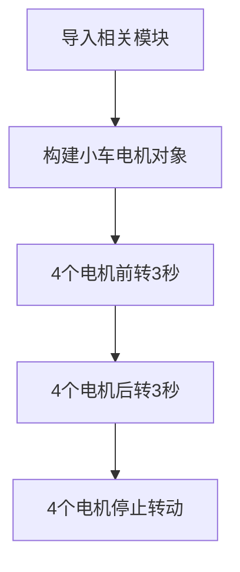
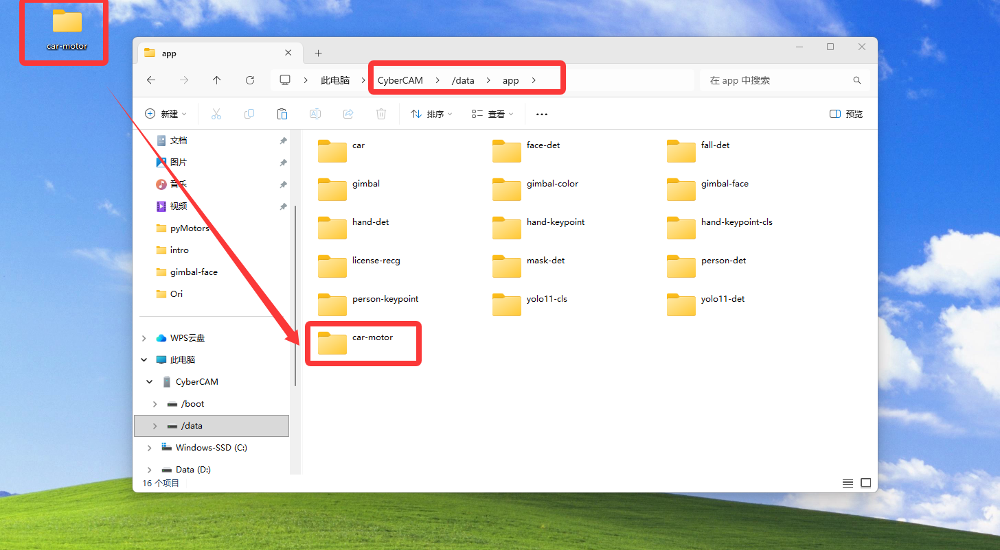
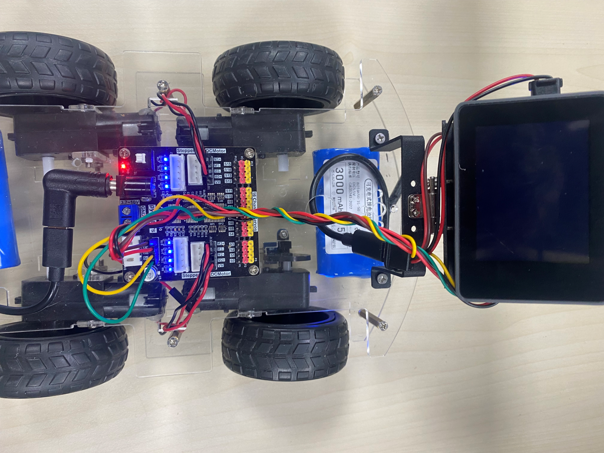

# 小车电机控制

## 前言

本机教程使用的直流电机为常用的TT马达，2个引脚，支持正转和反转，常用于智能小车等场景。


## 实验目的

学习CyberCAM控制小车直流电机。

## 实验讲解

直流电机本质通过2个引脚施加电压控制正反转，通过PWM调速。下图是一个电压为5V在不同占空比下等效电压示意图。**占空比越大，等效电压越高，电机转动速度就越快。**


小车使用的pyMotors电机模块最大支持4路直流减速电机。M0到M3接口，+表示正，-表示负。


## 开启I2C2

I2C2 与 UART2 复用同一组引脚，在同一时间只能选择其中一种功能使用，系统默认启用 UART2。

先执行下方指令检查一下I2C2的开启情况：
```bash
gpio pins
```

出现下图表示开启成功：


如果没有，需要在终端输入下面指令开启：
```bash
sudo set-device enable i2c2
```

重启开发板：
```bash
sudo reboot
```

重启后再次执行`gpio pins`指令检查确认已经开启即可。

## Motors对象

直流电机的 CircuitPython 驱动已经封装在 motor.py 和 pca9685.py 中。使用时初始化 I2C 和 PCA9685，然后创建直流电机对象即可使用。

### 构造函数

```python
from adafruit_pca9685 import PCA9685
from adafruit_motor import motor

i2c = busio.I2C(board.SCL2, board.SDA2)
pca = PCA9685(i2c, address=0x40)
pca.frequency = 100
...

m = motor.DCMotor(pca.channels[0], pca.channels[1])
```
使用 PCA9685 的两个 PWM 通道构建一路直流电机对象。

### 使用方法

```python
m.throttle = value
```
电机控制函数。

- `value`: 表示 PWM 占空比。取值范围：-1.0～1.0；

<br></br>

运行前需要将资料包中的示例程序文件夹整体拷贝到 CyberCAM 的 `/data/app`目录下。

代码编写流程如下：



## 参考代码

```python
'''
# Copyright (c) [2026] [01Studio]. Licensed under the MIT License.

实验名称：小车电机控制
实验平台：01Studio CyberCAM 
说明：同时控制4路直流减速电机
'''
import time, busio, board, os, sys

# 优先当前文件夹下相对路径（app离线部署）
local_lib_path = "./lib"
system_lib_path = "/data/app/car-motor/lib"

# 判断优先使用哪个路径
if os.path.exists(os.path.join(local_lib_path, "adafruit_motor")) or os.path.exists(os.path.join(local_lib_path, "adafruit_pca9685")):
    target_path = os.path.abspath(local_lib_path)
# 使用系统绝对路径（IDE运行调试）
elif os.path.exists(os.path.join(system_lib_path, "adafruit_motor")) or os.path.exists(os.path.join(system_lib_path, "adafruit_pca9685")):
    target_path = system_lib_path
else:
    raise FileNotFoundError("文件缺失，请检查当前路径与系统路径下的文件是否存在。")

# 将找到的路径插入到 sys.path 最前面（确保优先加载它）
sys.path.insert(0, target_path)

from adafruit_pca9685 import PCA9685
from adafruit_motor import motor

#构建I2C对象
i2c = busio.I2C(board.SCL2, board.SDA2)

#构建PCA9685对象
pca = PCA9685(i2c, address=0x40)
#设置pwm输出频率
pca.frequency = 100

#构建4小车4个电机对象
motor0 = motor.DCMotor(pca.channels[0], pca.channels[1])
motor1 = motor.DCMotor(pca.channels[3], pca.channels[2])
motor2 = motor.DCMotor(pca.channels[5], pca.channels[4])
motor3 = motor.DCMotor(pca.channels[6], pca.channels[7])

# throttle 取值范围：-1.0～1.0
# 正负号控制电机转向，绝对值表示 PWM 占空比
# 绝对值越大，电机驱动力通常越大、转速通常越高
# 教程接线中，负值对应小车前进

#前进
motor0.throttle = -0.5
motor1.throttle = -0.5
motor2.throttle = -0.5
motor3.throttle = -0.5

time.sleep(3)

#后退
motor0.throttle = 0.5
motor1.throttle = 0.5
motor2.throttle = 0.5
motor3.throttle = 0.5

time.sleep(3)

#制动停止,速度值为0
motor0.throttle = 0
motor1.throttle = 0
motor2.throttle = 0
motor3.throttle = 0

```

## 调试技巧

为了方便调试，避免电机转动导致小车跑动，可以在小车底盘下方放置一个尺寸合适的盒子，将轮胎撑起，然后做相关调试。


## 实验结果

将资料包中的示例程序文件夹整体拷贝到 CyberCAM 的 `/data/app`目录下，主程序及其依赖库均包含在该文件夹中。



终端输入下面指令确认I2C开启情况：
```bash
gpio pins
```

出现下图表示开启成功：

 

如没开启请按前面内容打开：[开启I2C2](#开启I2C2)

运行代码，可以看到小车的4个轮子前进，后退，停止。




