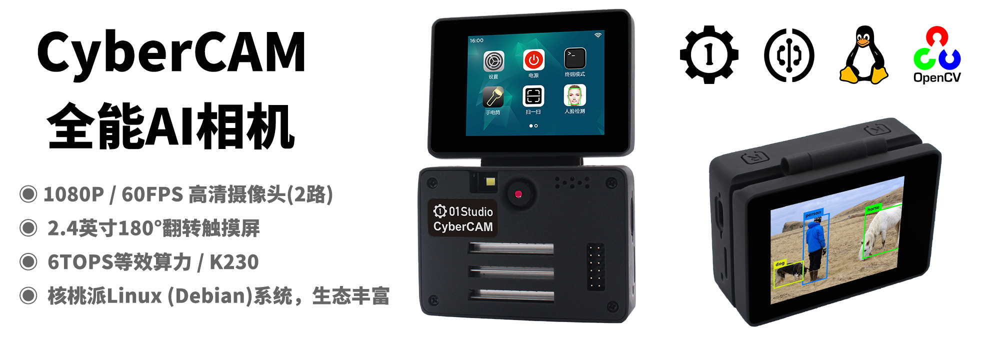

# 目录

### **CyberCAM介绍**

- [产品参数](./intro/product.md)
- [配件安装使用](./intro/module.md)
- [支架安装](./intro/bracket.md)

### **核桃派系统烧录和使用**

- [镜像烧录和开机](./os_software/image.md)
- [初始化配置](./os_software/initialize.md)
- [系统APP](./os_software/system_app.md)
- [自定义APP](./os_software/custom_app.md)
- [终端和常用命令](./os_software/terminal.md)
- [音频和录音](./os_software/audio.md)
- [主控温度](./os_software/cpu_temp.md)
- [主控ID号](./os_software/chip_id.md)
- [设备地图](./os_software/map_device.md)
- [开机自动运行脚本](./os_software/auto_run.md)

### [**开发板资料下载**](./download.md)

### [**VSCode IDE开发环境**](./vscode_ide.md)

### [**Python3基础知识**](./python_learn.md)

### **基础实验**

- [GPIO介绍](./basic_examples/gpio_intro.md) 
- [GPIO Python库](./basic_examples/gpio_python.md) 
- [点亮第1个LED](./basic_examples/led.md) 
- [按键](./basic_examples/key.md) 
- [PWM（补光灯）](./basic_examples/pwm_light.md) 
- [UART（串口通讯）](./basic_examples/uart.md) 
- [文件读写](./basic_examples/file.md) 
- [Python调用终端命令](./basic_examples/command.md) 

### **机器视觉**

- [OpenCV简介](./machine_vision/opencv_intro.md) 
- [摄像头](./machine_vision/camera.md) 
- [显示屏](./machine_vision/lcd.md) 
- [画图与字符](./machine_vision/draw.md) 
- **图像检测**
    - [边缘检测](./machine_vision/image_detection/find_edges.md) 
    - [圆形检测](./machine_vision/image_detection/find_circles.md) 
    - [矩形检测](./machine_vision/image_detection/find_rects.md) 
- **颜色识别**
    - [单一颜色识别](./machine_vision/color_recognition/single_color.md) 
    - [多种颜色识别](./machine_vision/color_recognition/mutli_color.md)
    - [物体计数（相同颜色）](./machine_vision/color_recognition/count.md)
- **码类识别**
    - [条形码识别](./machine_vision/code/barcode.md) 
    - [二维码识别](./machine_vision/code/qr_code.md) 
    - [AprilTag识别](./machine_vision/code/apriltag.md)
- **AI视觉（KPU）**
    - [人脸检测](./machine_vision/ai_vision/face_detection.md) 
    - [人体检测](./machine_vision/ai_vision/person_detection.md) 
    - [人体关键点检测](./machine_vision/ai_vision/person_keypoint.md) 
    - [跌倒检测](./machine_vision/ai_vision/falldown_detection.md) 
    - [手掌检测](./machine_vision/ai_vision/hand_detection.md) 
    - [手掌关键点检测](./machine_vision/ai_vision/hand_keypoint_det.md) 
    - [手掌关键点分类](./machine_vision/ai_vision/hand_keypoint_class.md)
    - [口罩识别](./machine_vision/ai_vision/mask_det.md)
    - [车牌识别](./machine_vision/ai_vision/license_det_rec.md)
    - [YOLO11检测](./machine_vision/ai_vision/yolo11_det.md)
    - [YOLO11分类](./machine_vision/ai_vision/yolo11_cls.md)
- [在线模型训练](./machine_vision/train.md) 
### **网络应用**

- [Socket通讯](./network/socket.md) 
- [MQTT通讯](./network/mqtt.md) 
- [HTTP通讯](./network/http.md)

### **传感器和拓展模块**

- [继电器](./sensor_module/relay.md) 

### [**社区用户开源项目分享**](./diy.md)

### [**更新说明**](./update.md)