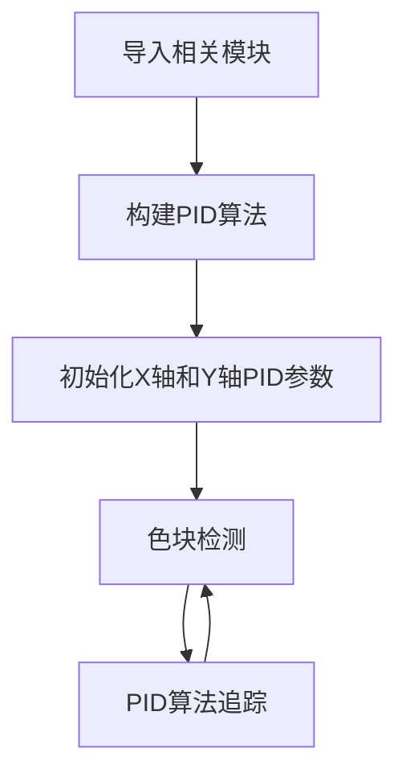
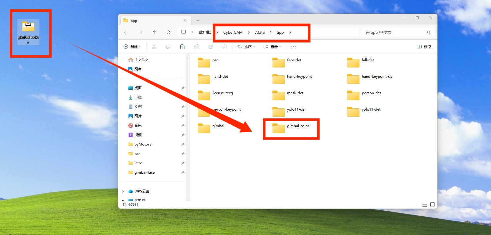
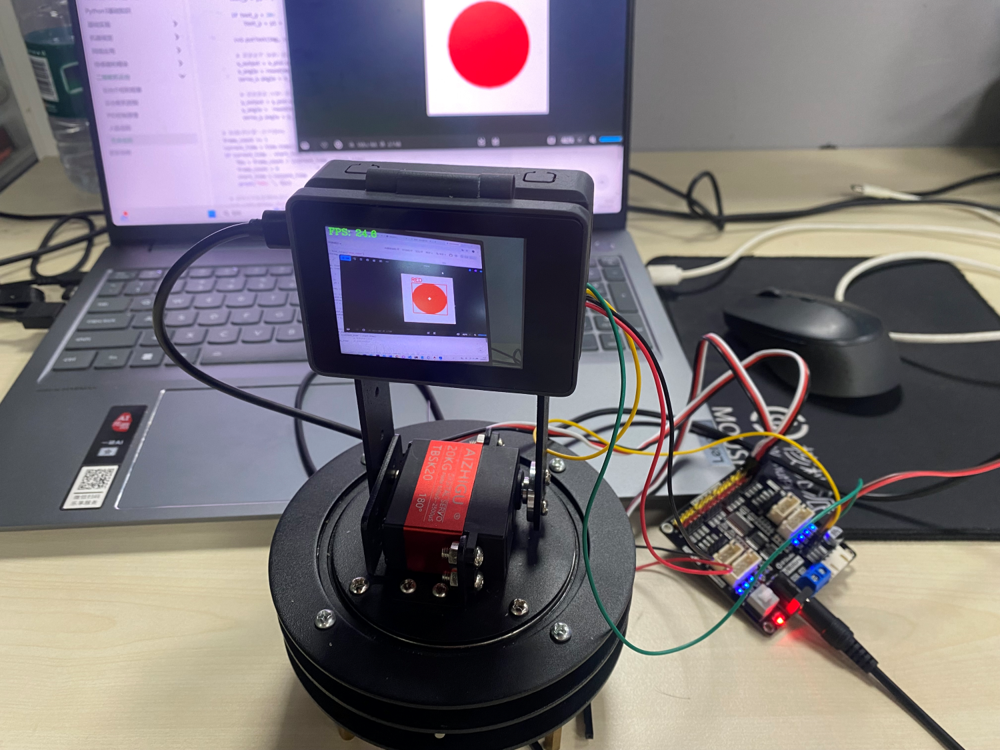

# 色块追踪

## 前言

在前两节我们学习了二维舵机云台舵机控制和PID控制原理知识，本节就来整合一下实现二维舵机云台色块追踪功能。


## 实验目的
二维舵机云台追踪指定颜色色块，让色块始终保持在显示屏正中央。

## 实验讲解

颜色识别教程参考 [单一颜色识别](../machine_vision/color_recognition/single_color.md) 章节内容，这里不再重复。

二维云台舵机控制教程参考 [舵机控制](./servo.md) 章节内容，这里不再重复。

## 开启I2C2

I2C2 与 UART2 复用同一组引脚，在同一时间只能选择其中一种功能使用，系统默认启用 UART2。

先执行下方指令检查一下I2C2的开启情况：
```bash
gpio pins
```

出现下图表示开启成功：


如果没有，需要在终端输入下面指令开启：
```bash
sudo set-device enable i2c2
```

重启开发板：
```bash
sudo reboot
```

重启后再次执行`gpio pins`指令检查确认已经开启即可。

## PID算法实现

关于PID控制原理可参考前面 [PID控制原理](./pid.md) 相关教程。

下面是一段PID算法CircuitPython实现代码：

```python
# PID对象
class PID:
    def __init__(self, p=0.05, i=0.01, d=0.01):
        self.kp = p
        self.ki = i
        self.kd = d
        self.target = 0
        self.error = 0
        self.last_error = 0
        self.integral = 0
        self.output = 0

    def update(self, current_value):
        self.error = self.target - current_value

        #变化小于10不响应
        if abs(self.error)<10:
            return 0

        self.integral += self.error
        derivative = self.error - self.last_error

        # 计算PID输出
        self.output = (self.kp * self.error) + (self.ki * self.integral) + (self.kd * derivative)

        self.last_error = self.error
        return self.output

    def set_target(self, target):
        self.target = target
        self.integral = 0
        self.last_error = 0
```

综合上面知识，色块追踪具体编程思路如下：



## 参考代码

运行代码前需要将资料包中的示例程序文件夹整体拷贝到 CyberCAM 的 `/data/app`目录下，以及确认I2C开启，主程序 main.py 代码如下：

```python

'''
# Copyright (c) [2026] [01Studio]. Licensed under the MIT License.

实验名称：cybercam二维舵机云台（色块追踪）
实验平台：01Studio cybercam + 二维舵机云台（含pyMotors驱动板）
说明：编程实现色块追踪，让色块保持在显示屏中央位置。（仅支持单个色块）
'''
import time,busio,board,sys,os,cv2 
import numpy as np
from walnutpi import Sensor, Display, direction, IDE

# 优先当前文件夹下相对路径（app离线部署）
local_lib_path = "./lib"
system_lib_path = "/data/app/gimbal-color/lib"

# 判断优先使用哪个路径
if os.path.exists(os.path.join(local_lib_path, "adafruit_motor")) or os.path.exists(os.path.join(local_lib_path, "adafruit_pca9685")):
    target_path = os.path.abspath(local_lib_path)
# 使用系统绝对路径（IDE运行调试）
elif os.path.exists(os.path.join(system_lib_path, "adafruit_motor")) or os.path.exists(os.path.join(system_lib_path, "adafruit_pca9685")):
    target_path = system_lib_path
else:
    raise FileNotFoundError("文件缺失，请检查当前路径与系统路径下的文件是否存在。")

# 将找到的路径插入到 sys.path 最前面（确保优先加载它）
sys.path.insert(0, target_path)

from adafruit_pca9685 import PCA9685
from adafruit_motor import servo

# 初始化显示屏
Display.init()

# 初始化摄像头，分辨率640x480
cap = Sensor.Sensor(640, 480)

# 检查摄像头是否打开
if not cap.isOpened():
    print("Cannot open camera")
    exit()

#获取当前显示屏方向，0表示默认，2表示180度翻转。
lcd_dir=direction.get_lcd() 
#print(lcd_dir) 

# 判断显示屏是否翻转，如果翻转，则设置显示旋转180°，摄像头同时设置为前置模式（水平镜像）
if lcd_dir == 2: #翻转了
    Display.set_rotation(2)
    cap.set_hmirror(1)

# ========== FPS计算 ==========
frame_count = 0       # 帧数计数器
start_time = time.time()
fps = 0.0

#构建I2C对象
i2c = busio.I2C(board.SCL2, board.SDA2)

#构建PCA9685对象
pca = PCA9685(i2c, address=0x40)
#设置pwm输出频率
pca.frequency = 50

#构建二维云台2路舵机对象
servo_x = servo.Servo(pca.channels[0], min_pulse=500, max_pulse=2500, actuation_range=270)
servo_y= servo.Servo(pca.channels[1], min_pulse=500, max_pulse=2500, actuation_range=180)

#初始位置，根据你的需要修改初始化位置
x_angle = 135
y_angle = 100

servo_x.angle = x_angle #水平（X轴）使用使用端口0，转到135°
servo_y.angle = y_angle #垂直（Y轴）使用使用端口1，转到90°

time.sleep(0.3)

# ========== 全图模式或缩放模式 ==========
width  = 640
height = 480
scale_x = 0.0
scale_y = 0.0

mode = 0 # 0:原图不缩放 1:根据定义的变量width，height大小进行缩放

if mode == 0:
    #原图不缩放，正常比例
    scale_x = 1.0
    scale_y = 1.0

elif mode == 1:

    # 宽度减少一半
    width = 320
    # 高度减少一半
    height = 240

    # 计算反向映射比例（原图尺寸 / 缩放后尺寸）
    # 当小图分辨率为 320x240 时，比例为 2.0，用于将小图坐标等比放大还原回原图
    scale_x = 640 / width
    scale_y = 480 / height  

# 颜色识别阈值 (L Min, L Max, A Min, A Max, B Min, B Max) LAB模型
# 下面的阈值元组是用来识别 红、绿、蓝三种颜色以及边框绘图的颜色，当然你也可以调整让识别变得更好
thresholds = {
    "RED": {
        "threshold": (30, 100, 15, 127, 15, 127),
        "draw_color": (0, 0, 255),
    },
}

#最小色块像素数
MIN_PIXELS = 150

#最小边框
MIN_WIDTH = 5
MIN_HEIGHT = 5

def canmv_lab_to_opencv(threshold):
    """
    将 CanMV 的 LAB 阈值转换为 OpenCV 8位 LAB 阈值。

    OpenMV:
        L = 0～100
        A = -128～127
        B = -128～127

    OpenCV CV_8U:
        L = 0～255
        A = 0～255
        B = 0～255
    """
    l_min, l_max, a_min, a_max, b_min, b_max = threshold

    lower = np.array(
        [
            round(l_min * 255 / 100),
            a_min + 128,
            b_min + 128,
        ],
        dtype=np.uint8,
    )

    upper = np.array(
        [
            round(l_max * 255 / 100),
            a_max + 128,
            b_max + 128,
        ],
        dtype=np.uint8,
    )

    return lower, upper


# 提前转换阈值，不要在每帧循环中创建数组
for config in thresholds.values():
    config["lower"], config["upper"] = canmv_lab_to_opencv(
        config["threshold"]
    )

# PID参数 (水平和垂直方向分别设置)
class PID:
    def __init__(self, p=0.05, i=0.01, d=0.01):
        self.kp = p
        self.ki = i
        self.kd = d
        self.target = 0
        self.error = 0
        self.last_error = 0
        self.integral = 0
        self.output = 0

    def update(self, current_value):
        self.error = self.target - current_value

        #坐标变化小于10不响应
        if abs(self.error) < 10:
            return 0

        self.integral += self.error
        derivative = self.error - self.last_error

        # 计算PID输出
        self.output = (self.kp * self.error) + (self.ki * self.integral) + (self.kd * derivative)

        self.last_error = self.error
        return self.output

    def set_target(self, target):
        self.target = target
        self.integral = 0
        self.last_error = 0

# 初始化2个PID控制器
x_pid = PID(p=0.02, i=0.0, d=0.001)  # 水平方向PID
y_pid = PID(p=0.02, i=0.0, d=0.001) # 垂直方向PID

# 设置目标位置 (图像中心), 摄像头输入图片分辨率为640x480
x_pid.set_target(320)
y_pid.set_target(240)

# 持续采集和显示图像
while True:

    # 读取图像帧
    ret, img = cap.read()

    if mode == 1:
        #调整图片的分辨率
        small = cv2.resize(img, (width, height),  interpolation=cv2.INTER_AREA)
    else:
        #保持原来的分辨率
        small = img

    #转换成LAB格式
    lab = cv2.cvtColor(small, cv2.COLOR_BGR2LAB)

    #最色块
    best_target = None

    #第一个目标
    first_target = None

    #提取色素
    for color_name, config in thresholds.items():
        #根据颜色阈值生成二值掩膜
        mask = cv2.inRange(lab, config["lower"], config["upper"])
        #连通域
        num_labels, labels, stats, centroids = cv2.connectedComponentsWithStats(mask, connectivity=8, ltype=cv2.CV_16U)
        #选择满足面积和尺寸要求的色块
        for label_index in range(1, num_labels):
            pixels = int(stats[label_index, cv2.CC_STAT_AREA])
            #减少碎块
            if pixels < MIN_PIXELS:
                continue

            x = int(stats[label_index, cv2.CC_STAT_LEFT])
            y = int(stats[label_index, cv2.CC_STAT_TOP])
            w = int(stats[label_index, cv2.CC_STAT_WIDTH])
            h = int(stats[label_index, cv2.CC_STAT_HEIGHT])

            # 过滤细长噪点
            if w < MIN_WIDTH or h < MIN_HEIGHT:
                continue

            #坐标映射计算            
            center_x = int(centroids[label_index][0])
            center_y = int(centroids[label_index][1])

            center_x = int(center_x * scale_x)
            center_y = int(center_y * scale_y)

            x = int(x * scale_x) 
            y = int(y * scale_y)
            w = int( w * scale_x) 
            h = int( h * scale_y)

            # 最大的色块
            if best_target is None or pixels > best_target["pixels"]:
                best_target = {
                    "pixels": pixels,
                    "x": x,
                    "y": y,
                    "w": w,
                    "h": h,
                    "center_x": center_x,
                    "center_y": center_y,
                    "color_name": color_name,
                    "draw_color": config["draw_color"],   
                }
        # if label_index == 0 and first_target is None:
        if best_target is not None:

            center_x = best_target["center_x"]
            center_y = best_target["center_y"]
            x1 = best_target["x"]
            y1 = best_target["y"]
            x2 = x1 + best_target["w"] 
            y2 = y1 + best_target["h"] 

            #画图
            draw_color = best_target["draw_color"]
            cv2.rectangle(img, (x1, y1), (x2, y2), draw_color, 2,)

            cross_size = 4
            
            cv2.line(img, (center_x - cross_size, center_y), (center_x + cross_size, center_y), (255, 255, 255), 2,)
            cv2.line(img, (center_x, center_y - cross_size), (center_x, center_y + cross_size), (255, 255, 255), 2,)

            text_y = y1 - 5
            
            if text_y < 20:
                text_y = y1 + 20

            cv2.putText(img, color_name, (x1, text_y), cv2.FONT_HERSHEY_SIMPLEX, 0.6, draw_color, 2,)

            # 更新水平（X轴）舵机角度
            x_output = x_pid.update(center_x)
            x_angle = round(max(0, min(abs(x_angle + x_output),270)),1)
            servo_x.angle = x_angle

            # 更新垂直（Y轴）舵机角度
            y_output = y_pid.update(center_y)
            y_angle =  round(max(0, min(abs(y_angle + y_output),180)),1)
            servo_y.angle = y_angle

    # 每满1秒计算一次平均FPS
    frame_count += 1    
    current_time = time.time()
    if current_time - start_time >= 1.0:
        fps = frame_count / (current_time - start_time)
        frame_count = 0              # 重置帧数计数器
        start_time = current_time    # 重置计时起点
        print("FPS: ", fps)

    # 添加文字标签和FPS显示
    cv2.putText(img, f'FPS: {fps:.1f}', (10, 30), cv2.FONT_HERSHEY_COMPLEX, 1, (0, 255, 0), 2)

    Display.show(img) #显示到屏幕上
    #IDE.show(img) # 发送到ide窗口内显示


```

**这里对关键代码进行讲解：**

- 初始化PID控制器：

可通过修改p,i,d数值改变追踪效果。i在本实验中用不到配置默认0即可。

```python
# 初始化2个PID控制器
x_pid = PID(p=0.02, i=0.0, d=0.001)  # 水平方向PID
y_pid = PID(p=0.02, i=0.0, d=0.001) # 垂直方向PID
```
- 设置目前期望的位置

由于案例默认`mode=0`，摄像头输入的图像分辨率为 640×480，因此画面中心的目标期望坐标设置为 (320, 240)。模式能够保留更多图像细节，但 CPU 计算量较大，如果需要提升速度把设置为`mode=1`，并适当降低 `width` 和`height`调整缩放比例。注意，跟踪控制是直接基于摄像头采集图像的像素坐标系进行计算的。即便后续将画面缩放并渲染到不同分辨率的显示屏上，也不会影响控制算法的中心点判定。

```python
# ========== 全图模式或缩放模式 ==========
width  = 640
height = 480
scale_x = 0.0
scale_y = 0.0

mode = 0 # 0:原图不缩放 1:根据定义的变量width，height大小进行缩放

if mode == 0:
    #原图不缩放，正常比例
    scale_x = 1.0
    scale_y = 1.0

elif mode == 1:

    # 宽度减少一半
    width = 320
    # 高度减少一半
    height = 240

    # 计算反向映射比例（原图尺寸 / 缩放后尺寸）
    # 当小图分辨率为 320x240 时，比例为 2.0，用于将小图坐标等比放大还原回原图
    scale_x = 640 / width
    scale_y = 480 / height  
```

```python
# 设置目标位置 (图像中心), 摄像头输入图片分辨率为640x480
x_pid.set_target(320)
y_pid.set_target(240)
```

- 主函数代码：

在循环中一直检测色块，然后返回色块的中心X,Y坐标值，将这2个值喂给PID算法，根据算法返回值调整舵机位置。


```python
...
###############
## 这里编写代码
###############
while True:

    # 读取图像帧
    ret, img = cap.read()

    if mode == 1:
        #调整图片的分辨率
        small = cv2.resize(img, (width, height),  interpolation=cv2.INTER_AREA)
    else:
        #保持原来的分辨率
        small = img

    #转换成LAB格式
    lab = cv2.cvtColor(small, cv2.COLOR_BGR2LAB)

    #最色块
    best_target = None

    #第一个目标
    first_target = None

    #提取色素
    for color_name, config in thresholds.items():
        #根据颜色阈值生成二值掩膜
        mask = cv2.inRange(lab, config["lower"], config["upper"])
        #连通域
        num_labels, labels, stats, centroids = cv2.connectedComponentsWithStats(mask, connectivity=8, ltype=cv2.CV_16U)
        #选择满足面积和尺寸要求的色块
        for label_index in range(1, num_labels):
            pixels = int(stats[label_index, cv2.CC_STAT_AREA])
            #减少碎块
            if pixels < MIN_PIXELS:
                continue

            x = int(stats[label_index, cv2.CC_STAT_LEFT])
            y = int(stats[label_index, cv2.CC_STAT_TOP])
            w = int(stats[label_index, cv2.CC_STAT_WIDTH])
            h = int(stats[label_index, cv2.CC_STAT_HEIGHT])

            # 过滤细长噪点
            if w < MIN_WIDTH or h < MIN_HEIGHT:
                continue

            #坐标映射计算            
            center_x = int(centroids[label_index][0])
            center_y = int(centroids[label_index][1])

            center_x = int(center_x * scale_x)
            center_y = int(center_y * scale_y)

            x = int(x * scale_x) 
            y = int(y * scale_y)
            w = int( w * scale_x) 
            h = int( h * scale_y)

            # 最大的色块
            if best_target is None or pixels > best_target["pixels"]:
                best_target = {
                    "pixels": pixels,
                    "x": x,
                    "y": y,
                    "w": w,
                    "h": h,
                    "center_x": center_x,
                    "center_y": center_y,
                    "color_name": color_name,
                    "draw_color": config["draw_color"],   
                }

        if best_target is not None:

            center_x = best_target["center_x"]
            center_y = best_target["center_y"]
            x1 = best_target["x"]
            y1 = best_target["y"]
            x2 = x1 + best_target["w"] 
            y2 = y1 + best_target["h"] 

            #画图
            draw_color = best_target["draw_color"]
            cv2.rectangle(img, (x1, y1), (x2, y2), draw_color, 2,)

            cross_size = 4
            
            cv2.line(img, (center_x - cross_size, center_y), (center_x + cross_size, center_y), (255, 255, 255), 2,)
            cv2.line(img, (center_x, center_y - cross_size), (center_x, center_y + cross_size), (255, 255, 255), 2,)

            text_y = y1 - 5
            
            if text_y < 20:
                text_y = y1 + 20

            cv2.putText(img, color_name, (x1, text_y), cv2.FONT_HERSHEY_SIMPLEX, 0.6, draw_color, 2,)

            # 更新水平（X轴）舵机角度
            x_output = x_pid.update(center_x)
            x_angle = round(max(0, min(abs(x_angle + x_output),270)),1)
            servo_x.angle = x_angle

            # 更新垂直（Y轴）舵机角度
            y_output = y_pid.update(center_y)
            y_angle =  round(max(0, min(abs(y_angle + y_output),180)),1)
            servo_y.angle = y_angle

    # 每满1秒计算一次平均FPS
    frame_count += 1    
    current_time = time.time()
    if current_time - start_time >= 1.0:
        fps = frame_count / (current_time - start_time)
        frame_count = 0              # 重置帧数计数器
        start_time = current_time    # 重置计时起点
        print("FPS: ", fps)

    # 添加文字标签和FPS显示
    cv2.putText(img, f'FPS: {fps:.1f}', (10, 30), cv2.FONT_HERSHEY_COMPLEX, 1, (0, 255, 0), 2)

    # 显示到屏幕
    Display.show(img)
    ...
```

## 实验结果

将资料包中的示例程序文件夹整体拷贝到 CyberCAM 的 `/data/app`目录下，主程序及其依赖库均包含在该文件夹中：



终端输入下面指令确认I2C开启情况：
```bash
gpio pins
```

出现下图表示开启成功：

 

如没开启请按前面内容打开：[开启I2C2](#开启I2C2)

本例程测试色块（代码默认红色，并且图像存在多个相同的色块是选择最大的色块作为跟踪目标），另存为图片到本地即可使用：


运行代码，在摄像头画面移动色块图片，可以看到二维舵机云台实现了色块追踪。



本例程默认红色阈值，如果想获取特定颜色阈值提升识别准确率，可以参考教程 [获取颜色阈值](../machine_vision/color_recognition/count.md#获取颜色阈值)。


