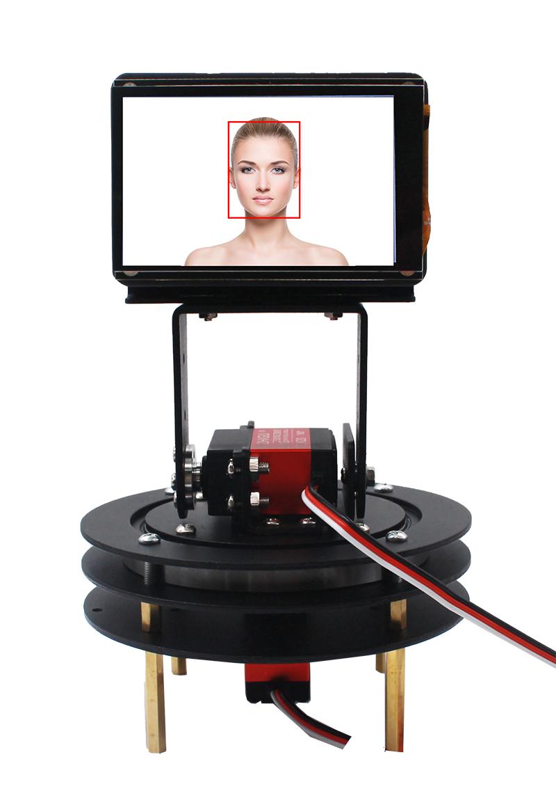
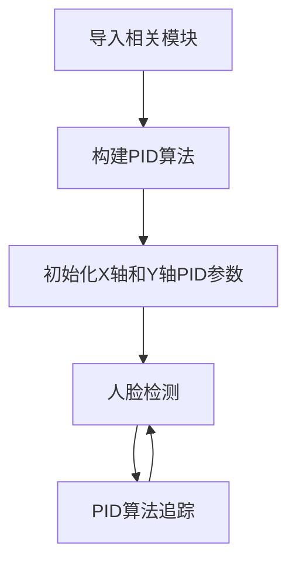
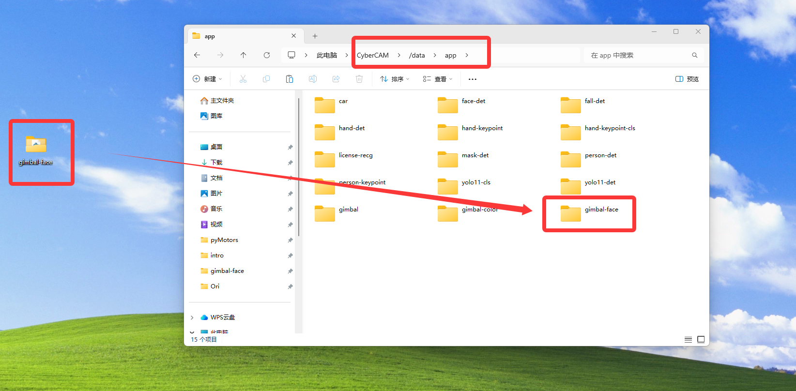
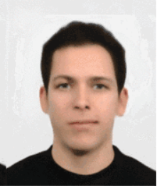
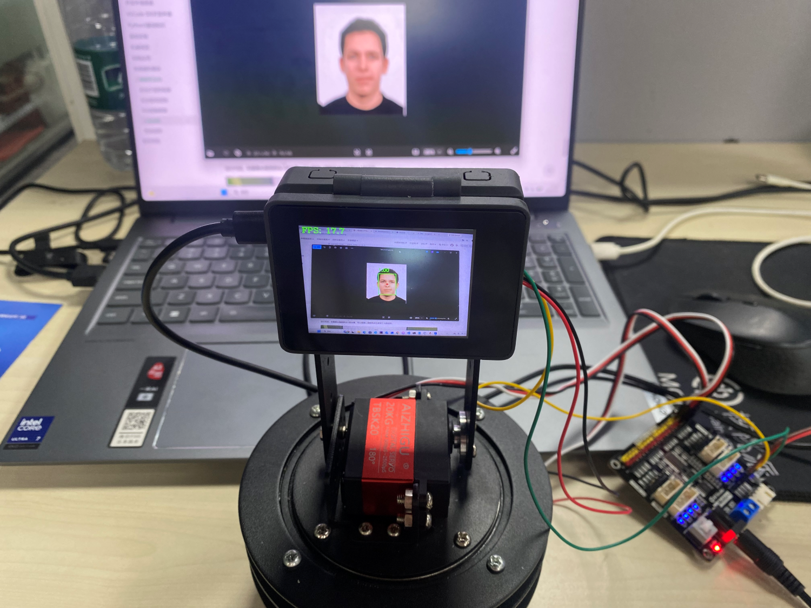

# 人脸追踪

## 前言
在前两节我们学习了二维舵机云台舵机控制和PID控制原理知识，本节就来整合一下实现二维舵机云台人脸追踪功能。



## 实验目的
二维舵机云台追踪人脸，让人脸始终保持在显示屏正中央。

## 实验讲解

人脸检测教程参考 [人脸检测](../machine_vision/ai_vision/face_detection.md) 章节内容，这里不再重复。

二维云台舵机控制教程参考 [舵机控制](./servo.md) 章节内容，这里不再重复。

## 开启I2C2

I2C2 与 UART2 复用同一组引脚，在同一时间只能选择其中一种功能使用，系统默认启用 UART2。

先执行下方指令检查一下I2C2的开启情况：
```bash
gpio pins
```

出现下图表示开启成功：


如果没有，需要在终端输入下面指令开启：
```bash
sudo set-device enable i2c2
```

重启开发板：
```bash
sudo reboot
```

重启后再次执行`gpio pins`指令检查确认已经开启即可。

## PID算法实现

关于PID控制原理可参考上一节 [PID控制原理](./pid.md) 相关教程。

下面是一段PID算法CircuitPython实现代码：

```python
# PID对象
class PID:
    def __init__(self, p=0.05, i=0.01, d=0.01):
        self.kp = p
        self.ki = i
        self.kd = d
        self.target = 0
        self.error = 0
        self.last_error = 0
        self.integral = 0
        self.output = 0

    def update(self, current_value):
        self.error = self.target - current_value

        #变化小于10不响应
        if abs(self.error)<10:
            return 0

        self.integral += self.error
        derivative = self.error - self.last_error

        # 计算PID输出
        self.output = (self.kp * self.error) + (self.ki * self.integral) + (self.kd * derivative)

        self.last_error = self.error
        return self.output

    def set_target(self, target):
        self.target = target
        self.integral = 0
        self.last_error = 0
```

综合上面知识，人脸追踪具体编程思路如下：



## 参考代码

运行代码前需要将资料包中的示例程序文件夹整体拷贝到 CyberCAM 的 `/data/app`目录下，以及确认I2C开启，主程序 main.py 代码如下：

```python
'''
# Copyright (c) [2026] [01Studio]. Licensed under the MIT License.

实验名称：cybercam二维舵机云台（人脸追踪）
实验平台：01Studio cybercam + 二维舵机云台（含pyMotors驱动板）
说明：编程实现人脸追踪，让人脸保持在显示屏中央位置。（仅支持单个人脸）
'''

import cv2,time,busio,board,sys,os
from walnutpi import Display,Sensor,kpu,IDE,direction

# 当前文件夹下相对路径，绝对路径（app离线部署）
local_lib_path = "./lib"
system_lib_path = "/data/app/gimbal/lib"

# 判断优先使用哪个路径
if os.path.exists(os.path.join(local_lib_path, "adafruit_motor")) or os.path.exists(os.path.join(local_lib_path, "adafruit_pca9685")):
    target_path = os.path.abspath(local_lib_path)
# 使用系统绝对路径（IDE运行调试）
elif os.path.exists(os.path.join(system_lib_path, "adafruit_motor")) or os.path.exists(os.path.join(system_lib_path, "adafruit_pca9685")):
    target_path = system_lib_path
else:
    raise FileNotFoundError("文件缺失，请检查当前路径与系统路径下的文件是否存在。")
# 将找到的路径插入到 sys.path 最前面（确保优先加载它）
sys.path.insert(0, target_path)

from adafruit_pca9685 import PCA9685
from adafruit_motor import servo

# 初始化屏幕
Display.init()

# 初始化摄像头
cap = Sensor.Sensor(640, 480)

#获取当前显示屏方向，0表示默认，2表示180度翻转。
lcd_dir=direction.get_lcd() 
#print(lcd_dir) 

# 判断显示屏是否翻转，如果翻转，则设置显示旋转180°，摄像头同时设置为前置模式（水平镜像）
if lcd_dir == 2: #翻转了
    Display.set_rotation(2)
    cap.set_hmirror(1)

if not cap.isOpened():
    print("Cannot open camera")
    exit()

# ========== FPS计算 ==========
frame_count = 0       # 帧数计数器
start_time = time.time()
fps = 0.0


# 优先当前文件夹下相对路径（app离线部署）
if os.path.exists("./face_detection_320.kmodel") and os.path.exists("./prior_data_320.bin"):
    model_path = "./face_detection_320.kmodel"
    anchors_path = "./prior_data_320.bin"

# 使用系统绝对路径（IDE运行调试）
elif os.path.exists("/data/app/face-det/face_detection_320.kmodel") and os.path.exists("/data/app/face-det/prior_data_320.bin"):
    model_path = "/data/app/face-det/face_detection_320.kmodel"
    anchors_path = "/data/app/face-det/prior_data_320.bin"
else:
    raise FileNotFoundError("模型文件缺失，请检查当前路径与系统路径下的模型文件是否存在。")

model_size = 320 #模型尺寸
detector = kpu.FACE_DETECT(model_path, anchors_path, model_size) #加载模型

#构建I2C对象
i2c = busio.I2C(board.SCL2, board.SDA2)

#构建PCA9685对象
pca = PCA9685(i2c, address=0x40)
#设置pwm输出频率
pca.frequency = 50

#构建二维云台2路舵机对象
servo_x = servo.Servo(pca.channels[0], min_pulse=500, max_pulse=2500, actuation_range=270)
servo_y= servo.Servo(pca.channels[1], min_pulse=500, max_pulse=2500, actuation_range=180)

#初始位置，根据你的需要修改初始化位置
x_angle = 135
y_angle = 100

servo_x.angle = x_angle #水平（X轴）使用使用端口0，转到135°
servo_y.angle = y_angle #垂直（Y轴）使用使用端口1，转到90°

time.sleep(0.3)

# PID参数 (水平和垂直方向分别设置)
class PID:
    def __init__(self, p=0.05, i=0.01, d=0.01):
        self.kp = p
        self.ki = i
        self.kd = d
        self.target = 0
        self.error = 0
        self.last_error = 0
        self.integral = 0
        self.output = 0

    def update(self, current_value):
        self.error = self.target - current_value

        #坐标变化小于10不响应
        if abs(self.error) < 10:
            return 0

        self.integral += self.error
        derivative = self.error - self.last_error

        # 计算PID输出
        self.output = (self.kp * self.error) + (self.ki * self.integral) + (self.kd * derivative)

        self.last_error = self.error
        return self.output

    def set_target(self, target):
        self.target = target
        self.integral = 0
        self.last_error = 0

# 初始化2个PID控制器
x_pid = PID(p=0.02, i=0.0, d=0.001)  # 水平方向PID
y_pid = PID(p=0.02, i=0.0, d=0.001) # 垂直方向PID

# 设置目标位置 (图像中心), 摄像头输入图片分辨率为640x480
x_pid.set_target(320)
y_pid.set_target(240)

while True:
    
    # 摄像头读取一帧图像    
    ret, img = cap.read()
    
    #如果图像上有多个目标，只把第一个目前当成跟踪对象
    first_target = None

    # 执行目标检测，设置置信度阈值为 0.6，IoU 阈值为 0.7
    results = detector.run(img, reliability_threshold=0.6, nms_threshold=0.7)

    # 把第一个对象作为目前跟踪的目标
    if results:
        first_target = results[0]

    # 打印并绘制结果，舵机控制
    if first_target is not None :

        # 绘制 人脸识别框
        cv2.rectangle(img, (first_target.x , first_target.y ), 
                        (first_target.x + first_target.w, first_target.y + first_target.h), 
                        (0, 255, 0), 2)
        #中心点
        center_x = int((first_target.x +  ( first_target.w / 2) ) ) 
        center_y = int((first_target.y + (first_target.h / 2 ) ) )

        cv2.circle(img, (center_x, center_y), 4, (0, 0, 255), -1)

        # 绘制置信度
        label = f"{first_target.reliability:.2f}"
        cv2.putText(img, label, (first_target.x, first_target.y - 10), cv2.FONT_HERSHEY_SIMPLEX, 0.6, (0, 255, 0), 2)

        # 更新水平（X轴）舵机角度
        x_output = x_pid.update(center_x)
        x_angle = round(max(0, min(abs(x_angle + x_output),270)),1)
        servo_x.angle = x_angle

        # 更新垂直（Y轴）舵机角度
        y_output = y_pid.update(center_y)
        y_angle =  round(max(0, min(abs(y_angle + y_output),180)),1)
        servo_y.angle = y_angle

    # 每满1秒计算一次平均FPS
    frame_count += 1    
    current_time = time.time()
    if current_time - start_time >= 1.0:
        fps = frame_count / (current_time - start_time)
        frame_count = 0              # 重置帧数计数器
        start_time = current_time    # 重置计时起点
        print("FPS: ", f'FPS: {fps:.1f}')

     # 添加文字标签和FPS显示
    cv2.putText(img, f'FPS: {fps:.1f}', (10, 30), cv2.FONT_HERSHEY_COMPLEX, 1, (0, 255, 0), 2)
    
    Display.show(img) #显示到屏幕上
    #IDE.show(img) # 发送到ide窗口内显示
```

这里对关键代码进行讲解：


- 初始化PID控制器：

可通过修改p,i,d数值改变追踪效果。i在本实验中用不到配置默认0即可。

```python
# 初始化2个PID控制器
x_pid = PID(p=0.02, i=0.0, d=0.001)  # 水平方向PID
y_pid = PID(p=0.02, i=0.0, d=0.001) # 垂直方向PID
```

- 设置目前期望的位置

由于当前摄像头采样的原始图像分辨率为 640×480，因此画面中心的期望控制坐标设定为 (320, 240)。
```python
# 设置目标位置 (图像中心)
x_pid.set_target(320)
y_pid.set_target(240)
```

- 主函数代码：

在循环中一直检测人脸，然后返回识别到的第一个人脸的中心X,Y坐标值，将这2个值喂给PID算法，根据算法返回值调整舵机位置。

```python
...
###############
## 这里编写代码
###############
while True:
    
    # 摄像头读取一帧图像    
    ret, img = cap.read()
    
    #如果图像上有多个目标，只把第一个目前当成跟踪对象
    first_target = None

    # 执行目标检测，设置置信度阈值为 0.6，IoU 阈值为 0.7
    results = detector.run(img, reliability_threshold=0.6, nms_threshold=0.7)

    # 把第一个对象作为目前跟踪的目标
    if results:
        first_target = results[0]

    # 打印并绘制结果，舵机控制
    if first_target is not None :

        # 绘制 人脸识别框
        cv2.rectangle(img, (first_target.x , first_target.y ), 
                        (first_target.x + first_target.w, first_target.y + first_target.h), 
                        (0, 255, 0), 2)
        #中心点
        center_x = int((first_target.x +  ( first_target.w / 2) ) ) 
        center_y = int((first_target.y + (first_target.h / 2 ) ) )

        cv2.circle(img, (center_x, center_y), 4, (0, 0, 255), -1)

        # 绘制置信度
        label = f"{first_target.reliability:.2f}"
        cv2.putText(img, label, (first_target.x, first_target.y - 10), cv2.FONT_HERSHEY_SIMPLEX, 0.6, (0, 255, 0), 2)

        # 更新水平（X轴）舵机角度
        x_output = x_pid.update(center_x)
        x_angle = round(max(0, min(abs(x_angle + x_output),270)),1)
        servo_x.angle = x_angle

        # 更新垂直（Y轴）舵机角度
        y_output = y_pid.update(center_y)
        y_angle =  round(max(0, min(abs(y_angle + y_output),180)),1)
        servo_y.angle = y_angle

    # 每满1秒计算一次平均FPS
    frame_count += 1    
    current_time = time.time()
    if current_time - start_time >= 1.0:
        fps = frame_count / (current_time - start_time)
        frame_count = 0              # 重置帧数计数器
        start_time = current_time    # 重置计时起点
        print("FPS: ", f'FPS: {fps:.1f}')

     # 添加文字标签和FPS显示
    cv2.putText(img, f'FPS: {fps:.1f}', (10, 30), cv2.FONT_HERSHEY_COMPLEX, 1, (0, 255, 0), 2)
    
    Display.show(img) #显示到屏幕上
    #IDE.show(img) # 发送到ide窗口内显示
    ...
```

## 实验结果

将资料包中的示例程序文件夹整体拷贝到 CyberCAM 的 `/data/app`目录下，主程序及其依赖库均包含在该文件夹中：



终端输入下面指令确认I2C开启情况：
```bash
gpio pins
```

出现下图表示开启成功：

 

如没开启请按前面内容打开：[开启I2C2](#开启I2C2)

本例程测试头像(如果图像出现多个头像，按模型检测到的第一个头像为跟踪目标)，可以另存为图片到本地即可使用：



运行代码，在摄像头画面移动人脸头像，可以看到二维舵机云台实现了人脸追踪。




