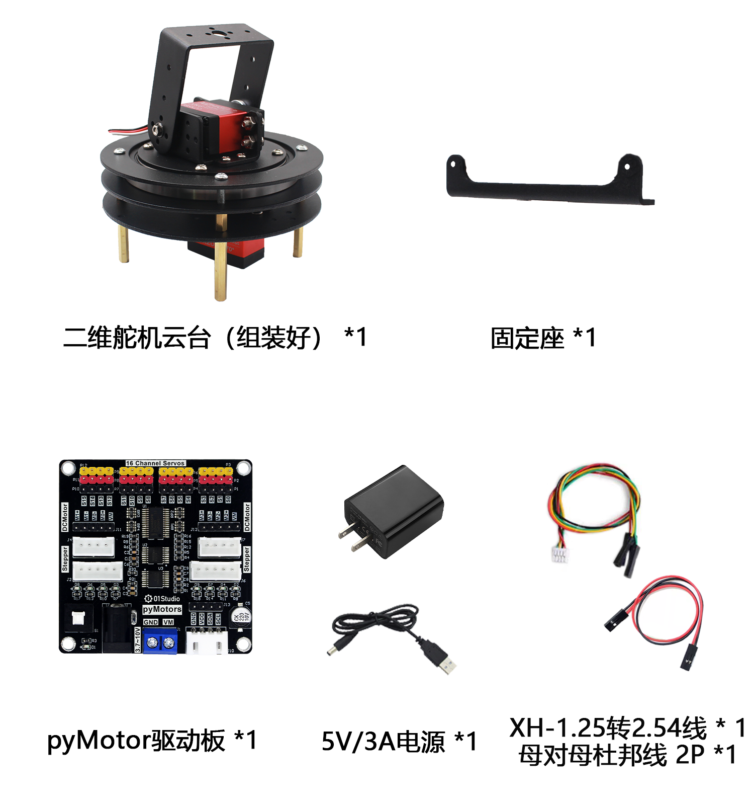
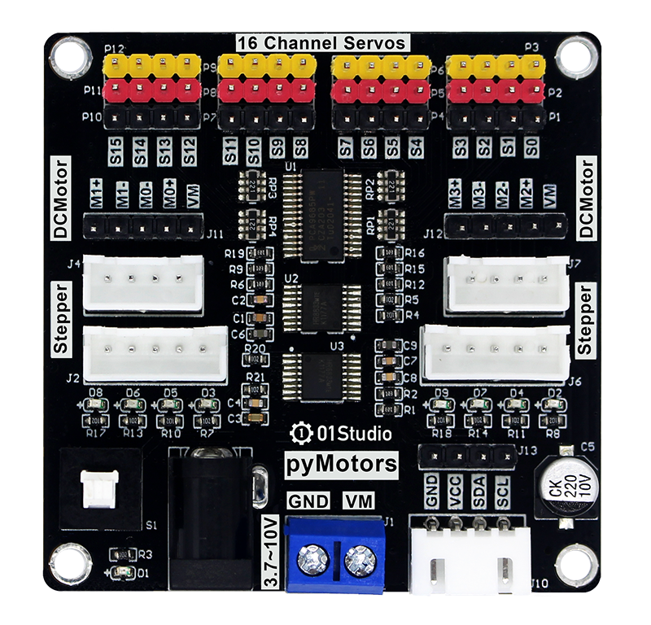
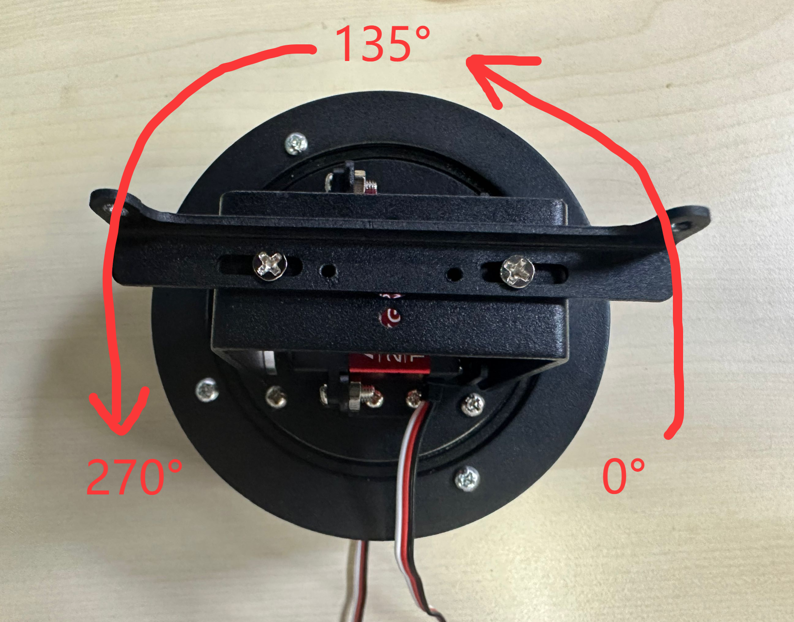
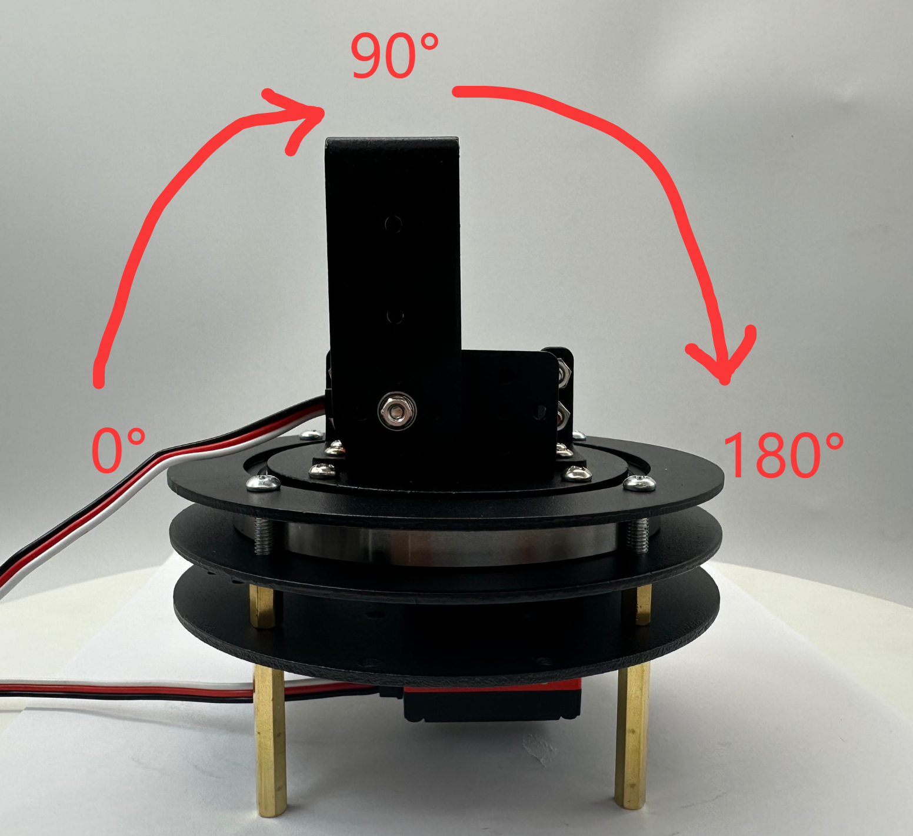
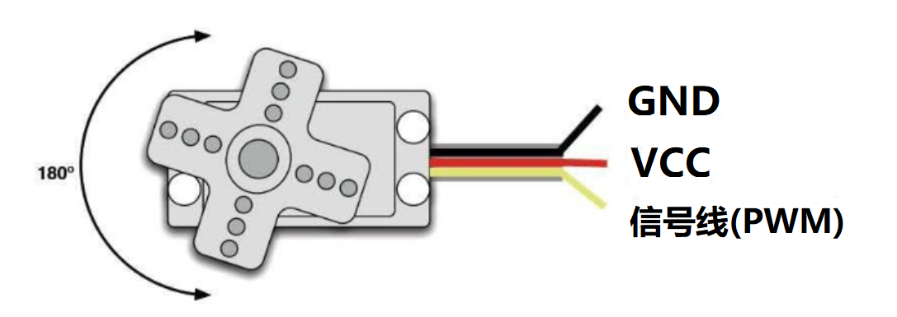
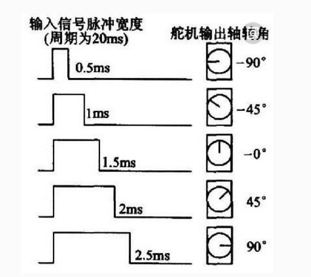
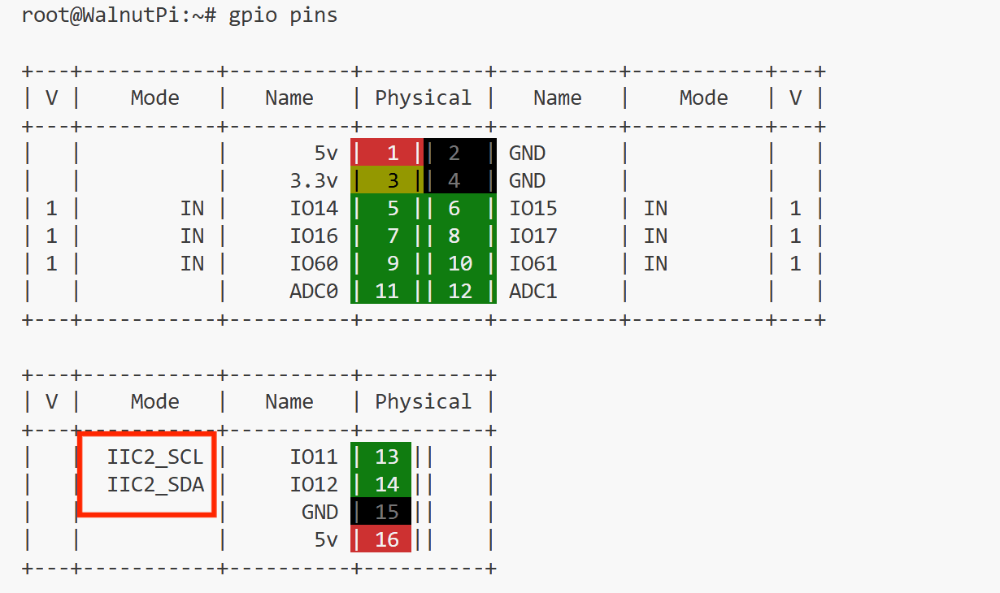
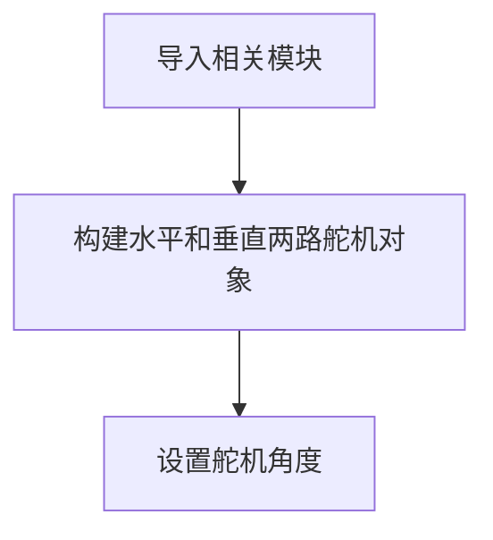
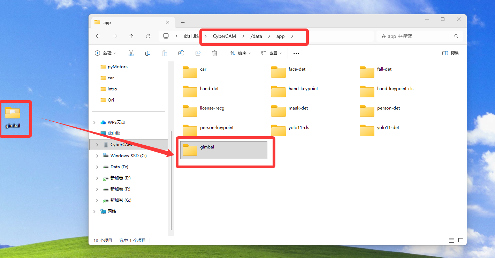
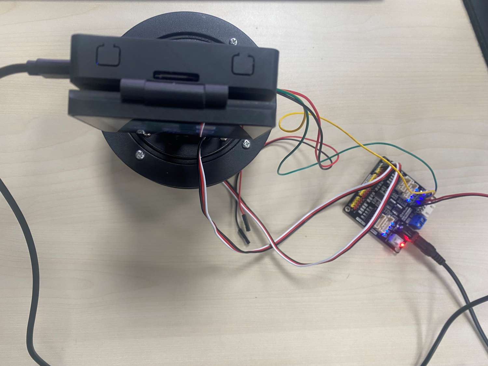

# 云台舵机控制

## 前言
在前面多路舵机模块章节我们已经讲解过通过如何驱动舵机。这节基于舵机云台我们再来重新讲解一下。

## 实验平台

01Studio CanMV K230开发板和二维舵机云台（含pyMotors驱动板）。 [**点击购买>>**](https://item.taobao.com/item.htm?id=956013958624)



## 实验目的

通过编程实现对二维舵机云台2个维度舵机任意角度的控制。

## 实验讲解

pyMotors多功能电机模块基于PCA9685，这是一款I2C转16路PWM芯片，只需要通过K230的I2C接口即可控制最大16路PWM舵机、4路直流电机、2路42步进电机或4相5线步进电机。电机供电支持3.7V-10V输入。



pyMotors模块资料包：[点击下载>>](https://download.01studio.cc/modules/motor/motors/motors.html)

本教程使用I2C2跟pyMotors模块连接。模块使用5V电源供电。连接方法参考[二维云台组装教程](../gimbal/intro.md#驱动板组装)。

## 舵机出厂角度位置

01Studio二维舵机云台水平（X轴）舵机270°。出厂角度如下：

- 以线在下方为参考点，正前方为居中135°，右下角为0°，左下角为270°。




垂直（Y轴）舵机180°。出厂角度如下：

- 以线在左边为参考点，正上方为居中90°，左边是0°，右边是180°。



## 舵机

舵机通过3线（一般舵机的线序为信号，电源，地）控制，二维舵机云台用到的是20KG大扭矩PWM舵机。通常情况下：黑色表示GND，红色表示VCC，橙色（或白色）表示信号线。



PWM舵机的控制一般需要一个周期20ms（频率50Hz）左右的时基脉冲，该脉冲的高电平部分一般为0.5ms-2.5ms范围内的角度控制脉冲部分，总间隔为2ms。下图以180°舵机为例（-90°到90°，可自行转换为0°-180°），说明了在固定PWM频率下通过不同的脉冲宽度信号即可控制舵机对应角度。**对于270°舵机同理。**



## 开启I2C2

I2C2 与 UART2 复用同一组引脚，在同一时间只能选择其中一种功能使用，系统默认启用 UART2。

先执行下方指令检查一下I2C2的开启情况：
```bash
gpio pins
```

出现下图表示开启成功：



如果没有，需要在终端输入下面指令开启：
```bash
sudo set-device enable i2c2
```

重启开发板：
```bash
sudo reboot
```

重启后再次执行`gpio pins`指令检查确认已经开启即可。

## Servos对象

基于pyMotors方式控制PWM舵机的CircuitPython驱动库已经封装好，位于servo.py和pca9685.py ,只需要在主函数初始化I2C2和PCA9685调用即可。

#### 构造函数
```python
import busio
import board
from adafruit_pca9685 import PCA9685
from adafruit_motor import servo

i2c = busio.I2C( board.SCL2, board.SDA2)
pca = PCA9685( i2c, address=0x40)
pca.frequency = 50
...

servo_0 = servo.Servo(pca.channels[0], min_pulse=500, max_pulse=2500, actuation_range=180)
```
构建1路舵机对象。
- `pwm_out`（第一个位置参数）: PCA9685 指定的 PWM 通道对象（如 pca.channels[0]）
- `min_pulse`:最小脉冲宽度，默认500us，即上图的0.5ms；
- `max_pulse`:最大脉冲宽度，默认2500us，即上图的2.5ms；
- `actuation_range`:舵机角度，默认180°。（270°舵机初始化时赋值270即可）

#### 使用方法
```python
servo_0.angle = value
```
设置某个舵机的位置。

- `value`: 舵机的角度；180°舵机值为 0~180，270°舵机值为 0~270.

<br></br>

编程思路如下：



## 参考代码

运行代码前需要将资料包中的示例程序文件夹整体拷贝到 CyberCAM 的 `/data/app`目录下，以及确认I2C开启，主程序 main.py 代码如下：

```python
'''
# Copyright (c) [2026] [01Studio]. Licensed under the MIT License.

实验名称：二维舵机云台两路舵机控制
实验平台：01Studio cybercam + 二维舵机云台（含pyMotors驱动板）
说明：控制二维舵机云台的两路舵机
'''

#导入相关模块
import busio, board
import os,sys

# 当前文件夹下相对路径，绝对路径（app离线部署）
local_lib_path = "./lib"
system_lib_path = "/data/app/gimbal/lib"

# 判断优先使用路径
if os.path.exists(os.path.join(local_lib_path, "adafruit_motor")) or os.path.exists(os.path.join(local_lib_path, "adafruit_pca9685")):
    target_path = os.path.abspath(local_lib_path)
# 使用系统绝对路径（IDE运行调试）
elif os.path.exists(os.path.join(system_lib_path, "adafruit_motor")) or os.path.exists(os.path.join(system_lib_path, "adafruit_pca9685")):
    target_path = system_lib_path
else:
    raise FileNotFoundError("文件缺失，请检查当前路径与系统路径下的文件是否存在。")

# 找到的路径插入到 sys.path 最前面（确保优先加载它）
sys.path.insert(0, target_path)

from adafruit_pca9685 import PCA9685
from adafruit_motor import servo

#构建I2C对象，推荐频率小于10KHz
i2c = busio.I2C(board.SCL2, board.SDA2)

#构建PCA9685对象
pca = PCA9685(i2c, address=0x40)
#设置pwm输出频率
pca.frequency = 50

#构建二维云台2路舵机对象
servo_x = servo.Servo(pca.channels[0], min_pulse=500, max_pulse=2500, actuation_range=270)
servo_y= servo.Servo(pca.channels[1], min_pulse=500, max_pulse=2500, actuation_range=180)

#初始位置，可以修改角度观察现象
servo_x.angle = 135 #水平（X轴）使用使用端口0，转到135°
servo_y.angle = 90 #垂直（Y轴）使用使用端口1，转到90°

while True:
    pass
```

修改下面代码的135和90可以分别控制2路点击转动到不同的角度。

```python
#初始位置，可以修改角度观察现象
servo_x.angle = 135 #水平（X轴）使用使用端口0，转到135°
servo_y.angle = 90 #垂直（Y轴）使用使用端口1，转到90°
```

## 实验结果

将资料包中的示例程序文件夹整体拷贝到 CyberCAM 的 `/data/app`目录下，主程序及其依赖库均包含在该文件夹中：



终端输入下面指令确认I2C开启情况：
```bash
gpio pins
```

出现下图表示开启成功：

 

如没开启请按前面内容打开：[开启I2C2](#开启I2C2)

运行代码，可以看到舵机启动后转动到下面位置。（水平135°居中，垂直90°居中）



:::danger 警告
二维云台舵机工作时力度非常大，调试时候小心夹手！
:::


