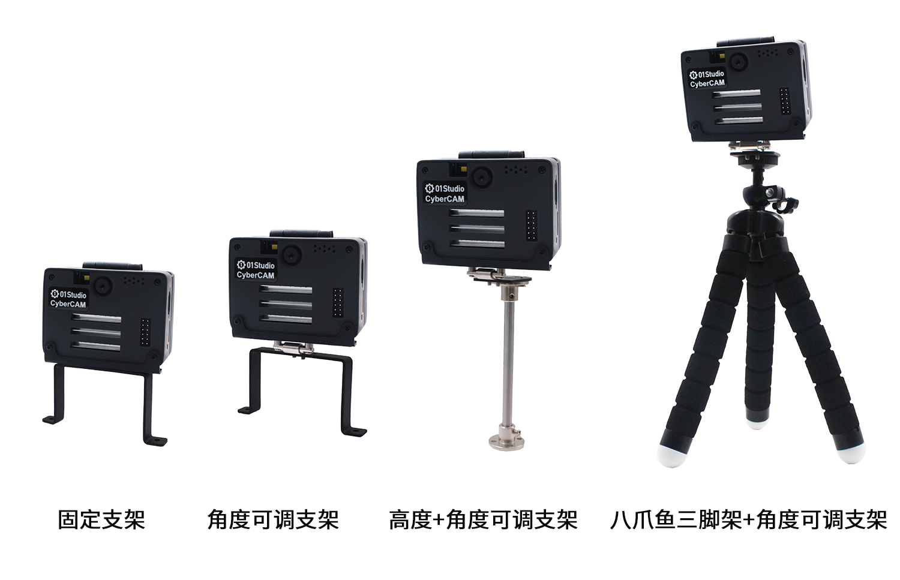
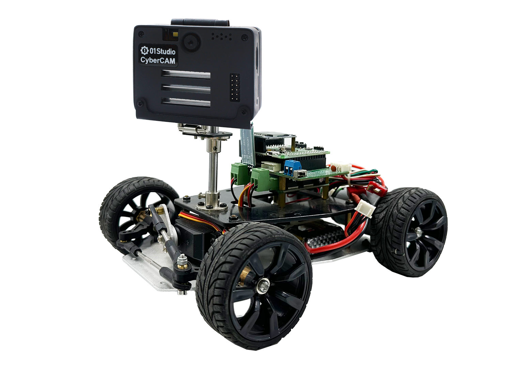
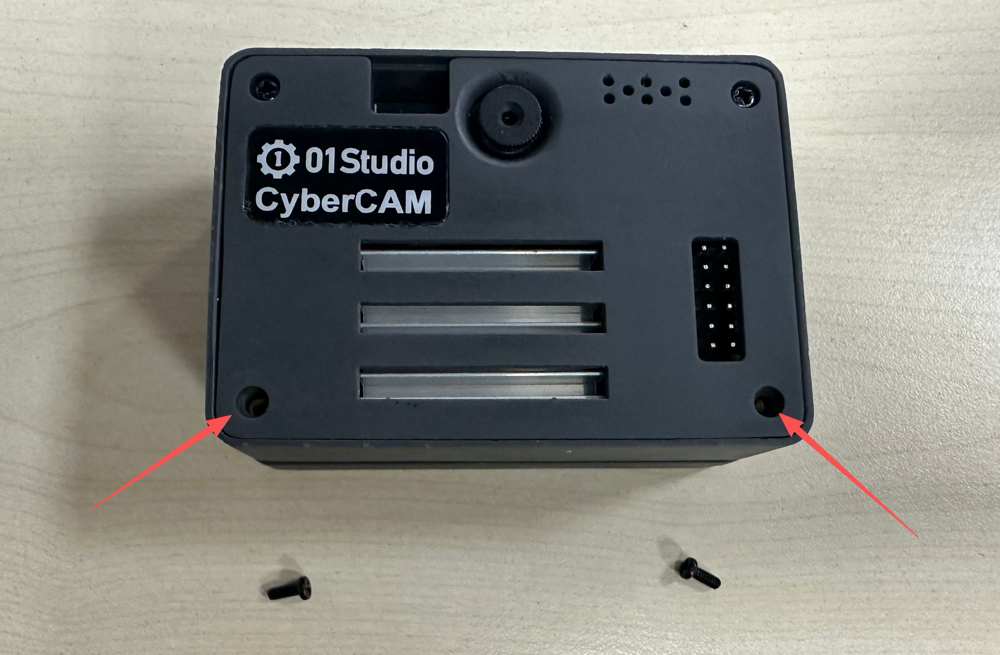
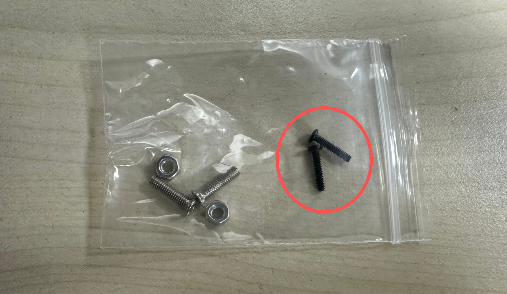
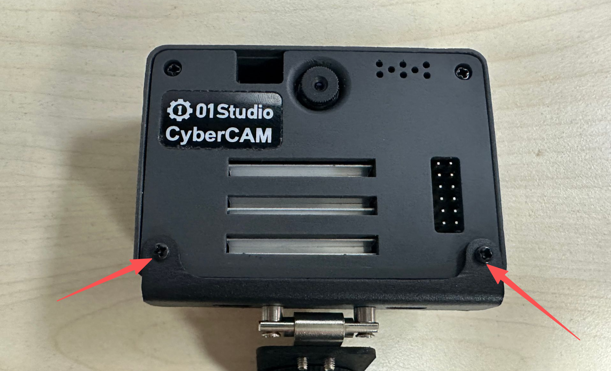
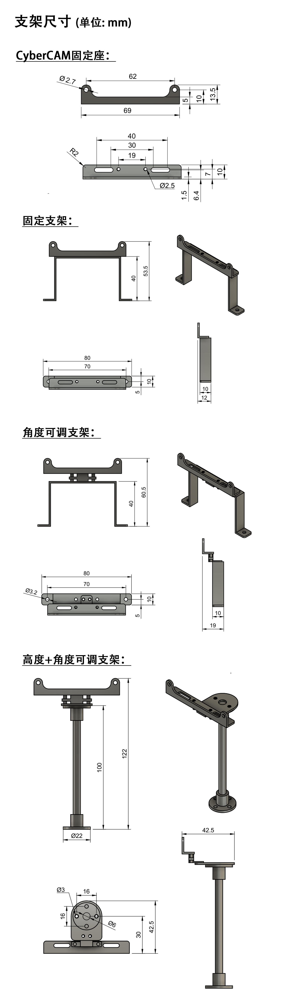

# 支架安装

01Studio CyberCAM支持4款支架安装，分别是**固定支架，角度可调节支架，高度+角度可调节支架，三脚架+角度可调支架**，方便用于小车、云台等需要固定或调节高度角度的各类场景。[点击购买>>](https://item.taobao.com/item.htm?id=776972674257)

- CanMV K230

- 安装到小车

## 安装方法

支架是组装好发货的，因此只需要将CyberCAM下方的螺丝M2x5螺丝拧下：

使用支架配套的M2X10螺丝。

将支架固定孔对准开发板固定孔，使用螺丝拧紧即可。

## 尺寸图

