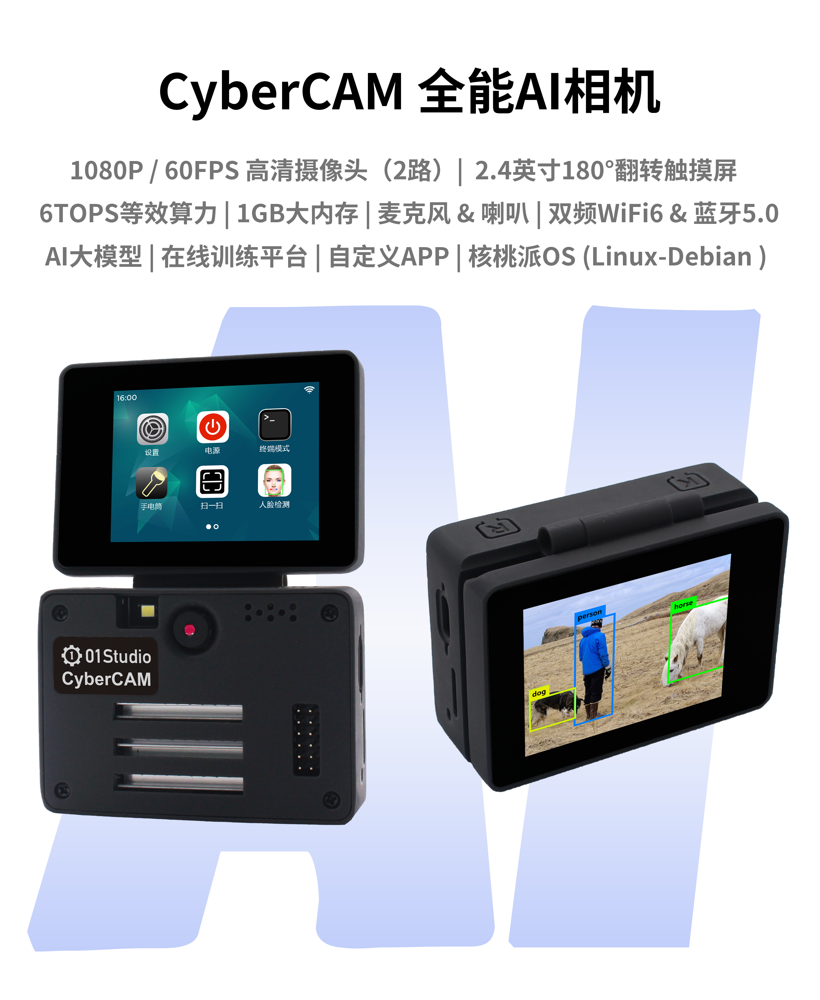
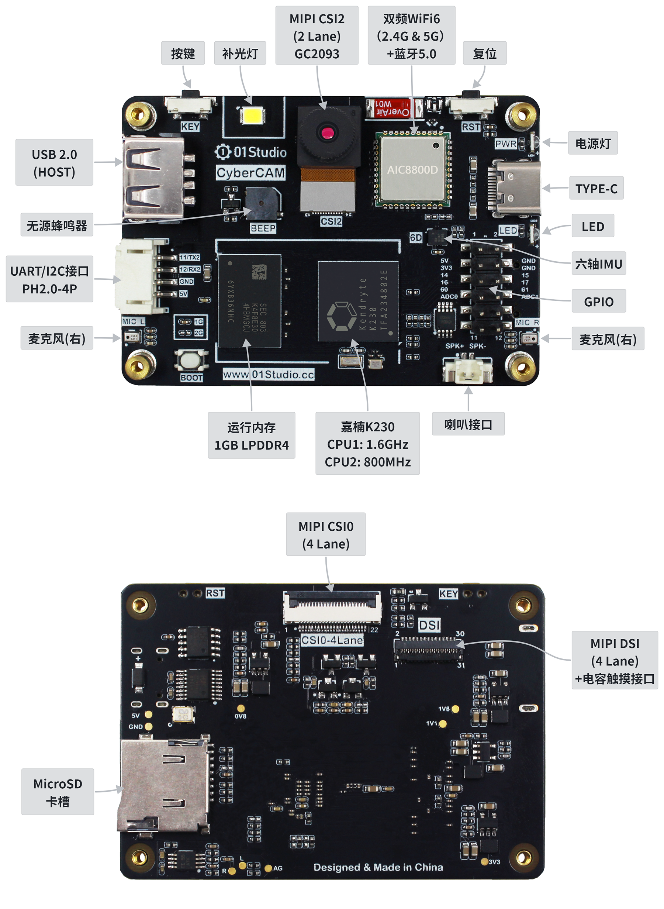
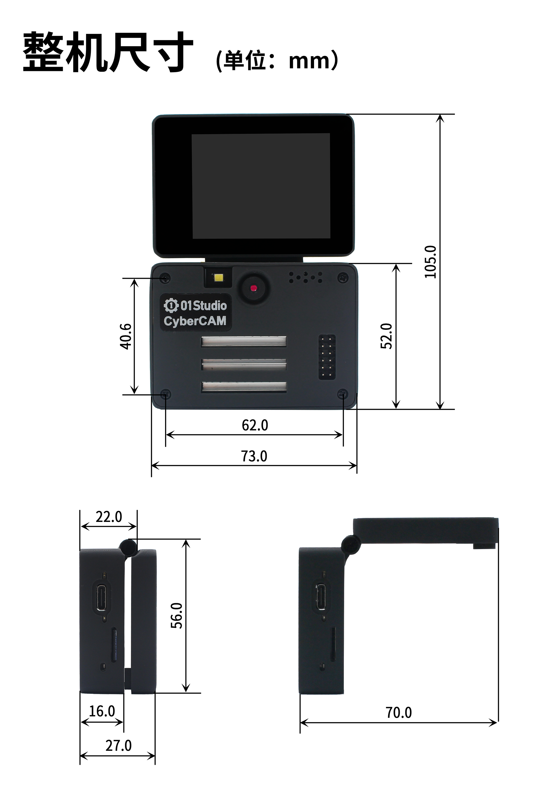
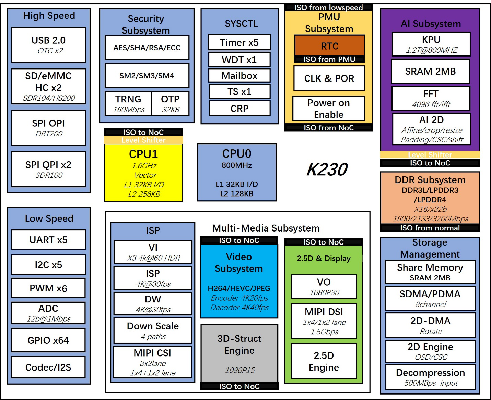

# 产品参数

01Studio CyberCAM 全能AI相机基于嘉楠科技AI芯片K230（RSIC-V架构，64位双核心）。

## CyberCAM

### 硬件资源

### GPIO引脚图

### 详细参数

|  产品参数 |
|  :---:  | ---  |
| K230主控  | ● CPU1: RISC-V , 1.6GHz, 支持RVV 1.0   ● CPU0: RISC-V , 800MHz |
| 神经网络处理器  | KPU（6TOPS等效算力），支持INT8和INT16|
| 内存 | ● 1GBytes（LPDDR4） | 
| 存储  |  ● MicroSD（最大支持512G）   ● SD NAND（预留焊盘，位于SD卡槽下方，可自行焊接） |
| 摄像头  | ● GC2093 (标配70°, 可旋转镜头对焦)    ● 支持2路CSI输入（1 x 2lane + 1 x 4lane） |
| 显示屏  | ● 2.4寸180°翻转触摸屏（可拆卸）   ● 分辨率 640x480    ● 电容触摸 |
| 其它显示  | ● MIPI显示屏（1x4 lane DSI）最大支持1920x1080   ● HDMI显示器最大支持1920x1080（需搭配转接板）   ● IDE显示最大支持1920x1080 |
| 无线网络  | ● 双频WiFi6（2.4G & 5G） + 蓝牙5.0（板载天线）|
| 有线网络  | 百兆以太网（需外接USB转以太网卡）|
| 音频输入  | x2 双麦克风 (双声道) |
| 音频输出  | 8欧1W腔体喇叭（右声道） |
| USB  | USB 2.0 HOST |
| 按键  | x2 （可编程按键，复位键） |
| LED  | x2 （可编程LED灯，电源灯） |
| 蜂鸣器  | 无源蜂鸣器 |
| IMU  | QMI8658A (三轴加速度 + 三轴陀螺仪) |
| GPIO  | 2.54mm x 12P 排针 |
| 串口/I2C接口  | PH-2.0mm-4P（送转接线） |
| 调试串口  | ● CPU1 大核（UART3 / COMB）   ●  CPU0 小核（UART0 / COMA / Linux终端） |
| TYPE-C  | IDE连接开发、代码调试、文件传输、供电多合一 |
| 供电  | 5V @ 1A |

|  外观规格 |
|  :---:  | ---  |
| 尺寸  | 73 x 56 x 27mm（整机） |
| 重量  |  ● 90克（整机）     ● 52克（不含翻转屏） |

### 尺寸图

## K230芯片参数

|  K230芯片参数 |
|  :---:  | ---  |
| CPU  | ● CPU1: RISC-V处理器 , 1.6GHz, 32KB I-cache, 32KB D-cache, 256KB L2 Cache, 128bit RVV 1.0扩展   ● CPU0: RISC-V处理器 , 800MHz, 32KB I-cache, 32KB D-cache, 128KB L2 Cache |
| KPU  | 6TOPS等效算力，支持INT8和INT16  典型网络性能：  Resnet50 ≥ 85fps @ INT8；Mobilenet_v2 ≥ 670fps @ INT8；YOLO V5s  ≥ 38fps @ INT8|
| DPU  | 3D结构光深度引擎，最大分辨率支持1920x1080 | 
| VPU  | H.264和H.265视频编解码，最大支持4096x4096  编码器性能：4K@20fps  解码器性能：4K@40fps  JEPG编解码器：最大支持8K(8192x8192)分辨率 |
| 图像输入  | 最大支持3路MIPI CSI输入：1x4 lane+1x2 lane 或 3x2 lane |
| 显示输出  | 1路MIPI DSI (1x4lane或1x2lane), 最大支持1920x1080 |
| 外设接口  | ● 5 x UART   ● 5 x I2C  ● 1 x I2S  ● 6 x PWM  ● 64 x GPIO + 8 x PMU GPIO  ● 2 x USB 2.0 OTG   ● 2 x SDxC: SD3.0, EMMC 5.0   ● 3 x SPI: 1 x OSPI + 2 x QSPI  ● Timer / RTC / WDT  |