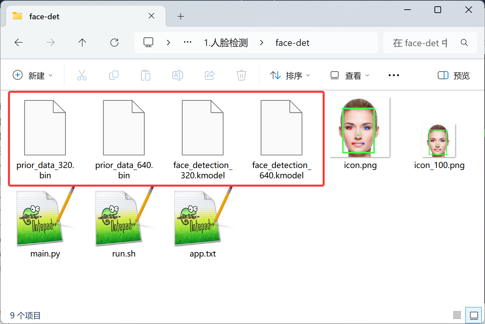
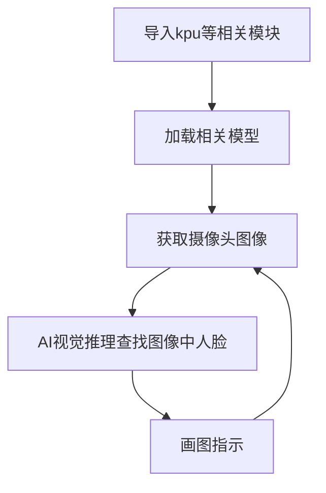
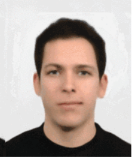
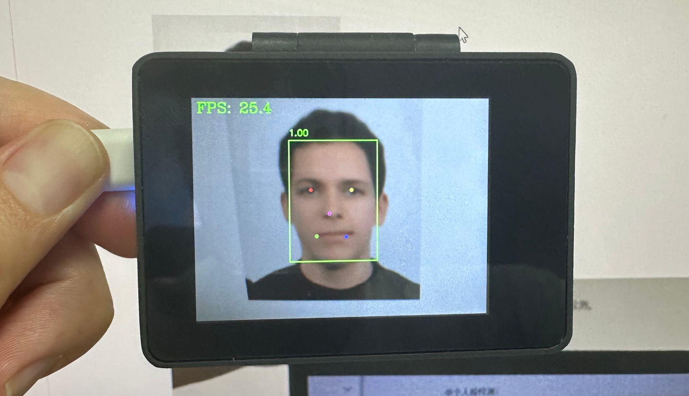
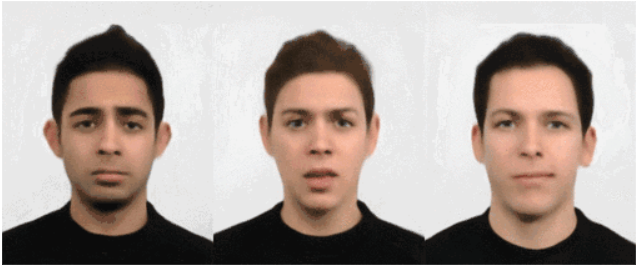
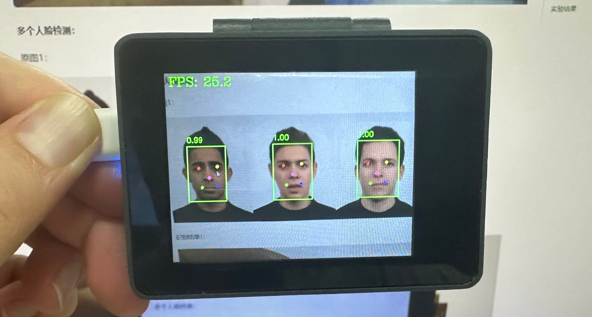
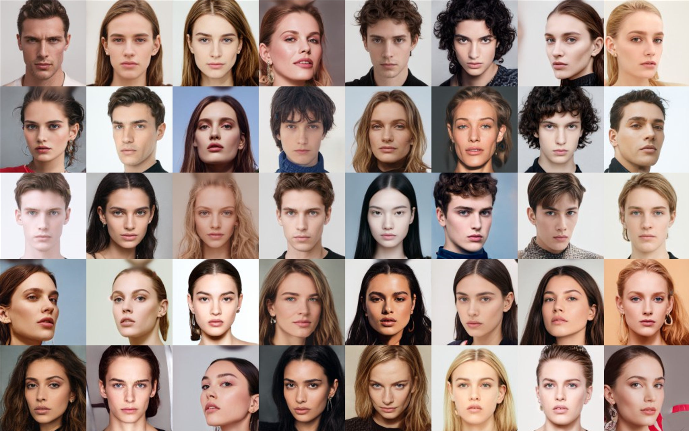
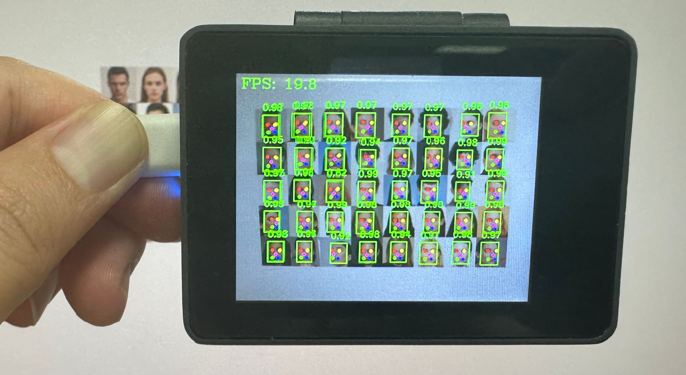
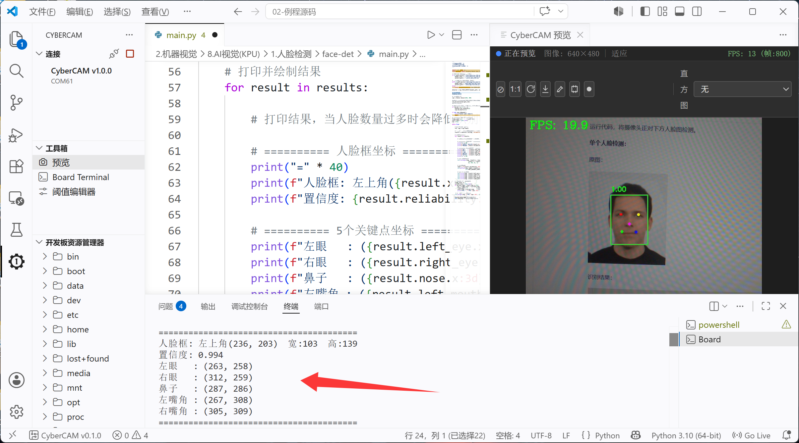

# 人脸检测

## 前言
人脸检测，简单来说就是告诉你将一幅图片中哪些是人脸，支持单个和多个人脸。今天我们来学习一下如何通过OpenCV与KPU库编程实现人脸检测。

## 实验目的
将摄像头拍摄到的画面中的人脸用矩形框标识出来。

## 实验讲解

人脸检测模型已经预先训练好，存放在代码同一目录下，我们只需要加载模型文件，使用kpu库进行推理，并将返回的结果画图并显示即可。



具体编程思路如下：



## 参考代码

```python
'''
实验名称：人脸检测
实验平台：CyberCAM
说明：单个或多个人脸检测
'''

import cv2, time, os
from walnutpi import Display,Sensor,kpu,IDE,direction
 
# 优先当前文件夹下相对路径（app离线部署）
if os.path.exists("./face_detection_320.kmodel") and os.path.exists("./prior_data_320.bin"):
    model_path = "./face_detection_320.kmodel"
    anchors_path = "./prior_data_320.bin"

# 使用系统绝对路径（IDE运行调试）
elif os.path.exists("/data/app/face-det/face_detection_320.kmodel") and os.path.exists("/data/app/face-det/prior_data_320.bin"):
    model_path = "/data/app/face-det/face_detection_320.kmodel"
    anchors_path = "/data/app/face-det/prior_data_320.bin"
else:
    raise FileNotFoundError("模型文件缺失，请检查当前路径与系统路径下的模型文件是否存在。")

model_size = 320 #模型尺寸
detector = kpu.FACE_DETECT(model_path, anchors_path, model_size) #加载模型

# 初始化屏幕
Display.init()

# 初始化摄像头
cap = Sensor.Sensor(640, 480)

#获取当前显示屏方向，0表示默认，2表示180度翻转。
lcd_dir=direction.get_lcd() 
#print(lcd_dir) 

# 判断显示屏是否翻转，如果翻转，则设置显示旋转180°，摄像头同时设置为前置模式（水平镜像）
if lcd_dir == 2: #翻转了
    Display.set_rotation(2)
    cap.set_hmirror(1)

if not cap.isOpened():
    print("Cannot open camera")
    exit()

# ========== FPS计算 ==========
frame_count = 0       # 帧数计数器
start_time = time.time()
fps = 0.0

while True:
    
    # 摄像头读取一帧图像    
    ret, img = cap.read()
    
    # 执行目标检测，设置置信度阈值为 0.6，IoU 阈值为 0.7
    results = detector.run(img, reliability_threshold=0.6, nms_threshold=0.7)

    # 打印并绘制结果
    for result in results:

        # 打印结果，当人脸数量过多时会降低识别帧率。
        '''
        # ========== 人脸框坐标 ==========
        print("=" * 40)
        print(f"人脸框: 左上角({result.x}, {result.y})  宽:{result.w}  高:{result.h}")
        print(f"置信度: {result.reliability:.3f}")
        
        # ========== 5个关键点坐标 ==========
        print(f"左眼   : ({result.left_eye.x:3d}, {result.left_eye.y:3d})")
        print(f"右眼   : ({result.right_eye.x:3d}, {result.right_eye.y:3d})")
        print(f"鼻子   : ({result.nose.x:3d}, {result.nose.y:3d})")
        print(f"左嘴角 : ({result.left_mouth.x:3d}, {result.left_mouth.y:3d})")
        print(f"右嘴角 : ({result.right_mouth.x:3d}, {result.right_mouth.y:3d})")
        print("=" * 40)
        '''
        # 绘制 人脸识别框
        cv2.rectangle(img, (result.x, result.y), 
                        (result.x + result.w, result.y + result.h), 
                        (0, 255, 0), 2)
        
        # 绘制置信度
        label = f"{result.reliability:.2f}"
        cv2.putText(img, label, (result.x, result.y - 10),
                    cv2.FONT_HERSHEY_SIMPLEX, 0.6, (0, 255, 0), 2)
        
        # 绘制 5 个关键点
        cv2.circle(img, (result.left_eye.x, result.left_eye.y), 4, (0, 0, 255), -1) # 左眼
        cv2.circle(img, (result.right_eye.x, result.right_eye.y), 4, (0, 255, 255), -1) # 右眼
        cv2.circle(img, (result.nose.x, result.nose.y), 4, (255, 0, 255), -1) # 鼻子
        cv2.circle(img, (result.left_mouth.x, result.left_mouth.y), 4, (0, 255, 0), -1) # 左嘴角
        cv2.circle(img, (result.right_mouth.x, result.right_mouth.y), 4, (255, 0, 0), -1) # 右嘴角

    # 每满1秒计算一次平均FPS
    frame_count += 1    
    current_time = time.time()
    if current_time - start_time >= 1.0:
        fps = frame_count / (current_time - start_time)
        frame_count = 0              # 重置帧数计数器
        start_time = current_time    # 重置计时起点
        print("FPS: ", f'FPS: {fps:.1f}')

     # 添加文字标签和FPS显示
    cv2.putText(img, f'FPS: {fps:.1f}', (10, 30), cv2.FONT_HERSHEY_COMPLEX, 1, (0, 255, 0), 2)
    
    Display.show(img) #显示到屏幕上
    IDE.show(img) # 发送到ide窗口内显示
```

## 实验结果

运行代码，将摄像头正对下方人脸图检测。

**单个人脸检测：**

原图：



识别结果：



**多个人脸检测：**

原图1：



识别结果1：




原图2：



识别结果2：




解除下面代码注释，可以在IDE终端打印输出结果：**但当人脸数量过多时会降低识别帧率。**

```python
        '''
        # ========== 人脸框坐标 ==========
        print("=" * 40)
        print(f"人脸框: 左上角({result.x}, {result.y})  宽:{result.w}  高:{result.h}")
        print(f"置信度: {result.reliability:.3f}")
        
        # ========== 5个关键点坐标 ==========
        print(f"左眼   : ({result.left_eye.x:3d}, {result.left_eye.y:3d})")
        print(f"右眼   : ({result.right_eye.x:3d}, {result.right_eye.y:3d})")
        print(f"鼻子   : ({result.nose.x:3d}, {result.nose.y:3d})")
        print(f"左嘴角 : ({result.left_mouth.x:3d}, {result.left_mouth.y:3d})")
        print(f"右嘴角 : ({result.right_mouth.x:3d}, {result.right_mouth.y:3d})")
        print("=" * 40)
        '''
```




本节学习了人脸检测，可以看到结合OpenCV与KPU推理库能轻松实现人脸检测，而且检测的准确率非常高（通常还与模型质量相关），用户无需关注过程即可直接调用结果，也就是通过Python编程我们轻松完成了实验。而且本实验支持单个和多个人脸同时检测，是机器视觉中非常有代表性的实验。