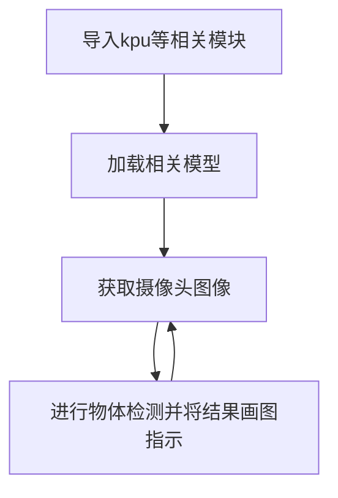
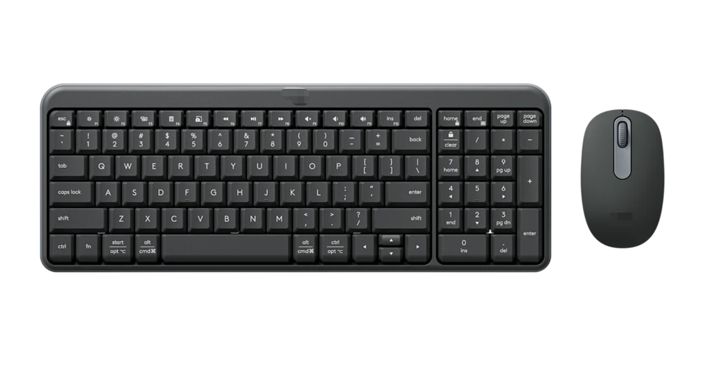
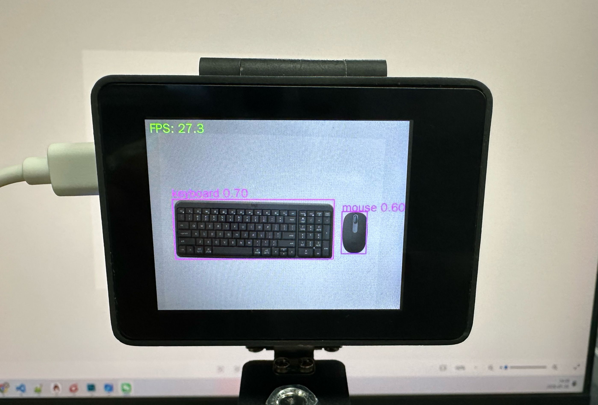

# YOLO11 检测

## 前言

物体检测，是机器视觉里面非常典型的应用。要实现的就是将一幅图片里面的各种物体检测出来，然后跟已知模型做比较从而判断物体是什么。我们来学习一下如何通过Python编程快速实现物体识别。

## 实验目的

编程实现物体检测识别并将识别结果画图指示。

## 实验讲解

基于CyberCAM K230 yolo11检测模型已经预先训练好，存放在代码同一目录下，我们只需要加载模型文件，使用kpu库进行推理，并将返回的结果画图并显示即可。

例程基于YOLO11, 支持识别80种物体。

["person", "bicycle", "car", "motorcycle", "airplane", "bus", "train", "truck", "boat", "traffic light", "fire hydrant", "stop sign", "parking meter", "bench", "bird", "cat", "dog", "horse", "sheep", "cow", "elephant", "bear", "zebra", "giraffe", "backpack", "umbrella", "handbag", "tie", "suitcase", "frisbee", "skis", "snowboard", "sports ball", "kite", "baseball bat", "baseball glove", "skateboard", "surfboard", "tennis racket", "bottle", "wine glass", "cup", "fork", "knife", "spoon", "bowl", "banana", "apple", "sandwich", "orange", "broccoli", "carrot", "hot dog", "pizza", "donut", "cake", "chair", "couch", "potted plant", "bed", "dining table", "toilet", "tv", "laptop", "mouse", "remote", "keyboard", "cell phone", "microwave", "oven", "toaster", "sink", "refrigerator", "book", "clock", "vase", "scissors", "teddy bear", "hair drier", "toothbrush"]

[“人”、“自行车”、“汽车”、“摩托车”、“飞机”、“公共汽车”、“火车”、“卡车”、“船”、“交通灯”、“消防栓”、“停车标志”、“停车收费表”、“长凳”、“鸟”、“猫”、“狗”、“马”、“羊”、“牛”、“大象”、“熊”、“斑马”、“长颈鹿”、“背包”、“雨伞”、“手提包”、“领带”、“手提箱”、“飞盘”、“滑雪板”、“滑雪板”、“运动球”、“风筝”、“棒球棒”、“棒球手套”、“滑板”、“冲浪板”、“网球拍”、“瓶子”、“酒杯”、“杯子”、“叉子”、“刀子”、“勺子”、“碗”、“香蕉”、“苹果”、“三明治”、“橙子”、“西兰花”、“胡萝卜”、“热狗”、“披萨”、“甜甜圈”、“蛋糕”、“椅子”、“沙发“盆栽”、“床”、“餐桌”、“马桶”、“电视”、“笔记本电脑”、“鼠标”、“遥控器”、“键盘”、“手机”、“微波炉”、“烤箱”、“烤面包机”、“水槽”、“冰箱”、“书”、“钟表”、“花瓶”、“剪刀”、“泰迪熊”、“吹风机”、“牙刷”]

具体编程思路如下：



## 参考代码

```python
'''
实验名称：物体检测（基于YOLO11）
实验平台：CyberCAM
说明：YOLO11检测
'''

import cv2, time, os, colorsys
from walnutpi import kpu, Display, Sensor, IDE, direction

# 优先当前文件夹下相对路径（app离线部署）
if os.path.exists("./yolo11n.kmodel"):
    model_path = "./yolo11n.kmodel"

# 使用系统绝对路径（IDE运行调试）
elif os.path.exists("/data/app/yolo11-det/yolo11n.kmodel"):
    model_path = "/data/app/yolo11-det/yolo11n.kmodel"

else:
    raise FileNotFoundError("模型文件缺失，请检查当前路径与系统路径下的模型文件是否存在。")

model_size = 224 #模型尺寸
yolo = kpu.YOLO11_DET(model_path, model_size) # 加载模型 

labels = [
    'person', 'bicycle', 'car', 'motorcycle', 'airplane', 'bus',
    'train', 'truck', 'boat', 'traffic light', 'fire hydrant',
    'stop sign', 'parking meter', 'bench', 'bird', 'cat', 'dog',
    'horse', 'sheep', 'cow', 'elephant', 'bear', 'zebra', 'giraffe',
    'backpack', 'umbrella', 'handbag', 'tie', 'suitcase', 'frisbee',
    'skis', 'snowboard', 'sports ball', 'kite', 'baseball bat',
    'baseball glove', 'skateboard', 'surfboard', 'tennis racket',
    'bottle', 'wine glass', 'cup', 'fork', 'knife', 'spoon', 'bowl',
    'banana', 'apple', 'sandwich', 'orange', 'broccoli', 'carrot',
    'hot dog', 'pizza', 'donut', 'cake', 'chair', 'couch',
    'potted plant', 'bed', 'dining table', 'toilet', 'tv', 'laptop',
    'mouse', 'remote', 'keyboard', 'cell phone', 'microwave',
    'oven', 'toaster', 'sink', 'refrigerator', 'book', 'clock',
    'vase', 'scissors', 'teddy bear', 'hair drier', 'toothbrush'
]

#字符显示改进，支持中英文显示
ft = cv2.freetype.createFreeType2() #创建freetype渲染器
ft.loadFontData("/usr/share/fonts/truetype/wqy/wqy-zenhei.ttc", 0) #加载字体文件, 文泉驿正黑

def putText_Chinese(img, text, org, fontScale=30, color=(0, 255, 0)):
    
    global ft  # 使用全局的 FreeType 渲染器实例
    
    # 绘制中文
    ft.putText(
        img=img,
        text=text,
        org=org,
        fontHeight=fontScale,
        color=color,
        thickness=-1,        # 笔画粗细
        line_type=cv2.LINE_AA,  # 抗锯齿，文字更平滑
        bottomLeftOrigin=True  # False:坐标为左上角; True:与原生cv2.putText一致（左下角）
    )
    return img

def _get_label_color(label_index, num_labels):
    r, g, b = colorsys.hsv_to_rgb(label_index / num_labels, 0.9, 0.8)
    return (int(b * 255), int(g * 255), int(r * 255))

# 初始化屏幕
Display.init()

# 初始化摄像头
cap = Sensor.Sensor(640, 480)
if not cap.isOpened():
    print("Cannot open camera")
    exit()

#获取当前显示屏方向，0表示默认，2表示180度翻转。
lcd_dir=direction.get_lcd() 
#print(lcd_dir) 

# 判断显示屏是否翻转，如果翻转，则设置显示旋转180°，摄像头同时设置为前置模式（水平镜像）
if lcd_dir == 2: #翻转了
    Display.set_rotation(2)
    cap.set_hmirror(1)

# ========== FPS计算 ==========
frame_count = 0       # 帧数计数器
start_time = time.time()
fps = 0.0

while True:
    
    # 摄像头读取一帧
    ret, img = cap.read()

    # 阻塞式目标检测
    boxes = yolo.run(img, 0.5, 0.45)

    # 输出检测结果
    for box in boxes:
        print(
            "{:f} ({:4d},{:4d}) w{:4d} h{:4d} {:s}".format(
                box.reliability,
                box.x,
                box.y,
                box.w,
                box.h,
                labels[box.label],
            )
        )

    # 绘制检测框和中文标签 
    for box in boxes:

        FONT_SIZE = 30 # 字体大小

        color = _get_label_color(box.label, len(labels))
        label_text = f"{labels[box.label]} {box.reliability:.2f}"

        left_x = int(box.x)
        left_y = int(box.y)
        right_x = int(box.x + box.w)
        right_y = int(box.y + box.h)

        # 获取文字尺寸
        (label_width, label_height), baseline = ft.getTextSize(label_text, FONT_SIZE, -1)

        # 防止标签超出图像顶部
        text_y = left_y - baseline
        bg_y1 = left_y - label_height - baseline
        if bg_y1 < 0:
            bg_y1 = 0
            text_y = label_height

        # 画检测框（不同标签不同颜色）
        cv2.rectangle(img, (left_x, left_y), (right_x, right_y), color, 2)

        #输出字符
        putText_Chinese(img, label_text, (left_x, text_y), fontScale=FONT_SIZE, color=color)

    # 每满1秒计算一次平均FPS
    frame_count += 1    
    current_time = time.time()
    if current_time - start_time >= 1.0:
        fps = frame_count / (current_time - start_time)
        frame_count = 0              # 重置帧数计数器
        start_time = current_time    # 重置计时起点
        print("FPS: ", f'FPS: {fps:.1f}')

    #FPS显示
    putText_Chinese(img, f'FPS: {fps:.1f}',  (10, 30), fontScale=30, color=(0, 255, 0))

    # 显示图像
    Display.show(img)
    IDE.show(img)
```

## 实验结果

运行代码，将摄像头正对下方图像。可看到检测结果。

原图：



识别结果：


