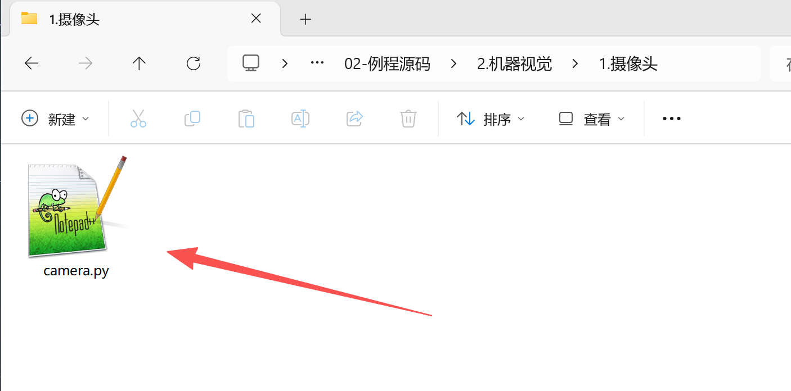
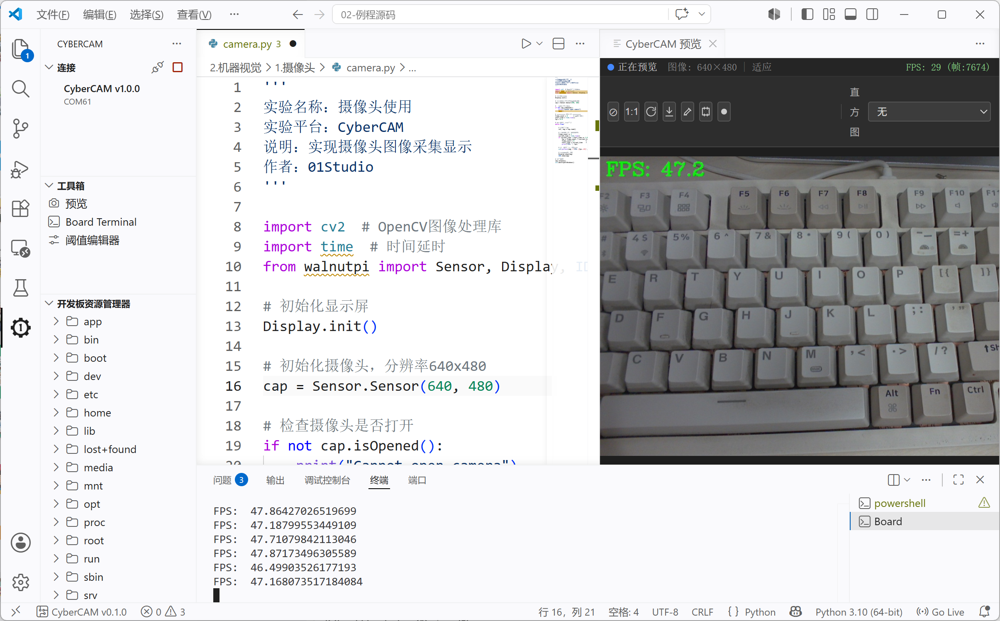
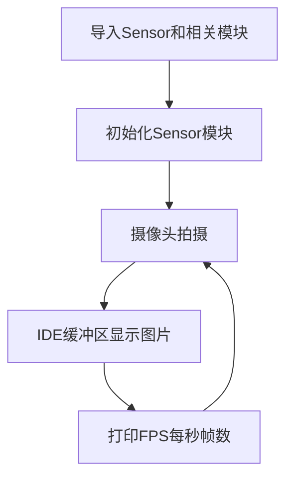
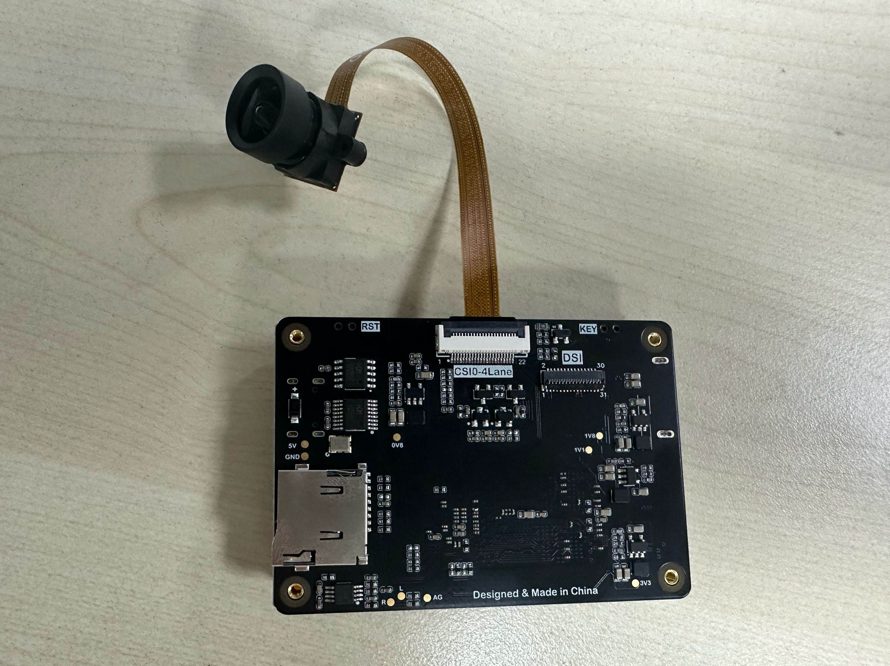
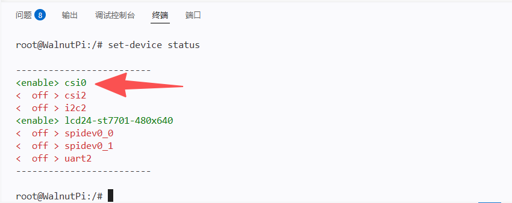

# 摄像头

## 前言

从前面的基础实验我们熟悉了CyberCAM K230基于Python的编程方法，但那可以说是只发挥了CyberCAM K230冰山一角的性能应用，摄像头是整个机器视觉应用的基础。今天我们就通过示例代码来看看CyberCAM K230是如何使用摄像头的。

## 实验目的

学习CyberCAM K230摄像头使用。

## 实验讲解

在VSCode IDE中打开 <u>**01科技（01Studio）CyberCAM（K230）开发套件配套资料\02-例程源码\2.机器视觉\1.摄像头**</u> 目录下的camera.py文件。



打开后发现编辑框出现了相关代码，我们可以先直接跑一下代码看看实验现象，连接CyberCAM K230，点击运行，可以发右图上方出现了摄像头实时采集的图像。





## Sensor对象

### 构造函数
```python
from walnutpi import Sensor #导入Sensor模块，使用摄像头相关接口

cap = Sensor(width, height)
```
构建摄像头对象。目前支持摄像头型号有：GC2093, OV5647
- `width`: sensor采集图像宽度。默认1920；
- `height`: sensor采集图像高度。默认1080；

### 使用方法

```python
cap.isOpened()
```
检查摄像头是否已打开。返回布尔值，True表示已打开，False表示未打开。

<br></br>

```python
ret, img = cap.read()
```
读取摄像头数据，返回：
- `ret`: 布尔值，True表示读取成功，False表示读取失败；
- `img`: 图像数据，返回的是一个image对象。

<br></br>

```python
cap.release()
```
释放摄像头资源。

```python
cap.set_hmirror(value)
```
设置摄像头画面水平镜像。
- `value`: 格式。
    - `1` : 开启水平镜像；
    - `0` : 关闭水平镜像。

<br></br>

```python
cap.set_vflip(value)
```
设置摄像头画面垂直翻转。
- `value`: 格式。
    - `1` : 开启垂直翻转；
    - `0` : 关闭垂直翻转。

**提示：通过设置摄像头的水平镜像和垂直翻转组合可以实现前置和后置摄像头拍摄变换。**
<br></br>

## IDE对象

IDE对象主要用于IDE图像预览,方便观察。

### 构造函数
```python
from walnutpi import IDE #导入IDE模块，使用IDE相关接口
```
构建一个IDE预览对象。

### 使用方法
```python
IDE.show(img)
```
给IDE缓冲区发送图片。

<br></br>

我们来看看代码的编写流程图：



## 参考代码

```python
'''
实验名称：摄像头使用
实验平台：CyberCAM
说明：实现摄像头图像采集显示
作者：01Studio
'''

import cv2  # OpenCV图像处理库
import time  # 时间延时
from walnutpi import Sensor, Display, IDE # CyberCAM库：摄像头、显示屏、IDE预览

# 初始化显示屏
Display.init()

# 初始化摄像头，分辨率640x480
cap = Sensor.Sensor(640, 480)

# 检查摄像头是否打开
if not cap.isOpened():
    print("Cannot open camera")
    exit()

# ========== FPS计算 ==========
frame_count = 0       # 帧数计数器
start_time = time.time()
fps = 0.0

# 持续采集和显示图像
while True:

    # 读取图像帧
    ret, img = cap.read()
    
    # 每满1秒计算一次平均FPS
    frame_count += 1    
    current_time = time.time()
    if current_time - start_time >= 1.0:
        fps = frame_count / (current_time - start_time)
        frame_count = 0              # 重置帧数计数器
        start_time = current_time    # 重置计时起点
        print("FPS: ", fps)

    # 添加文字标签和FPS显示
    cv2.putText(img, f'FPS: {fps:.1f}', (10, 30), cv2.FONT_HERSHEY_COMPLEX, 1, (0, 255, 0), 2)

    # 显示到屏幕和IDE
    Display.show(img)
    IDE.show(img)

# 释放资源
cap.release()
cv2.destroyAllWindows()
```

## 实验结果

点击运行代码，可以看到在右边显示摄像头实时拍摄情况。在终端可以看到实时显示当前的FPS(每秒帧数)。


通过本实验，我们了解了摄像头Sensor模块的原理和应用，可以看到CyberCAM将摄像头功能封装成Sensor模块，大部分功能兼容OpenCV库，用户不必关注底层代码编可以轻松使用。

## 拓展摄像头接口使用

CyberCAM除了标配的GC2093（60FPS）摄像头（CSI2接口）外，还可以通过背面摄像头接口（CSI0）外接摄像头。

- GC2093（1080P 60FPS）。10cm长度。可手动对焦镜头（100°无畸变） [**点击购买>>**](https://item.taobao.com/item.htm?id=947782638904)
- GC2093（1080P 60FPS）。30cm长度。可手动调焦镜头 [**点击购买>>**](https://item.taobao.com/item.htm?id=997163758838)

CSI0扩展接口在背面，22P接口。



可以使用支架固定。


### 配置CSI0摄像头

#### v1.1.0之后版本：

只需在摄像头初始化时加入参数id=0即可使用CSI0摄像头，代码如下：

```python
# 初始化摄像头，分辨率640x480
cap = Sensor.Sensor(640, 480, id=0) # id=0表示使用CSI0拓展摄像头，id=2表示默认使用CSI2板载摄像头
```

#### v1.0.0系统版本：

CyberCAM v1.0.0系统版本只能使用其中一路摄像头，默认开启的是CSI2板载摄像头，如果需使用CSI0可以使用下面命令切换：

```bash
sudo set-device enable csi0
```

配置完成后需要重启系统，重启后可以使用CSI0摄像头。

```bash
sudo reboot
```

重启后可以使用下面指令查看CSI0摄像头是否已经开启（able）。

```base
sudo set-device status
```



配置完成无需修改任何代码，运行前面摄像头代码即可使用CSI0摄像头。

需要改回使用板载摄像头CSI2可以使用下面命令切换：

```bash
sudo set-device enable csi2
```

重启生效。
```bash
sudo reboot
```
