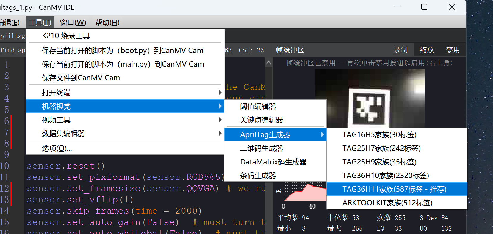
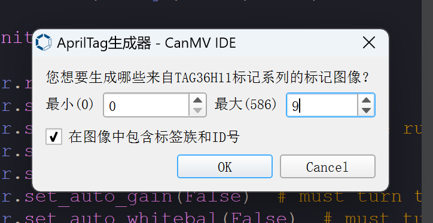
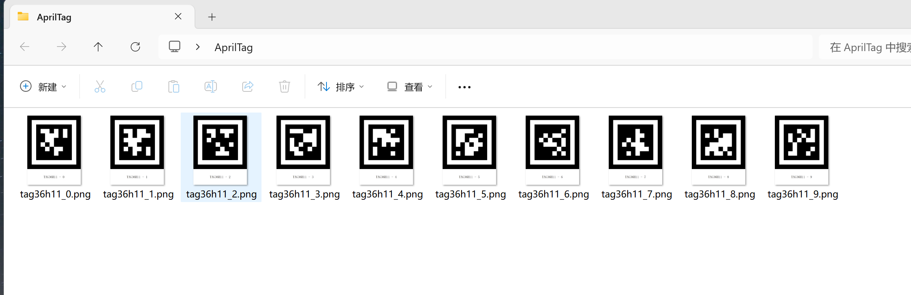
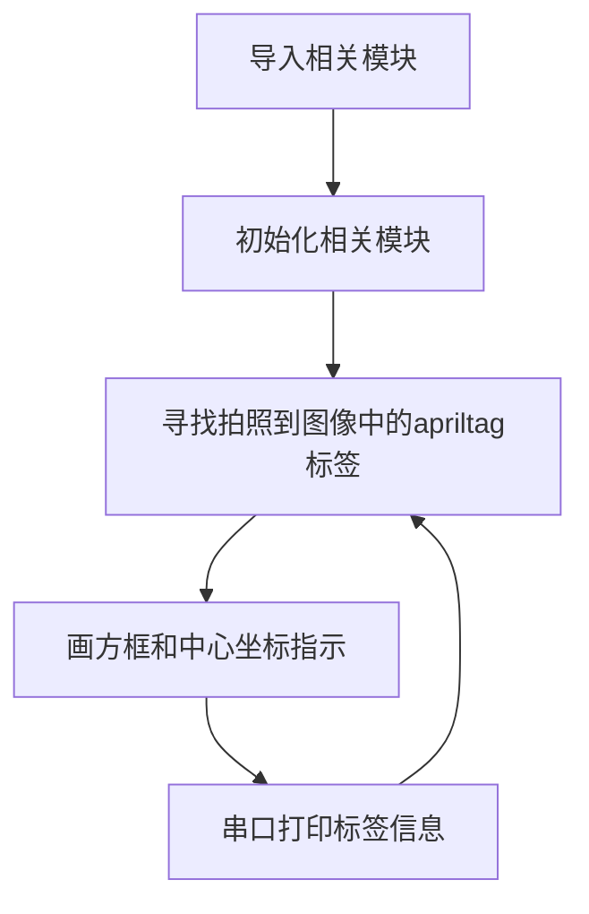
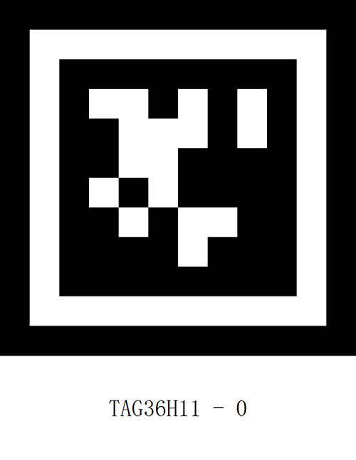
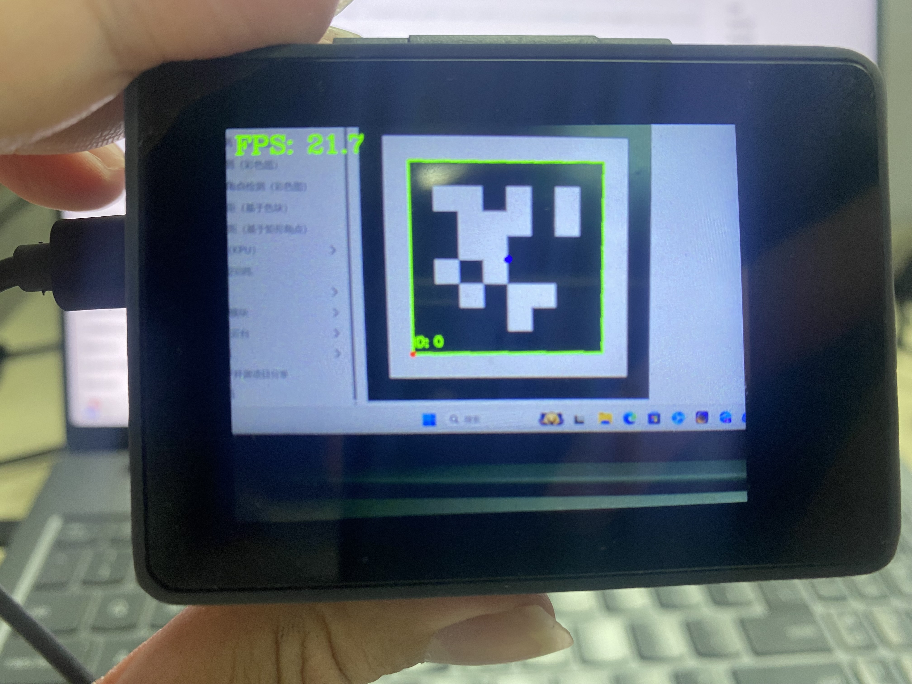
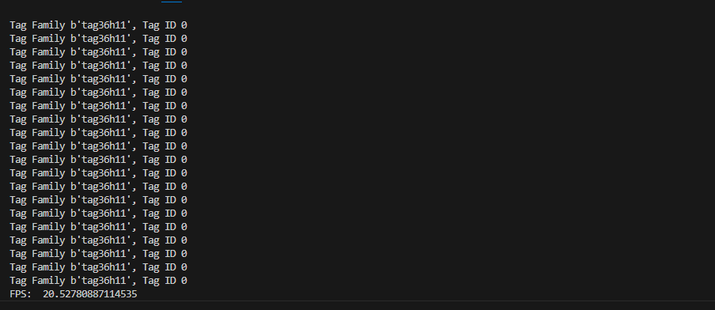

# AprilTag标签识别

## 前言
**AprilTag**是一种视觉基准系统，可用于多种任务，包括增强现实、机器人和相机校准。可以通过普通打印机创建目标，AprilTag 检测软件可以计算标签相对于相机的精确3D位置、方向和标识。

AprilTag官网介绍：https://april.eecs.umich.edu/software/apriltag.html

## 实验目的
编程实现AprilTag标签识别，并将识别到的信息通过串口终端打印出来。

## 实验讲解

### AprilTag种类

可以将AprilTag简单地理解为一个特定信息的**二维码**，有family和ID两个概念：

- `TAG16H5` → 0 to 29
- `TAG25H7` → 0 to 241
- `TAG25H9` → 0 to 34
- `TAG36H10` → 0 to 2319
- `TAG36H11` → 0 to 586 （CanMV K230推荐使用）
- `ARTOOLKIT` → 0 to 511

以【`TAG36H11` → 0 to 586】为例，family信息就是：TAG36H11 ， ID可以是“0 到 586” ，也就是一共有587种标记码。

**不同家族区别：**TAG16H5的有效区域是 4x4 的方块，那么它比TAG36H11看的更远（因为他有 6x6 个方块）。 但是内容少，所以TAG16H5的错误率比TAG36H11 高很多，因为TAG36H11的校验信息多。CanMV K210推荐使用TAG36H11家族的标记码。

### AprilTag生成

可以在CanMV IDE生成AprilTag。点击**工具--机器视觉--AprilTag生成器--TAG36H11家族：**



最小输入0 ，最大输入9 ，制作id从0-9共10张标签。



点击OK后选择要生成的位置文件夹即可：



## Detector对象

识别apriltag采用的第三方的pupil apriltags库，算法跟官方库差不多的，具体说明如下：

### 导入 Detector 模块
```python
from pupil_apriltags import Detector
```
Detector 是 pupil-apriltags 库提供的检测器类

### 构造函数
```python
at_detector = Detector(families="tag36h11", nthreads=1, quad_decimate=1.0, quad_sigma=0.0, refine_edges=1, decode_sharpening=0.25, debug=0)
```
Detector() 用于创建 AprilTag 检测器对象，并设置检测参数。
- `families`：指定需要识别的 AprilTag 标签族，例如 "tag36h11"。
- `nthreads`：检测使用的线程数量。
- `quad_decimate`：检测时的图像降采样比例。数值越大，处理速度通常越快，但较小的标签可能更难识别。
- `quad_sigma`：对检测图像进行高斯模糊时使用的参数，设置为 0.0 表示不进行额外模糊。
- `refine_edges`：是否对检测到的四边形边缘进行进一步修正，非零值表示启用。
- `decode_sharpening`：解码标签时使用的锐化强度。
- `debug`：是否输出调试信息，设置为 0 表示关闭。

### 使用方法
```python
results = at_detector.detect(gray)
```
detect() 用于扫描输入的灰度图像，返回检测结果列表。
- `gray`：输入的单通道灰度图像，通常为 uint8 类型。

代码编写流程如下图所示：



## 参考代码

```python
'''
实验名称：AprilTag标签检测
实验平台：CyberCAM
说明：识别摄像头采集图像中的AprilTag标签
作者：01Studio
'''
import cv2
import time
import numpy as np

from pupil_apriltags import Detector
from walnutpi import Sensor, Display, direction, IDE

# 初始化显示屏
Display.init()

# 初始化摄像头，分辨率640x480
cap = Sensor.Sensor(640, 480)

# 检查摄像头是否打开
if not cap.isOpened():
    print("Cannot open camera")
    exit()

#获取当前显示屏方向，0表示默认，2表示180度翻转。
lcd_dir=direction.get_lcd() 
#print(lcd_dir) 

# 判断显示屏是否翻转，如果翻转，则设置显示旋转180°，摄像头同时设置为前置模式（水平镜像）
if lcd_dir == 2: #翻转了
    Display.set_rotation(2)


# ========== FPS计算 ==========
frame_count = 0
start_time = time.perf_counter()
fps = 0.0


#创建 AprilTag 检测器
at_detector = Detector(families="tag36h11", nthreads=1, quad_decimate=2, quad_sigma=0.0, refine_edges=0, decode_sharpening=0, debug=0)

while True:

    ret,img = cap.read()
    #转灰度
    gray = cv2.cvtColor(img, cv2.COLOR_BGR2GRAY)

    if not gray.flags['C_CONTIGUOUS']:
        gray = np.ascontiguousarray(gray, dtype=np.uint8)

    # 3. 执行检测
    results = at_detector.detect(gray)
    
    # 4. 绘制检测结果
    for result in results:  
        corners = result.corners.astype(int)

        # 绘制 Tag 轮廓
        pts = corners.reshape((-1, 1, 2))
        cv2.polylines(img, [pts], isClosed=True, color=(0, 255, 0), thickness=2)

        # 绘制起点（红点）与中心点（蓝点）
        cv2.circle(img, tuple(corners[0]), 4, (0, 0, 255), -1)
        center = (int(result.center[0]), int(result.center[1]))
        cv2.circle(img, center, 4, (255, 0, 0), -1)

        # 绘制 ID
        cv2.putText(img, f"ID: {result.tag_id}", (corners[0][0], corners[0][1] - 10), cv2.FONT_HERSHEY_SIMPLEX, 0.5, (0, 255, 0), 2)

        #输出类型，id
        print_args = (result.tag_family, result.tag_id) #打印标签信息
        print("Tag Family %s, Tag ID %d" % print_args)

    # 每满1秒计算一次平均FPS
    frame_count += 1    
    current_time = time.perf_counter()
    if current_time - start_time >= 1.0:
        fps = frame_count / (current_time - start_time)
        frame_count = 0              # 重置帧数计数器
        start_time = current_time    # 重置计时起点
        print("FPS: ", fps)

    # 添加文字标签和FPS显示
    cv2.putText(img, f'FPS: {fps:.1f}', (10, 30), cv2.FONT_HERSHEY_COMPLEX, 1, (0, 255, 0), 2)

    # 显示到屏幕和IDE
    Display.show(img)

    # 显示到IDE
    IDE.show(img) 

```

## 实验结果

这里打开family: TAG36H11 , id: 0的标签图片测试：



运行程序，将摄像头正对标签，可以看到识别出来：



IDE串口终端显示识别结果：

