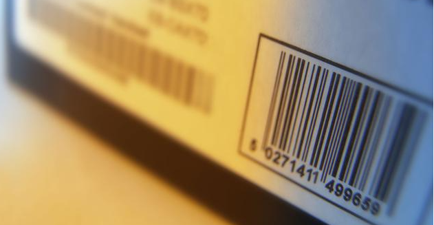
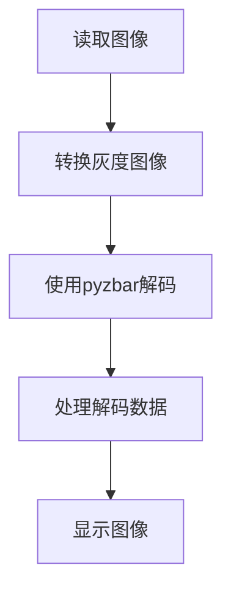
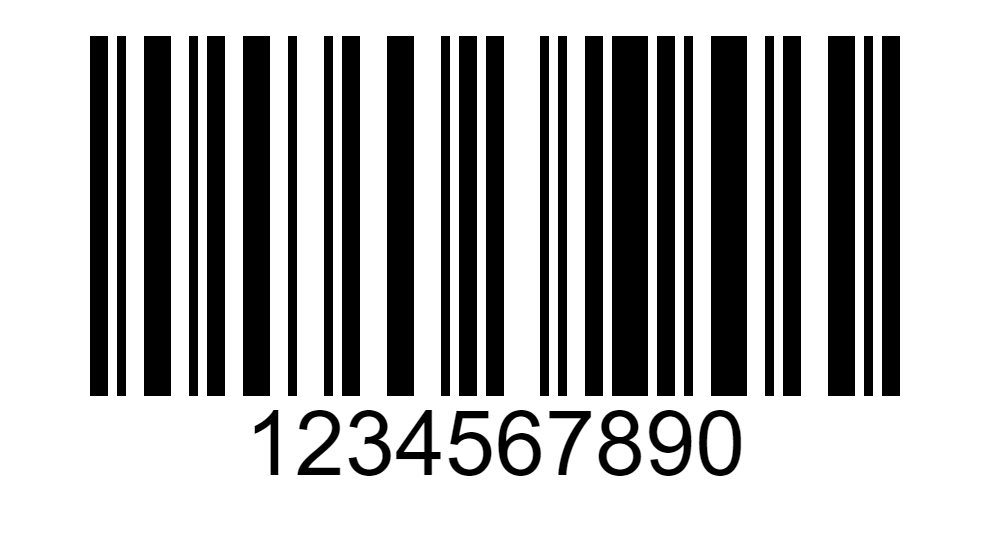
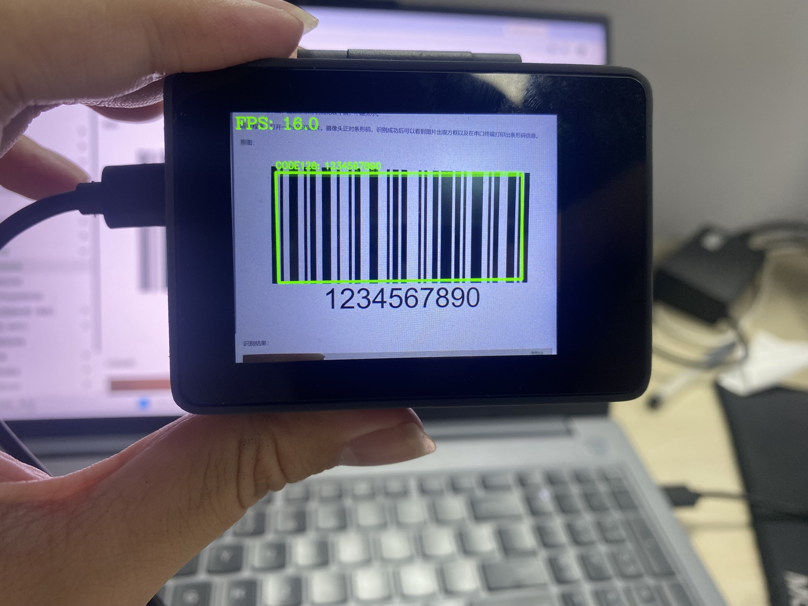
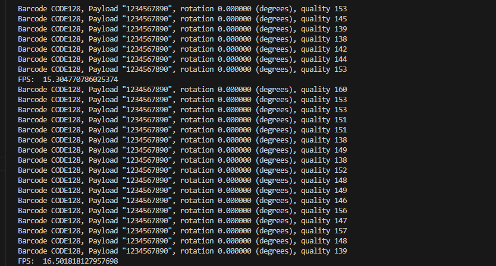

# 条形码识别

## 前言
条形码（barcode）是将宽度不等的多个黑条和空白，按照一定的编码规则排列，用以表达一组信息的图形标识符。常见的条形码是由反射率相差很大的黑条（简称条）和白条（简称空）排成的平行线图案。条形码可以标出物品的生产国、制造厂家、商品名称、生产日期、图书分类号、邮件起止地点、类别、日期等许多信息，因而在商品流通、图书管理、邮政管理、银行系统等许多领域都得到广泛的应用。



## 实验目的
编程实现条形码识别，并将识别到的信息通过串口终端打印出来。

## 实验讲解

cybercam采用 OpenCV 结合 pyzbar 库进行条形码识别。pyzbar 通过调用 ZBar 解码器完成图像中的码制检测与数据解析，支持对以下一维条形码解码：

EAN2 <br></br>
EAN5 <br></br>
EAN8 <br></br>
UPCE <br></br>
ISBN10 <br></br>
UPCA <br></br>
EAN13 <br></br>
ISBN13 <br></br>
I25 <br></br>
DATABAR (RSS-14) <br></br>
DATABAR_EXP (RSS-Expanded) <br></br>
CODABAR <br></br>
CODE39 <br></br>
PDF417 <br></br>
CODE93 <br></br>
CODE128 <br></br>

## decode() 函数和 ZBarSymbol 枚举

### 导入模块
```python
from pyzbar.pyzbar import decode, ZBarSymbol
```
导入decode函数，即可使用decode扫描输入图像中的条形码，获取结果列表。
导入ZBarSymbol枚举，即可指定解码类型，可以减少不需要的扫描。

### ZBarSymbol枚举使用方法
```python
def build_symbol_list(names):

    result = []

    for name in names:
        symbol = getattr(
            ZBarSymbol,
            name,
            None
        )

        if symbol is not None:
            result.append(symbol)

    return result


ACTIVE_SYMBOLS = build_symbol_list([
    "CODE128"
])
```
pyzbar库是支持条形码和二维码的解码，原则上条形码跟二维码都是码类型。将需要的条码类型名称传入 build_symbol_list([ ... ])，即可安全地按需加载特定的条码类型。这能自动兼容不同版本的 pyzbar，避免因底层版本缺失某些 ZBarSymbol 属性而抛出异常。

### decode()使用方法
```python
results = decode(image, symbols=None)
```
decode 扫描输入图像中的码类型，返回results结果列表。
- `image`：输入图像，可以是灰度图像或彩色图像。
- `symbols`：指定需要识别的码制类型。
  - 设置为 `None` 时，检测 ZBar 支持的所有码制；
  - 传入 `ZBarSymbol` 列表时，只检测指定类型，可以减少不需要的扫描。

### decoded 结果对象

`decode()` 返回的列表中，每个元素都是一个 `Decoded` 结果对象。对象中保存了解码内容、码制类型和所在位置等信息。

```python
for result in results:
    code_type = result.type
    code_data = result.data.decode("utf-8")
    rect = result.rect
```
常用成员如下：

- `result.data`：二维码或条形码中保存的原始数据，数据类型为 `bytes`。
- `result.type`：识别到的码制类型，例如 `QRCODE`、`CODE128` 或 `EAN13`。
- `result.rect`：二维码或条形码的外接矩形位置。
- `result.polygon`：二维码或条形码轮廓的顶点坐标。
- `result.orientation`：码图方向。部分旧版本 ZBar 可能不支持该信息。
- `result.quality`：识别质量的相对值，数值越大通常表示识别质量越高。

由于 `result.data` 返回的是字节数据，通常需要转换为字符串：

从调用方式来看，使用 pyzbar 库进行条码识别非常简洁，只需调用 decode() 函数并处理返回的结果列表即可。整体代码编写流程如下图所示：


## 参考代码

```python
'''
实验名称：条形码检测
实验平台：CyberCAM
说明：识别摄像头采集图像中的条形码
作者：01Studio
'''
import cv2
import time
import numpy as np

from pyzbar.pyzbar import decode, ZBarSymbol
from walnutpi import Sensor, Display, direction, IDE

# 初始化显示屏
Display.init()

# 初始化摄像头，分辨率640x480
cap = Sensor.Sensor(640, 480)

# 检查摄像头是否打开
if not cap.isOpened():
    print("Cannot open camera")
    exit()

#获取当前显示屏方向，0表示默认，2表示180度翻转。
lcd_dir=direction.get_lcd() 
#print(lcd_dir) 

# 判断显示屏是否翻转，如果翻转，则设置显示旋转180°，摄像头同时设置为前置模式（水平镜像）
if lcd_dir == 2: #翻转了
    Display.set_rotation(2)


# ========== FPS计算 ==========
frame_count = 0
start_time = time.perf_counter()
fps = 0.0

# ========== 全图模式或缩放模式 ==========
width  = 640
height = 480
scale_x = 0.0
scale_y = 0.0

mode = 0 # 0:原图不缩放 1:根据定义的变量width，height大小进行缩放

if mode == 0:
    #原图不缩放，正常比例
    scale_x = 1.0
    scale_y = 1.0

elif mode == 1:

    # 宽度减少一半
    width = 320
    # 高度减少一半
    height = 240

    # 计算反向映射比例（原图尺寸 / 缩放后尺寸）
    # 当小图分辨率为 320x240 时，比例为 2.0，用于将小图坐标等比放大还原回原图
    scale_x = 640 / width
    scale_y = 480 / height  

#判断是否支持该类型
def build_symbol_list(names):
    """
    不同ZBar版本支持的符号枚举可能略有差异。
    只添加当前pyzbar中实际存在的类型。
    """
    result = []

    for name in names:
        symbol = getattr(
            ZBarSymbol,
            name,
            None
        )

        if symbol is not None:
            result.append(symbol)

    return result

# 选择添加条形码，建议关掉没有使用条形码，减少不需要的扫描，影响显示。
ACTIVE_SYMBOLS = build_symbol_list([
    # "EAN2",
    # "EAN5",
    # "EAN8",
    # "UPCE",
    # "ISBN10",
    # "UPCA",
    # "EAN13",
    # "ISBN13",
    # "I25",
    # "DATABAR",
    # "DATABAR_EXP",
    # "CODABAR",
    # "CODE39",
    # "PDF417",
    # "CODE93",
    "CODE128",
])

if not ACTIVE_SYMBOLS:
    raise RuntimeError(
        "当前 pyzbar 没有 CODE128"
    )

while True:
    ret, img = cap.read()

    if mode == 1:
        #调整图片的分辨率
        small = cv2.resize(img, (width, height),  interpolation=cv2.INTER_AREA)
    else:
        #保持原来的分辨率
        small = img

    # 转灰度
    gray = cv2.cvtColor(small, cv2.COLOR_BGR2GRAY)

    # 强制图像8位类型
    gray = np.ascontiguousarray(gray, dtype=np.uint8)

    #ZBar扫描
    results = decode(gray, symbols=ACTIVE_SYMBOLS)

    
    #处理数据
    for result in results:
        code_type = result.type
        code_data = result.data.decode("utf-8")

        rect = result.rect

        x = int(rect.left * scale_x) 
        y = int(rect.top * scale_y) 
        w = int(rect.width * scale_x) 
        h = int(rect.height * scale_y)

        cv2.rectangle(img, (x, y), (x + w, y + h), (0, 255, 0), 3)

        text_x = x
        text_y = y - 8

        if text_y < 25:
            text_y = 25

        label = f"{code_type}: {code_data}"

        display_label = label[:40]

        cv2.putText(img, display_label, (text_x, text_y), cv2.FONT_HERSHEY_SIMPLEX, 0.55, (0, 255, 0), 2)

        # 将 orientation 映射为角度（或通过 polygon 计算）
        rotation_map = {'UP': 0.0, 'RIGHT': 90.0, 'DOWN': 180.0, 'LEFT': 270.0}
        rotation = rotation_map.get(result.orientation, 0.0)

        print_args = (code_type, code_data, rotation, result.quality)
        print("Barcode %s, Payload \"%s\", rotation %f (degrees), quality %d" % print_args)
        
    # 每满1秒计算一次平均FPS
    frame_count += 1    
    current_time = time.time()
    if current_time - start_time >= 1.0:
        fps = frame_count / (current_time - start_time)
        frame_count = 0              # 重置帧数计数器
        start_time = current_time    # 重置计时起点
        print("FPS: ", fps)

    # 添加文字标签和FPS显示
    cv2.putText(img, f'FPS: {fps:.1f}', (10, 30), cv2.FONT_HERSHEY_COMPLEX, 1, (0, 255, 0), 2)

    # 显示到屏幕
    Display.show(img)

    # 显示到IDE
    IDE.show(img)
```
本例默认采用`mode=0`，程序直接使用摄像头采集的 `640×480` 图像进行检测。该模式能够保留更多图像细节，但 CPU 计算量较大。如果需要提升速度把设置为`mode=1`，并适当降低 `width` 和`height`
## 实验结果

为了更好地识别，图像上条形码需比较平展，不能太小。

运行程序，打开一个条形码图片。摄像头正对条形码，识别成功后可以看到图片出现方框以及在串口终端打印出条形码信息。

原图：



识别结果：



串口终端打印条形码详细信息：



条形码是日常生活应用非常广泛的东西，有了本节实验技能，我们就可以轻松打造一个属于自己的条形码扫描仪了。