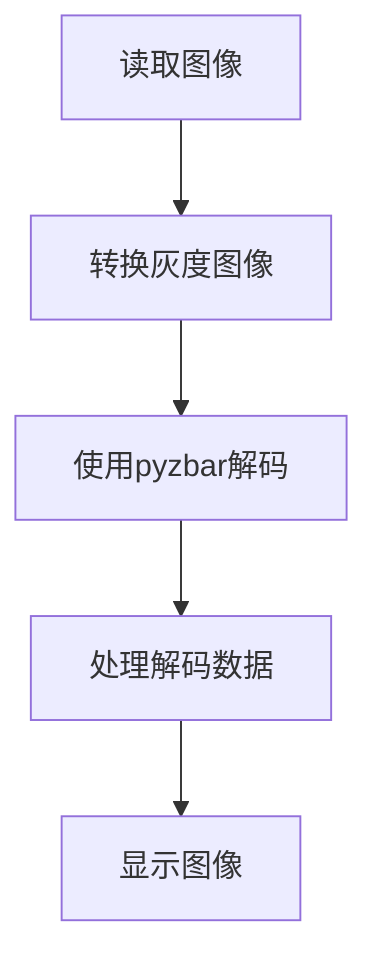
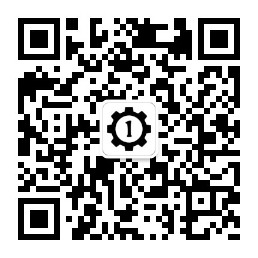
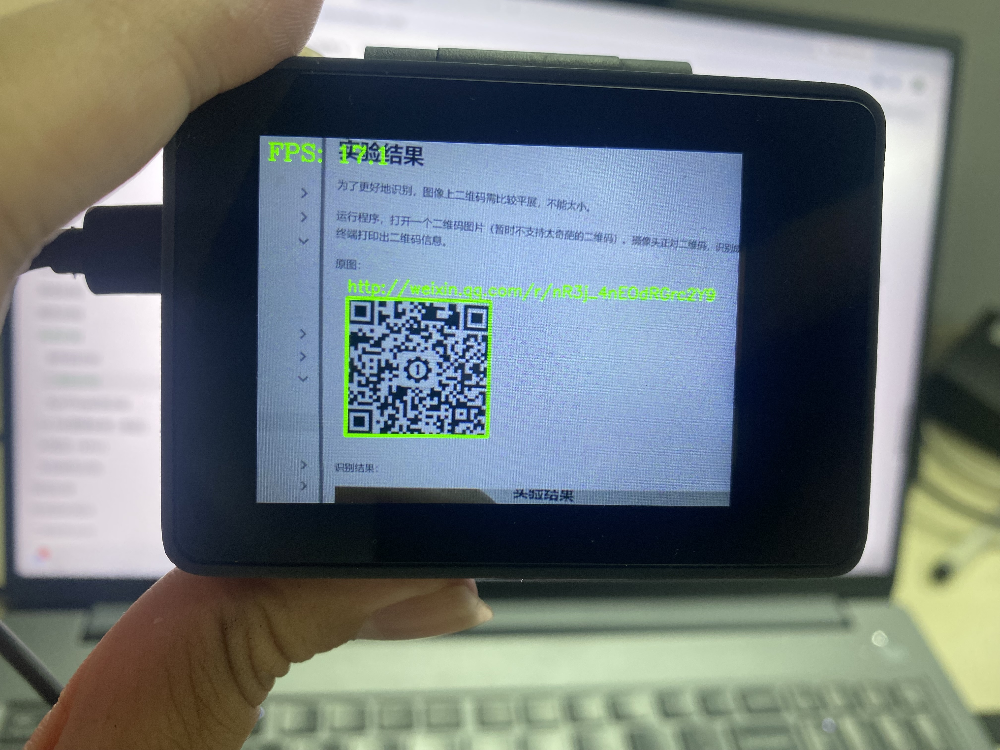

# 二维码识别

## 前言
相信大家都知道二维码了，特别是在扫码支付越来越流行的今天，二维码的应用非常广泛。今天我们就来学习如何使用CanMV K230开发套件实现二维码信息识别。

## 实验目的
编程实现二维码识别，并将识别到的信息通过串口终端打印出来。

## 实验讲解

二维码又称二维条码，常见的二维码为QR Code，QR全称Quick Response，是一个近几年来移动设备上超流行的一种编码方式，它比传统的Bar Code条形码能存更多的信息，也能表示更多的数据类型。

二维条码/二维码（2-dimensional bar code）是用某种特定的几何图形按一定规律在平面（二维方向上）分布的、黑白相间的、记录数据符号信息的图形；在代码编制上巧妙地利用构成计算机内部逻辑基础的“0”、“1”比特流的概念，使用若干个与二进制相对应的几何形体来表示文字数值信息，通过图象输入设备或光电扫描设备自动识读以实现信息自动处理：它具有条码技术的一些共性：每种码制有其特定的字符集；每个字符占有一定的宽度；具有一定的校验功能等。同时还具有对不同行的信息自动识别功能、及处理图形旋转变化点。

cybercam采用 OpenCV 结合 pyzbar 库进行二维码识别，直接使用pyzbar库中的decode()即可获取摄像头采集图像中二维码的相关信息。具体说明如下：

## decode() 函数和 ZBarSymbol 枚举

### 导入模块
```python
from pyzbar.pyzbar import decode, ZBarSymbol
```
导入decode函数，即可使用decode扫描输入图像中的条形码，获取结果列表
导入ZBarSymbol枚举，即可指定解码类型，可以减少不需要的扫描。

### ZBarSymbol枚举使用方法
```python
ACTIVE_SYMBOLS = [
    ZBarSymbol.QRCODE
]
```
pyzbar库是支持条形码和二维码的解码，原则上条形码跟二维码都是码类型。这里直接使用 ZBarSymbol.QRCODE，而条形码示例使用 build_symbol_list() 动态获取枚举成员，主要是因为条形码的码制类型较多，不同版本的 pyzbar 或底层 ZBar 可能支持不同的条形码枚举。QRCODE 是 ZBar 常用且长期支持的码制类型，通常可以直接引用；对于多种条形码，则可以通过 getattr() 动态获取枚举成员，避免当前版本不存在某个码制类型时产生异常。

### decode()使用方法
```python
results = decode(image, symbols=None)
```
decode 扫描输入图像中的码类，返回results结果列表。

- `image`：输入图像，可以是灰度图像或彩色图像。
- `symbols`：指定需要识别的码制类型。
  - 设置为 `None` 时，检测 ZBar 支持的所有码制；
  - 传入 `ZBarSymbol` 列表时，只检测指定类型，可以减少不需要的扫描，比如现在识别二维码只需要指定类型为 ZBarSymbol.QRCODE就可以了。

从调用方式来看，使用 pyzbar 库进行二维码识别非常简洁，只需调用 decode() 函数并处理返回的结果列表即可。整体代码编写流程如下图所示：



## 参考代码
```python
'''
实验名称：二维码检测
实验平台：CyberCAM
说明：识别摄像头采集图像中的二维码
作者：01Studio
'''
import cv2
import time
import numpy as np

from pyzbar.pyzbar import decode, ZBarSymbol
from walnutpi import Sensor, Display, direction, IDE

# 初始化显示屏
Display.init()

# 初始化摄像头，分辨率640x480
cap = Sensor.Sensor(640, 480)

# 检查摄像头是否打开
if not cap.isOpened():
    print("Cannot open camera")
    exit()

#获取当前显示屏方向，0表示默认，2表示180度翻转。
lcd_dir=direction.get_lcd() 
#print(lcd_dir) 

# 判断显示屏是否翻转，如果翻转，则设置显示旋转180°，摄像头同时设置为前置模式（水平镜像）
if lcd_dir == 2: #翻转了
    Display.set_rotation(2)


# ========== FPS计算 ==========
frame_count = 0
start_time = time.perf_counter()
fps = 0.0

# ========== 全图模式或缩放模式 ==========
width  = 640
height = 480
scale_x = 0.0
scale_y = 0.0

mode = 0 # 0:原图不缩放 1:根据定义的变量width，height大小进行缩放

if mode == 0:
    #原图不缩放，正常比例
    scale_x = 1.0
    scale_y = 1.0

elif mode == 1:

    # 宽度减少一半
    width = 320
    # 高度减少一半
    height = 240

    # 计算反向映射比例（原图尺寸 / 缩放后尺寸）
    # 当小图分辨率为 320x240 时，比例为 2.0，用于将小图坐标等比放大还原回原图
    scale_x = 640 / width
    scale_y = 480 / height  

#二维码
ACTIVE_SYMBOLS = [
    ZBarSymbol.QRCODE
]

while True:
    ret, img = cap.read()

    if mode == 1:
        #调整图片的分辨率
        small = cv2.resize(img, (width, height),  interpolation=cv2.INTER_AREA)
    else:
        #保持原来的分辨率
        small = img
    
   # 转灰度
    gray = cv2.cvtColor(small, cv2.COLOR_BGR2GRAY)

    # 强制图像8位类型
    gray = np.ascontiguousarray(gray, dtype=np.uint8)

    #ZBar扫描
    results = decode(gray, symbols=ACTIVE_SYMBOLS)

    #处理数据
    for result in results:
        code_data = result.data.decode("utf-8")

        rect = result.rect

        x = int(rect.left * scale_x) 
        y = int(rect.top * scale_y) 
        w = int(rect.width * scale_x) 
        h = int(rect.height * scale_y)

        cv2.rectangle(img, (x, y), (x + w, y + h), (0, 255, 0), 3)

        text_x = x
        text_y = y - 8

        if text_y < 25:
            text_y = 25

        label = f"{code_data}"

        display_label = label[:40]

        cv2.putText(img, display_label, (text_x, text_y), cv2.FONT_HERSHEY_SIMPLEX, 1.0, (0, 255, 0), 2)

        #输出数据
        print(label)
        
    # 每满1秒计算一次平均FPS
    frame_count += 1    
    current_time = time.time()
    if current_time - start_time >= 1.0:
        fps = frame_count / (current_time - start_time)
        frame_count = 0              # 重置帧数计数器
        start_time = current_time    # 重置计时起点
        print("FPS: ", fps)

    # 添加文字标签和FPS显示
    cv2.putText(img, f'FPS: {fps:.1f}', (10, 30), cv2.FONT_HERSHEY_COMPLEX, 1, (0, 255, 0), 2)

    # 显示到屏幕
    Display.show(img)

    # 显示到IDE
    IDE.show(img)     
```
本例默认采用`mode=0`，程序直接使用摄像头采集的 `640×480` 图像进行检测。该模式能够保留更多图像细节，但 CPU 计算量较大。如果需要提升速度把设置为`mode=1`，并适当降低 `width` 和`height`

## 实验结果

为了更好地识别，图像上二维码需比较平展，不能太小。

运行程序，打开一个二维码图片（暂时不支持太奇葩的二维码）。摄像头正对二维码，识别成功后可以看到图片出现方框以及在串口终端打印出二维码信息。

原图：



识别结果：



串口终端打印二维码详细信息：


二维码是日常生活应用非常广泛的东西，有了本节实验技能，我们就可以轻松打造一个属于自己的二维码扫描仪了。