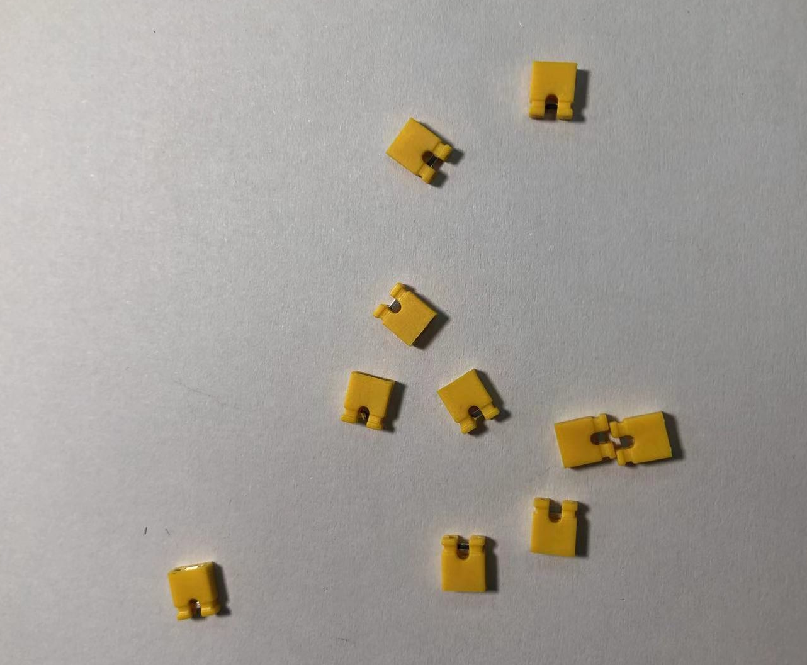
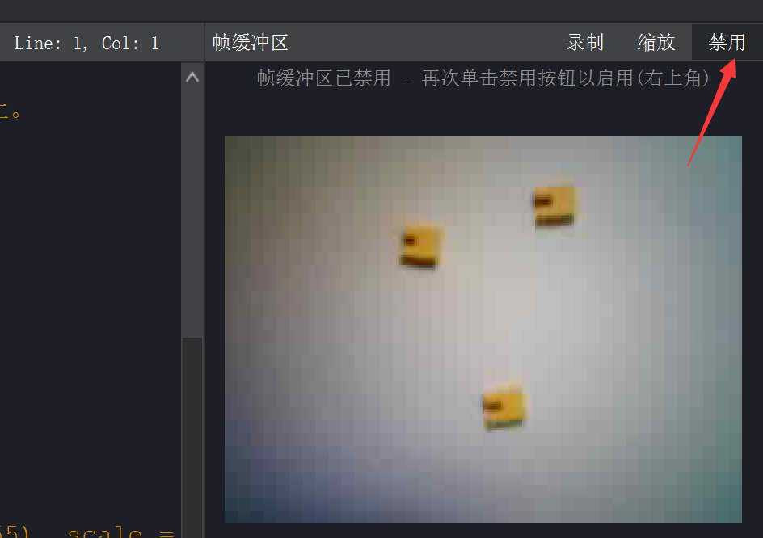
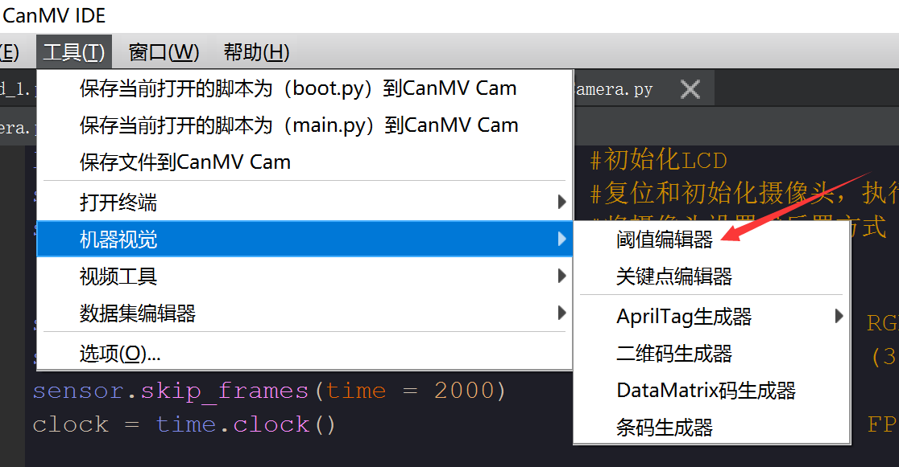
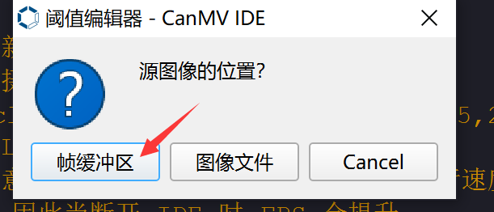
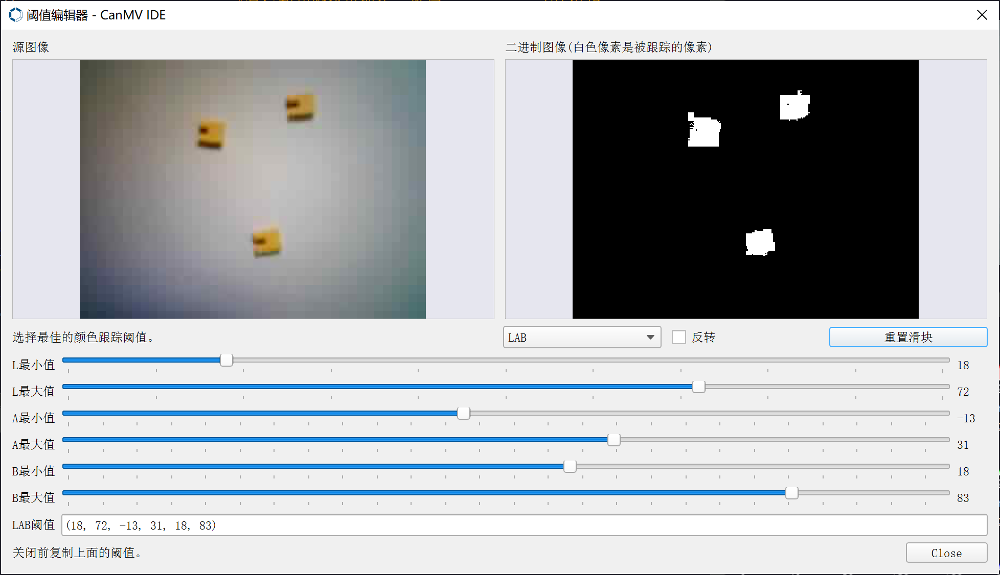
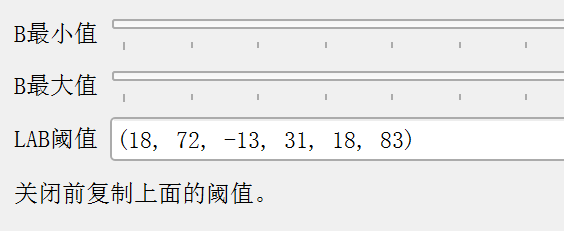
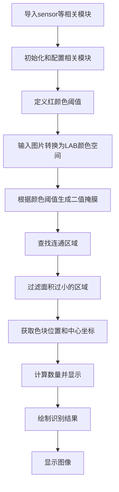
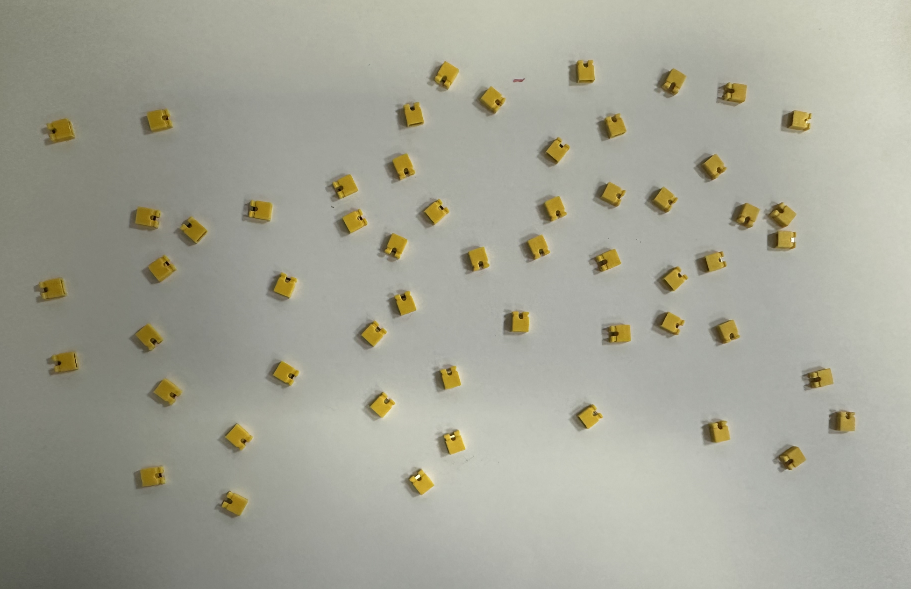
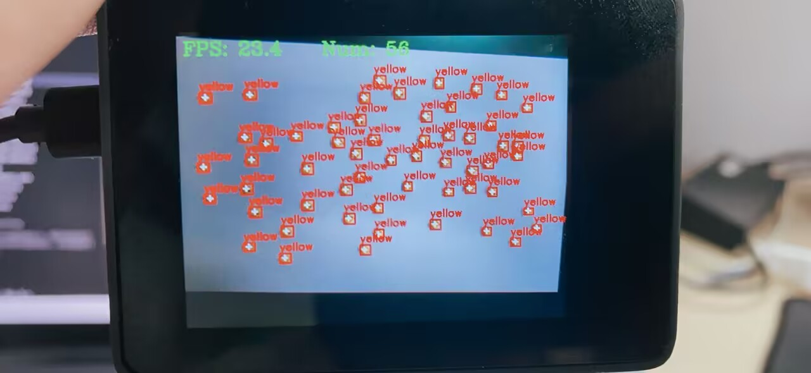

# 物体计数（相同颜色）

## 前言
通过上一节颜色识别我们看到可以识别出色块的数量，这节我们就基于上一节颜色识别来学习如何识别指定颜色的物体，计算其数量。

## 实验目的
通过OpenCV库实现Cybercam识别程序预先设定的颜色，计算物体的数量。

## 实验讲解

OpenCV 是通过颜色空间转换、颜色阈值分割和连通域分析，实现图像中的颜色识别。主要将输入的图像转换为 LAB 图像，然后根据不同颜色的阈值生成二值掩膜，最后使用连通域分析查找满足面积和尺寸要求的色块。具体如下：

## OpenCV LAB 颜色识别

###  cvtColor() 使用方法
```python
lab = cv2.cvtColor(image, code)
```
cvtColor图像颜色空间转换。返回lab值为转换后得到的新图像矩阵。
- `image` ：输入的原始图像。
- `code` ：颜色空间转换模式变量（通常传入 OpenCV 预设的整型常量标识符，例如本次转换为 LAB 图像传入变量 `cv2.COLOR_BGR2LAB`）。

### inRange() 使用方法
```python
mask = cv2.inRange(src, lowerb, upperb)
```
inRange判断图像中的像素是否位于指定阈值范围内(符合阈值范围的像素值为 `255`，不符合阈值范围的像素值为 `0`。)，并返回值为二值掩膜。
- `src`：输入图像，本实验为 LAB 图像。
- `lowerb`：颜色阈值下限。
- `upperb`：颜色阈值上限。
- `mask`：返回的单通道二值图像。

### connectedComponentsWithStats() 使用方法
```python
num_labels, labels, stats, centroids = cv2.connectedComponentsWithStats(image, connectivity=8, ltype=cv2.CV_16U)
```
connectedComponentsWithStats查找二值图像中的连通区域，并返回每个区域的位置、尺寸、面积和中心坐标。
- `image`：输入的单通道二值图像。
- `connectivity`：像素连接方式。
  - `4`：使用四邻域连接；
  - `8`：使用八邻域连接。
- `ltype`：标签图的数据类型。

## 获取颜色阈值

针对不同颜色的物体我们如何获取它的阈值呢？这里以黄色的跳线帽为例来讲解。



先使用 [摄像头](../../machine_vision/camera.md)代码采集物体图像，在IDE右上角缓冲区点击“**禁用**”将要识别的物体确认下来：



点击 **工具—机器视觉—阈值编辑器** 。



在弹出的对话框选择“帧缓冲区”。



通过调整下方6个LAB值，使得物体颜色在右边为白色，其余背景为黑色。（需要花费一点时间，找到临界值效果更佳。）



记录颜色的LAB值，在后面代码中使用。



学会了找色块函数和颜色阈值获取方法后，我们可以理清一下编程思路，代码编写流程如下：



## 参考代码

```python
'''
实验名称：物体计数
实验平台：CyberCAM
说明：物体计数（相同颜色物体）
作者：01Studio
'''
import cv2  # OpenCV图像处理库
import time  
import numpy as np
from walnutpi import Sensor, Display, direction, IDE

# 初始化显示屏
Display.init()

# 初始化摄像头，分辨率640x480
cap = Sensor.Sensor(640, 480)

# 检查摄像头是否打开
if not cap.isOpened():
    print("Cannot open camera")
    exit()

#获取当前显示屏方向，0表示默认，2表示180度翻转。
lcd_dir=direction.get_lcd() 
#print(lcd_dir) 

# 判断显示屏是否翻转，如果翻转，则设置显示旋转180°，摄像头同时设置为前置模式（水平镜像）
if lcd_dir == 2: #翻转了
    Display.set_rotation(2)
    cap.set_hmirror(1)

# ========== FPS计算 ==========
frame_count = 0       # 帧数计数器
start_time = time.time()
fps = 0.0

# ========== 全图模式或缩放模式 ==========
width  = 640
height = 480
scale_x = 0.0
scale_y = 0.0

mode = 0 # 0:原图不缩放 1:根据定义的变量width，height大小进行缩放

if mode == 0:
    #原图不缩放，正常比例
    scale_x = 1.0
    scale_y = 1.0

elif mode == 1:

    # 宽度减少一半
    width = 320
    # 高度减少一半
    height = 240

    # 计算反向映射比例（原图尺寸 / 缩放后尺寸）
    # 当小图分辨率为 320x240 时，比例为 2.0，用于将小图坐标等比放大还原回原图
    scale_x = 640 / width
    scale_y = 480 / height  

# 颜色识别阈值 (L Min, L Max, A Min, A Max, B Min, B Max) LAB模型
# 下面的阈值元组是用来识别 红、绿、蓝三种颜色以及边框绘图的颜色，当然你也可以调整让识别变得更好
thresholds = {
    "yellow": {
        "threshold": (18, 72, -13, 31, 24, 83),
        "draw_color": (0, 0, 255),
    }

}


#最小色块像素数
MIN_PIXELS = 50

#最小边框
MIN_WIDTH = 2
MID_HEIGHT = 2

def canmv_lab_to_opencv(threshold):
    """
    将 CanMV 的 LAB 阈值转换为 OpenCV 8位 LAB 阈值。

    OpenMV:
        L = 0～100
        A = -128～127
        B = -128～127

    OpenCV CV_8U:
        L = 0～255
        A = 0～255
        B = 0～255
    """
    l_min, l_max, a_min, a_max, b_min, b_max = threshold

    lower = np.array(
        [
            round(l_min * 255 / 100),
            a_min + 128,
            b_min + 128,
        ],
        dtype=np.uint8,
    )

    upper = np.array(
        [
            round(l_max * 255 / 100),
            a_max + 128,
            b_max + 128,
        ],
        dtype=np.uint8,
    )

    return lower, upper


# 提前转换阈值，不要在每帧循环中创建数组
for config in thresholds.values():
    config["lower"], config["upper"] = canmv_lab_to_opencv(
        config["threshold"]
    )

# 持续采集和显示图像
while True:

    # 读取图像帧
    ret, img = cap.read()

    if mode == 1:
        #调整图片的分辨率
        small = cv2.resize(img, (width, height),  interpolation=cv2.INTER_AREA)
    else:
        #保持原来的分辨率
        small = img

    #转换成LAB格式
    lab = cv2.cvtColor(small, cv2.COLOR_BGR2LAB)

    num = 0
    #提取色素
    for color_name, config in thresholds.items():
        #根据颜色阈值生成二值掩膜
        mask = cv2.inRange(lab, config["lower"], config["upper"])
        #连通域
        num_labels, labels, stats, centroids = cv2.connectedComponentsWithStats(mask, connectivity=8, ltype=cv2.CV_16U)
        #选择满足面积和尺寸要求的色块
        for label_index in range(1, num_labels):
            pixels = int(stats[label_index, cv2.CC_STAT_AREA])
            #减少碎块
            if pixels < MIN_PIXELS:
                continue

            x = int(stats[label_index, cv2.CC_STAT_LEFT])
            y = int(stats[label_index, cv2.CC_STAT_TOP])
            w = int(stats[label_index, cv2.CC_STAT_WIDTH])
            h = int(stats[label_index, cv2.CC_STAT_HEIGHT])

            # 过滤细长噪点
            if w < MIN_WIDTH or h < MIN_WIDTH:
                continue

            #坐标映射计算            
            center_x = int(centroids[label_index][0])
            center_y = int(centroids[label_index][1])

            center_x = int(center_x * scale_x)
            center_y = int(center_y * scale_y)

            x1 = int(x * scale_x) 
            y1 = int(y * scale_y)
            x2 = int((x + w) * scale_x) 
            y2 = int((y + h) * scale_y)

            #画图
            draw_color = config["draw_color"]

            cv2.rectangle(img, (x1, y1), (x2, y2), draw_color, 2,)

            cross_size = 4
            
            cv2.line(img, (center_x - cross_size, center_y), (center_x + cross_size, center_y), (255, 255, 255), 2,)
            cv2.line(img, (center_x, center_y - cross_size), (center_x, center_y + cross_size), (255, 255, 255), 2,)

            text_y = y1 - 5
            
            if text_y < 20:
                text_y = y1 + 20

            cv2.putText(img, color_name, (x1, text_y), cv2.FONT_HERSHEY_SIMPLEX, 0.6, draw_color, 2,)
            num = num + 1
    # 每满1秒计算一次平均FPS
    frame_count += 1    
    current_time = time.time()
    if current_time - start_time >= 1.0:
        fps = frame_count / (current_time - start_time)
        frame_count = 0              # 重置帧数计数器
        start_time = current_time    # 重置计时起点
        print("FPS: ", fps)
    
    # 添加文字标签和FPS显示
    cv2.putText(img, f'FPS: {fps:.1f}    Num: {num}  ', (10, 30), cv2.FONT_HERSHEY_COMPLEX, 1, (0, 255, 0), 2)

    # 显示到屏幕
    Display.show(img)

    # 显示到IDE
    IDE.show(img)

```
本例默认采用`mode=0`，程序直接使用摄像头采集的 `640×480` 图像进行检测。该模式能够保留更多图像细节，但 CPU 计算量较大。如果需要提升速度把设置为`mode=1`，并适当降低 `width` 和`height`，重新调整阈值

## 实验结果

在IDE中运行代码，这里尝试识别多个跳线帽，可以看到准确度非常高：

待识别物体：



识别结果：



