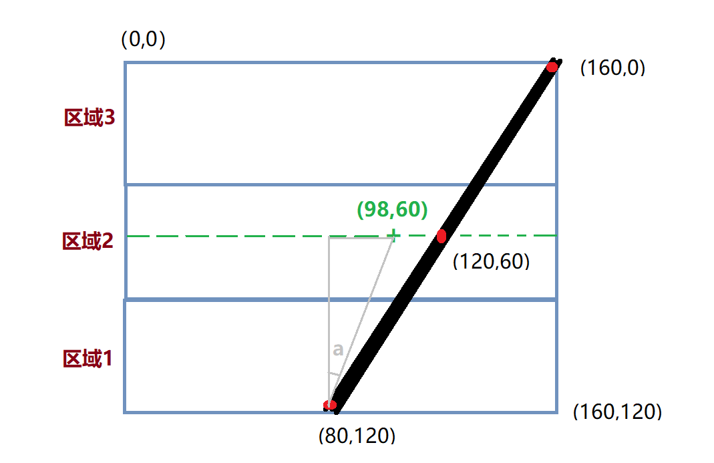
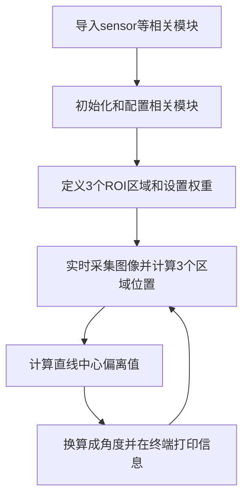
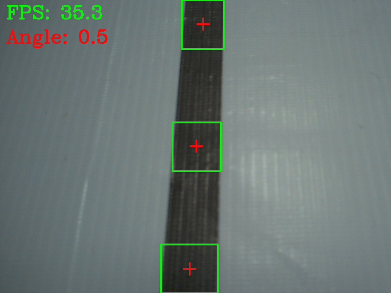
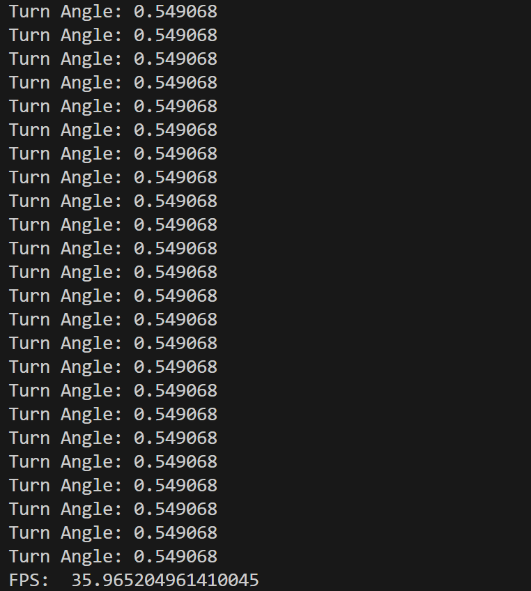
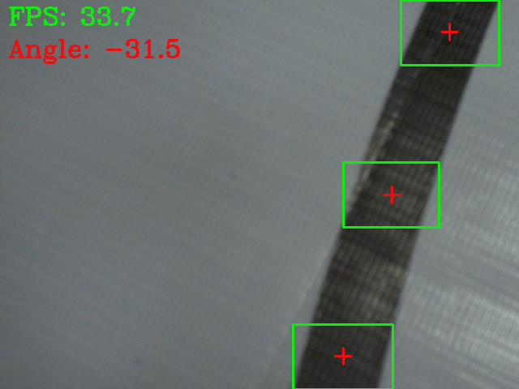
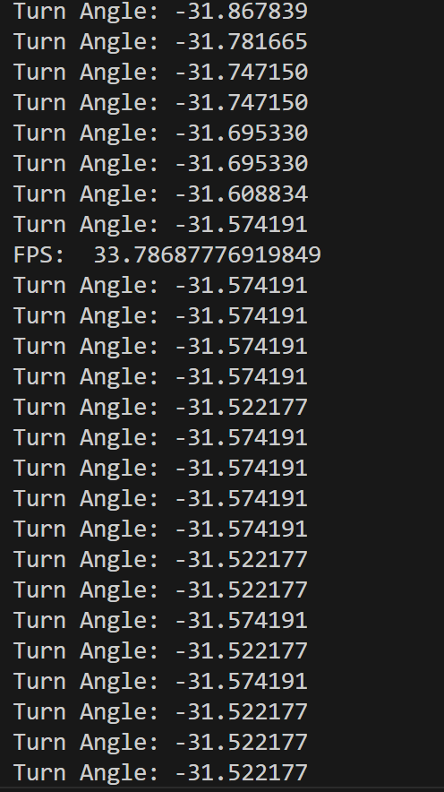
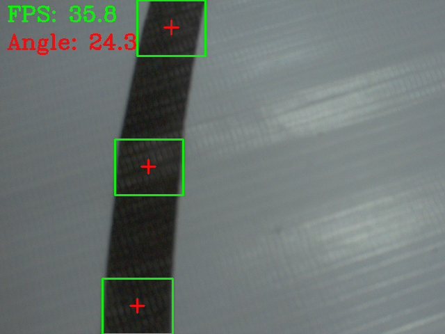
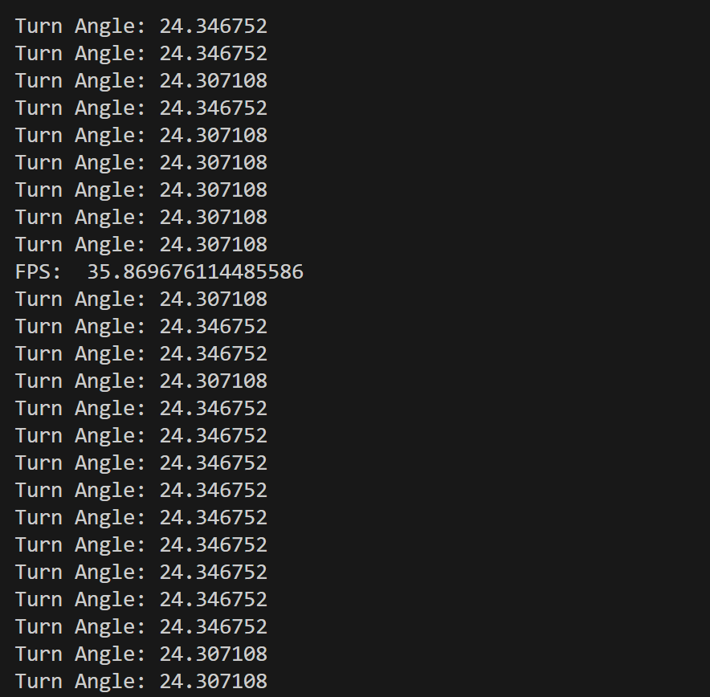

# 机器人巡线（实线）

## 前言

本节的巡线案例仍然是基于颜色识别，原理是根据摄像头采集到的图像直线与中心偏离的位置计算出偏离角度，这个方法让巡线变得更容易。如果你的CyberCAM K230连接到机器人（或相关设备），那么机器人（设备）可以直接关键计算角度偏离结果做出相应调整。


## 实验目的
通过编程实现CyberCAM K230摄像头画面中黑线的偏离角度。

## 实验讲解

本实验对画面是有一定要求的，也就是摄像头采集图像一定要出现唯一1条连续的黑色直线。程序通过对画面切割成三部分，计算每个部分黑色线的中心点X坐标，然后采用加权平均算法估算出直线的偏离位置。通常情况下越靠近底部的地方离摄像头越近，顶部表示远方线段。因此底部的图形权重高。以下下是示意图讲解：

假设摄像头当前画面的像素分辨率：160（宽）X120（高），左上角坐标为（0,0），然后当前出现直线坐标为（80,120）至（160,0）偏右的直线。上中下三个部分的权重分别为0.1、0.3、0.7（底部图像靠近机器人，权重大，权重总和可以不是1），我们来计算一下其中心值。



上图中Y轴的中点坐标就是60，X坐标加权平均值计算如下：

X’=（80\*0.7+120\*0.3+160\*0.1）/（0.7+0.3+0.1）=98

那么直线偏离坐标可以认为是（98,60），图中绿色“+”位置。那么利用反正切函数可以求出偏离角度：a = atan((98-80)/60)=16.7°，机器人相当于实线的位置往左偏了，所以加一个负号，即 -16.7°；偏离角度就是这么计算出来的。**得到偏离角度后就可以自己编程去调整小车或者机器人的运动状态，直到0°为没有偏离。**

本实验主要使用 OpenCV 库编程，具体函数在上一节已经有讲述，具体使用方法如下表：

## OpenCV 颜色识别

### inRange() 使用方法
```python
mask = cv2.inRange(src, lowerb, upperb)
```
inRange判断图像中的像素是否位于指定阈值范围内(符合阈值范围的像素值为 `255`，不符合阈值范围的像素值为 `0`。)，并返回值为二值掩膜。
- `src`：输入图像，本实验为 取出 ROI 灰度图。
- `lowerb`：颜色阈值下限。
- `upperb`：颜色阈值上限。
- `mask`：返回的单通道二值图像。

### connectedComponentsWithStats() 使用方法
```python
num_labels, labels, stats, centroids = cv2.connectedComponentsWithStats(image, connectivity=8, ltype=cv2.CV_16U)
```
connectedComponentsWithStats查找二值图像中的连通区域，并返回每个区域的位置、尺寸、面积和中心坐标。
- `image`：输入的单通道二值图像。
- `connectivity`：像素连接方式。
  - `4`：使用四邻域连接；
  - `8`：使用八邻域连接。
- `ltype`：标签图的数据类型。

了解了找色块函数应用方法后，我们可以理清一下编程思路，代码编写流程如下：



## 参考代码

```python
'''
实验名称：机器人巡线（实线）
实验平台：01Studio CyberCAM K230
教程：wiki.01studio.cc

# 黑色灰度线巡线跟踪示例
#
#做一个跟随机器人的机器人需要很多的努力。这个示例脚本
#演示了如何做机器视觉部分的线跟随机器人。你
#可以使用该脚本的输出来驱动一个差分驱动机器人
#跟着一条线走。这个脚本只生成一个表示的旋转值（偏离角度）
#你的机器人向左或向右。
#
# 为了让本示例正常工作，你应该将摄像头对准一条直线（实线）
#并将摄像头调整到水平面45度位置。请保证画面内只有1条直线。
'''
import time,busio,board,sys,os,cv2, math
import numpy as np
from walnutpi import Sensor, Display, direction, IDE

# 初始化显示屏
Display.init()

# 初始化摄像头，分辨率640x480
cap = Sensor.Sensor(640, 480)

# 检查摄像头是否打开
if not cap.isOpened():
    print("Cannot open camera")
    exit()

#获取当前显示屏方向，0表示默认，2表示180度翻转。
lcd_dir=direction.get_lcd() 
#print(lcd_dir) 

# 判断显示屏是否翻转，如果翻转，则设置显示旋转180°，摄像头同时设置为前置模式（水平镜像）
if lcd_dir == 2: #翻转了
    Display.set_rotation(2)
    cap.set_hmirror(1)

# ========== FPS计算 ==========
frame_count = 0       # 帧数计数器
start_time = time.time()
fps = 0.0

# =========================================================
# 图像参数
# =========================================================

IMAGE_WIDTH = 640
IMAGE_HEIGHT = 480

# 黑线灰度范围，对应 CanMV 的 [(0, 95)]
BLACK_MIN = 0
BLACK_MAX = 70

# ROI：(x, y, width, height, weight)
# 图像下方权重最大，因为下方黑线距离小车更近
ROIS = [
    (0, 400, 640, 80, 0.50),
    (0, 200, 640, 80, 0.30),
    (0,   0, 640, 80, 0.20),
]

# 连通域过滤条件
MIN_PIXELS = 150
MIN_WIDTH = 5
MIN_HEIGHT = 5

# 形态学处理内核
open_kernel = np.ones((3, 3), dtype=np.uint8)
close_kernel = np.ones((5, 5), dtype=np.uint8)

# 持续采集和显示图像
while True:

    # 读取图像帧
    ret, img = cap.read()

    # 转换为灰度图
    gray = cv2.cvtColor(img, cv2.COLOR_BGR2GRAY)

    centroid_sum = 0.0

    # 只累计实际检测到黑线的 ROI 权重
    detected_weight_sum = 0.0

    blob_detected = False

    # 用于绘制不同 ROI 中检测到的中心点
    detected_points = []

    roi_center_x_list = [None, None, None]
    
    for roi_index, roi in enumerate(ROIS):

        roi_x, roi_y, roi_w, roi_h, weight = roi

        # 取出 ROI 灰度图
        gray_roi = gray[
            roi_y:roi_y + roi_h,
            roi_x:roi_x + roi_w
        ]

        # 提取灰度值 0～95 的黑色区域
        mask = cv2.inRange(gray_roi, BLACK_MIN, BLACK_MAX)

        # 去除小噪声
        mask = cv2.morphologyEx(mask, cv2.MORPH_OPEN, open_kernel)

        # 连接黑线中较小的断裂
        mask = cv2.morphologyEx(mask, cv2.MORPH_CLOSE, close_kernel)

        # 连通域检测
        num_labels, labels, stats, centroids = cv2.connectedComponentsWithStats(mask, connectivity=8, ltype=cv2.CV_16U)
        
        largest_label = -1
        largest_pixels = 0

        # 从 1 开始，0 是背景
        for label_index in range(1, num_labels):

            pixels = int(stats[label_index, cv2.CC_STAT_AREA])
            width = int(stats[label_index, cv2.CC_STAT_WIDTH])
            height = int(stats[label_index, cv2.CC_STAT_HEIGHT])

            # 减少碎块
            if pixels < MIN_PIXELS:
                continue

            # 过滤细长噪点
            if width < MIN_WIDTH or height < MIN_HEIGHT:
                continue

            if pixels > largest_pixels:
                largest_pixels = pixels
                largest_label = label_index

        # 当前 ROI 找到了有效黑线
        if largest_label >= 0:

            blob_detected = True

            blob_x = int(stats[largest_label, cv2.CC_STAT_LEFT])

            blob_y = int(stats[largest_label, cv2.CC_STAT_TOP])

            blob_w = int(stats[largest_label, cv2.CC_STAT_WIDTH])

            blob_h = int(stats[largest_label, cv2.CC_STAT_HEIGHT])

            # 连通域中心坐标是相对于 ROI 的
            center_x = int(centroids[largest_label][0])

            center_y = int(centroids[largest_label][1])

            # 转换为整张图像坐标
            global_center_x = roi_x + center_x
            global_center_y = roi_y + center_y

            global_blob_x = roi_x + blob_x
            global_blob_y = roi_y + blob_y

            # 按 ROI 权重累计黑线中心
            centroid_sum += global_center_x * weight
            detected_weight_sum += weight

            roi_center_x_list[roi_index] = global_center_x

            detected_points.append((global_center_x, global_center_y))

            # 绘制边框
            cv2.rectangle(img, (global_blob_x, global_blob_y), (global_blob_x + blob_w,global_blob_y + blob_h), (0, 255, 0), 2)

            # 绘制黑线中心
            cv2.drawMarker(img, (global_center_x, global_center_y), (0, 0, 255), markerType=cv2.MARKER_CROSS, markerSize=20, thickness=2)

    if blob_detected or detected_weight_sum > 0:

        center_pos = centroid_sum / detected_weight_sum
        # 计算黑线偏离角度
        # center_pos < 320：黑线在左侧，角度为正
        # center_pos > 320：黑线在右侧，角度为负
        deflection_angle = -math.atan((center_pos - IMAGE_WIDTH / 2)/ (IMAGE_HEIGHT / 2))

        deflection_angle = math.degrees( deflection_angle)

        print("Turn Angle: %f" % deflection_angle)
        cv2.putText(img, f"Angle: {deflection_angle:.1f}", (10, 70), cv2.FONT_HERSHEY_COMPLEX, 1, (0, 0, 255), 2)
    # 每满1秒计算一次平均FPS
    frame_count += 1    
    current_time = time.time()
    if current_time - start_time >= 1.0:
        fps = frame_count / (current_time - start_time)
        frame_count = 0              # 重置帧数计数器
        start_time = current_time    # 重置计时起点
        print("FPS: ", fps)

    # 添加文字标签和FPS显示
    cv2.putText(img, f'FPS: {fps:.1f}', (10, 30), cv2.FONT_HERSHEY_COMPLEX, 1, (0, 255, 0), 2)

    Display.show(img) #显示到屏幕上
    #IDE.show(img) # 发送到ide窗口内显示

```

## 实验结果

在vscode CyberCAM中运行代码，分别观察摄像头采集到没偏移、左偏和右偏各个直线的实验结果。

### 无偏移

可以看到偏移角度接近0°；

画面图片：



终端结果：



### 左偏

小车或机器人左偏时角度为负数；

画面图片：



终端结果：



### 右偏

小车或机器人右偏时角度为正数；

画面图片：



终端结果：



获取偏移角度后可以执行指定动作或结合[UART(串口通讯)](../../basic_examples/uart.md) 章节内容告知其它外设或主控。