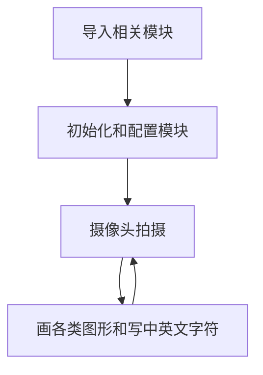
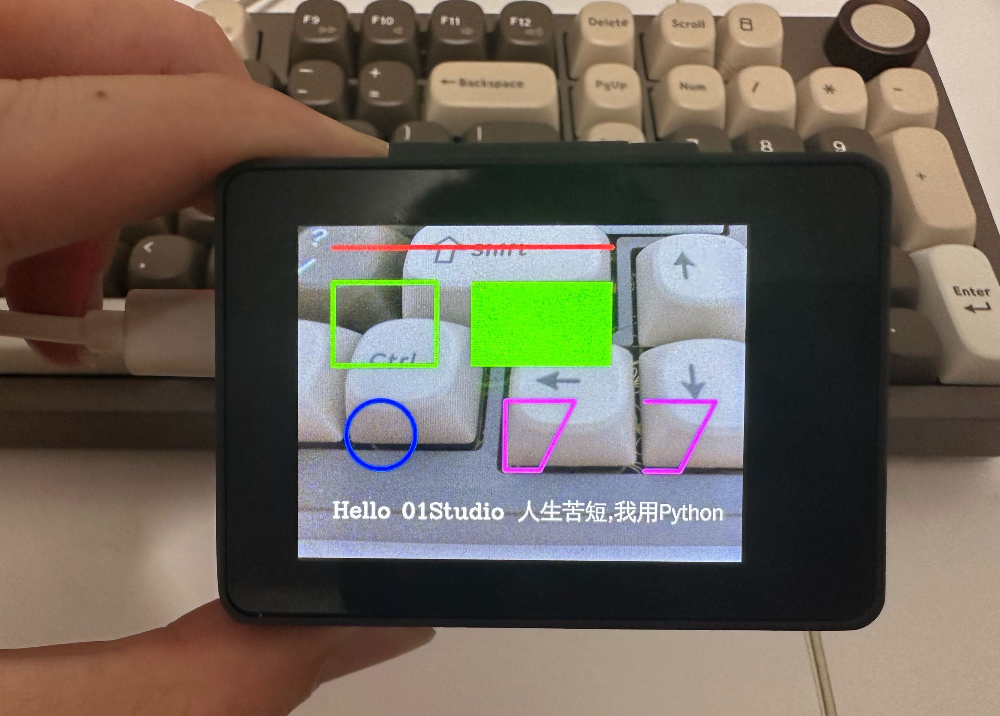
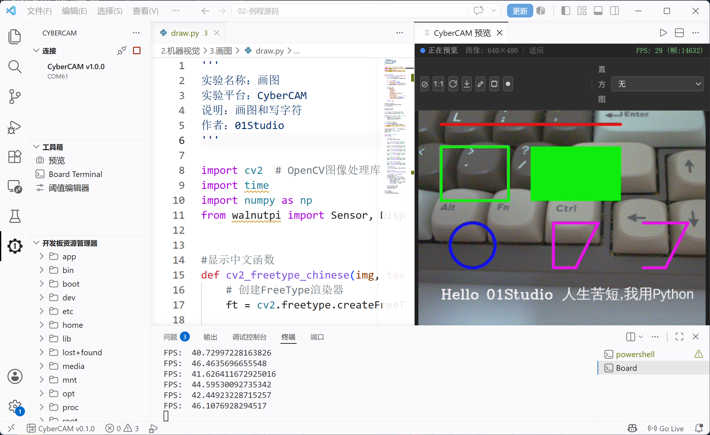

# 画图与字符

## 前言
通过摄像头采集到照片后，我们会进行一些处理，而这时候往往需要一些图形来指示，比如在图片某个位置标记箭头、人脸识别后用矩形框提示等。本节就是学习在图形上画图的使用功能。

## 实验目的
在摄像头拍摄的图像上画各种图形和写字符。

## 实验讲解

上一节我们学习了摄像头sensor模块应用，通过摄像头实时采集到的是图片image, 通过OpenCV画图函数即可实现各种图形绘制，具体如下：

## 画图函数

### 画线段

```python
img = cv2.line(img, pt1, pt2, color, thinkness)
```
画线段：
- `img` ：图像。
- `pt1` ：起点坐标。
- `pt2` ：终点坐标。
- `color` ：颜色（BGR顺序）。
- `thinkness` ：线段宽度（粗细）。

<br></br>

### 画矩形

```python
img = cv2.rectangle(img, pt1, pt2, color, thinkness)
```
画矩形：
- `img` ：图像。
- `pt1` ：左上角坐标。
- `pt2` ：右下角坐标。
- `color` ：颜色（BGR顺序）。
- `thinkness` ：线段宽度（粗细）。当值为`-1`时，表示填充。

<br></br>

### 画圆

```python
img = cv2.circle(img, center, radius, color, thinkness)
```
画圆形：
- `img` ：图像。
- `center` ：圆心坐标。
- `radius` ：半径。
- `color` ：颜色（BGR顺序）。
- `thinkness` ：线段宽度（粗细）。当值为`-1`时，表示填充。

<br></br>

### 画任意多边形

```python
img = cv2.polylines(img, pts, isClosed, color, thinkness)
```
画任意多边形：
- `img` ：图像。
- `pts` ：各个顶点坐标。Numpy数组。
- `isClosed` ：是否闭合。
    - `True` ：表示闭合多边形。
    - `False` ：表示不闭合多边形。
- `color` ：颜色（BGR顺序）。
- `thinkness` ：线段宽度（粗细）。

<br></br>

## 写字符函数

### 英文字符
```python
img = cv2.putText(img, text, org, fontFace, fontScale, color, thinkness, lineType, bottomLeftOrigin)
```
写英文字符：
- `img` ：图像。
- `text` ：要写的字符。
- `org` ：字符左下角坐标。
- `fontFace` ：字体样式，有以下字体类型。示例：cv2.FONT_HERSHEY_SIMPLEX
    - `FONT_HERSHEY_SIMPLEX` ：正常大小的无衬线字体。
    - `FONT_HERSHEY_PLAIN` ：小号无衬线字体。
    - `FONT_HERSHEY_DUPLEX` ：正常大小无衬线字体（比FONT_HERSHEY_SIMPLEX复杂）。
    - `FONT_HERSHEY_COMPLEX` ：正常大小的衬线字体。【推荐】
    - `FONT_HERSHEY_TRIPLEX` ：正常大小衬线字体（比FONT_HERSHEY_COMPLEX复杂）。
    - `FONT_HERSHEY_COMPLEX_SMALL` ：FONT_HERSHEY_COMPLEX字体简化版。
    - `FONT_HERSHEY_SCRIPT_SIMPLEX` ：手写风格字体。
    - `FONT_HERSHEY_SCRIPT_COMPLEX` ：手写风格字体（比FONT_HERSHEY_SCRIPT_SIMPLEX复杂）。
    - `FONT_ITALIC` ：斜体。
- `fontScale` ：字体大小。
- `color` ：颜色(BGR顺序)。
- `thickness` ：粗细。

<br></br>

### 中文字符

OpenCV不支持直接显示中文，可以通过FreeType模块实现。以下是封装好的一个带中文显示函数。

```python
#字符显示改进，支持中英文显示
ft = cv2.freetype.createFreeType2() #创建freetype渲染器
ft.loadFontData("/usr/share/fonts/truetype/wqy/wqy-zenhei.ttc", 0) #加载字体文件, 文泉驿正黑

def putText_Chinese(img, text, org, fontScale=30, color=(0, 255, 0)):
    
    global ft  # 使用全局的 FreeType 渲染器实例
    
    # 绘制中文
    ft.putText(
        img=img,
        text=text,
        org=org,
        fontHeight=fontScale,
        color=color,
        thickness=-1,        # 笔画粗细
        line_type=cv2.LINE_AA,  # 抗锯齿，文字更平滑
        bottomLeftOrigin=True  # False:坐标为左上角; True:与原生cv2.putText一致（左下角）
    )
    return img
```
写中文字符：
- `img` ：图像。
- `text` ：要写的字符。
- `org` ：字符左下角坐标。
- `fontScale` ：字体大小。
- `color` ：颜色(BGR顺序)。
- `font_path` ：字体路径。

<br></br>


熟悉了OpenCV的画图功能后，我们尝试在摄像头采集到的画面依次画出线段、矩形、圆形、多边形和中英文字符。具体编程思路如下：



## 参考代码

```python
'''
实验名称：画图
实验平台：CyberCAM
说明：画图和写字符
作者：01Studio
'''

import cv2, time 
import numpy as np
from walnutpi import Sensor, Display, IDE, direction # CyberCAM库：摄像头、显示屏、IDE预览

#字符显示改进，支持中英文显示
ft = cv2.freetype.createFreeType2() #创建freetype渲染器
ft.loadFontData("/usr/share/fonts/truetype/wqy/wqy-zenhei.ttc", 0) #加载字体文件, 文泉驿正黑

def putText_Chinese(img, text, org, fontScale=30, color=(0, 255, 0)):
    
    global ft  # 使用全局的 FreeType 渲染器实例
    
    # 绘制中文
    ft.putText(
        img=img,
        text=text,
        org=org,
        fontHeight=fontScale,
        color=color,
        thickness=-1,        # 笔画粗细
        line_type=cv2.LINE_AA,  # 抗锯齿，文字更平滑
        bottomLeftOrigin=True  # False:坐标为左上角; True:与原生cv2.putText一致（左下角）
    )
    return img

# 初始化显示屏
Display.init()

cap = Sensor.Sensor(640, 480) # 初始化摄像头，分辨率640x480
# 检查摄像头是否打开
if not cap.isOpened():
    print("Cannot open camera")
    exit()

#获取显示屏方向 
lcd_dir=direction.get_lcd() 
#print(lcd_dir)

# 判断显示屏是否翻转，如果翻转，则设置显示旋转180°，摄像头同时设置为前置模式（水平镜像）
if lcd_dir == 2: #翻转了
    Display.set_rotation(2)
    cap.set_hmirror(1)

# ========== FPS计算 ==========
frame_count = 0       # 帧数计数器
start_time = time.time()
fps = 0.0

# 持续采集和显示图像
while True:

    # 读取图像帧
    ret, img = cap.read()

    #画线段，从(50,30)到(450,30)，颜色红色，线宽5像素。
    img = cv2.line(img, (50,30), (450,30), (0,0,255), 5)

    #画矩形1，从(50,80)到(200,200),绿色，线宽5像素。
    img = cv2.rectangle(img, (50,80), (200,200), (0,255,0), 5)

    #画矩形2，从(250,80)到(450,200)，绿色，填充。
    img = cv2.rectangle(img, (250,80), (450,200), (0,255,0), -1)

    #画圆形，圆心(120,300)，半径50,蓝色，线宽3
    img = cv2.circle(img, (120, 300), 50, (255,0,0), 5)

    #画任意多边形1,封闭
    pts = np.array([[300,250],[400,250],[350,350],[300,350]],np.int32)
    img = cv2.polylines(img, [pts], True, (255,0,255), 5)

    #画任意多边形2,不封闭
    pts = np.array([[500,250],[600,250],[550,350],[500,350]],np.int32)
    img = cv2.polylines(img, [pts], False, (255,0,255), 5)

    # 写英文字符
    cv2.putText(img, 'Hello 01Studio', (50, 420), cv2.FONT_HERSHEY_COMPLEX, 1, (255, 255, 255), 2)
    
    # 写中文字符
    img = putText_Chinese(img, "人生苦短,我用Python", (320, 420), 32, (255, 255, 255))

    # 每满1秒计算一次平均FPS
    frame_count += 1    
    current_time = time.time()
    if current_time - start_time >= 1.0:
        fps = frame_count / (current_time - start_time)
        frame_count = 0              # 重置帧数计数器
        start_time = current_time    # 重置计时起点
        print("FPS: ", fps)
    
        #获取显示屏方向 
        lcd_dir=direction.get_lcd()

        if lcd_dir == 2: #屏幕翻转             
            Display.set_rotation(2) 
            cap.set_hmirror(1) #摄像头前置

        elif lcd_dir == 0: #屏幕无翻转            
            Display.set_rotation(0)
            cap.set_hmirror(0) #摄像头后置
    
    # 显示到屏幕和IDE
    Display.show(img)
    IDE.show(img)
```

## 实验结果

点击运行。可以看到在在LCD中画上了各种图形。



图像缓冲区也有相应的显示：



画图形是很基础的功能，在以后的实验中特别是指示识别内容时候会经常用到。