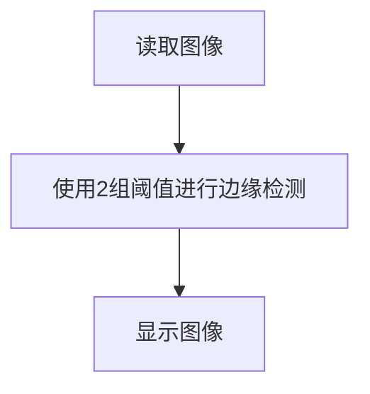
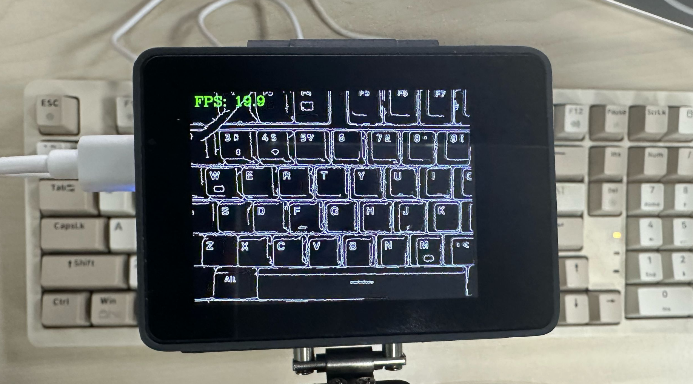

# 边缘检测

## 前言

本节学习使用OpenCV对图像进行边缘检测功能，使用Canny边缘检测算法，相对于前面轮廓检测，这里只需要简单几行代码便可实现。

## 实验目的

图像边缘检测并显示。

## 实验讲解

OpenCV Python库提供了Canny()函数实现边缘检测功能。

### Canny() 使用方法

```python
edges = cv2.Canny(image, threshold1, threshold2, apertureSize, L2gradient)
```

Canny边缘检测。返回edges为二值图像。
- `iamge` ：原始图像。
- `threshold1` ：计算使用的第1个阈值，通常是最小阈值。
- `threshold2` ：计算使用的第2个阈值，通常是最大阈值。

从上面可知道Canny方法使用非常简单，我们只需要根据需求设定好合适的阈值即可，我们可以使用2组阈值来对比实验。代码编写流程如下：



<br></br>

参考代码如下:

```python
'''
实验名称：边缘检测
实验平台：CyberCAM
说明：描绘摄像头采集图像的边缘
作者：01Studio
'''

import cv2  # OpenCV图像处理库
import time  
from walnutpi import Sensor, Display, IDE, direction

# 初始化显示屏
Display.init()

# 初始化摄像头，分辨率640x480
cap = Sensor.Sensor(640, 480)

# 检查摄像头是否打开
if not cap.isOpened():
    print("Cannot open camera")
    exit()

#获取当前显示屏方向，0表示默认，2表示180度翻转。
lcd_dir=direction.get_lcd() 
#print(lcd_dir) 

# 判断显示屏是否翻转，如果翻转，则设置显示旋转180°，摄像头同时设置为前置模式（水平镜像）
if lcd_dir == 2: #翻转了
    Display.set_rotation(2)
    cap.set_hmirror(1)

# ========== FPS计算 ==========
frame_count = 0       # 帧数计数器
start_time = time.time()
fps = 0.0

# 持续采集和显示图像
while True:

    # 读取图像帧
    ret, img = cap.read()

    # 进行边缘检测，阈值50和150
    img = cv2.Canny(img, 50, 150) 

    # 单通道灰度图转3通道BGR彩色图, 以便在显示屏和IDE上显示
    img = cv2.cvtColor(img, cv2.COLOR_GRAY2BGR)
        
    # 每满1秒计算一次平均FPS
    frame_count += 1    
    current_time = time.time()
    if current_time - start_time >= 1.0:
        fps = frame_count / (current_time - start_time)
        frame_count = 0              # 重置帧数计数器
        start_time = current_time    # 重置计时起点
        print("FPS: ", fps)

    # 添加文字标签和FPS显示
    cv2.putText(img, f'FPS: {fps:.1f}', (10, 30), cv2.FONT_HERSHEY_COMPLEX, 1, (0, 255, 0), 2)

    # 显示到屏幕和IDE
    Display.show(img)
    IDE.show(img)
```

## 实验结果

运行代码，可以看到识别效果如下：



**修改代码的2个阈值可获得不同的效果**

```python
    # 进行边缘检测，阈值50和150
    img = cv2.Canny(img, 50, 150)
```