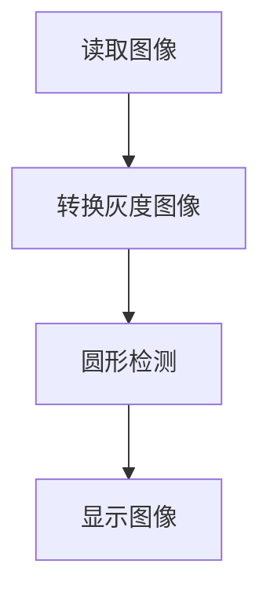
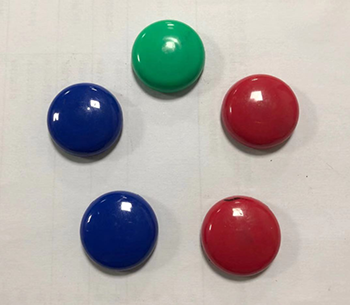
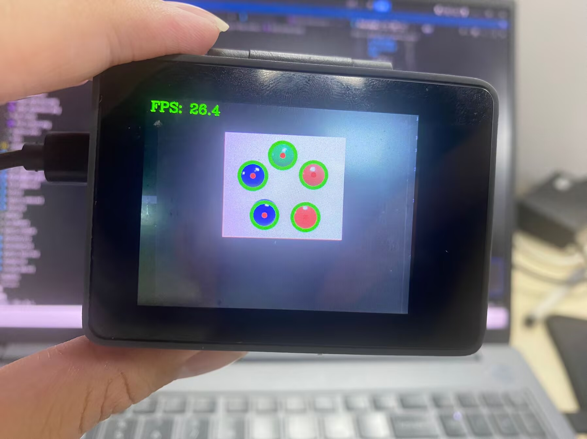

# 圆形检测

## 前言

本节学习使用OpenCV对图像中的圆形进行检测。

## 实验目的

通过OpenCV库检测图像中的圆形并画图显示。

## 实验讲解

OpenCV Python库提供了HoughCircles()函数用于检测图像中的圆形。

### HoughCircles() 使用方法
```python
circles = cv2.HoughCircles(image, method, dp, minDist, param1, param2, minRadius, maxRadius)
```
圆形检测。返回circles为多个圆形数组（圆心坐标 + 半径）。例：[[x0,y0,r0],[x1,y1,r1]]
- `image` ：原始图像。
- `method` ：检测方法，默认使用cv2.HOUGH_GRADIENT。
- `dp`：累加器分辨率设置，通常为1。
- `minDist`：圆心之间最小间距。
- `param1`：Canny边缘检测最大阈值（可选）。
- `param2`：值越大，检测到的圆越小，越精确（可选）。
- `minRadius`：检测圆的最小半径（可选）。
- `maxRadius`：检测圆的最大半径（可选）。

从HoughCircles函数可以知道整个流程不复杂先读取图像，然后进行圆形检测。代码编写流程如下：



## 参考代码

```python
'''
实验名称：圆形检测
实验平台：CyberCAM
说明：描绘摄像头采集图像中的圆形
作者：01Studio
'''
import cv2
import time
import numpy as np
from walnutpi import Sensor, Display, direction, IDE

# 初始化显示屏
Display.init()

# 初始化摄像头，分辨率640x480
cap = Sensor.Sensor(640, 480)

# 检查摄像头是否打开
if not cap.isOpened():
    print("Cannot open camera")
    exit()

#获取当前显示屏方向，0表示默认，2表示180度翻转。
lcd_dir=direction.get_lcd() 
#print(lcd_dir) 

# 判断显示屏是否翻转，如果翻转，则设置显示旋转180°，摄像头同时设置为前置模式（水平镜像）
if lcd_dir == 2: #翻转了
    Display.set_rotation(2)


# ========== FPS计算 ==========
frame_count = 0
start_time = time.time()
fps = 0.0

# ========== 全图模式或缩放模式 ==========
width  = 640
height = 480
scale_x = 0.0
scale_y = 0.0

mode = 0 # 0:原图不缩放 1:根据定义的变量width，height大小进行缩放

if mode == 0:
    #原图不缩放，正常比例
    scale_x = 1.0
    scale_y = 1.0

elif mode == 1:

    # 宽度减少一半
    width = 320
    # 高度减少一半
    height = 240

    # 计算反向映射比例（原图尺寸 / 缩放后尺寸）
    # 当小图分辨率为 320x240 时，比例为 2.0，用于将小图坐标等比放大还原回原图
    scale_x = 640 / width
    scale_y = 480 / height  

while True:
    ret, img = cap.read()

    if mode == 1:
        #调整图片的分辨率
        small = cv2.resize(img, (width, height),  interpolation=cv2.INTER_AREA)
    else:
        #保持原来的分辨率
        small = img
    # 转灰度
    gray = cv2.cvtColor(small, cv2.COLOR_BGR2GRAY)

    # 霍夫圆检测
    circles = cv2.HoughCircles(gray, cv2.HOUGH_GRADIENT, dp=1, minDist=20, param1=100, param2=40, minRadius=8, maxRadius=40)

    if circles is not None:
        # 保留数据结构：(1, N, 3)
        circles = np.uint32(np.around(circles))

        for c in circles[0]:
            x, y, r = c

            # 圆心坐标映射回原图
            draw_x = int(round(x * scale_x))
            draw_y = int(round(y * scale_y))

            # 只有等比例缩放时，圆仍然是圆
            scale_r = (scale_x + scale_y) / 2.0
            draw_r = int(round(r * scale_r))
            
            # 打印映射回原图坐标
            #print(f"原图圆心坐标: ({draw_x}, {draw_y}), 半径: {draw_r}")

            # 绘制圆心
            cv2.circle(img, (draw_x, draw_y), 3, (0, 0, 255), 5)

            # 绘制圆环
            cv2.circle(img, (draw_x, draw_y), draw_r, (0, 255, 0), 8)
    # 每满1秒计算一次平均FPS
    frame_count += 1    
    current_time = time.time()
    if current_time - start_time >= 1.0:
        fps = frame_count / (current_time - start_time)
        frame_count = 0              # 重置帧数计数器
        start_time = current_time    # 重置计时起点
        print("FPS: ", fps)

    # 添加文字标签和FPS显示
    cv2.putText(img, f'FPS: {fps:.1f}', (10, 30), cv2.FONT_HERSHEY_COMPLEX, 1, (0, 255, 0), 2)

    # 显示到屏幕
    Display.show(img)

    # 显示到IDE
    IDE.show(img)
```
本例默认采用`mode=0`，程序直接使用摄像头采集的 `640×480` 图像进行检测。该模式能够保留更多图像细节，适合检测尺寸较小或边缘不明显的圆形，但 CPU 计算量较大。如果需要提升速度把设置为`mode=1`，并适当降低 `width` 和`height`,缩放尺寸应保持与原图相同的宽高比例，避免圆形因非等比例缩放而变成椭圆。

## 实验结果

运行代码，可以看到识别效果如下：

**原图：**



**实验结果：**


## 圆形参数调整建议

先确定目标圆的大致半径范围，再调节检测灵敏度：

1. 设置合适的 `minRadius` 和 `maxRadius`，排除尺寸不符合要求的圆。
2. 出现较多误检时，逐步增大 `param2`，使圆形判定更加严格。
3. 出现漏检时，逐步减小 `param2`，提高检测灵敏度。
4. 同一个圆附近出现多个重复检测结果时，适当增大 `minDist`。
5. 每次只调整一个参数，便于观察该参数对检测结果的影响。


> 注意：`minRadius`、`maxRadius` 和 `minDist` 的单位都是当前处理图像中的像素。如果图像经过缩放，这些参数也应根据缩放比例进行换算。