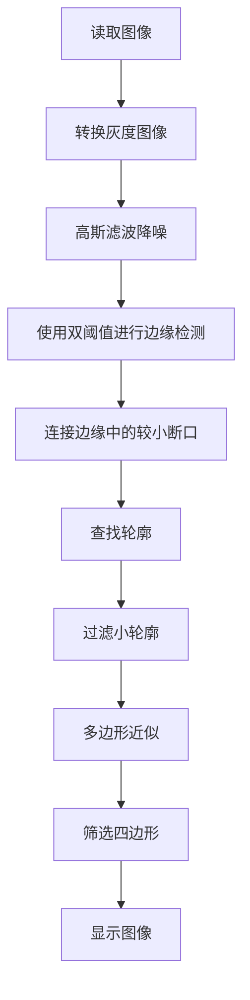
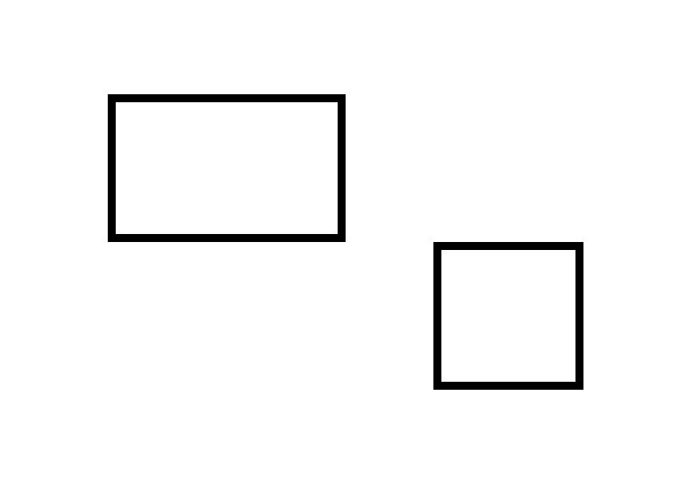
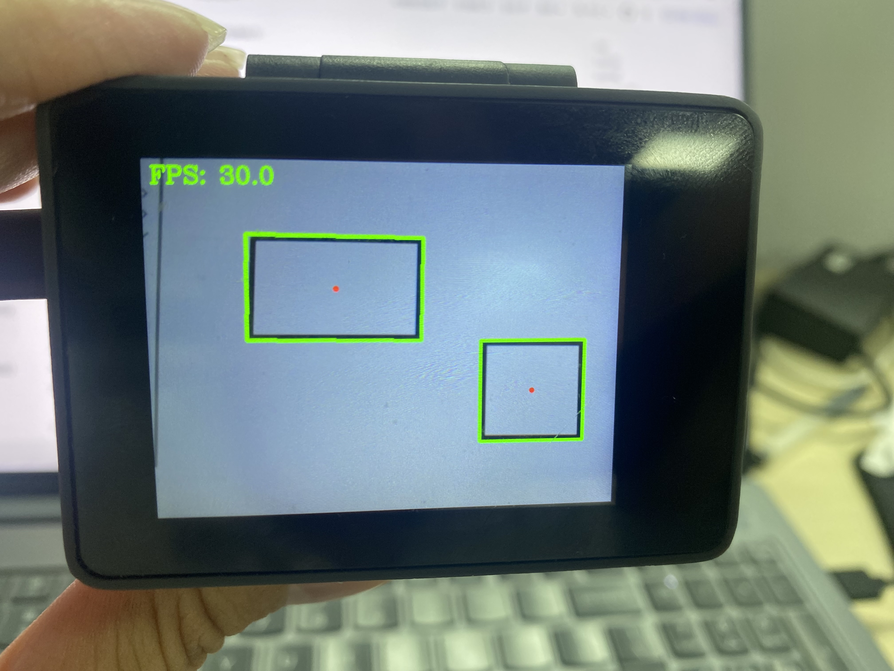

# 矩形检测

## 前言

本节学习使用OpenCV对图像中的矩形进行检测识别。

## 实验目的

检测图像中的矩形并画图显示。

## 实验讲解

OpenCV Python 库提供了边缘检测、轮廓查找和多边形近似等函数，将这些函数组合使用，可以检测图像中轮廓较为明显的矩形或四边形目标。
之前我们已经学习过边缘检测了，这里就不重复之前边缘检测的函数的Canny()跟图像转换cvtColor()使用方法了。

### GaussianBlur() 使用方法
```python
gray = cv2.GaussianBlur(src, ksize, sigmaX, sigmaY=0, borderType=cv2.BORDER_DEFAULT)
```
GaussianBlur用于对图像进行高斯滤波，返回gray为经过高斯滤波处理后的结果图像。
- `src` ：输入图像，可以是单通道灰度图像，也可以是多通道彩色图像。
- `ksize` ：滤波核的大小，说的是滤波处理过程中其邻域图像的高度和宽度,格式为 `(width, height)`。宽度和高度通常设置为正奇数，例如 `(3, 3)`、`(5, 5)`。
- `sigmaX` ：卷积核在水平方向上的标准,用于控制水平方向上的平滑程度。
- `sigmaY` ：卷积核在垂直方向上的标准差如果将该值设置为0，则只采用sigmaX的值；如果两者都为0，则通过ksize的值计算得到。
- `borderType` ： 图像边界的扩展方式，通常直接使用默认值 `cv2.BORDER_DEFAULT`。

### getStructuringElement() 使用方法
```python
kernel = cv2.getStructuringElement(shape, ksize, anchor)
```
getStructuringElement创建形态学处理所需要的结构元素，返回的kernel为生成的结构元素。
- `shape` ：结构元素的形状，常用取值如下：
    - `cv2.MORPH_RECT` : 矩形结构元素；
    - `cv2.MORPH_ELLIPSE` : 椭圆形结构元素；
    - `cv2.MORPH_CROSS` : 十字形结构元素。
- `ksize` ：结构元素大小，格式为 `(width, height)`，例如 `(3, 3)`。
- `anchor` ：结构元素的锚点位置。省略时，默认使用结构元素中心点。

### morphologyEx() 使用方法
```python
edges = cv2.morphologyEx(src, op, kernel, iterations=1)
```
morphologyEx对图像执行形态学处理, 返回的dst处理后的图像
- `src` ：输入图像，通常为灰度图像或二值图像。
- `op` ：形态学操作类型，常用取值如下：
    - `cv2.MORPH_OPEN` : 开运算，先腐蚀再膨胀，常用于去除小噪点。
    - `cv2.MORPH_CLOSE` : 闭运算，先膨胀再腐蚀，常用于连接小断口和填补小孔。
    - `cv2.MORPH_GRADIENT` : 形态学梯度，用于提取目标边缘。
    - `cv2.MORPH_TOPHAT` : 顶帽运算。
    - `cv2.MORPH_BLACKHAT` : 黑帽运算。
- `kernel` ：形态学处理使用的结构元素。
- `iterations` ：返回处理后的图像。

### findContours() 使用方法
```python
contours, _ = cv2.findContours(image, mode, method)
```
findContours查找轮廓.第一个返回值为检测到的轮廓列表，第二个返回值为轮廓层级信息
- `image` ：输入的二值图像(通常为经过边缘检测后的图像)。
- `mode` ：轮廓检索模式。用于定义轮廓之间的层级包络关系。(例如：cv2.RETR_EXTERNAL: 只检测最外层轮廓。cv2.RETR_LIST: 检测所有轮廓，但不建立层次关系。cv2.RETR_TREE: 检测所有轮廓，并建立完整的层次结构。)
- `method` ：轮廓近似方法。用于定义如何表达轮廓的几何特征，常用的有:cv2.CHAIN_APPROX_NONE: 存储所有的轮廓点;cv2.CHAIN_APPROX_SIMPLE: 压缩水平、垂直和对角线段，只保留端点。

### contourArea() 使用方法
```python
contour_area  = cv2.contourArea(contour)
```
contourArea用于计算轮廓内部区域的面积，返回值contour_area 为当前处理图像中的像素面积。
- `contour` ：输入的单个轮廓，（通常为 `cv2.findContours` 检测出的单个轮廓点集）。

### arcLength() 使用方法
```python
perimeter = cv2.arcLength(curve,closed)
```
arcLength计算轮廓或曲线的周长，返回值perimeter为轮廓周长。
- `curve`：输入的轮廓或曲线坐标点。
- `closed`：表示曲线是否闭合。
  - `True`：按照闭合轮廓计算周长；
  - `False`：按照开放曲线计算长度。

### approxPolyDP() 使用方法
```python
approx = cv2.approxPolyDP(curve, epsilon, closed)
```
approxPolyDP将轮廓近似为顶点较少的多边形，返回值approx为近似后的多边形顶点集合
- `curve` ：输入的原始轮廓（通常为 `cv2.findContours` 检测出的单个轮廓点集）。
- `epsilon` ：允许的最大近似误差。值越大拟合出的多边形顶点越少、越简练；值越小越逼近原轮廓。通常设置为轮廓周长的百分比（例如：`0.02 * cv2.arcLength(curve, True)`）。
- `closed` ：轮廓近似方法。用于定义如何表达轮廓的几何特征。
    - `True` : 表示曲线是闭合的（如圆、矩形等封闭图形），算法会确保首尾两个顶点相互连接。
    - `False` :  表示曲线是敞开的（如一条折线、单条电线轮廓）。

### isContourConvex ()使用方法
```python
result = cv2.isContourConvex(contour)
```
isContourConvex判断一个轮廓是否为凸轮廓,返回的result是布尔值，真轮廓为凸多边形，假轮廓为凹多边形。
- `contour`：输入的轮廓或多边形顶点集合。

OpenCV 调用的函数是比较多看似复杂，但形状识别的核心逻辑非常清晰：就是利用边缘检测提取结构线条，通过轮廓查找锁定目标边界，借助多边形近似完成形状判定。代码编写流程如下：



## 参考代码

```python
'''
实验名称：矩形检测
实验平台：CyberCAM
说明：描绘摄像头采集图像中的矩形
作者：01Studio
'''
import cv2
import time
import numpy as np
from walnutpi import Sensor, Display, direction, IDE

# 初始化显示屏
Display.init()

# 初始化摄像头，分辨率640x480
cap = Sensor.Sensor(640, 480)

# 检查摄像头是否打开
if not cap.isOpened():
    print("Cannot open camera")
    exit()

#获取当前显示屏方向，0表示默认，2表示180度翻转。
lcd_dir=direction.get_lcd() 
#print(lcd_dir) 

# 判断显示屏是否翻转，如果翻转，则设置显示旋转180°，摄像头同时设置为前置模式（水平镜像）
if lcd_dir == 2: #翻转了
    Display.set_rotation(2)


# ========== FPS计算 ==========
frame_count = 0
start_time = time.time()
fps = 0.0

# ========== 全图模式或缩放模式 ==========
width  = 640
height = 480
scale_x = 0.0
scale_y = 0.0

mode = 0 # 0:原图不缩放 1:根据定义的变量width，height大小进行缩放

if mode == 0:
    #原图不缩放，正常比例
    scale_x = 1.0
    scale_y = 1.0

elif mode == 1:

    # 宽度减少一半
    width = 320
    # 高度减少一半
    height = 240

    # 计算反向映射比例（原图尺寸 / 缩放后尺寸）
    # 当小图分辨率为 320x240 时，比例为 2.0，用于将小图坐标等比放大还原回原图
    scale_x = 640 / width
    scale_y = 480 / height  

while True:
    ret, img = cap.read()

    if mode == 1:
        #调整图片的分辨率
        small = cv2.resize(img, (width, height),  interpolation=cv2.INTER_AREA)
    else:
        small = img

    # 转灰度
    gray = cv2.cvtColor(small, cv2.COLOR_BGR2GRAY)

    #高斯滤波
    gray = cv2.GaussianBlur(gray, (3, 3), 0.8)

    #边缘检测
    edges = cv2.Canny(gray, 50, 150)

    #创建矩形卷积核
    kernel = cv2.getStructuringElement(cv2.MORPH_RECT, (3, 3))

    #闭运算只连接小断口
    edges = cv2.morphologyEx(edges, cv2.MORPH_CLOSE, kernel, iterations=1)

    #查找连续轮廓
    contours, _ = cv2.findContours(edges, cv2.RETR_EXTERNAL, cv2.CHAIN_APPROX_SIMPLE)

    #处理轮廓
    for contour in contours:
        
        #计算轮廓内部区域的面积
        contour_area = cv2.contourArea(contour)

        #过滤面积小于 `100` 像素的轮廓
        if contour_area < 100:
            continue

        
        # 先计算旋转外接矩形
        rect = cv2.minAreaRect(contour)
        center, size, angle = rect

        rect_width, rect_height = size

        if rect_width < 15 or rect_height <  15:
            continue

        rect_area = rect_width * rect_height

        if rect_area <= 0:
            continue

        # 矩形度：轮廓面积占旋转外接框面积的比例
        fill_ratio = contour_area / rect_area

        if fill_ratio < 0.75:
            continue

        perimeter = cv2.arcLength(contour, True)

        if perimeter <= 0:
            continue

        approx = cv2.approxPolyDP(
            contour,
            0.02 * perimeter,
            True
        )

        if len(approx) != 4:
            continue

        if not cv2.isContourConvex(approx):
            continue

        # 获取旋转外接矩形的4个顶点
        box = cv2.boxPoints(rect)

        # 坐标映射回原图
        box[:, 0] *= scale_x
        box[:, 1] *= scale_y

        box = np.round(box).astype(np.int32)

        #画图把4个顶点接着
        cv2.polylines(img, [box], True, (0, 255, 0), 3)

        center_x = int(round(center[0] * scale_x))
        center_y = int(round(center[1] * scale_y))

        cv2.circle(img, (center_x, center_y), 4, (0, 0, 255), -1)

        # 4个顶点坐标
        # pt1, pt2, pt3, pt4 = box

        # # 计算两条邻边的长度
        # side1 = np.linalg.norm(pt1 - pt2)
        # side2 = np.linalg.norm(pt2 - pt3)

        # # 较长的边为长（width/length），较短的为宽（height）
        # length = max(side1, side2)
        # width = min(side1, side2)

        # print(f"矩形的长: {length:.2f}")
        # print(f"矩形的宽: {width:.2f}")


    # 每满1秒计算一次平均FPS
    frame_count += 1    
    current_time = time.time()
    if current_time - start_time >= 1.0:
        fps = frame_count / (current_time - start_time)
        frame_count = 0              # 重置帧数计数器
        start_time = current_time    # 重置计时起点
        print("FPS: ", fps)

    # 添加文字标签和FPS显示
    cv2.putText(img, f'FPS: {fps:.1f}', (10, 30), cv2.FONT_HERSHEY_COMPLEX, 1, (0, 255, 0), 2)

    # 显示到屏幕
    Display.show(img)

    # 显示到IDE
    IDE.show(img)
```
本例默认采用`mode=0`，程序直接使用摄像头采集的 `640×480` 图像进行检测。该模式能够保留更多图像细节，适合检测尺寸较小或边缘不明显的圆形，但 CPU 计算量较大。如果需要提升速度把设置为`mode=1`，并适当降低 `width` 和`height`
缩放尺寸应保持与原图相同的宽高比例。

## 实验结果

运行代码，可以看到识别效果如下：

**原图：**



**实验结果：**


## 矩形参数调整建议

矩形检测参数较多，建议按照以下顺序进行调整：

1. 矩形完全检测不到时，先确认 Canny 边缘图中是否能够看到完整的矩形边缘。如果边缘较弱，可以适当降低 Canny 阈值。
2. 矩形边缘出现断裂时，可以适当增加闭运算次数，使断开的边缘连接起来。
3. 小矩形检测不到时，可以适当减小最小轮廓面积和最小宽高限制。
4. 大矩形内部的小矩形检测不到时，应将轮廓检索模式设置为 `cv2.RETR_TREE`。
5. 出现较多不规则四边形误检时，可以提高矩形度要求，或者收紧几何判断条件。

建议每次只调整一个参数，便于观察该参数对检测结果的影响。

