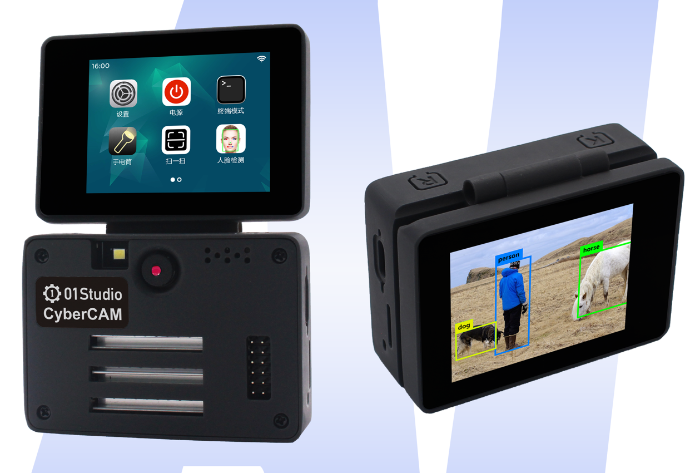
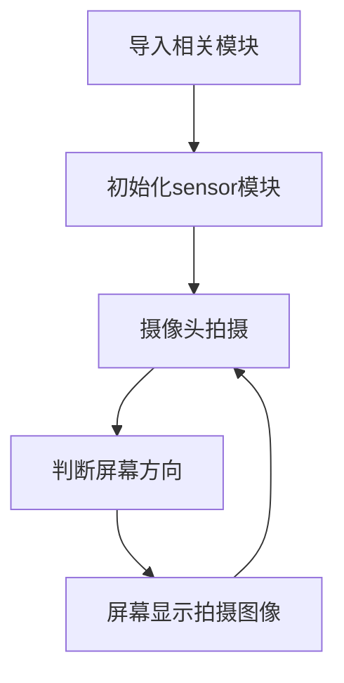
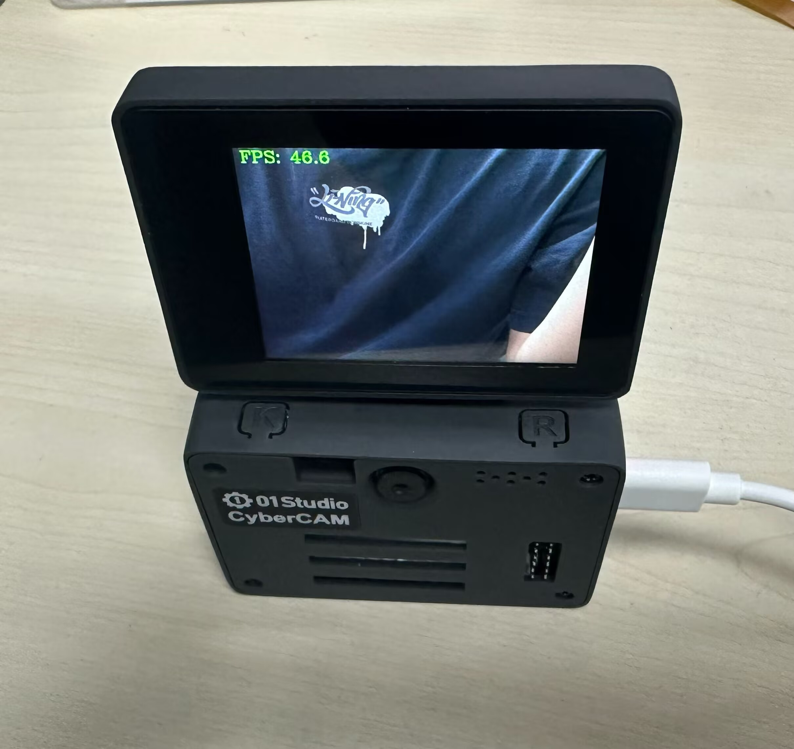

# 显示屏

## 前言

在摄像头拍摄图像后我们需要观察图像，这就涉及如何显示的问题，目前CyberCAM支持2种显示方式。分别是：IDE缓冲区显示和2.4寸翻转显示屏。



## 实验目的

编程实现摄像头图像采集通过显示屏显示。

## 实验讲解

01Studio CyberCAM K230开发板目前有2种图像显示方式，各有特点：

- `IDE缓冲区显示`：性价比最高，图像质量有一定下降，但能满足大部分场合调试使用。最大支持1920x1080分辨率。
- `MIPI显示屏`：2.4寸(640x480) 翻转屏，内置重力感应传感器，可以一体化组装，适合离线部署和调试使用。

IDE显示我们上一节已经讲解过，这节来介绍显示屏显示。

## Display对象

### 构造函数
```python
from walnutpi import Display
```
导入Display模块，即可使用Display相关API接口。

### 使用方法

```python
Display.init()
```
初始化Display模块。

<br></br>

```python
Display.set_rotation(value)
```
设置显示方向。
- 0：默认方向  
- 1：0基础上顺时针旋转90° 
- 2：0基础上顺时针旋转180°  (翻转用)
- 3：0基础上顺时针旋转270° 

<br></br>

```python
Display.show(img)
```
显示图像。

- `img`: 显示的图像，可以通过创建图像或者摄像头采集。


## direction对象（屏幕方向）

CyberCAM配套的显示屏内置重力感应传感器，可以通过设置方向实现屏幕显示旋转。

### 构造函数
```python
from walnutpi import direction
```
导入direction模块，即可使用direction相关API接口。

### 使用方法

```python
direction.get_lcd()
```
返回屏幕方向。

- 0：默认方向  
- 1：0基础上顺时针旋转90° 
- 2：0基础上顺时针旋转180° （翻转用）
- 3：0基础上顺时针旋转270° 


我们来看看代码的编写流程图：




## 参考代码
```python
'''
实验名称：2.4寸显示屏使用
实验平台：CyberCAM
说明：实现摄像头图像采集并在显示屏显示
作者：01Studio
'''

import cv2  # OpenCV图像处理库
import time  # 时间延时
from walnutpi import Sensor, Display, IDE, direction # CyberCAM库：摄像头、显示屏、IDE预览

# 初始化显示屏
Display.init()

# 初始化摄像头，分辨率640x480
cap = Sensor.Sensor(640, 480)

#获取当前显示屏方向，0表示默认，2表示180度翻转。
lcd_dir=direction.get_lcd() 
#print(lcd_dir) 

# 判断显示屏是否翻转，如果翻转，则设置显示旋转180°，摄像头同时设置为前置模式（水平镜像）
if lcd_dir == 2: #翻转了
    Display.set_rotation(2)
    cap.set_hmirror(1)

# 检查摄像头是否打开
if not cap.isOpened():
    print("Cannot open camera")
    exit()

# ========== FPS计算 ==========
frame_count = 0       # 帧数计数器
start_time = time.time()
fps = 0.0

# 持续采集和显示图像
while True:

    # 读取图像帧
    ret, img = cap.read()
    
    # 每满1秒计算一次平均FPS
    frame_count += 1    
    current_time = time.time()
    if current_time - start_time >= 1.0:
        fps = frame_count / (current_time - start_time)
        frame_count = 0              # 重置帧数计数器
        start_time = current_time    # 重置计时起点
        print("FPS: ", fps)

        #获取显示屏方向 
        lcd_dir=direction.get_lcd()

        if lcd_dir == 2: #屏幕翻转             
            Display.set_rotation(2) 
            cap.set_hmirror(1) #摄像头前置

        elif lcd_dir == 0: #屏幕无翻转
            Display.set_rotation(0)
            cap.set_hmirror(0) #摄像头后置

    # 添加文字标签和FPS显示
    cv2.putText(img, f'FPS: {fps:.1f}', (10, 30), cv2.FONT_HERSHEY_COMPLEX, 1, (0, 255, 0), 2)

    # 显示到屏幕和IDE
    Display.show(img)
    IDE.show(img)

# 释放资源
cap.release()
```

## 实验结果

运行代码，可以看到显示屏上显示摄像头采集图像


代码在计算FPS中实现了屏幕方向检测，我们翻转屏幕，可以看到图像显示自动跟着旋转。



