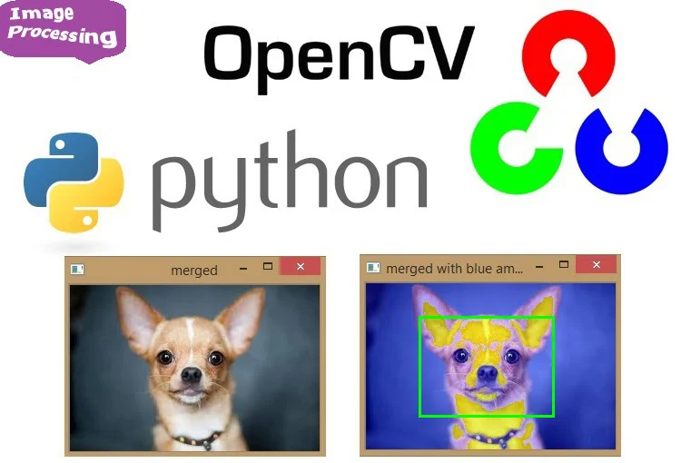
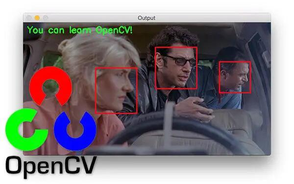
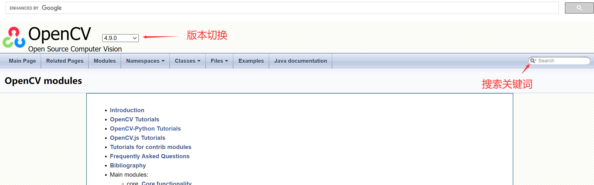

# OpenCV简介

:::tip 提示
**CyberCAM可使用满血版OpenCV和K230 KPU Python库组合编程，充分发挥芯片性能，快速落地AI视觉项目。**
:::

OpenCV是一个基于Apache2.0许可（开源）发行的跨平台计算机视觉和机器学习软件库，可以运行在Linux、Windows、Android和Mac OS操作系统上。 它轻量级而且高效——由一系列 C 函数和少量 C++ 类构成，同时提供了Python、Ruby、MATLAB等语言的接口，实现了图像处理和计算机视觉方面的很多通用算法。

## 官方网站

https://www.opencv.org/

## OpenCV Python库文档

https://docs.opencv.org/4.9.0/

可通过右边搜索功能搜索各类库说明。

