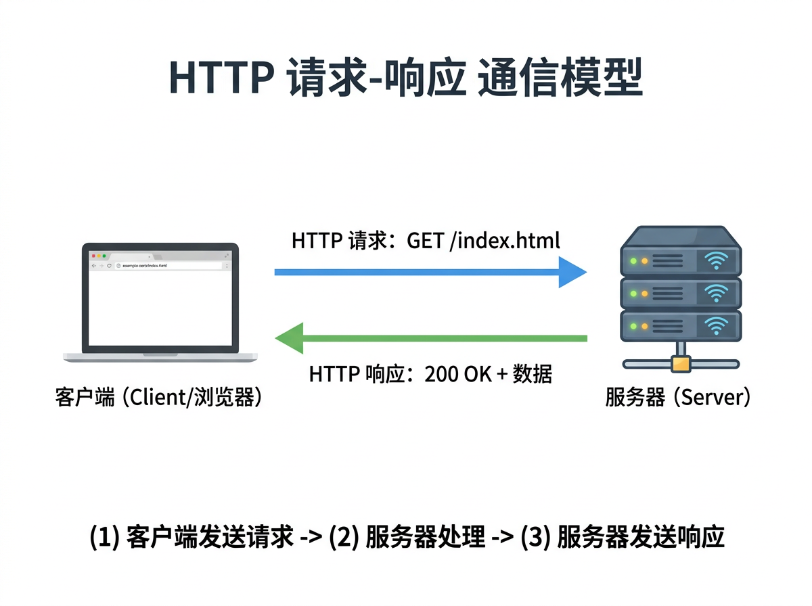
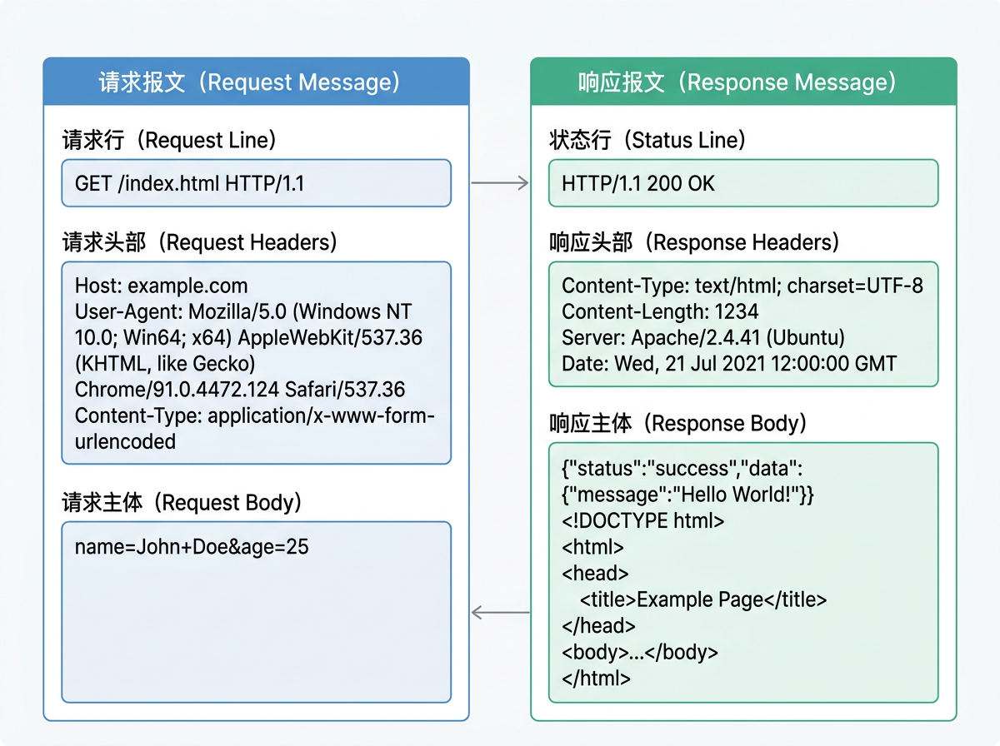
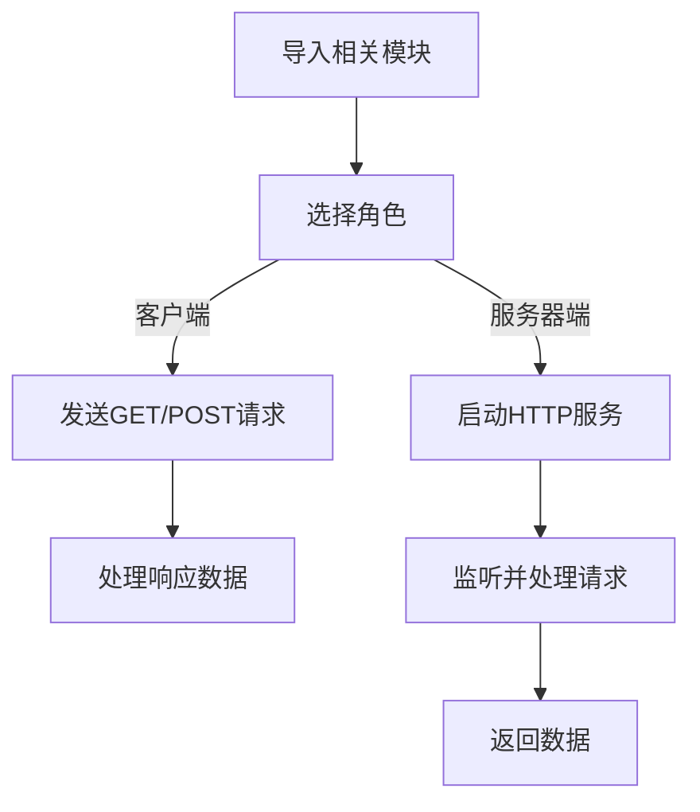
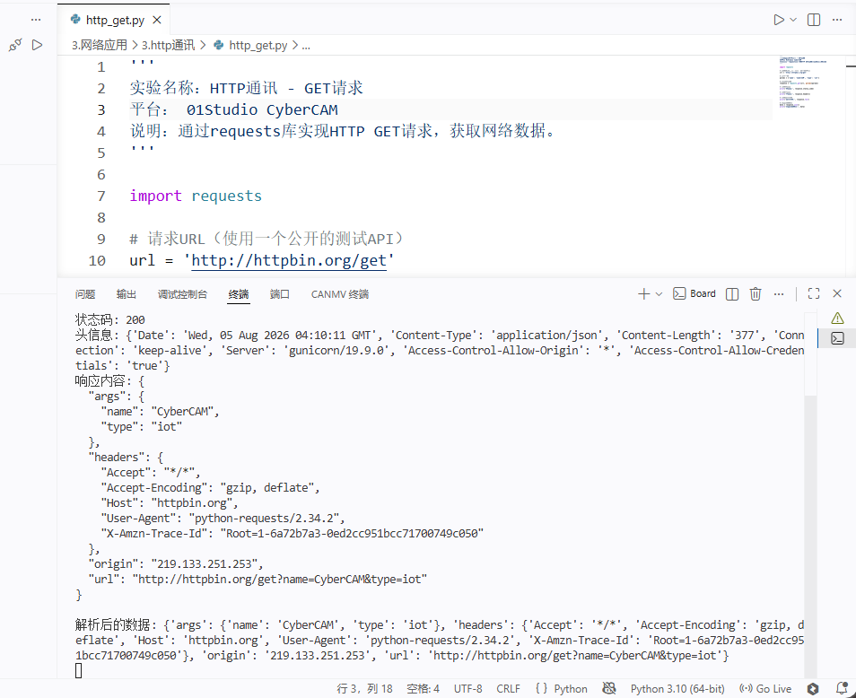
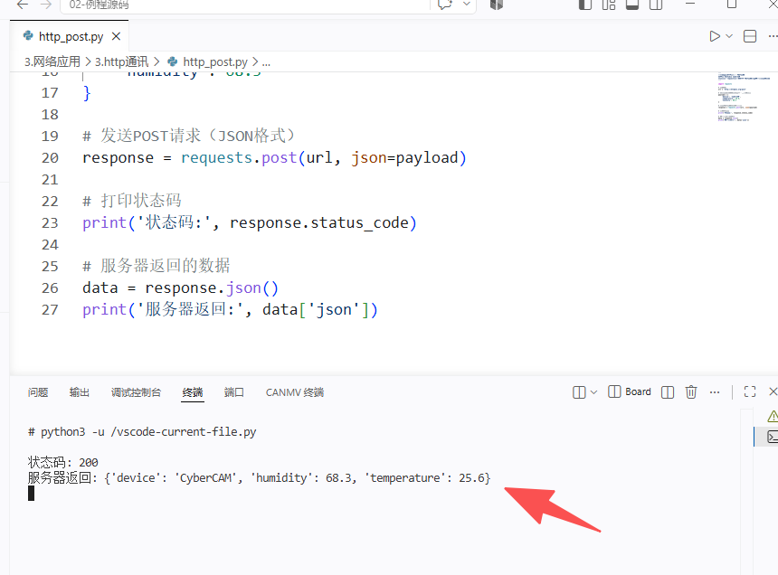
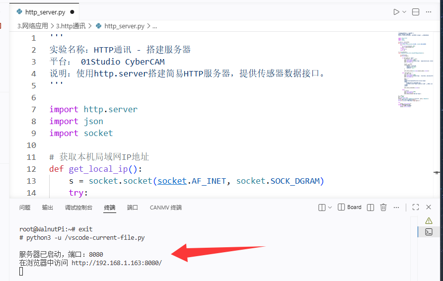
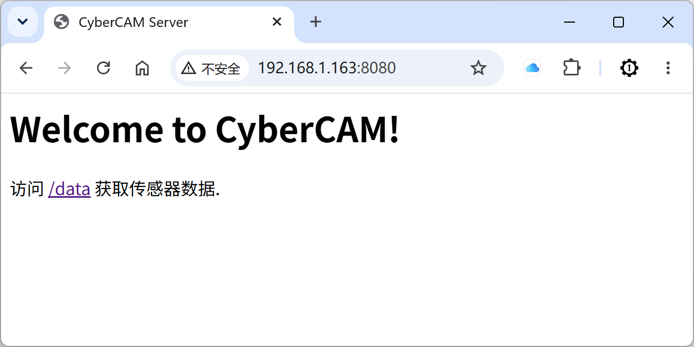
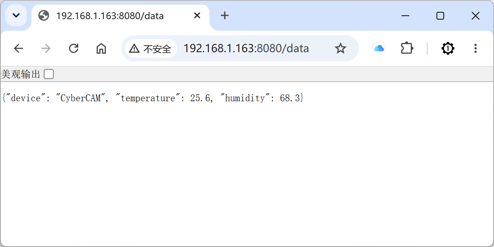

# HTTP通讯

## 前言
前两节我们学习了底层的Socket通信和面向物联网的MQTT协议。而在日常的互联网应用中，最广泛使用的协议莫过于HTTP（超文本传输协议）。无论是浏览网页、调用RESTful API、还是实现Web服务，HTTP都是核心基础。CyberCAM运行着Linux系统，不仅可以作为HTTP客户端请求网络资源，还能搭建轻量级的HTTP服务器，为其他设备提供数据接口。

这一节我们就来学习如何使用Python在CyberCAM上实现HTTP通讯。

## 实验目的
通过Python编程实现CyberCAM的HTTP客户端请求（GET/POST），以及搭建简单的HTTP服务器。

## 实验讲解
HTTP（HyperText Transfer Protocol）是应用层协议，通常基于TCP协议实现，默认使用80端口（HTTPS使用443端口）。它采用经典的**请求-响应**模型：客户端发起请求，服务器处理后返回响应数据，连接即完成一次交互。

与前面学习的Socket和MQTT不同，HTTP的特点如下：
- **短连接**：一次请求-响应后连接即关闭（HTTP/1.0），或保持短暂复用（HTTP/1.1 keep-alive）；
- **无状态**：服务器不保留客户端的状态信息，每次请求相互独立；
- **文本协议**：请求和响应都是可读的文本格式，易于调试；
- **RESTful风格**：通过GET/POST/PUT/DELETE等方法对资源进行操作。



从上图可以看到，HTTP通信模型非常简单：客户端发送请求报文，服务器解析并返回响应报文。一次完整的HTTP请求包含以下部分：

**请求报文结构：**
- 请求行：方法（GET/POST等）+ URL + HTTP版本
- 请求头：Host、User-Agent、Content-Type等
- 请求体：POST等方法的携带数据

**响应报文结构：**
- 状态行：HTTP版本 + 状态码（200/404/500等）+ 状态描述
- 响应头：Content-Type、Content-Length等
- 响应体：返回的实际数据（HTML、JSON、图片等）



对于CyberCAM而言，使用Python进行HTTP编程非常便捷。`requests`库是目前最流行的HTTP客户端库，语法简洁、功能强大。而Python自带的`http.server`模块可以快速搭建简易的HTTP服务器。

系统预装了`requests`库，如果没有，请在终端运行以下指令：

```bash
sudo pip3 install requests
```

## requests对象

### 构造函数
```python
import requests
```
导入requests库后即可直接使用其方法，无需显式构造对象。

### GET请求
```python
response = requests.get(url, params=None)
```
发送GET请求。从服务器获取资源，用于请求数据而不对数据进行更改。例如，从服务器获取网页、图片等。
- `url` : 请求地址；
- `params` : 可选，URL参数字典。例：`{'key':'value'}`

返回`Response`对象。

<br></br>

### POST请求
```python
response = requests.post(url, data=None, json=None)
```
发送POST请求。向服务器发送数据以创建新资源，常用于提交表单数据或上传文件，发送的数据包含在请求体中。
- `url` : 请求地址；
- `data` : 可选，表单数据字典；
- `json` : 可选，JSON数据字典。

返回`Response`对象。

<br></br>

### Response对象常用属性与方法
```python
response.status_code  # 状态码，200表示成功
response.text         # 响应内容（字符串形式）
response.json()       # 将响应内容解析为JSON
response.content      # 响应内容（字节形式）
response.headers      # 响应头字典
```

<br></br>

### 更多HTTP方法
```python
response = requests.put(url, data=None)
response = requests.delete(url)
```
发送PUT和DELETE请求，用法与POST类似。

<br></br>

更多用法请阅读requests官方文档：
https://docs.python-requests.org/zh_CN/latest/

## HTTP服务器

Python内置的`http.server`模块可以快速搭建一个简易的HTTP服务器（网站），方便在CyberCAM上提供数据接口服务。基本用法如下：

```python
import http.server
import socketserver

# 自定义请求处理器
class MyHandler(http.server.BaseHTTPRequestHandler):
    def do_GET(self):
        # 处理GET请求
        pass
    
    def do_POST(self):
        # 处理POST请求
        pass
```

本实验中CyberCAM既可以作为HTTP客户端请求远程API，也可以作为HTTP服务器向局域网内其他设备提供数据。代码编写流程如下：



## 参考代码

### HTTP客户端 - GET请求

```python
'''
实验名称：HTTP通讯 - GET请求
平台： 01Studio CyberCAM
说明：通过requests库实现HTTP GET请求，获取网络数据。
'''

import requests

# 请求URL（使用一个公开的测试API）
url = 'http://httpbin.org/get'

# 携带参数
params = {'name': 'CyberCAM', 'type': 'iot'}

# 发送GET请求
response = requests.get(url, params=params)

# 打印状态码
print('状态码:', response.status_code)

# 打印头信息
print('头信息:', response.headers)

# 打印响应内容
print('响应内容:', response.text)

# 解析JSON数据
data = response.json()
print('解析后的数据:', data)
```

### HTTP客户端 - POST请求

```python
'''
实验名称：HTTP通讯 - POST请求
平台： 01Studio CyberCAM
说明：通过requests库实现HTTP POST请求，向服务器发送数据。
'''

import requests

# 请求URL
url = 'http://httpbin.org/post'

# 要发送的JSON数据（模拟传感器数据）
payload = {
    'device': 'CyberCAM',
    'temperature': 25.6,
    'humidity': 68.3
}

# 发送POST请求（JSON格式）
response = requests.post(url, json=payload)

# 打印状态码
print('状态码:', response.status_code)

# 服务器返回的数据
data = response.json()
print('服务器返回:', data['json'])
```

### HTTP服务器

```python
'''
实验名称：HTTP通讯 - 搭建服务器
平台： 01Studio CyberCAM
说明：使用http.server搭建简易HTTP服务器，提供传感器数据接口。
'''

import http.server
import json
import socket

# 获取本机局域网IP地址
def get_local_ip():
    s = socket.socket(socket.AF_INET, socket.SOCK_DGRAM)
    try:
        s.connect(('8.8.8.8', 80))
        ip = s.getsockname()[0]
    finally:
        s.close()
    return ip

# 自定义请求处理器
class MyHandler(http.server.BaseHTTPRequestHandler):

    # 处理GET请求
    def do_GET(self):
        
        if self.path == '/data':
            # 返回JSON格式的传感器数据
            self.send_response(200)
            self.send_header('Content-Type', 'application/json; charset=utf-8')
            self.end_headers()
            
            # 模拟传感器数据
            sensor_data = {
                'device': 'CyberCAM',
                'temperature': 25.6,
                'humidity': 68.3
            }
            
            self.wfile.write(json.dumps(sensor_data).encode())
            
        elif self.path == '/':
            # 返回欢迎页面
            self.send_response(200)
            self.send_header('Content-Type', 'text/html; charset=utf-8')
            self.end_headers()
            
            html = '''
            <html>
            <head><title>CyberCAM Server</title></head>
            <body>
                <h1>Welcome to CyberCAM!</h1>
                <p>访问 <a href="/data">/data</a> 获取传感器数据.</p>
            </body>
            </html>
            '''
            self.wfile.write(html.encode())
            
        else:
            # 404处理
            self.send_response(404)
            self.end_headers()
            self.wfile.write(b'404 Not Found')

# 启动服务器
port = 8080
ip = get_local_ip()
server = http.server.HTTPServer(('0.0.0.0', port), MyHandler)
print(f'服务器已启动，端口：{port}')
print(f'在浏览器中访问 http://{ip}:{port}/')

try:
    server.serve_forever()
except KeyboardInterrupt:
    print('\n服务器已关闭')
    server.server_close()
```

## 实验结果

### GET请求测试

确保CyberCAM连接到互联网，运行GET请求代码：



可以看到终端打印出服务器返回的状态码和JSON数据，说明HTTP请求成功。

<br></br>

### POST请求测试

运行POST请求代码：需要等待几十秒。



终端打印出状态码200和服务器返回的JSON数据，其中包含了我们发送的传感器模拟数据，证明POST请求和数据传输成功。

<br></br>

### HTTP服务器测试

运行服务器代码后，终端显示服务器已启动：



在电脑浏览器（确保与CyberCAM在同一局域网）地址栏输入 `http://<CyberCAM_IP>:8080/`：



可以看到浏览器显示了欢迎页面，说明HTTP服务器运行正常。

访问 `http://<CyberCAM_IP>:8080/data` 可以获取JSON格式的传感器数据：



通过本节学习，我们掌握了使用Python在CyberCAM上实现HTTP通讯的方法，包括GET/POST客户端请求以及搭建HTTP服务器。HTTP作为互联网最基础的协议，是后续学习Web开发、API调用、前后端交互等高级应用的前提。结合前面学习的Socket和MQTT，你现在已经掌握了从底层到应用层完整的网络通讯技能。
