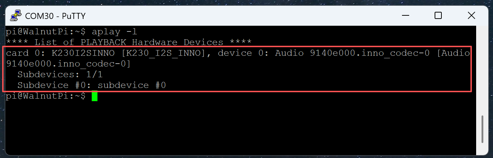
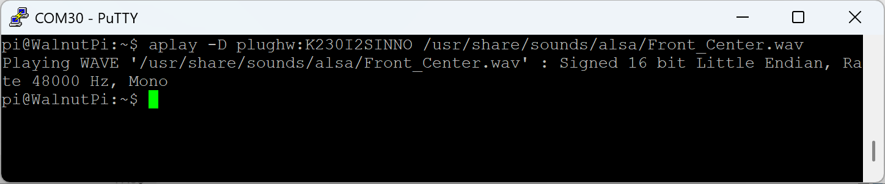
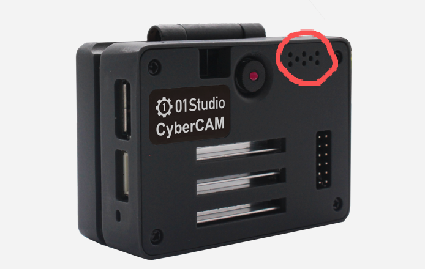
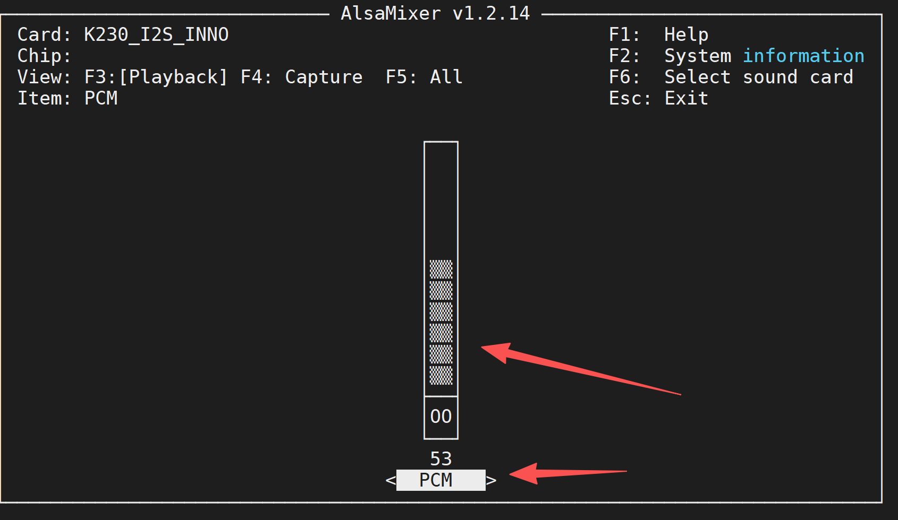
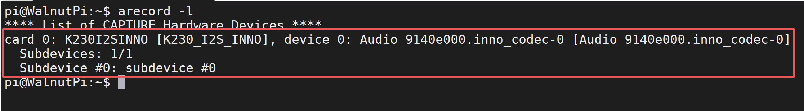
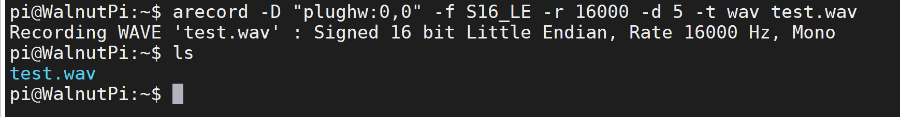
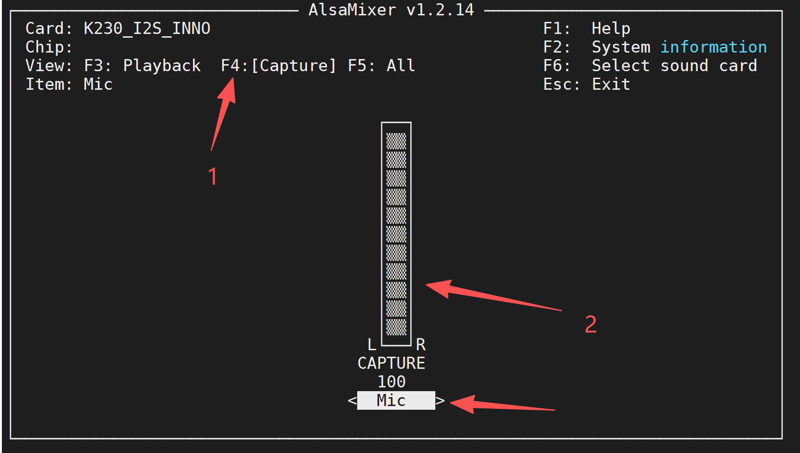

# 音频和录音

CyberCAM板载双路麦克风和一路扬声器（右声道）。

## 音频

### 查看音频设备

可以使用下面指令来查看音频信息：

```bash
aplay -l
```



### 音频播放测试

播放系统自带wav音频文件测试, 下面指令的**K230I2SINNO**为上面指令查看到的音频设备名称：

```bash
aplay -D plughw:K230I2SINNO /usr/share/sounds/alsa/Front_Center.wav
```



可以听到喇叭位置播放出声音。



### 播放音量调整

执行下面指令：通过按下键盘↑和↓按键可以调整音量大小。(图中的PCM表示播放音量)

```bash
alsamixer
```



## 录音

CyberCAM板载双路麦克风，可通过下面指令查看信息:

下面指令可以列出音频设备：

```bash
arecord -l
```


### 录音测试

可以通过下面指令录音：

```bash
arecord -D "plughw:0,0" -f S16_LE -r 16000 -d 5 -t wav /test.wav
```

- -D: 设备名称，从上面`arecode -l`可以看到这里是card0,device0,所以使用："plughw:0,0"；
- -f：录音格式，S16_LE表示16位；
- -r: 采样率，16000表示16KHz;
- -d: 录音时长，10表示10秒；
- -t: 录音格式, wav表示wav格式；
- test.wav 表示在当前路径下生成test.wav文件。

录完后在当前目录可以看到生成test.wav文件：



可以使用下面指令可以播放刚刚录音的文件：

```bash
aplay -D plughw:K230I2SINNO test.wav
```

### 调整麦克风音量

默认配置的麦克风音量可能偏小，可以通过以下方式调整:

输入下面命令：
```bash
alsamixer
```

在弹出界面按F4，选择Capture表示麦克风。通过按下键盘↑和↓按键可以调整音量大小。


