# 自定义APP

## APP存放路径

CyberCAM系统支持自定义APP，用户可以通过按规范上传相关代码和配置文件，即可快速部署自己的APP并在系统GUI上显示。

系统预装了一些自定义的APP，可以通过打开CyberCAM媒体识别里面的/data/app文件夹看到。

在我的电脑找到CyberCAM盘符：

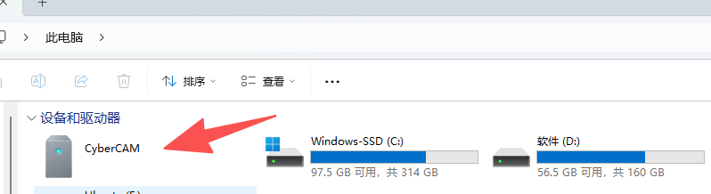

打开`/data/app`文件夹：

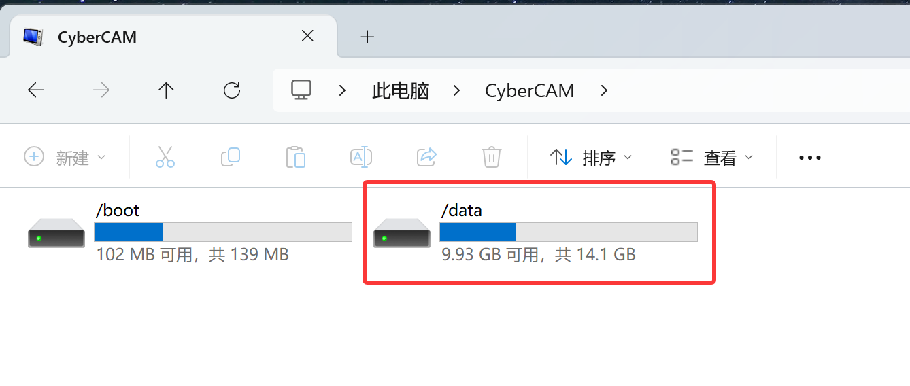

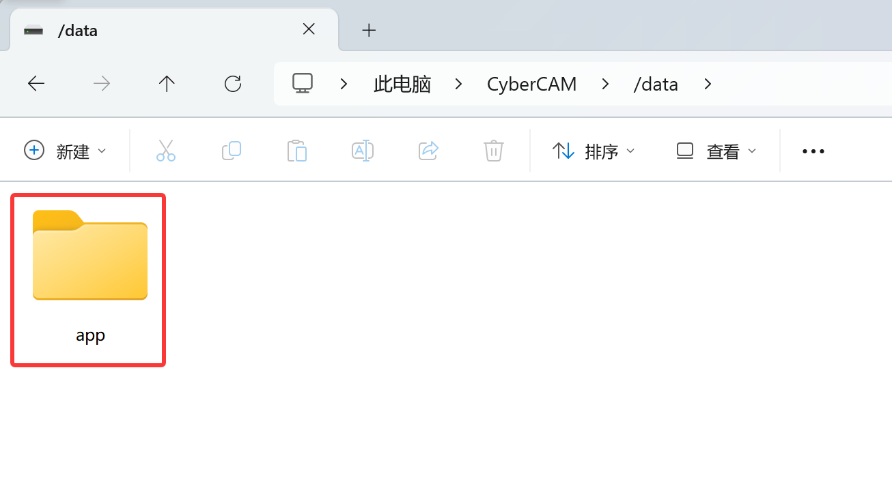

app文件夹里面装着几个文件夹，每个文件夹对应1个APP。

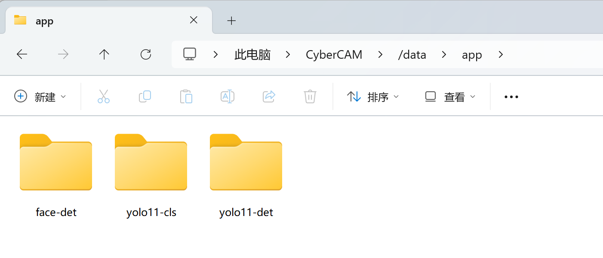

- face-det :人脸检测
- yolo11-cls : YOLO11分类
- yolo11-det : YOLO11检测

:::tip 提示
CyberCAM媒体设备默认只能复制、删除和修改文件名称，不能直接编辑文件。如需修改文件需要将文件拷贝到电脑修改，然后再拖动回去覆盖。
:::

## APP定义规范

我们拿YOLO11检测APP举例。打开yolo11-det文件夹，看到有一些文件

- app.txt : APP信息配置文件；
- run.sh : 执行APP时运行的脚本文件；
- main.py : APP的代码；
- yolo11n.kmodel : 代码调用的模型文件；
- icon_png : 用户上传的图标；
- icon_100.png : 系统自动生成的 100x100像素的图标文件。

我们复制粘贴一个用于修改测试。

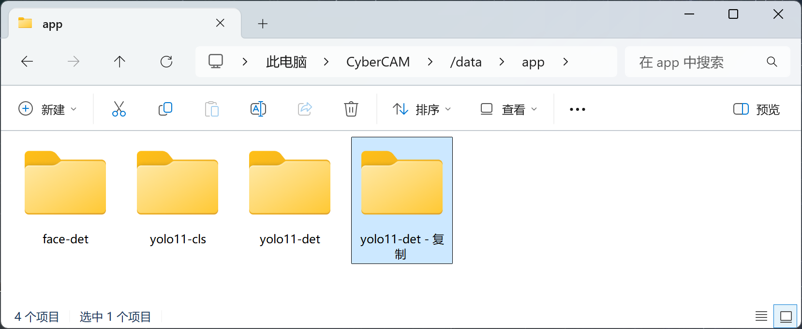

复制后可以看到界面出现一个相同名称和图标的APP：

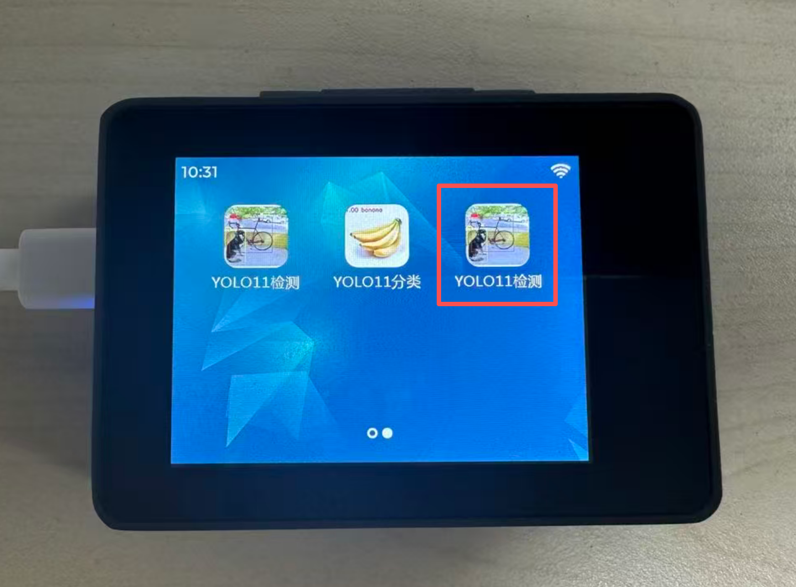

这相当于创建了一个新的APP了，我们使用这个复制的文件讲解。

### 信息配置 app.txt

打开app.txt，可以看到信息如下：

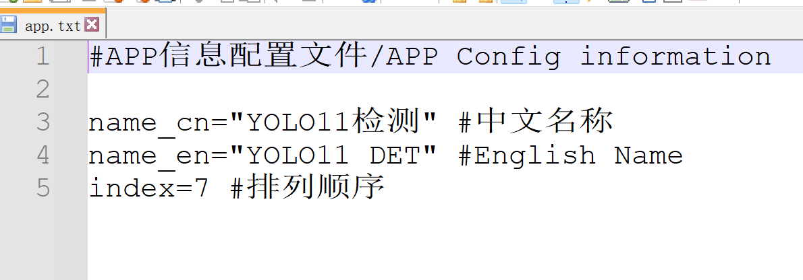

- name_cn：中文名称，系统语言为中文时显示；
- name_en: 英文名称，系统语音为英文时显示；
- index=7: APP排序，最小为1。

我们先将`app.txt`拖动到电脑打开，修改name_cn名字为"测试APP"。

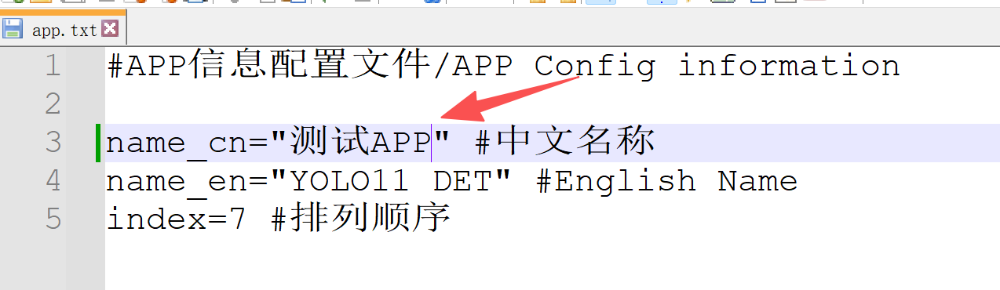

然后再拖动到yolo-det文件夹覆盖原文件。**这是因为CyberCAM的媒体设备默认是不能直接修改文件。**

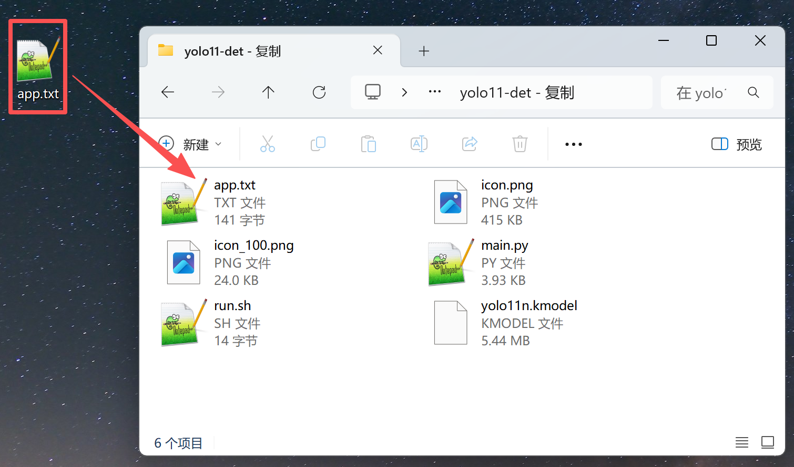

可以看到APP名称变成了【测试APP】

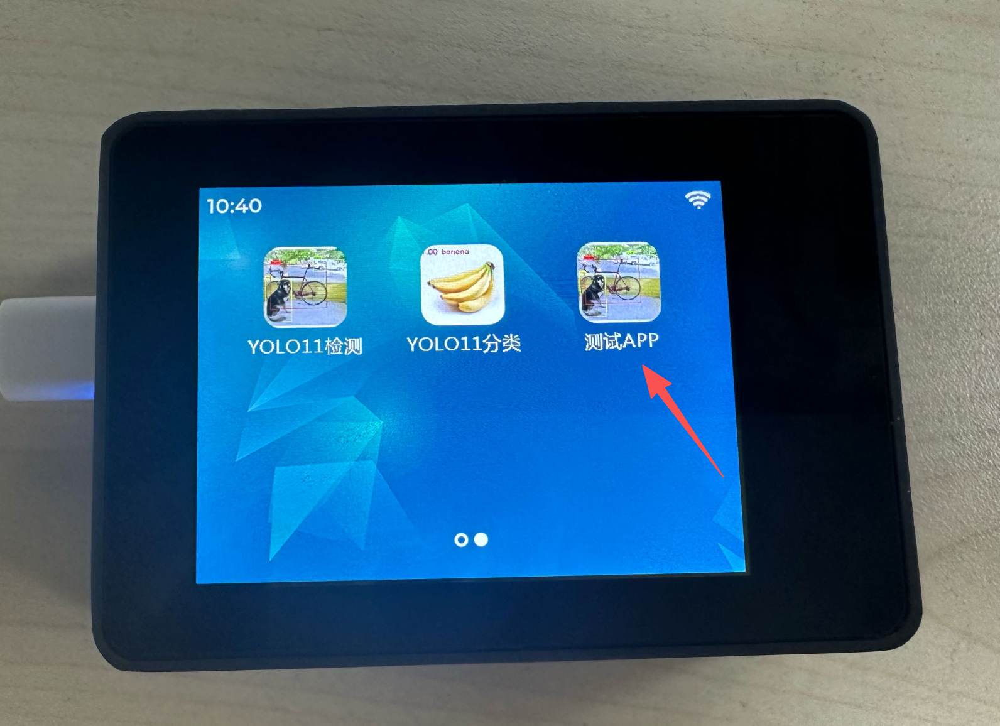

我们使用同样的方式将index值修改为 1 :

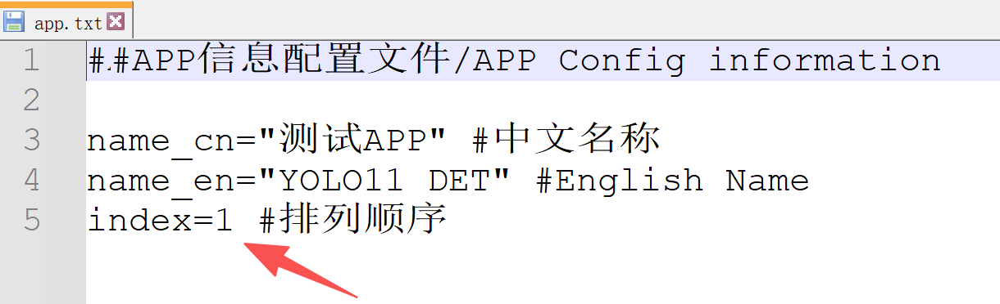

可以看到这个图标排到了第1位。

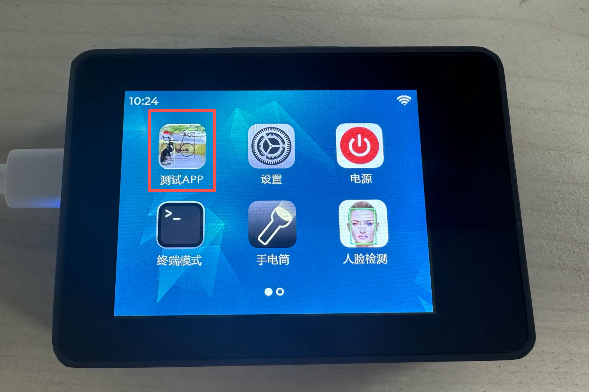

### 运行脚本 run.sh

当用户点击APP时，会执行当前目录下的`run.sh文`件，这样的好处是用户可以任意编辑自己的脚本文件以实现执行各种功能，如：执行python代码、执行C代码，甚至是一些命令操作。

打开`run.sh`，可以看到当前应用的脚本非常简单，就是执行当前目录下的`main.py`。

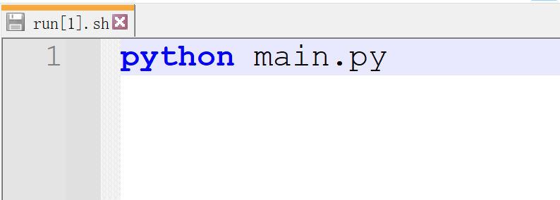

### 代码和相关库

在YOLO检测 APP中，`main.py`和`yolo11n.kmodel` 2个文件构成了代码和相关库文件。`main.py`运行YOLO检测并调用了`yolo11n.kemodel`文件。

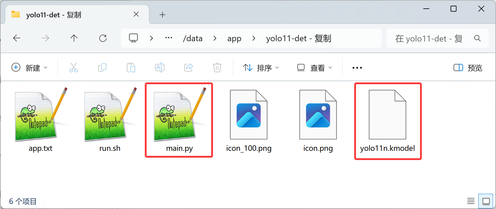

### APP图标

系统会识别当前APP路径下的icon.png或icon.jpg图片文件，然后自动裁剪成`icon_100.png`用于APP实际图标显示，因此你只需要修改`icon.png`即可实现修改自己的APP图标。
:::tip 提示
当文件夹内没有`icon.png`、`icon.jpg` 或 `icon_100.png`、`icon_100.jpg`文件时，系统会使用默认01Studio LOGO作为图标。
:::
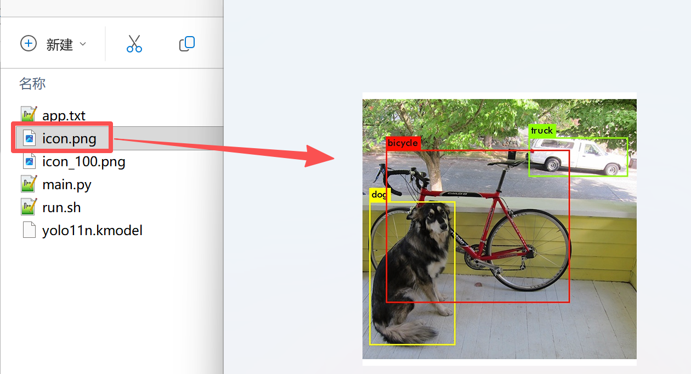

将下面这个图片保存到电脑，名称修改为`icon.png`

先将APP文件原有的`icon.png`和`incon_100.png`文件删除

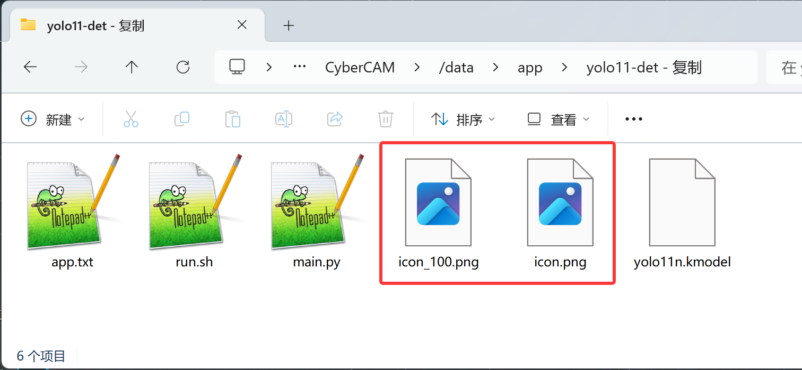

再将刚刚下载的`icon.png`拖动到APP文件夹下

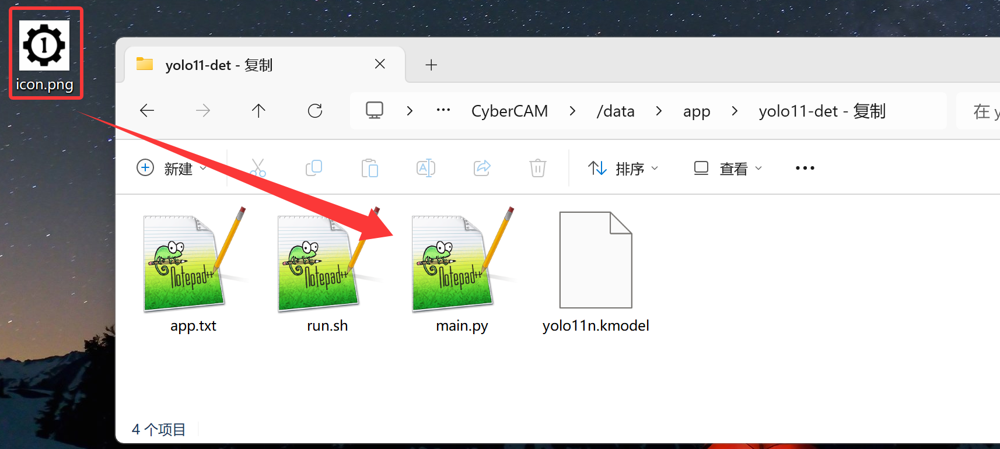

刷新一下，可以看到自动生成了 `icon_100.png` 图标文件。**如果没有的话可以重启一下CyberCAM**

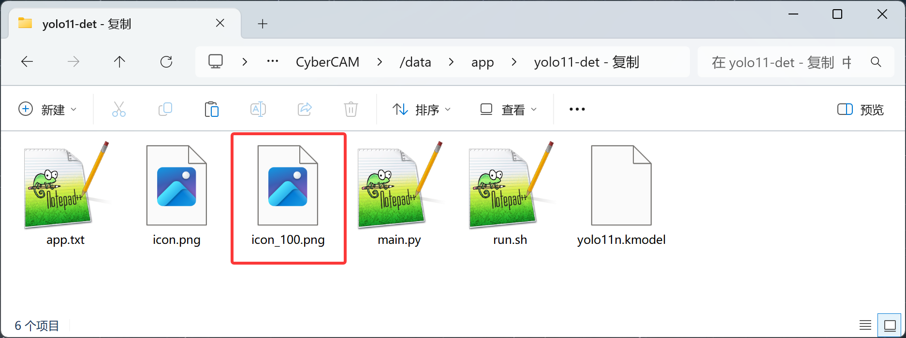

CyberCAM上对应APP的图标也更新了。

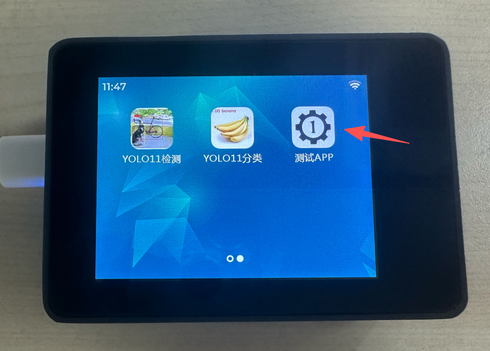

## APP贡献

- CyberCAM Apps 开源仓库：https://github.com/01studio-lab/CyberCAM-Apps 

欢迎贡献您的APP！请遵循以下步骤：

1.Fork本项目；

2.在本地修改代码；

3.提交Pull Request。

请将将测试好的APP上传到app目录下，并在您的APP文件夹内添加README.md文件，介绍你的APP和使用方法。**对于优秀的APP，我们将会在CyberCAM系统中预装，并在官方文档中进行推荐。并给予开发者产品或其它形式奖励。**

