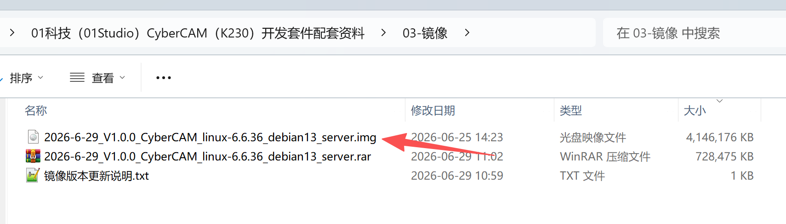
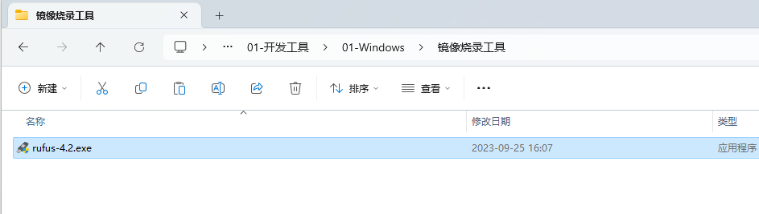
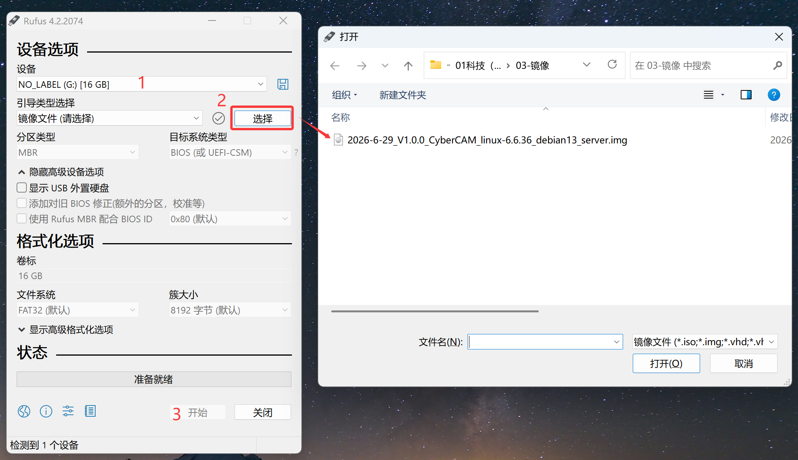
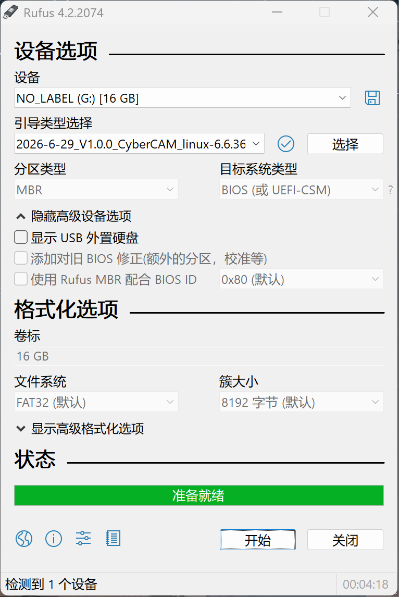
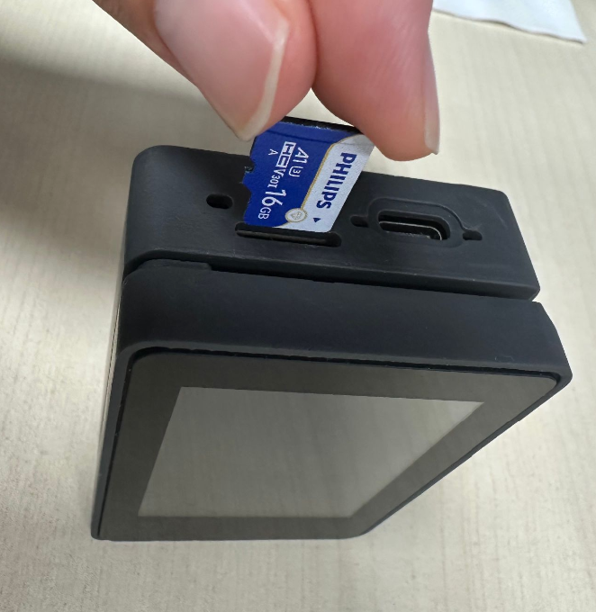
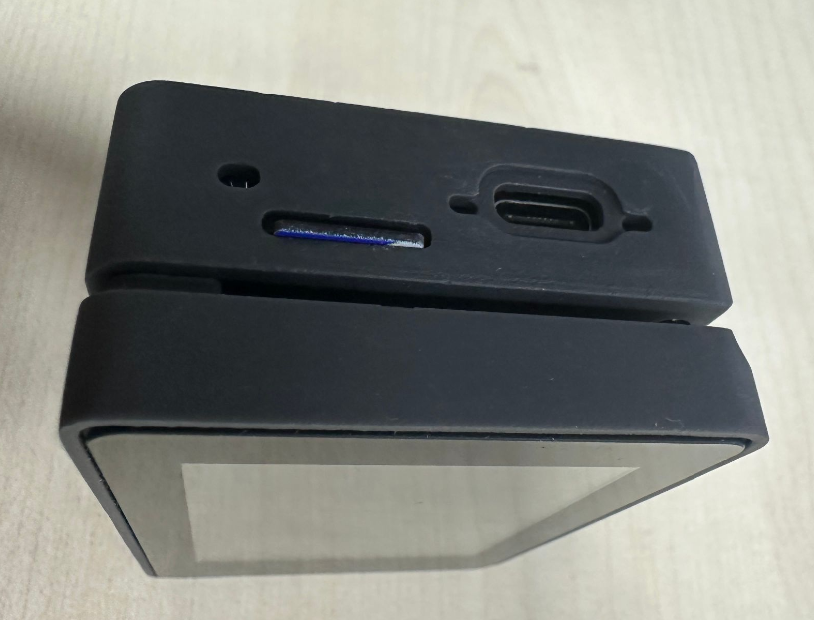
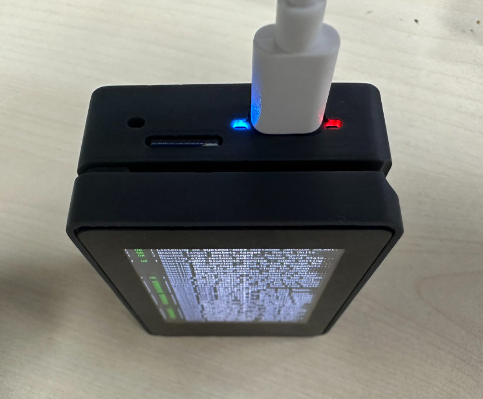
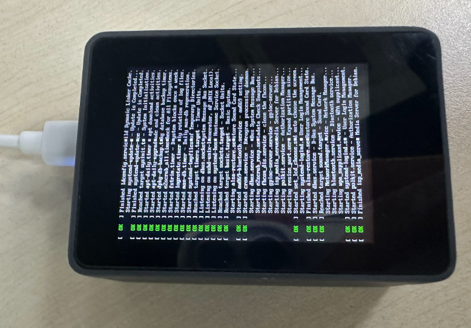
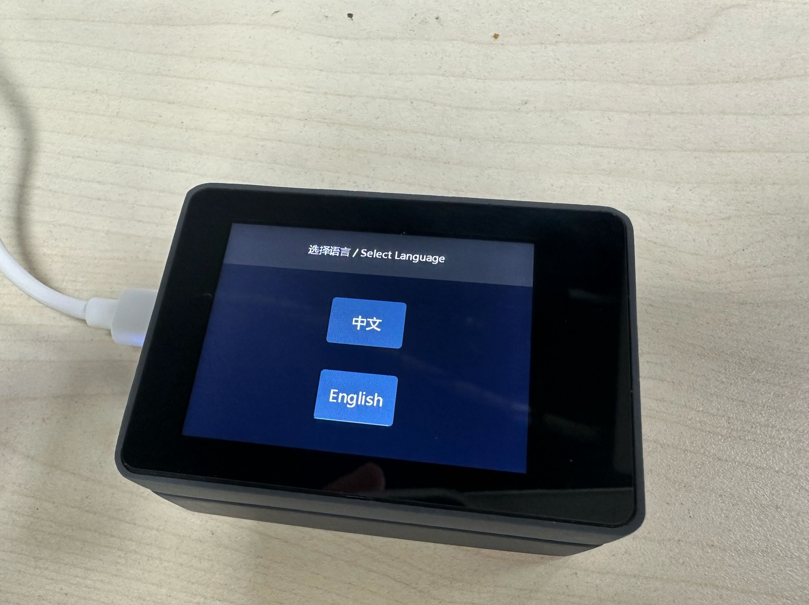

# 镜像烧录和开机

## SD卡镜像烧录

01科技 CyberCAM需要使用烧好镜像的SD卡启动。镜像文件位于 **01科技（01Studio）CyberCAM（K230）开发套件配套资料\03-镜像** 文件夹下。（资料包默认是rar压缩包，需要自行解压后使用以 .img 结尾的镜像文件。）

将MicroSD卡通过读卡器连接到电脑：

打开资料包镜像烧录工具。rufus烧录工具位于 **01科技（01Studio）CyberCAM（K230）开发套件配套资料\01-开发工具\镜像烧录工具** 文件夹内：

1.选择SD卡对应的U盘盘符;  
2.然后点击 **`选择`** 按钮，选择前面下载解压的.img镜像文件;  
3.点击开始：

烧写完成后如下图所示：

至此烧录完成，接下来请看下面 [开机](#开机) 内容。

## 开机

将烧录好的SD卡插入CyberCAM，按下图所示方向垂直插入。

插入后SD卡边缘和外壳平齐。（防呆设计，注意方向，反了插不进）

然后通过type-c线连接到电脑。（注意请勿带电拔插SD卡，有烧坏风险。）

红灯亮表示电源供电正常，蓝灯亮表示系统正常启动。

启动时显示屏会有启动日志信息：

首次启动的SD卡会进入初始化配置界面，如下图：（配置方法会在下一节详细讲解，至此，系统启动成功。）

【我的电脑】里面会弹出CyberCAM媒体设备。

