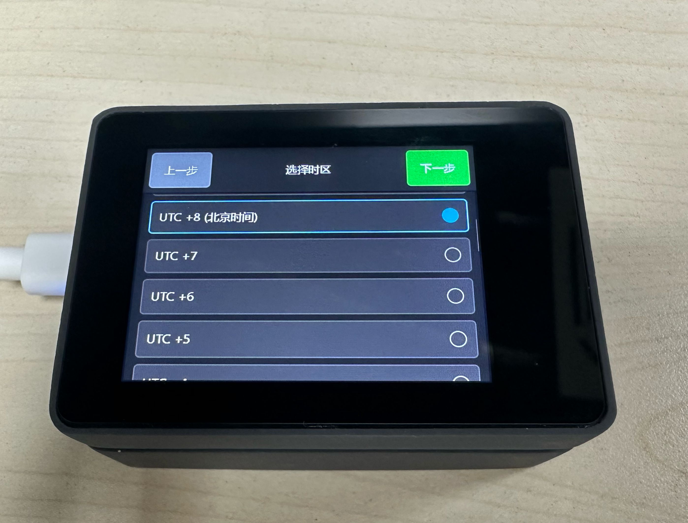
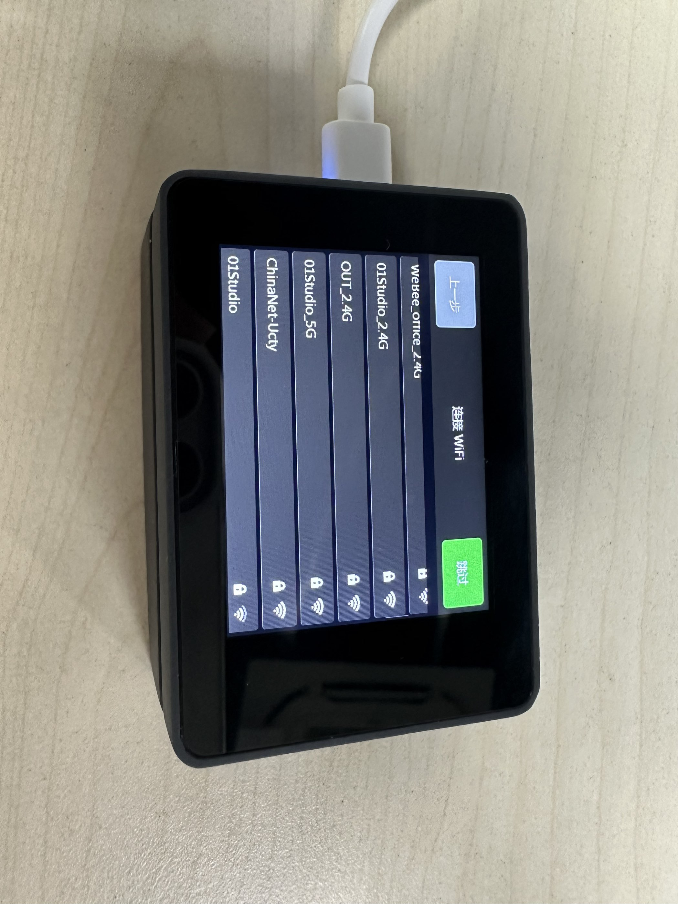
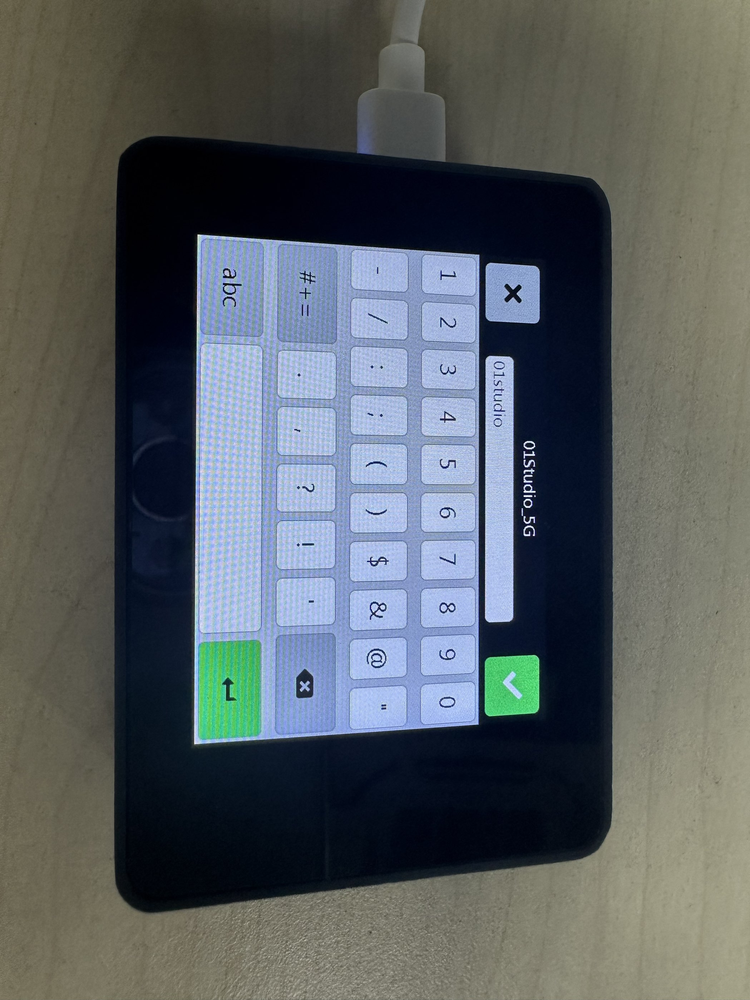
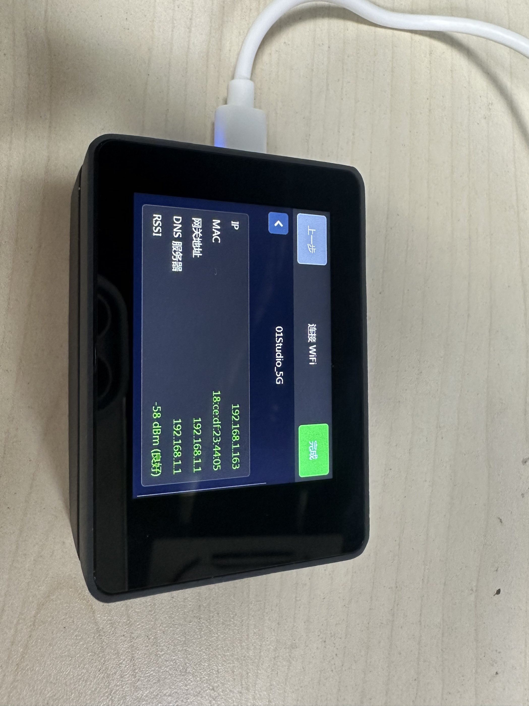
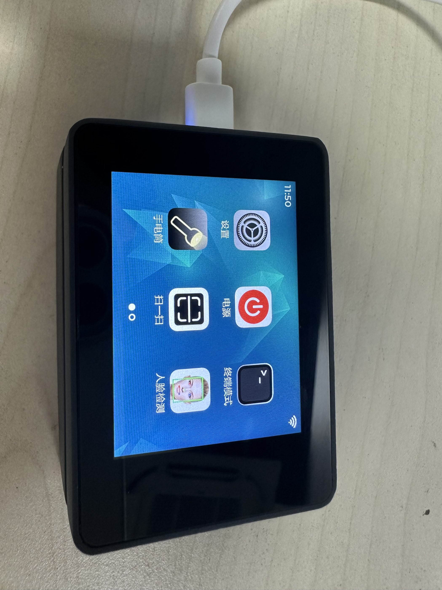

# 初始化配置

CyberCAM系统首次启动会默认进入初始化配置界面，配置语言、时区和网络等界面。配置完成后会保存相关信息，下次启动就无需再次配置。

## 语言

当前系统支持中文和英文两种语言，点击按钮选择即可。

## 时区

语言选择中文后时区默认会选择**东八区（北京时间）**，如需其它时区可自行选择。选完后点击【下一步】。

## WiFi连接

CyberCAM支持双频WiFi（2.4G和5G）信号，选择要连接的WiFi网络SSID。

输入密码，点击绿色按钮确认连接。

连接完成后如下图，显示IP地址等网络信息。

点击完成，即可进入GUI界面。

