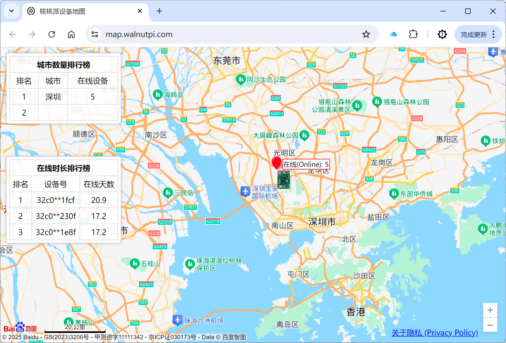

# 设备地图

核桃派设备地图是核桃派系统特有功能，通过IP地址获取开发板的位置并在地图展示，位置只精确到城市。[设备地图链接>>](https://map.walnutpi.com)



该功能默认开启，用户可以自行设置关闭和开启，约有1小时左右刷新延时。

## 设置界面开启和关闭

打开【设置】-【位置】，可通过按钮实现开启或关闭。


## 通过终端命令开启和关闭

**关闭指令：**

```bash
systemctl disable map_device.service
```

重启开发板生效。

**开启指令：**

```bash
systemctl enable map_device.service
```

重启开发板生效。

