# 终端和常用命令

终端（Termianal）要追溯到早期的计算机时代，那时候还没有可视化桌面，很多计算机操作都是通过终端命令完成。 到现在我们依然很多场合和调试会用到，掌握 linux 常用终端命令，能让你的开发工作事半功倍。


## 终端打开方式
CyberCAM有多种方式可以打开终端。

### 调试串口打开终端

调试串口方式是最原始的方式打开终端，能查看所有系统启动信息，判断系统无法启动故障原因。通过USB将CyberCAM连接到电脑。在**设备管理器**中可以看到对应的COM端口。 注意是 **`SERIAL-A CH342`** 对应的端口号，不同电脑端口不一样。

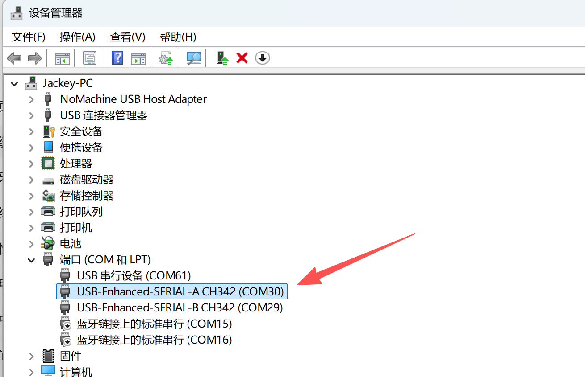

:::tips 提示
如果有感叹号，说明需要安装CH342 USB转串口芯片驱动。可以在**01科技（01Studio）CyberCAM（K230）开发套件配套资料\01-开发工具\串口终端工具\CH342驱动** 文件夹中找到对应的驱动安装包安装。

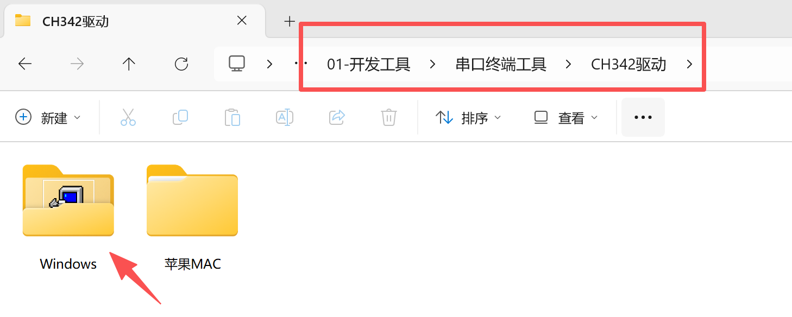

:::

打开**CyberCAM资料包\01-开发工具\串口终端工具**文件夹配套的 putty终端软件:

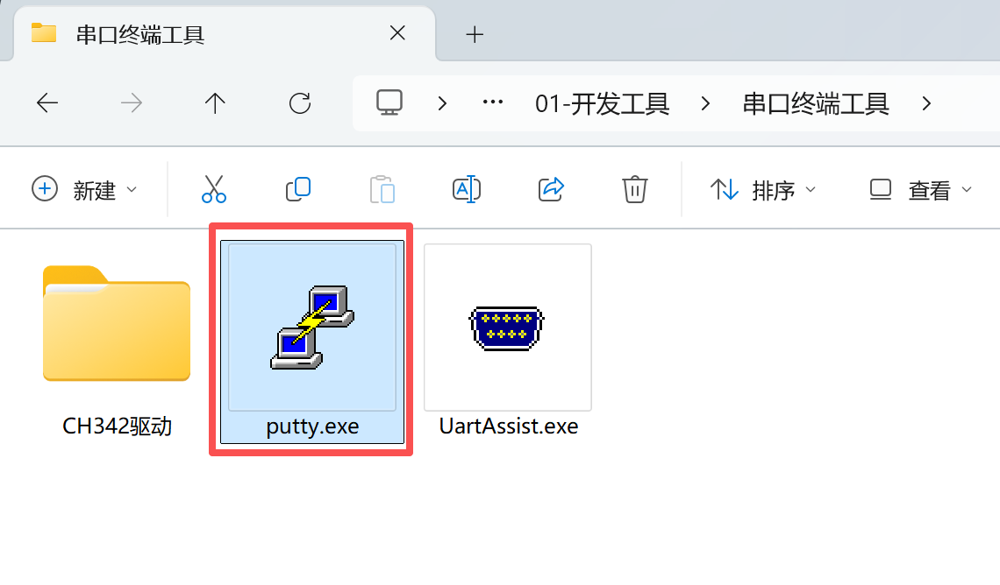

选择Serial方式，输入刚刚查看到自己电脑的COM号`COM30`，波特率是：`115200`，点击open:

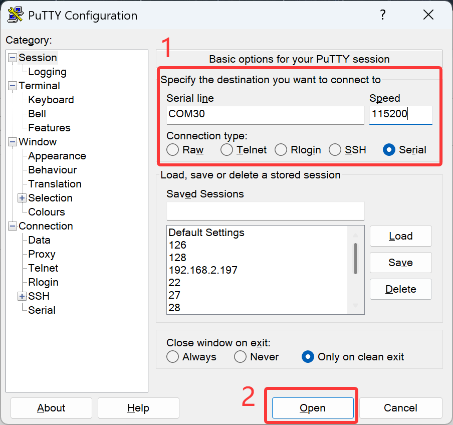

然后出现账号密码输入提示，**如果没出现可以按一下键盘回车键**。普通用户账户密码都输入"pi"即可。

**密码是不显示的，输入直接按回车即可。**

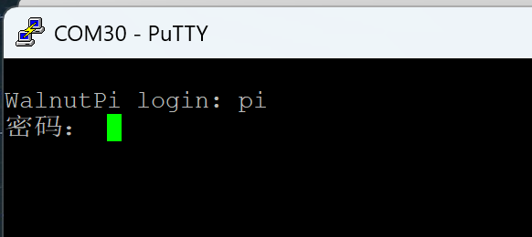

登录成功就就出现核桃派系统终端相关信息。

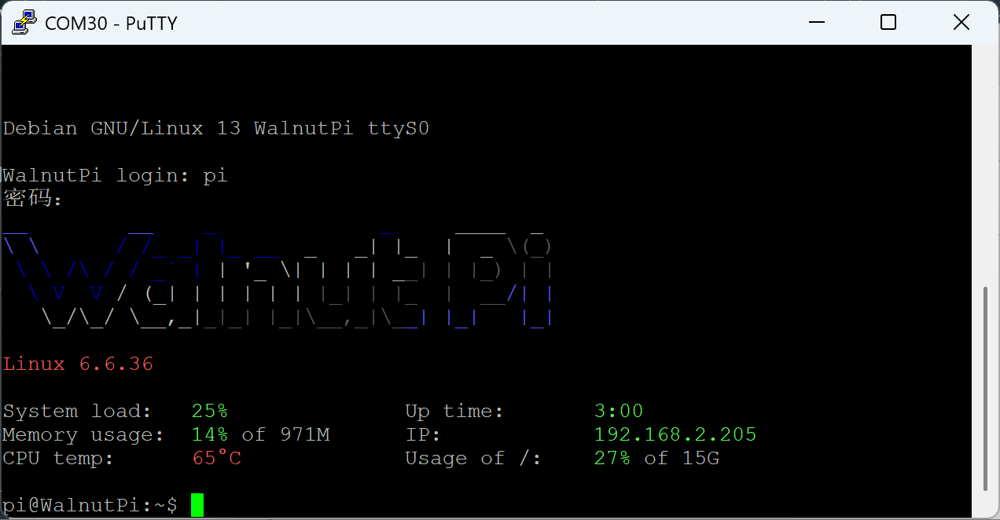


### GUI打开终端

进入CyberCAM系统GUI，点击终端APP即可进入终端。[教程>>](./system_app.md#终端模式)

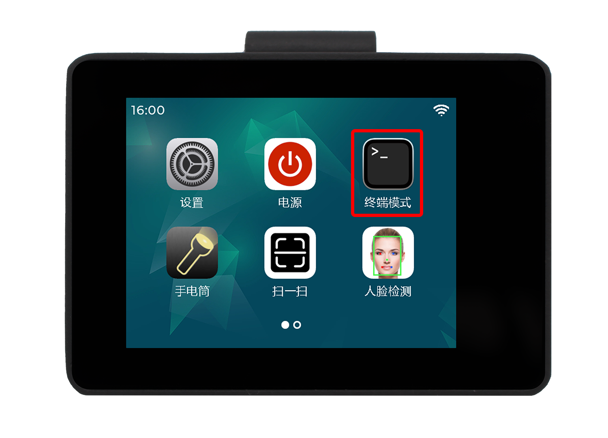

### VScode插件打开终端

使用CyberCAM VSCode插件，点击工具栏`Board Terminal`即可进入终端。[教程>>](../vscode_ide.md#终端交互)

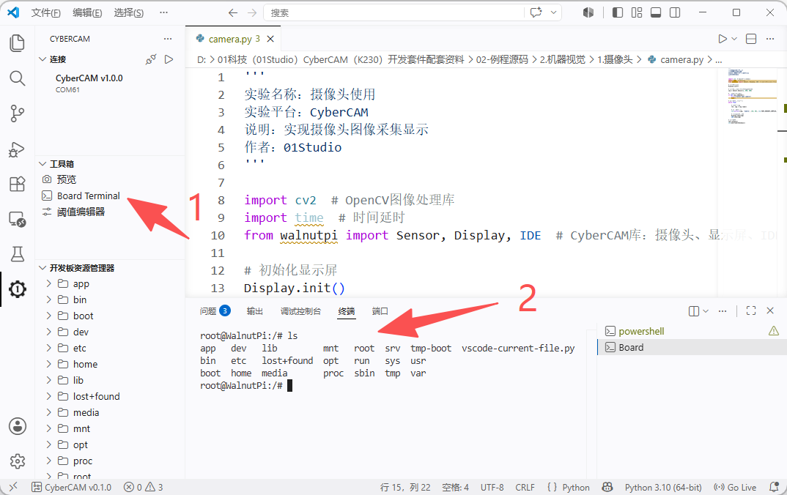

### SSH远程终端

这个方式常用于无线或者远程调试，需要确保CyberCAM和电脑在同一个局域网下（通常指连接到同一个路由器下）。

可以通过【设置】-【网络】界面获取设备IP信息：

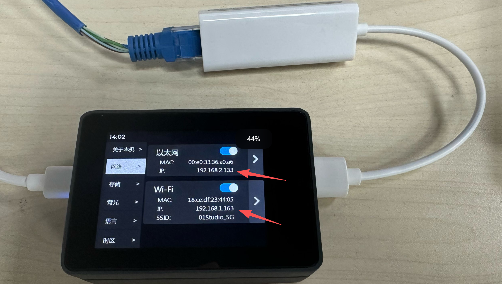

也可以在终端`sudo ifconfig`命令查看CyberCAM的IP地址:

- eth0: 有线网络IP地址
- wlan0: 无线网络IP地址

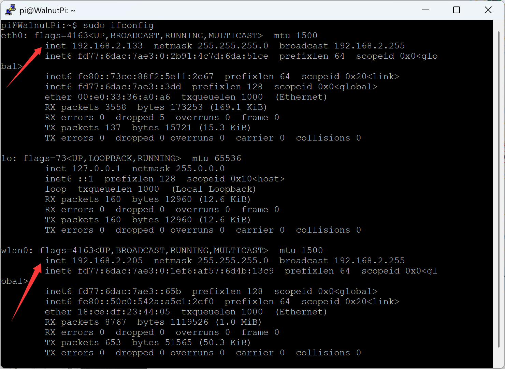

这里使用putty软件演示（你可以使用其它带ssh功能的软件工具）:


选择的是ssh，然后输入CyberCAM IP地址，端口默认22。

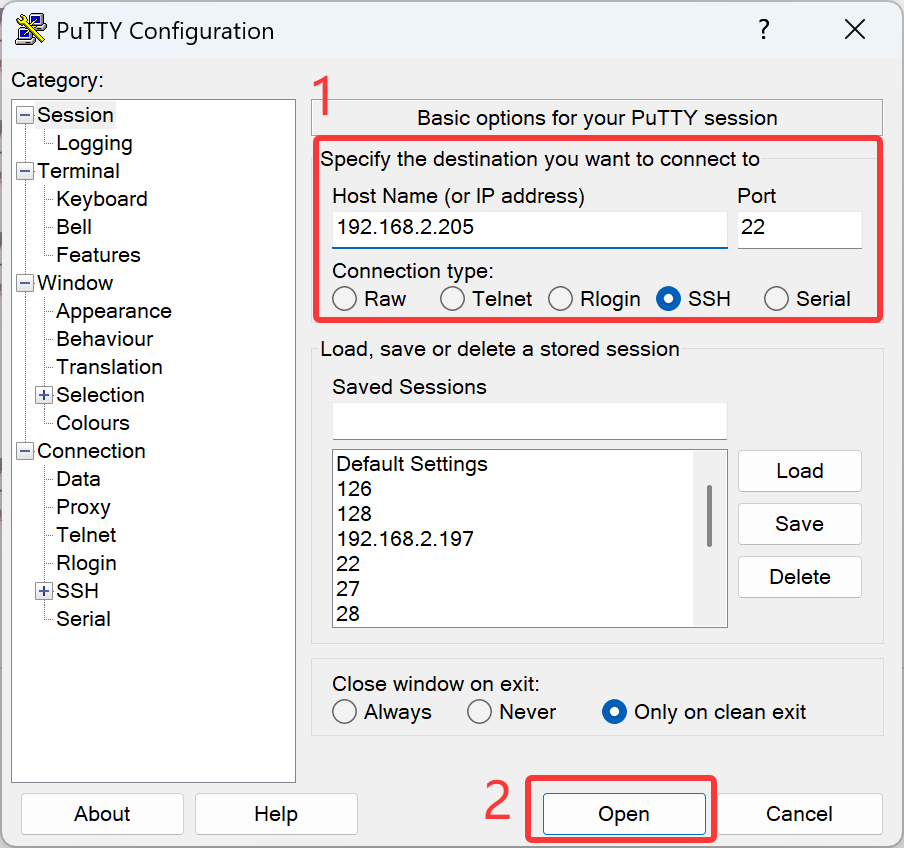

弹出信任直接选择是即可。

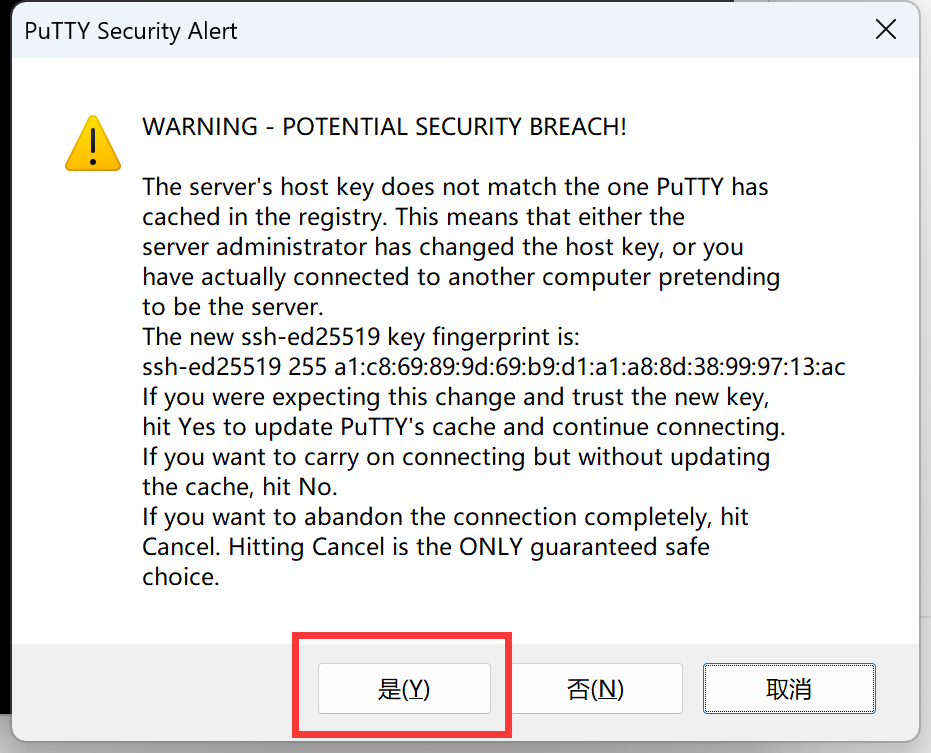

然后出现账号密码输入提示，**如果没出现可以按一下键盘回车键**。普通用户账户密码都输入"pi"即可。

**密码是不显示的，输入直接按回车即可。**

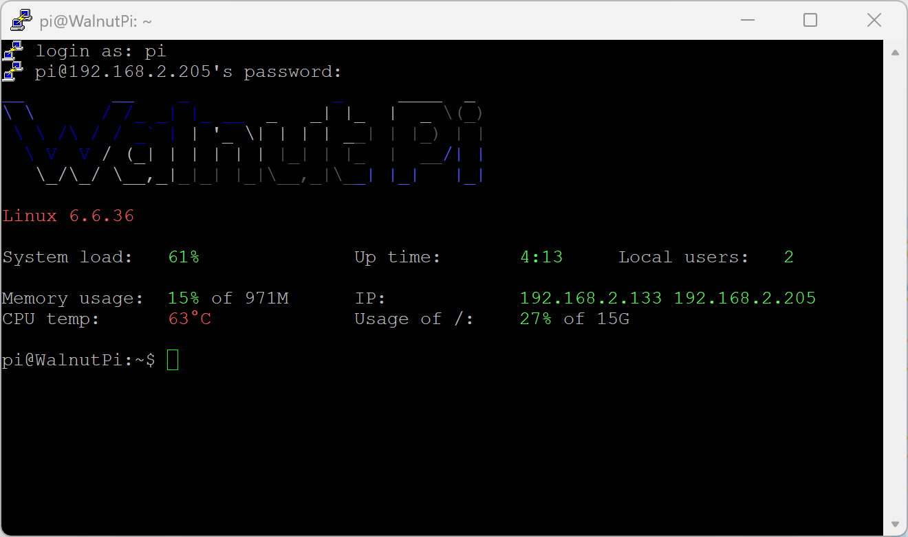


## 用户切换

在终端中首先看到的是提示符，它正在等待您的指示。 提示运行如下：

<font color='#06fe00'>pi@WalnutPi</font>:~$

pi 表示用户名; 

@后面的 WalnutPi 表示主机名; 

~后面表示当前目录; 

**$**表示非特权用户。

核桃派系统预设2个用户。分别是：
- **普通账户(桌面系统默认启动)** 用户名：pi 密码：pi
- **管理员** 用户名：root 密码：root

有些终端命令需要通过管理员才可以执行，我们可以在终端通过 **sudo + 指令** 来执行。如果想直接在终端切换成管理员账户可以使用 su 指令来实现。

**切换为管理员：**在终端输入su，按回车，然后在弹出的Password:后面输入密码 **root**,（密码不会显示，注意大小写），再按回车当前终端即可进入管理员用户。
```bash
su
```
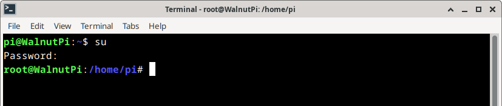

**切换为普通用户：**在终端输入su加用户名按回车即可，如切换为pi用户可输入下面命令：
```bash
su pi
```
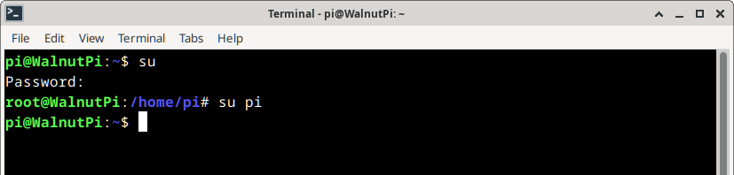

## 常用Linux命令

我们来简单测试一下终端，在终端输入 `ls /`,按回车，可以看到列出了根目录下的文件和文件夹名称（**系统pi目录下默认没有文件**）：
```bash
ls /
```
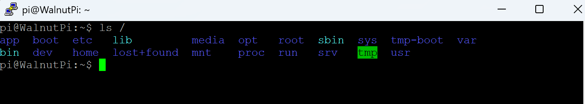

输入 `cd app` ,按回车，可以看到提示当前目录变成了在app下。
```bash
cd app
```
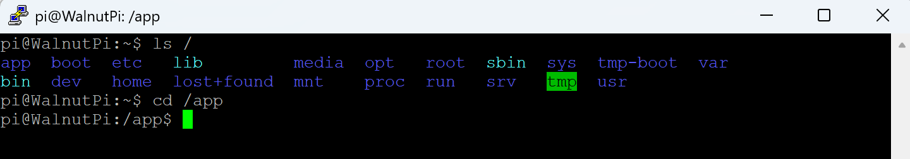

下面是一些Linux常用命令：

|  编号 | 命令 | 命令长称 | 功能 |  
|  :---:  | :---:  | ---  | ---  |
| 1  | ls | list | 列出当前目录下的文件 |
| 2  | pwd | print working directory | 输出当前目录 |
| 3  | cd | change directory | 改变目录 |
| 4  | mkdir | make directory | 新建目录 |
| 5  | cat | concatenate | 显示或连接文件内容 |
| 6  | rm | remove | 删除文件 |
| 7  | rmdir | remove directory | 删除目录 |
| 8  | mv | move | 移动/重命名文件或目录 |
| 9  | cp | copy | 复制文件或目录 |
| 10  | echo |   | 显示在终端输入内容 |
| 11  | date |  | 读取系统日期和时间 |
| 12  | grep | global search regular <br></br> expression and print | 全面搜索正则表达式并打印 |
| 13  | man | manual  | 显示命令使用手册 |
| 14  | sudo | super user do | 以root权限执行 |
| 15  | chomod | change mode | 改变文件读写权限 |
| 16  | ./program |   | 运行program程序 |
| 17  | apt | advance package tool | 安装/删除软件包 |
| 18  | exit |  | 退出 |
| 19  | reboot |   | 重启 |
| 20 | poweroff |  | 关机 |