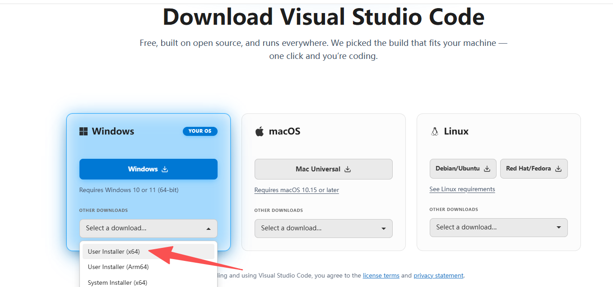
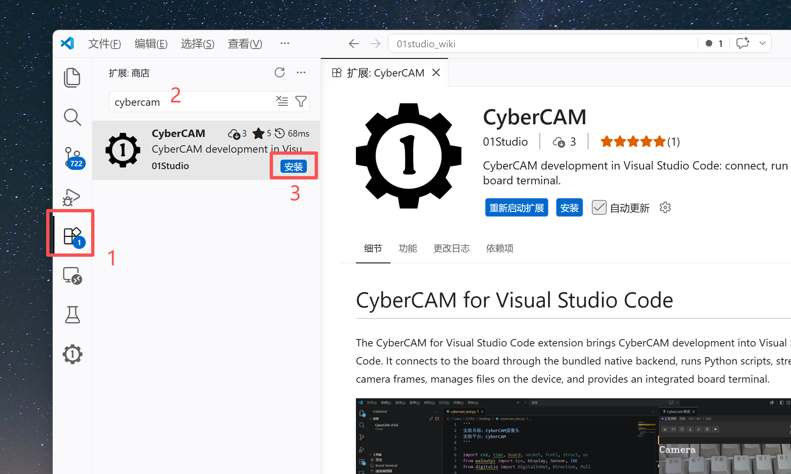
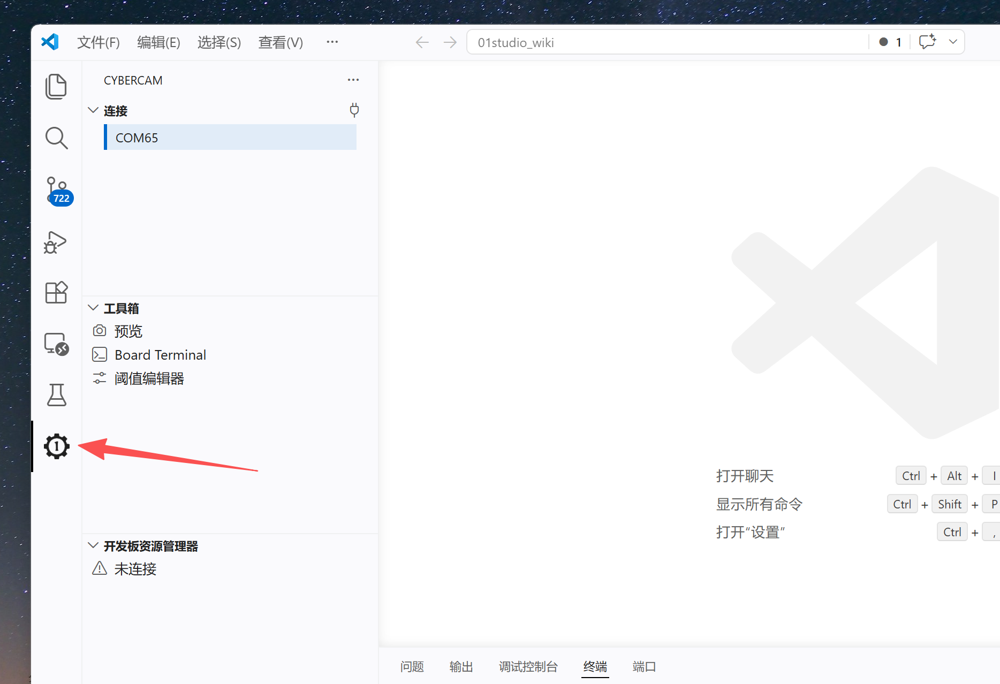
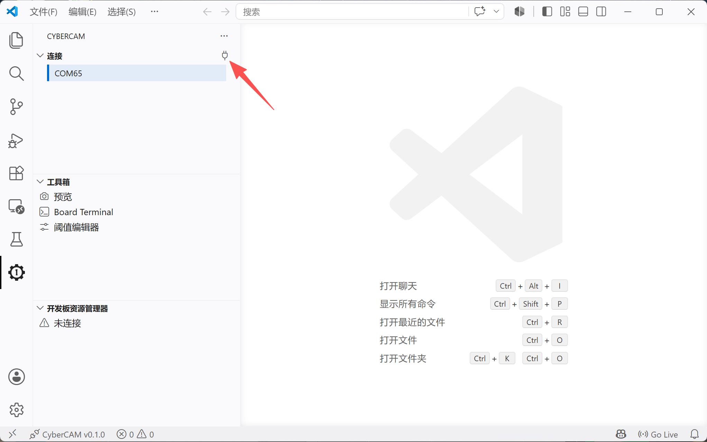
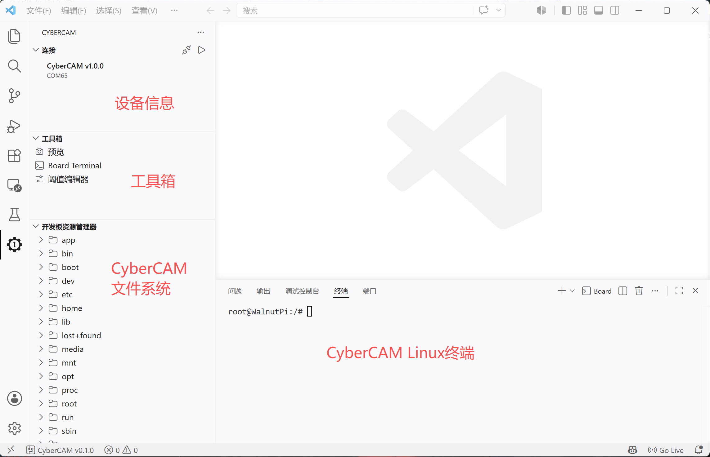
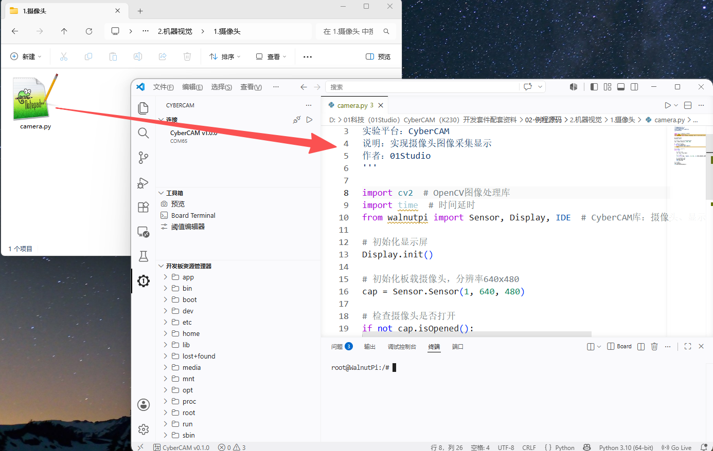
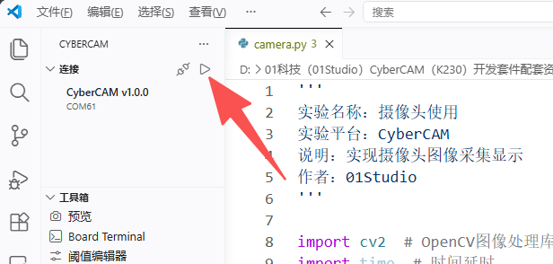
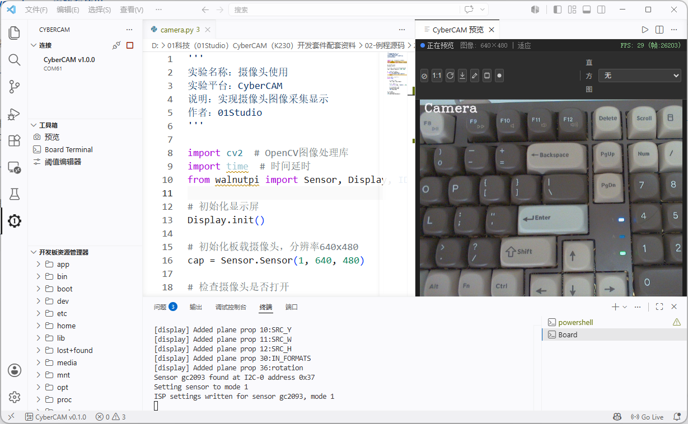
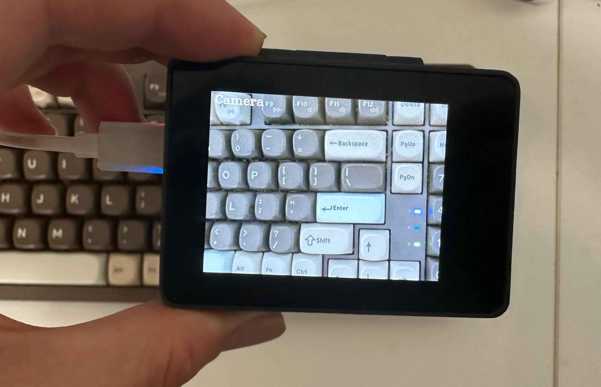
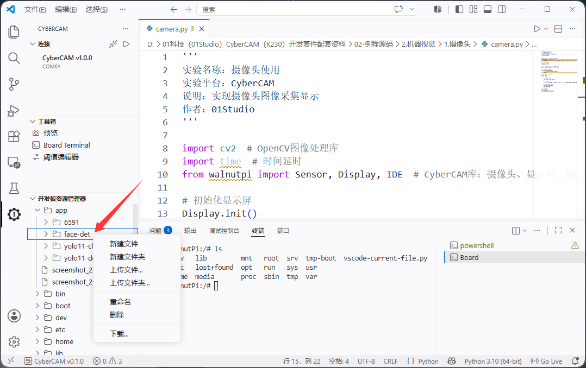

# VSCode IDE开发环境

## VSCode插件安装

CyberCAM提供VScode插件，下周安装后即可拥有基于VSCode的开发环境。支持多机连接、代码补全和实时运行调试、文件系统、终端交互、高帧率实时图像显示等功能。

先安装VSCode，如果已经安装，请跳过。

下载地址：https://code.visualstudio.com/download

安装完成后打开，点击【插件】图标，搜素`cybercam`，点击安装按钮。

安装完成后左侧出现CyberCAM插件的LOGO说明安装完成。

## 连接开发板

CyberCAM插入烧录镜像的SD卡，通过TYPE-C连接到电脑，[开机](./os_software/image.md#开机)。

找到设备后连接框会显示出设备的端口，支持多个设备显示。然后点击下图小图标连接开发板。

连接成功后如下图：

## 运行代码

这里示例示例代码演示，打开 **01科技（01Studio）CyberCAM（K230）开发套件配套资料\02-例程源码\2.机器视觉\1.摄像头**文件夹，将`camera.py`代码文件拖动到VSCode窗口。

点击运行按钮，代码会在开发板上运行

运行结果会显示在终端窗口，IDE右边为摄像头图像预览窗口。
:::tip 提示
这里只做代码运行演示，实验代码讲解将在后续章节中进行详细说明。
:::

## 终端交互

左侧工具栏的工具箱里面提供`Board Terminal` 的功能是开发板终端交互窗口，支持输入Linux命令和查看输出结果。

## 文件系统

左下方为开发板文件系统，展示了开发板的所有目录文件，通过点击右键可以对文件或文件夹进行重命名、下载到本地电脑、从电脑上传文件到开发板等功能。

