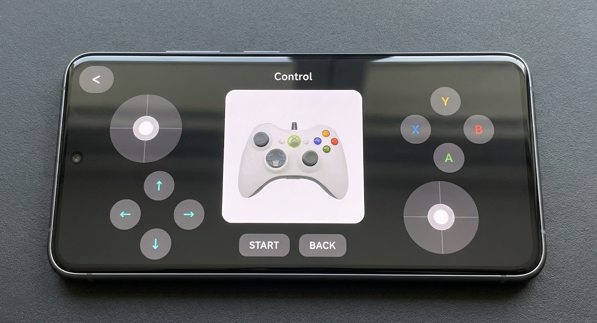
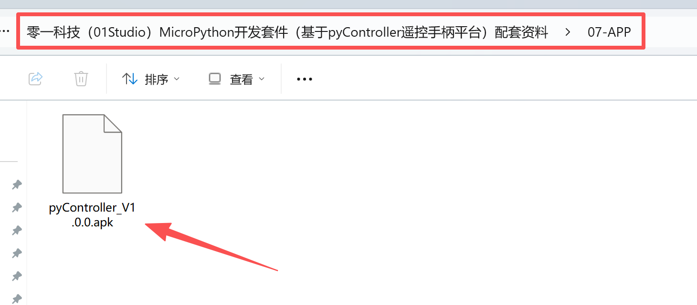
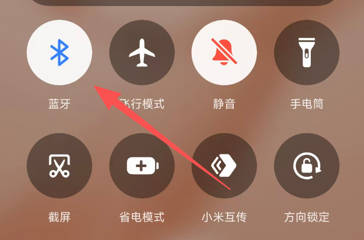
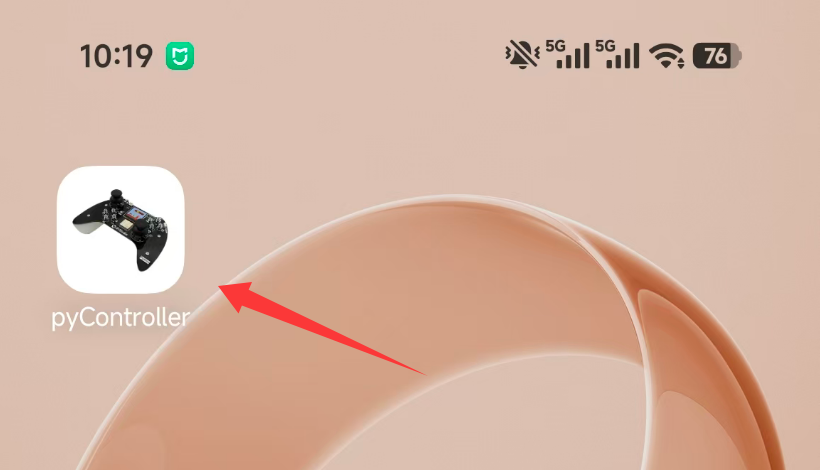
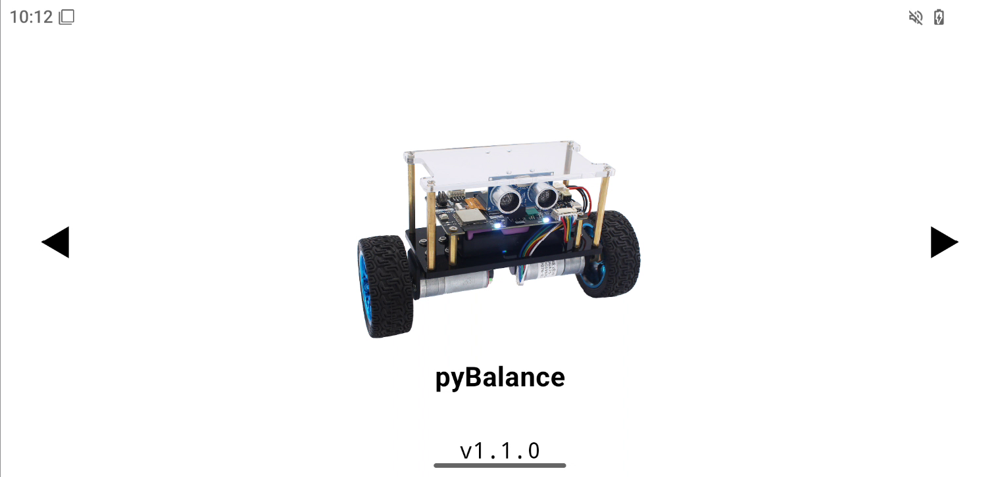
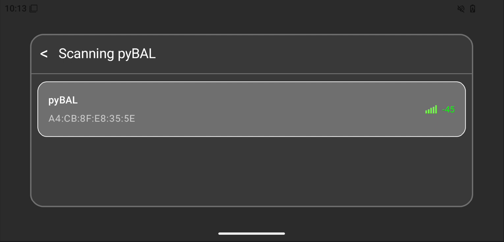

# APP控制

我们为pyController手柄制作了一款APP，功能和外观和手柄完全一致，用户可以使用它来替代手柄，实现蓝牙无线控制01Studio 四轴飞行器、小车等设备。

:::tip 提示
目前仅有安卓版本APP。
:::

## 安装

apk文件位于 **开发板配套资料/07-app**

将apk文件拖到到Android手机并安装。**安装过程中同意相关权限**。

安装完成后务必先打开手机蓝牙功能，然后再打开APP，否则可能会闪退。

打开安装好的APP：

建议设置允许横屏方式使用，可以通过左右滑动或者点击箭头实现不同控制方式选择。

## pyBalance模式

pyBalance模式用于控制01Studio pyBalance两轮平衡小车设备，只搜索“pyBAL”蓝牙设备名称。

[pyBalance平衡小车教程](../intro/balance.md)

点击中间图片进入，此时旁边有扫描到等待连接的pybalance设备就会自动搜索到。

点击进入，可以看到操作界面跟pyController手柄一样。

