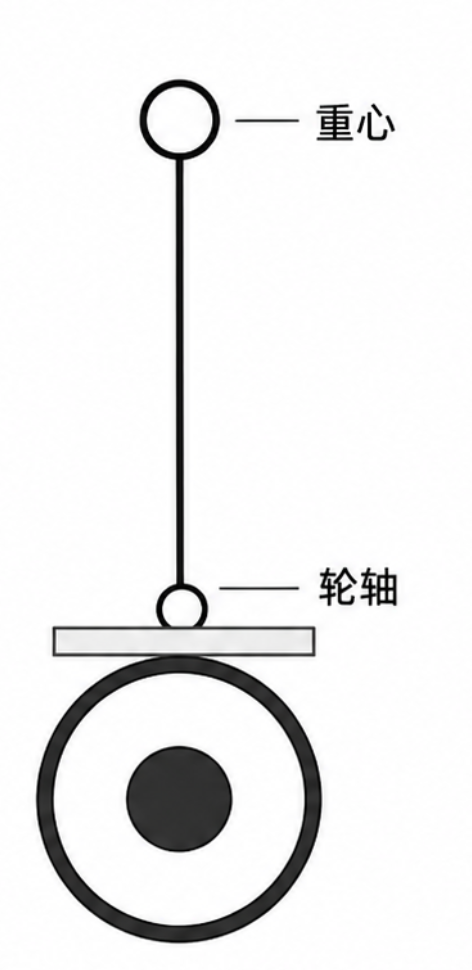
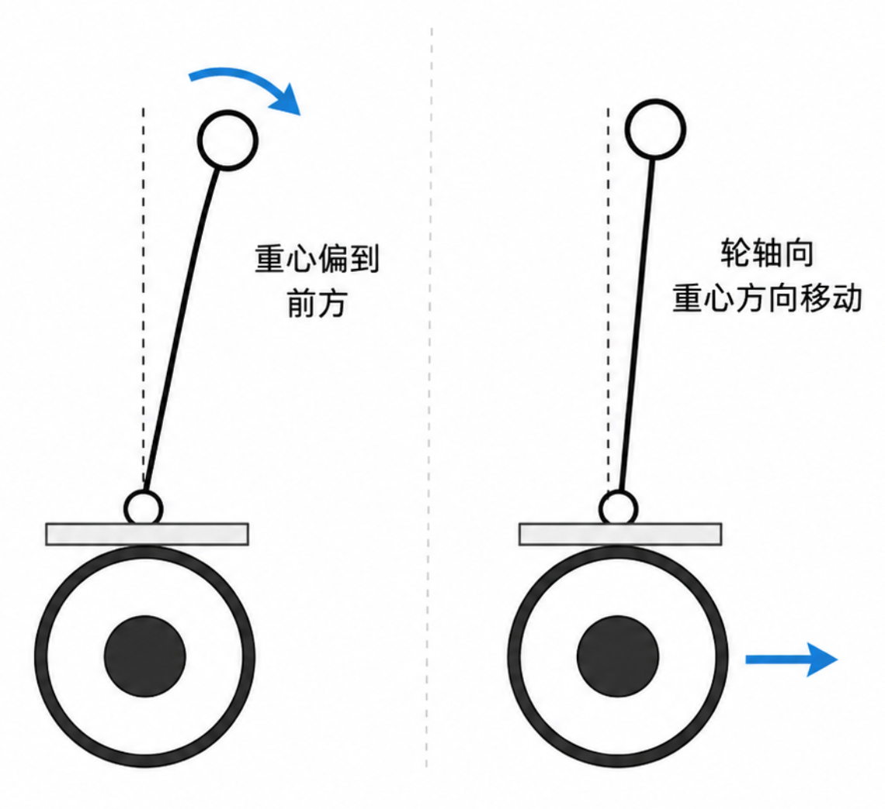
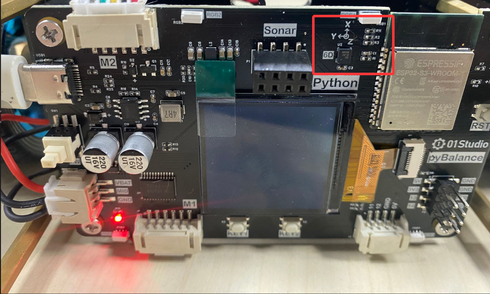
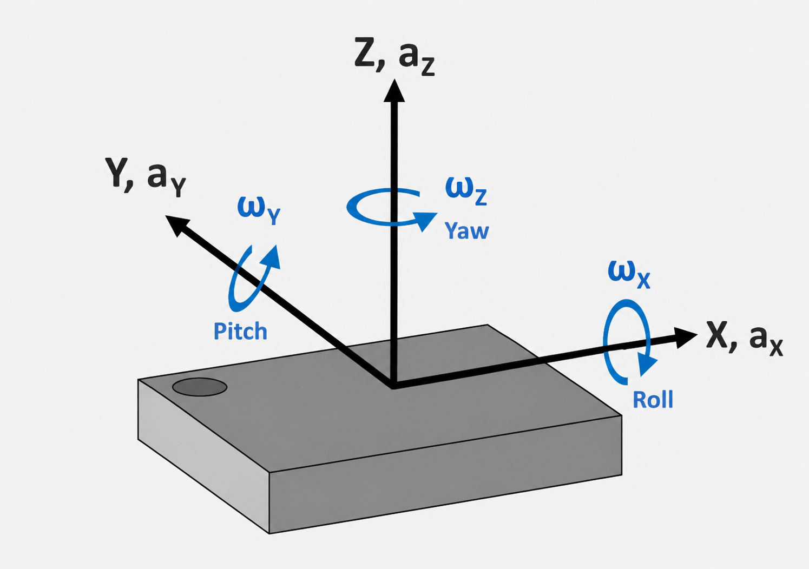
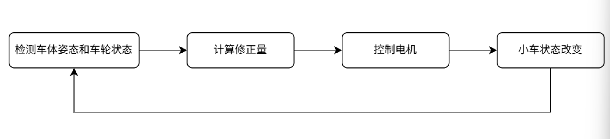

# 平衡小车基础知识

## 前言

由于 MicroPython 对底层控制功能进行了封装，平衡小车的姿态检测、电机控制等核心功能已经由底层模块实现，因此在 python 中可以通过简单的接口控制小车运动。为了更好地理解这些接口的作用，本节将结合平衡小车的一些基础知识，介绍其姿态以及保持平衡的基本原理。

## 直立平衡原理

当一个竖直物体的重心位于支撑点上方时，这种状态通常是不稳定的。物体稍微向一侧倾斜，重力就会使它继续向该方向倾倒。若想让物体保持直立，就需要不断移动下方的支撑点，使支撑点尽量跟随物体重心的位置变化。平衡小车正是利用类似的方法，通过车轮前后移动不断调整轮轴位置，从而保持车体直立。

为了便于理解平衡小车的工作原理，可以将小车简化为一个倒立摆模型。模型中，上方圆形表示车体重心，中间直线表示车体，底部支点表示车轮的轮轴，如图所示。

当小车保持直立时，车体重心位于轮轴上方，此时小车处于平衡位置。但这种平衡状态并不稳定，只要受到轻微扰动，车体就可能向前或向后倾斜。

当车体向前倾斜时，重心会偏移到轮轴前方，此时控制车轮向前运动，使轮轴向重心下方移动；当车体向后倾斜时，控制过程相同，只是车轮运动方向相反。

通过不断检测车体的倾斜状态并快速调整车轮位置，使轮轴尽量保持在车体重心下方，从而维持小车直立。因此，平衡小车的直立并不是完全静止的，而是通过车轮持续进行前后微小调整来实现动态平衡。为了及时进行调整，需要实时获取车体的倾斜角度和运动速度。

## 平衡姿态

pyBalance 板载 QMI8658A 六轴传感器，用于获取小车的姿态和运动信息。根据传感器的实际安装方向，X 轴正方向指向车头前方，Y 轴正方向指向小车左侧，Z 轴正方向指向小车上方，如下图所示。

根据上述传感器坐标方向，可以建立平衡小车的 X、Y、Z 三维坐标系。物体分别绕 X、Y、Z 轴旋转时，对应 Roll（横滚角）、Pitch（俯仰角）和 Yaw（偏航角），如下图所示。

对于平衡小车来说，车体主要会沿前后方向发生倾斜，因此直立平衡主要关注 Pitch（俯仰角）。关于 Pitch 的计算与融合方法，可参考 [QMI8658A 姿态角计算原理](../basic_examples/qmi8658.md#加速度计获取角度)。

## 平衡控制

获得小车的 Pitch（俯仰角）后，控制程序会将当前 Pitch 与直立位置进行比较，根据两者的偏差计算电机需要调整的输出。车体偏离直立位置时，电机带动车轮运动，及时调整轮轴位置，使车体重新靠近直立状态。

在这个过程中，车轮为了维持平衡会不断前后转动，小车也可能随之产生前后移动。因此，仅知道车体的 Pitch 还不够，还需要通过电机编码器检测车轮的转动方向和速度，了解小车当前的运动状态。

完整的平衡控制会结合 Pitch 和编码器的反馈不断调整电机输出。其中，Pitch 用于反映车体的倾斜状态，编码器用于反映车轮的运动状态。控制程序根据这两部分反馈持续调整电机输出，使小车在保持直立的同时，还能够控制前进、后退和停止。

小车状态发生改变后，QMI8658A 和编码器会再次获取新的状态信息，控制程序再根据新的反馈继续调整电机输出。整个过程不断重复，如下图所示。

这种不断检测小车状态，并根据反馈结果持续进行计算和修正的控制方式，就是常说的闭环控制。

