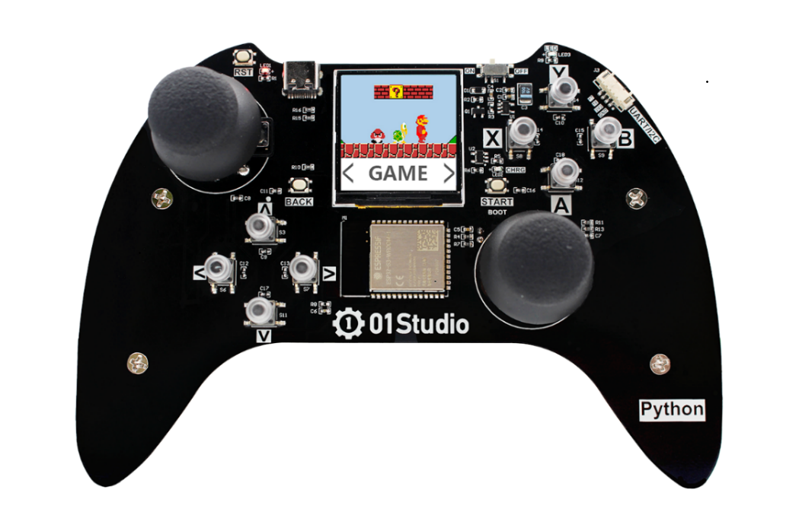
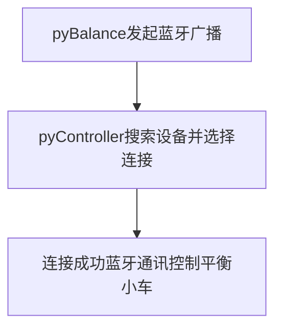
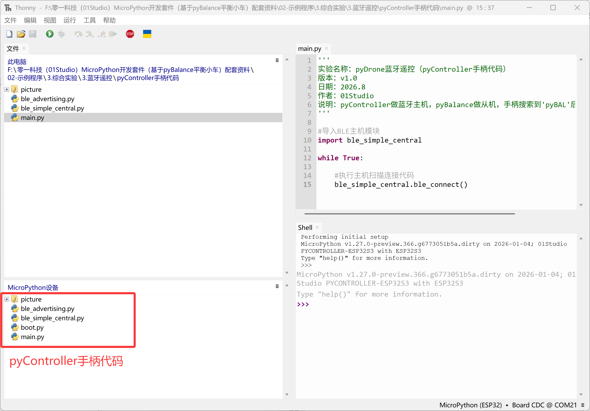
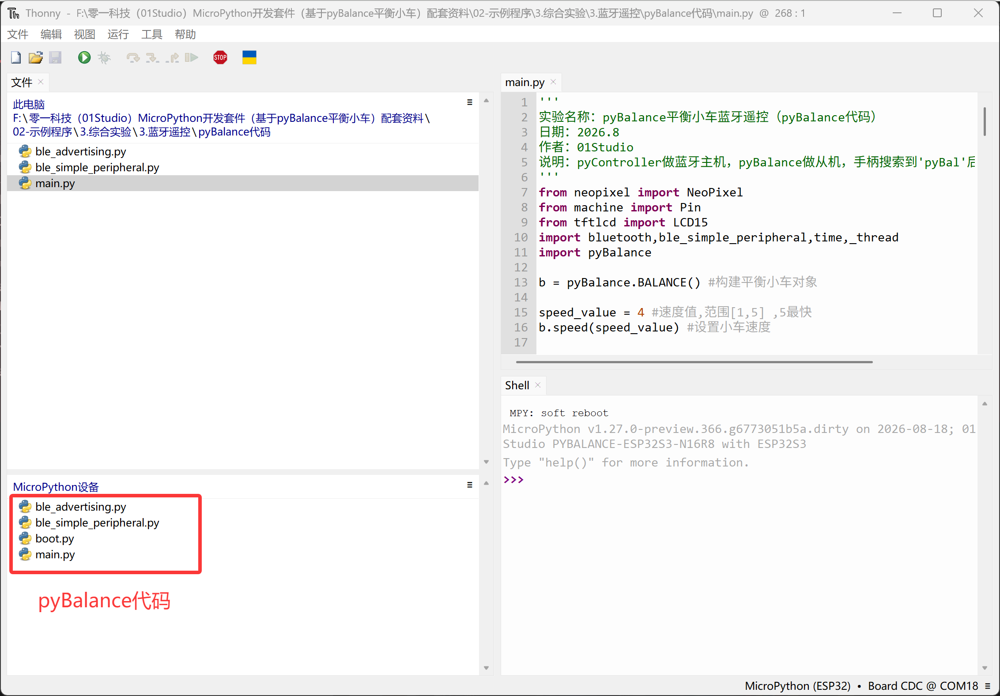
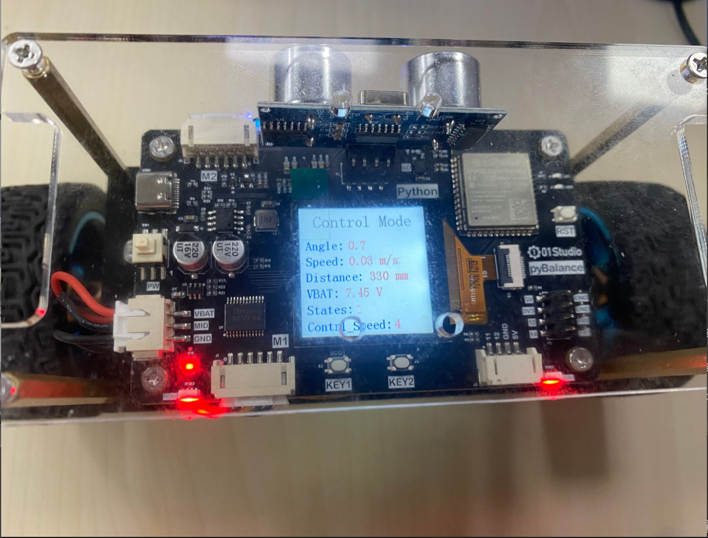
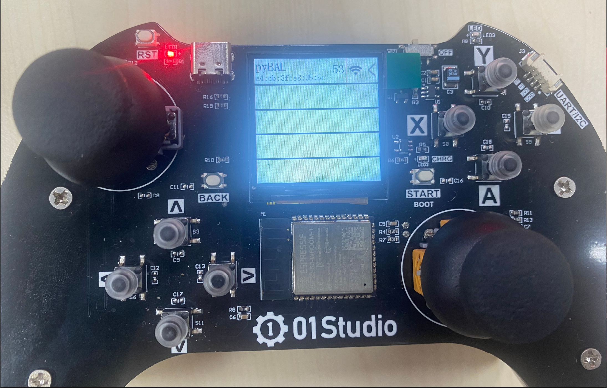
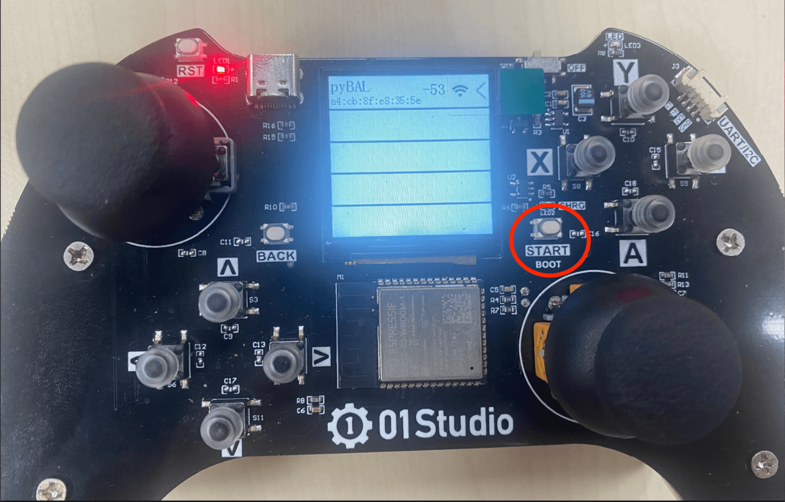
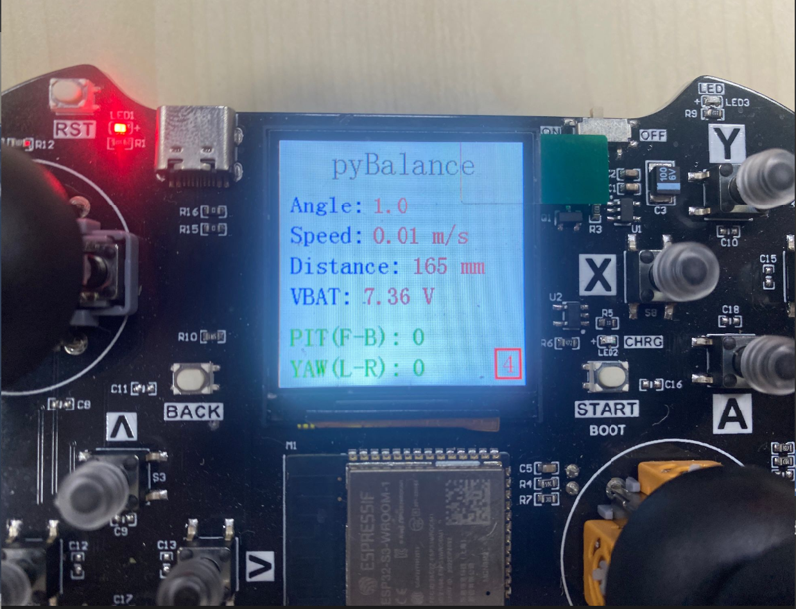
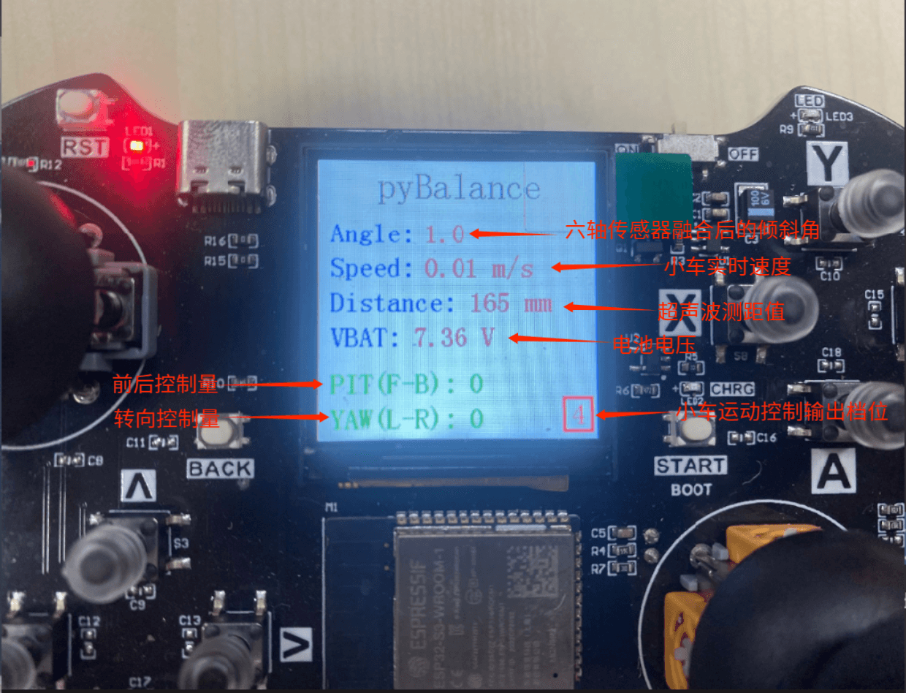
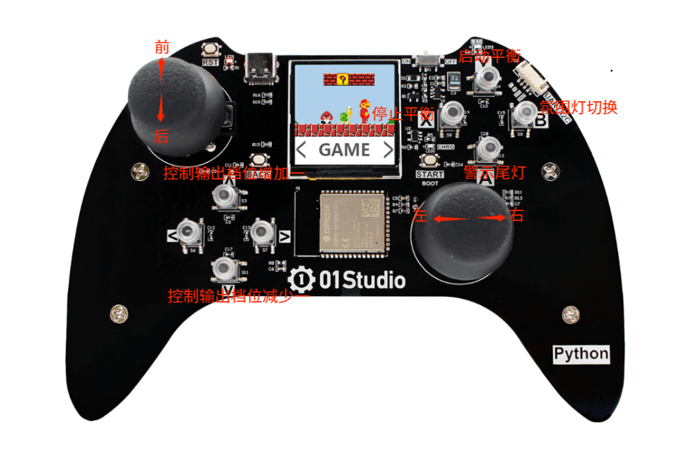

# 蓝牙控制

## 前言

上一节通过超声波测距实现了小车的自动跟随，本节将在此基础上实现 pyBalance 的蓝牙遥控功能。远程遥控平衡小车离不开遥控器，这里使用pyController手柄为例（手柄的摇杆比手机更有触感，体验更好），通过手柄发出信号，pyBalance接收后进行相应动作的变化。

## 实验平台

pyBalance和pyController手柄。




## 实验目的 

编程实现手柄通过pyController手柄蓝牙（BLE）方式控制pyBalance。

## 实验讲解

关于01Studio pyController遥控/游戏手柄学习教程见：https://wiki.01studio.cc/docs/pycontroller

平衡小车需要持续进行姿态检测、电机控制和超声波测距，对控制实时性要求较高。因此，01Studio pyBalance 将直立平衡、电机控制以及超声波数据采集等功能集成在固件底层，并通过 MicroPython 提供相应接口。通过开放出micropython接口，让用户通过简单的python语句便可实现pyBalance的各种控制。

我们先来看看pyBalance对象的构造函数和使用方法。

## BALANC对象

### 构造函数
```python
b = pyBalance.BALANCE()
```
构建pyBalance对象。

### 使用方法
```python
b.start()
```
启动平衡控制，使能电机输出。调用后，小车进入自平衡工作状态。

<br></br>

```python
b.stop()
```
停止平衡控制，关闭电机输出，用于突发情况停止或结束运行。

<br></br>

```python
b.speed(value=5)
```
设置小车运动控制的输出档位，范围为 [1, 5]，默认为 5。数值越大，控制前进、后退和转向时的电机输出越大，小车运动速度越快；数值越小，输出越小，运动速度越慢。

<br></br>

```python
b.control(pit=0, yaw=0)
```
控制平衡小车的前后运动和左右转向。

- ``pit``：前后运动控制量，范围为 -100 ~ 100。正值控制小车前进，负值控制小车后退，绝对值越大，前后运动的目标输出越大。
- ``yaw``：左右转向控制量，范围为 -100 ~ 100。正值控制小车向右转动，负值控制小车向左转动，绝对值越大，转向的目标输出越大。

<br></br>

```python
b.read_states()
```
读取平衡小车状态信息。返回8个数据的元组。

1、	倾斜角，范围：-1800 ~ 1800 ；角度10倍。

2、	小车实时速度， 单位 :mm/s。

3、	超声波距离，单位：mm ，范围：20mm ~ 4500mm 。

4、	电池电量，单位：10mv 。  

5、	小车启动状态：启动：1，停止：0。 

6、	小车控制运动输出比例：[1-5]。  

7、	遥控器pitch控制量，范围：-100 ~100 。

8、	遥控器yaw控制量，范围：-100 ~ 100 。

<br></br>

ESP32-S3固件集成了BLE库，支持低功耗蓝牙（BLE）主从机功能。关于BLE的应用细节不会在本节内容展开，这里我们只需要搞清楚主机(central)和从机（peripheral）的概念区别即可，蓝牙设备在连接过程如下：

**从机发起广播 –> 主机搜索广播的设备 –> 发起连接 –> 连接成功后通讯**

一般来说子设备通常作为从机，控制设备作为主机，比如我有一个蓝牙耳机（从机），开机后发起广播，而手柄（主机）在搜索，搜索到这个蓝牙耳机后就发起连接，连接成功后相互通讯。

本节中，我们将平衡小车设定从机，上电后发出广播，广播名称设为“pyBAL”，然后pyController手柄作为主机，上电后不断搜索周围的四轴设备，搜索后发起连接，连接成功后将手柄摇杆和按键原始数据发送给pyBalance，pyBalance接收到数据后执行各种运动动作。

结合上述讲解，总结出代码编写流程图如下：



## 参考代码

### pyBalance（蓝牙从机）代码

- `main.py`代码

```python
'''
实验名称：pyBalance平衡小车蓝牙遥控（pyBalance代码）
日期：2026.8
作者：01Studio
说明：pyController做蓝牙主机，pyBalance做从机，手柄搜索到'pyBAL'后发起连接，然后控制。
'''
from neopixel import NeoPixel
from machine import Pin
from tftlcd import LCD15
import bluetooth,ble_simple_peripheral,time,_thread
import pyBalance

b = pyBalance.BALANCE() #构建平衡小车对象

speed_value = 4 #速度值,范围[1,5] ,5最快
b.speed(speed_value) #设置小车速度

########################
# 构建1.5寸LCD对象并初始化
########################
d = LCD15(portrait=2) #默认方向竖屏

#定义红、绿、蓝、白、黑五种颜色
RED=(255,0,0)
GREEN=(0,255,0)
BLUE=(0,0,255)
WHITE=(255,255,255)
BLACK=(0,0,0)

#定义RGB灯珠
pin = Pin(45, Pin.OUT)
NUM_LEDS = 4
np = NeoPixel(pin, NUM_LEDS)

#普通车灯模式，车头灯白色，车尾灯红色。
def rgb_normal(): 

    np[0]=WHITE 
    np[1]=WHITE
    np[2]=RED 
    np[3]=RED
    np.write()

rgb_normal()

# ---------------- 全局控制 ----------------

running = True                   # 线程运行标志

# ---------------- 工具函数 ----------------

def hsv_to_rgb(h, s=1.0, v=1.0):
    """HSV转RGB，h范围0~1，返回0~255的(r,g,b)元组"""
    i = int(h * 6.0)
    f = h * 6.0 - i
    p = v * (1.0 - s)
    q = v * (1.0 - s * f)
    t = v * (1.0 - s * (1.0 - f))
    i = i % 6
    if   i == 0: r, g, b = v, t, p
    elif i == 1: r, g, b = q, v, p
    elif i == 2: r, g, b = p, v, t
    elif i == 3: r, g, b = p, q, v
    elif i == 4: r, g, b = t, p, v
    else:        r, g, b = v, p, q
    return (int(r * 255), int(g * 255), int(b * 255))

# ---------------- 彩虹线程函数 ----------------

def rainbow_thread():
    speed = 0.01
    offset = 0.0
    while running:                          # 检查标志位
        for i in range(NUM_LEDS):
            hue = ((i / NUM_LEDS) + offset) % 1.0
            np[i] = hsv_to_rgb(hue, 1.0, 1.0)
        np.write()
        offset = (offset + 1.0 / 256) % 1.0
        time.sleep(speed)
    # 线程退出前熄灭灯珠
    np.fill((0, 0, 0))
    np.write()

# ---------------- 线程启停控制函数 ----------------

def start_rainbow():
    """启动彩虹线程"""
    global running
    running = True
    _thread.start_new_thread(rainbow_thread, ())
    print("彩虹线程已启动")

def stop_rainbow():
    """终止彩虹线程（等其自行退出）"""
    global running
    running = False                        # 置标志位
    time.sleep(0.1)                        # 等待线程检测到并退出
    print("彩虹线程已停止")

fl_node = 0
bl_node = 0
no_key = 0
rgb_node = 0

#接收到蓝牙数据处理函数
def on_rx(text):
    
    global fl_node,bl_node,speed_value,no_key,rgb_node
    
    control_data = [None]*2
    
    #接收的蓝牙数据
    print("RX:", text)
    
    #对收到的手柄8字节数据进行判断
    for i in range(len(text)):
        print(i,text[i])
        
    #将摇杆值转化为飞控控制值。      
    for i in range(2):
        if  100 < text[i+2] < 155 :
            control_data[i] = 0
            
        elif text[i+2] <= 100 :      
            control_data[i] = text[i+2] - 100
            
        else:
            control_data[i] = text[i+2] - 155
    
    print('control:',control_data)
            
    #rol:[-100:100],rol:[-100:100],yaw:[-100:100],thr:[-100:100]
    b.control(pit = control_data[0], yaw = control_data[1])
    
    #控制速度调试
    if text[5] ==  0: #上键按下
        
        
        if no_key == 1:
            
            no_key = 0 
            
            speed_value = speed_value + 1
            if speed_value > 5:
                speed_value = 5
            
            b.speed(speed_value) #调速
            
   #控制速度调试
    if text[5] ==  4: #下键按下
        
        if no_key == 1:
            
            no_key = 0 
            
            speed_value = speed_value - 1
            
            if speed_value < 1:
                speed_value = 1
                
            b.speed(speed_value) #调速    

    
    #检测X/Y/A/B按键
    if text[5] == 24: #Y键按下
        
        print('Y')
        b.start() #启动                 
 
        
    if text[5] == 72: #A键按下
        
        print('A')
        
        if no_key == 1:
            
            no_key = 0
            
            bl_node = not bl_node #灯光取反变化
            
            if bl_node:
        
                np[2]=RED 
                np[3]=RED
                np.write()
            
            else:
                
                np[2]=BLACK 
                np[3]=BLACK
                np.write()                    
 
    if text[5] == 40: #B键按下，可以自己添加功能。
        
        print('B')
        
        if no_key == 1:
            
            no_key = 0
                
            rgb_node = rgb_node + 1
            if rgb_node > 2:
                rgb_node = 0
            
            if rgb_node == 0:
                rgb_normal()                
                
            elif rgb_node == 1:
                start_rainbow()                
            
            elif rgb_node == 2:
                stop_rainbow()
                        

        
    if text[5] == 136: #X键按下,紧急停止
        print('X')
        #降落，不允许control
        b.stop()
        
    if text[5] ==  8: #无按键按下
        
        no_key = 1
        
    #读取平衡小车状态信息
    states = b.read_states()
    print('states: ',states)
    state_buf = [None]*16
    for i in range(8):
        for j in range(2):
            if j == 0:
                state_buf[i*2+j] = int((states[i]+32768)/256)
            else:
                state_buf[i*2+j] = int((states[i]+32768)%256)
                
    p.send(bytes(state_buf)) #蓝牙回传姿态、电机控制和超声波测距等数据


d.fill(WHITE) #设置屏幕的背景是白色

b.start() #启动
        
#初始化蓝牙BLE从机,广播名称为pyDrone
ble = bluetooth.BLE()
p = ble_simple_peripheral.BLESimplePeripheral(ble,name='pyBAL')

#注册从机接收回调函数，收到数据会进入on_rx函数。#系统会自动广播, 连接断开后重新自动广播。
p.on_write(on_rx)

while True:
    
    data = b.read_states()
    #print(data)
    d.printStr('Control Mode', 25, 10, BLACK, size=3)
    d.printStr('Angle:', 10, 60, BLUE, size=2)
    d.printStr(str(data[0]/10)+ ' '*5, 90, 60, RED, size=2)
    d.printStr('Speed:', 10, 90, BLUE, size=2)
    d.printStr(str('%.2f'%(data[1]/1000))+' m/s'+' '*3, 90, 90, RED, size=2)
    d.printStr('Distance:', 10, 120, BLUE, size=2)
    d.printStr(str(data[2])+' mm'+' '*3, 130, 120, RED, size=2)
    d.printStr('VBAT:', 10, 150, BLUE, size=2)
    d.printStr(str('%.2f'%(data[3]/100))+' V'+' '*3, 80, 150, RED, size=2)
    d.printStr('States:', 10, 180, BLUE, size=2)
    d.printStr(str(data[4]), 100, 180, RED, size=2)
    d.printStr('Contrl_Speed:', 10, 210, BLUE, size=2)
    d.printStr(str(data[5]), 170, 210, RED, size=2)
    time.sleep_ms(100)

```

### pyController遥控手柄（蓝牙主机）代码

- `main.py`代码

```python
'''
实验名称：pyDrone蓝牙遥控（pyController手柄代码）
版本：v1.0
日期：2026.8
作者：01Studio
说明：pyController做蓝牙主机，pyBalance做从机，手柄搜索到'pyBAL'后发起连接，然后控制。
'''

#导入BLE主机模块
import ble_simple_central

while True:
    
    #执行主机扫描连接代码
    ble_simple_central.ble_connect()
```

- `ble_simple_central.py`关键代码：

```python

...

def ble_connect():
    
    ble = bluetooth.BLE()
    central = BLESimpleCentral(ble)

    not_found = False
    
    def on_scan(addr_type, addr, name):
        if addr_type is not None:
            print("Found peripheral:", addr_type, addr, name)
            central.connect()
        else:
            global not_found
            not_found = True
            print("No peripheral found.")

    central.scan(callback=on_scan)

    # Wait for connection...
    while not central.is_connected():
        time.sleep_ms(100)
        if not_found:
            break

    print("Connected")

    
    #接收信息处理
    def on_rx(v):
    
        state_buf = [None]*16
        
        #解码接收到的7个数据
        for i in range(8):
                
            state_buf[i] = v[i*2]*256+v[i*2+1] - 32768
        
        l.printStr('pyBalance', 50, 5, BLACK, size=3)
        l.printStr('Angle:', 10, 50, BLUE, size=2)
        l.printStr(str('%.1f'%(state_buf[0]/10))+ ' '*3, 90, 50, RED, size=2)
        l.printStr('Speed:', 10, 80, BLUE, size=2)
        l.printStr(str('%.2f'%(state_buf[1]/1000))+' m/s'+' '*3, 90, 80, RED, size=2)           
        l.printStr('Distance:', 10, 110, BLUE, size=2)
        l.printStr(str(state_buf[2])+' mm'+' '*3, 130, 110, RED, size=2)
        l.printStr('VBAT:', 10, 140, BLUE, size=2)
        l.printStr(str('%.2f'%(state_buf[3]/100))+' V'+' '*3, 80, 140, RED, size=2)


        l.printStr('PIT(F-B): '+str(state_buf[6])+' '*3, 10, 180, GREEN, size=2)
        
        l.printStr('YAW(L-R): '+str(state_buf[7])+' '*3, 10, 210, GREEN, size=2)
        
        #速度
        l.drawRect(210, 204, 26, 30, RED, border=3, fillcolor=None)
        l.printStr(str(state_buf[5]), 218, 207, RED, size=2)
        
    central.on_notify(on_rx)

    with_response = False

    while central.is_connected():

        try:
            a = gamepad.read() #读取手柄数据
            #print("TX", a) #打印手柄原始数据
            central.write(bytes(a), with_response) #发送手柄数据
        except:
            print("TX failed")
        time.sleep_ms(400 if with_response else 50) #50ms发送一次
        
    print("Disconnected")

...

```

## 实验结果

运行参考代码前，要先完成 [QMI8658A 六轴传感器校准](./cail.md)。未校准的传感器误差会影响姿态计算，从而导致小车无法稳定保持平衡。

将**示例程序--综合实验--蓝牙遥控**的所有库代码文件分别发送到pyController和pyBalance。





将平衡小车扶正后，打开电池供电开关，小车进入直立平衡状态，前后灯珠点亮。




然后启动手柄，可以看到搜索到pyBAL，信息包含mac地址和信号强度。（支持多台pyBAL同时搜索）。


信号强的范围是 0 ~ -99, 值越接近0表示信号越好。



如果搜索到多台，可以通过按手柄的上、下键来选择，长按START键即可连接pyBAL。



连接成功后手柄显示屏出现pyBalance发送的实时信息界面。



LCD 从上到下依次显示标题、六轴传感器融合后的倾斜角、小车实时速度、超声波测距值、电池电压、遥控器 Pit 前后控制量和 Yaw 转向控制量。右侧边框中的数值表示当前小车运动控制输出档位。



这时候即可遥控平衡小车。手柄控制说明如下：



启动平衡：启动平衡控制并使能电机输出。正常情况下，小车扶正后上电即可自动进入平衡状态，因此一般无需手动启动。该功能主要用于小车已停止平衡控制后重新启动，例如将小车斜靠放置且倾斜角度未超过 60° 时，可通过该按键重新进入平衡控制状态。

注意： 当小车倾斜角度超过 60° 触发保护机制后，电机输出会被关闭，此时启动平衡按键不能绕过该保护。需要先将小车扶回允许的倾斜范围内，再重新启动平衡控制。

停止平衡：停止平衡控制，同时关闭电机输出。

氛围灯切换：循环切换前后灯珠颜色及关闭状态。

警示尾灯：开启或关闭车尾红色警示灯，用于提醒后方。由于警示尾灯与氛围灯共用车尾灯珠，使用警示尾灯时建议先将氛围灯切换至关闭状态，避免灯光显示冲突。

控制输出档位加一：每按一次，运动控制输出档位增加 1，最高为 5。

控制输出档位减一：每按一次，运动控制输出档位减少 1，最低为 1。

控制输出档位对应 b.speed() 的设置值，用于调整小车运动控制的输出比例，并不表示小车的实际速度。

左摇杆：向前推动控制小车前进，向后推动控制小车后退；左右推动不参与控制。

右摇杆：向左推动控制小车左转，向右推动控制小车右转；前后推动不参与控制

> **注意：** 当小车的 Pitch（俯仰角）绝对值超过 `60°` 时，系统会判断小车已经失去平衡，并立即关闭电机输出。此时启动平衡按键无法绕过保护，需要先将小车扶回允许的倾斜范围内，再重新启动平衡控制。

**总结：平衡小车对控制实时性要求较高，pyBalance 将姿态检测和平衡控制等功能集成在底层，并通过 MicroPython 提供简单的控制接口。用户只需处理手柄输入并调用相应接口，即可实现小车的前进、后退、转向、灯光以及停止平衡等功能。**
