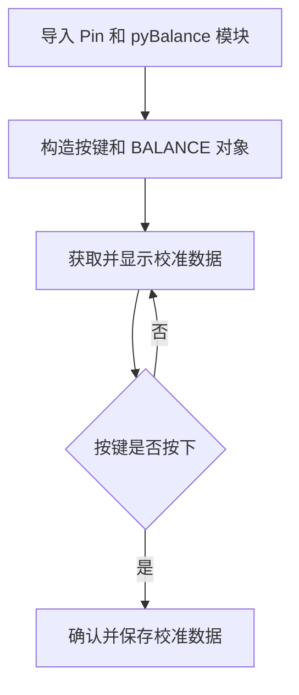
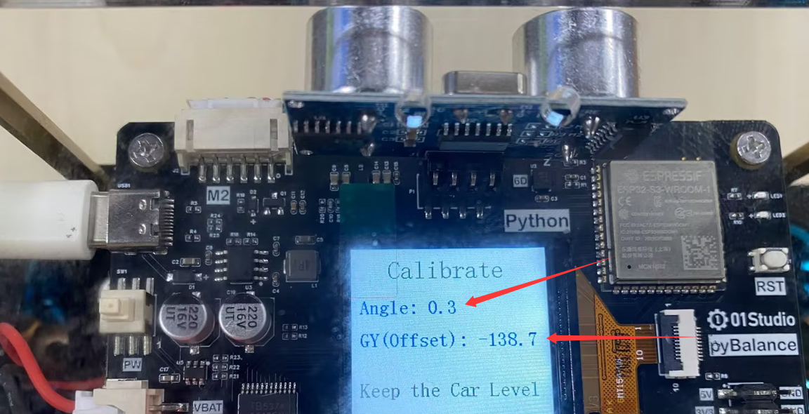
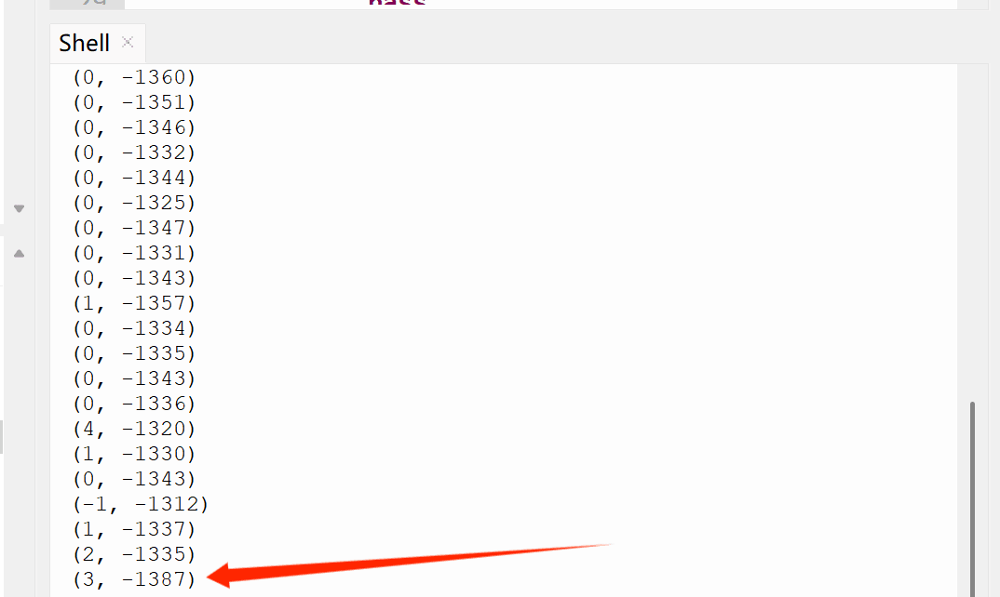
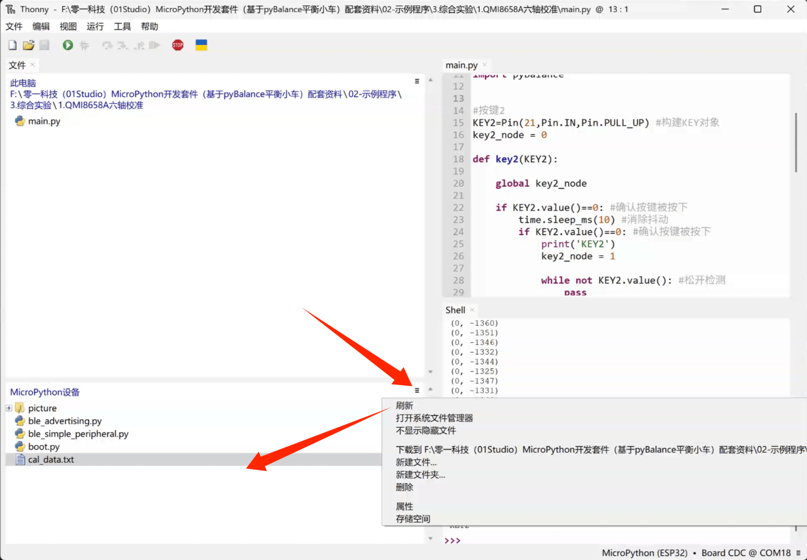

# 六轴传感器校准

## 前言

QMI8658A 在实际使用中会受到传感器误差和安装偏差等影响，导致小车直立时的倾斜角和静止时的陀螺仪数据存在偏差，因此需要进行校准。

本实验主要校准两个关键参数：

- **倾斜角零点**：记录小车直立时的倾斜角，作为平衡位置的参考值。
- **陀螺仪零偏**：记录小车静止时的陀螺仪平均值，用于补偿静态偏差。

校准后的数据将用于后续的姿态计算和平衡控制。

## 实验平台

pyBalance


## 实验目的 

了解 QMI8658A 的零点误差，并通过程序完成平衡小车的倾斜角零点和陀螺仪零偏校准。

## 实验讲解

校准时，将小车保持直立并尽量静止。小车前后倾斜对应绕 Y 轴的 Pitch（俯仰）方向，程序进行 20 次采样，分别计算加速度计得到的 Pitch 倾斜角平均值和陀螺仪 Y 轴（GY）原始数据平均值。采用多次采样取平均，目的减小传感器瞬时波动对校准结果的影响。


其中，加速度计倾斜角平均值用于校正倾斜角的零点，使其在姿态融合中提供正确的角度参考；陀螺仪原始数据平均值用于校正静止状态下的陀螺仪零偏。

关于加速度计倾斜角和陀螺仪角速度的基础原理，可参考：

- [QMI8658A 六轴传感器](../basic_examples/qmi8658.md)

确认校准后，这两个参数会保存到 `cal_data.txt` 文件中。小车再次上电时会自动读取并使用保存的校准参数，无需每次重新校准。

我们先来看看pyBalance对象的构造函数和校准使用方法。

## BALANC对象

### 构造函数
```python
b = pyBalance.BALANCE()
```
构建pyBalance对象。

### 使用方法
```python
b.read_cal_data()
```
获取当前校准数据。函数连续采集 20 次传感器数据并计算平均值，返回以下两个数据：
- `倾斜角度平均值`：根据加速度计 X、Z 轴数据计算得到的 Y 轴方向倾斜角（Pitch）平均值，范围为 `-1800 ~ 1800`，数值放大 10 倍以保留 1 位小数。
- `陀螺仪原始平均值`：陀螺仪 Y 轴（GY）原始数据的平均值，理论范围为 `-327680 ~ 327670`，数值放大 10 倍以保留 1 位小数。

<br></br>

```python
b.confirm_cal()
```
确认并保存当前校准数据。将 b.read_cal_data() 获取的倾斜角度平均值和角速度原始平均值写入 cal_data.txt 文件，作为小车的校准参数。下次开机时会自动读取该文件，并使用保存的参数进行校准。

```python
b.cal_states()
```
获取当前校准状态，用于判断小车上电后是否成功加载校准数据。
- `1`: 已成功读取 cal_data.txt 中的校准数据，校准已生效。
- `0` : 未找到 cal_data.txt，或文件中的校准数据不完整，校准未生效。

更多用法请参阅 [pyBalance API 手册](./api.md)。

将小车保持直立并静止，读取当前校准数据并显示。确认数据后，按下按键保存校准参数。代码编写流程如下：



## 参考代码

```python

'''
实验名称：QMI8658A六轴传感器校准
版本：v1.0
日期：2026.8
作者：01Studio
说明：获取校准数据，保存校准数据到cal_data.txt文中。
'''
from machine import Pin
from tftlcd import LCD15
import bluetooth,ble_simple_peripheral,time,_thread
import pyBalance


#按键2
KEY2=Pin(21,Pin.IN,Pin.PULL_UP) #构建KEY对象
key2_node = 0

def key2(KEY2):
    
    global key2_node
    
    if KEY2.value()==0: #确认按键被按下
        time.sleep_ms(10) #消除抖动
        if KEY2.value()==0: #确认按键被按下
            print('KEY2')
            key2_node = 1
            
            while not KEY2.value(): #松开检测
                pass

KEY2.irq(key2,Pin.IRQ_FALLING) #定义中断，下降沿触发

b = pyBalance.BALANCE() #构建平衡小车对象

########################
# 构建1.5寸LCD对象并初始化
########################
d = LCD15(portrait=2) #默认方向竖屏

#定义红、绿、蓝、白、黑五种颜色
RED=(255,0,0)
GREEN=(0,255,0)
BLUE=(0,0,255)
WHITE=(255,255,255)
BLACK=(0,0,0)

d.fill(WHITE)
while True:
    
    cal_data = b.read_cal_data()
    print(cal_data)
    d.printStr('Calibrate', 45, 10, BLACK, size=3)
    d.printStr('Angle: '+str('%.1f'%(cal_data[0]/10))+'   ', 10, 60, BLUE, size=2)
    d.printStr('GY(Offset): '+str('%.1f'%(cal_data[1]/10))+'   ', 10, 100, BLUE, size=2)
    d.printStr('Keep the Car Level', 10, 160, BLACK, size=2)
    d.printStr('Press KEY2 Confirm!', 10, 200, RED, size=2)
    time.sleep_ms(20)
    
    if key2_node: #确认键按下

        key2_node = 0 #清除按键标志位
        
        b.confirm_cal() #执行校准
        
        d.printStr('Success! Exit...   ', 10, 200, RED, size=2)
        
        time.sleep(2)

        break

```

## 实验结果

运行程序后，LCD 会实时显示当前校准数据，并提示按下 KEY2 确认校准。由于 `b.read_cal_data()` 返回的数据放大了 10 倍，因此 LCD 显示时需要先除以 `10`，再保留 1 位小数。Thonny 终端中直接打印 `b.read_cal_data()` 的返回值，因此显示的是未除以 `10` 的返回数据。





按键确认校准后，文件系统中会生成 `cal_data.txt` 文件。在 Thonny 刷新 MicroPython 设备文件列表后，可以看到该文件。



通过 Thonny 打开该文件，可以看到校准数据以 6 位小数保存；LCD 显示时则保留 1 位小数，便于查看。两者只是保存和显示精度不同，实际表示的是同一组校准数据。将 `cal_data.txt` 中的数据保留 1 位小数后，可以与 Thonny 终端最后一次输出以及确认校准后 LCD 保持显示的数据进行对比，结果应保持一致。


注意了如果 `cal_data.txt` 文件已经存在，再次确认校准时会覆盖原有数据，并保存最新的校准参数。
