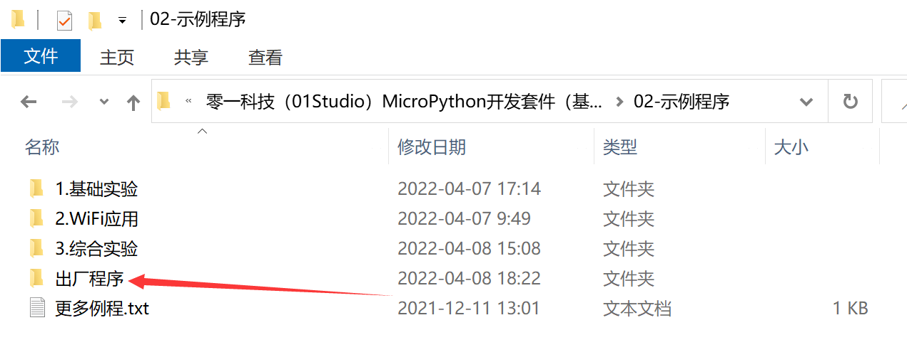
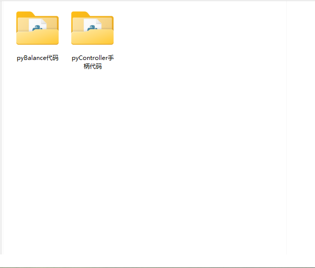
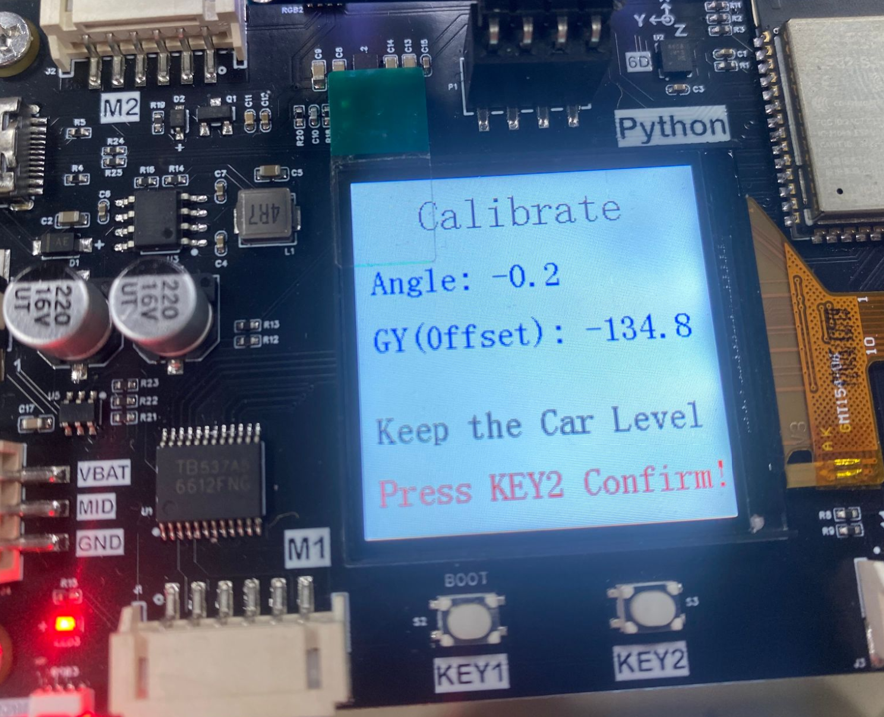
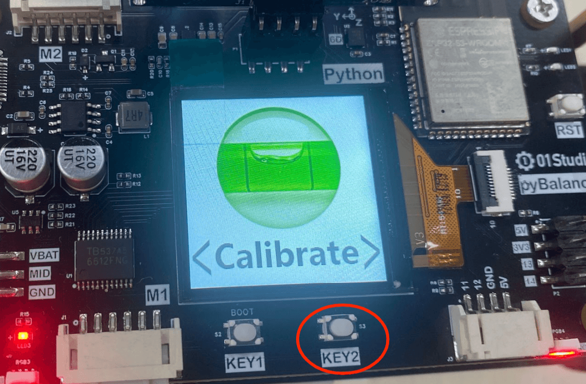
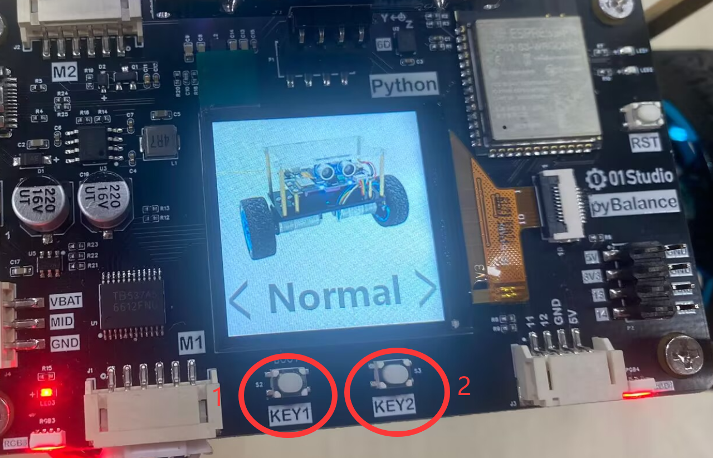
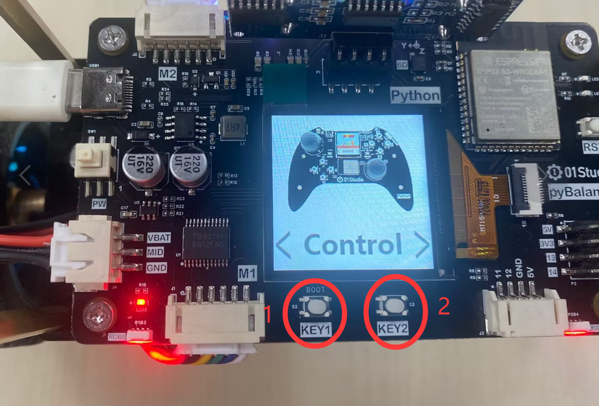
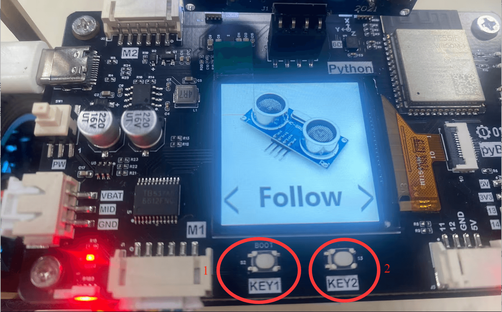
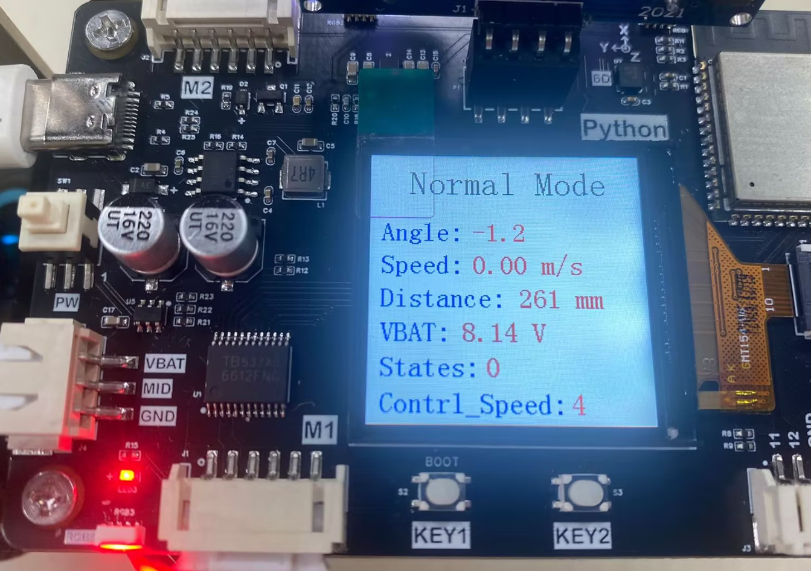
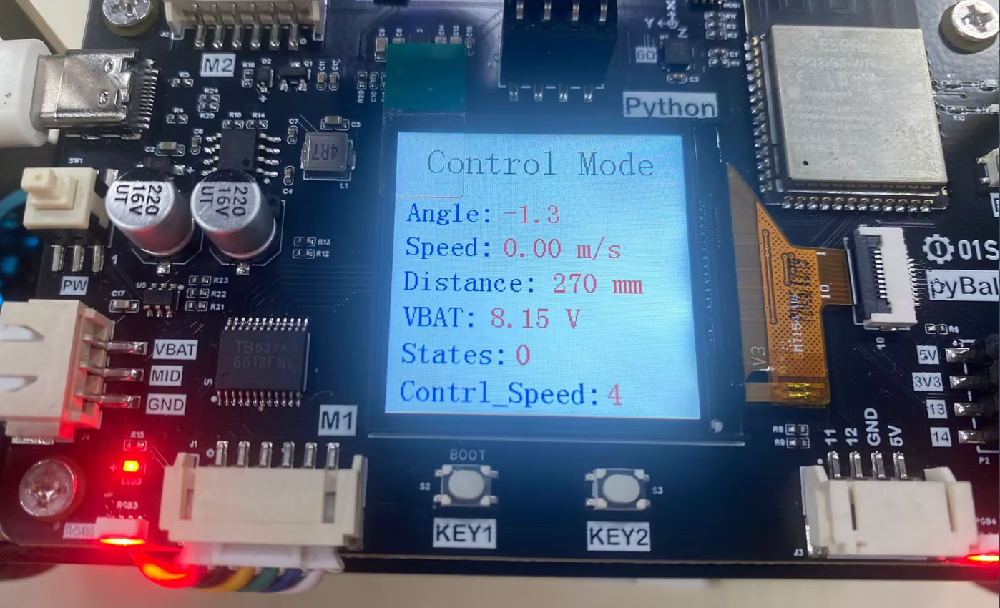
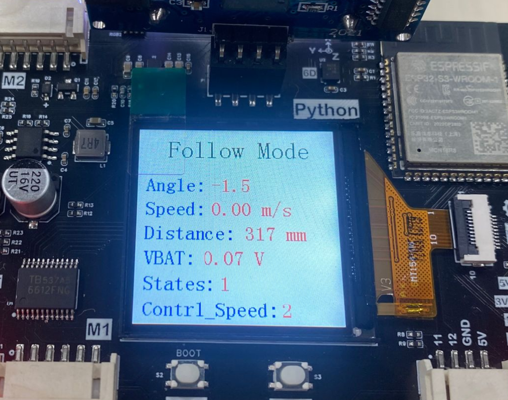

# 出厂例程

资料包的示例程序中提供了 pyBalance 出厂例程。

出厂例程包含 `pyBalance` 和 `pyController` 两部分程序，分别运行在平衡小车和手柄上。

其中，pyBalance 集成了六轴传感器校准、直立模式、蓝牙遥控和超声波跟随等功能；pyController 则集成了 NES 游戏、pyCar 遥控车、pyDrone 四轴飞行器、pyBalance 平衡小车以及手柄测试等功能，两者均配有相应的图形化操作界面。

这里主要介绍 pyBalance 的图形化操作界面及各功能的使用方法。pyController 主要作为遥控手柄使用，因此这里不再单独介绍其界面和其他功能。

## 初始化

小车上电后会首先检测是否存在有效的 `cal_data.txt` 校准文件。如果未检测到校准数据，则自动进入六轴传感器校准界面。

完成校准后，按下 KEY2 确认并保存校准数据，随后返回功能选择界面，并停留在“六轴传感器校准”选项。

在功能选择界面中，按下 KEY1 可以在 **直立模式 → 蓝牙遥控 → 超声波跟随 → 六轴传感器校准** 之间循环切换，按下 KEY2 确认并进入当前选择的功能。

## 直立模式

进入直立模式后，小车仅保持自身平衡，不执行其他附加功能，界面如下。

## 蓝牙遥控

蓝牙遥控功能与前面的 [蓝牙遥控](./ble_control.md) 实验一致，可通过 pyController 手柄控制小车前进、后退和转向。

## 超声波跟随

超声波跟随功能与前面的 [超声波跟随](./follow.md) 实验一致，小车可根据目标物体距离自动前进或后退。

## 六轴传感器校准

六轴传感器校准功能与前面的 [六轴传感器校准](./cail.md) 实验操作方式一致。

完成校准并确认后，新的校准数据会写入 `cal_data.txt` 文件；如果原有校准文件已经存在，则会使用本次校准结果覆盖原有数据。

与前面的独立实验不同，出厂例程增加了开机校准检测功能。当系统未检测到有效的校准数据时，会自动进入六轴传感器校准界面，完成校准后再返回功能选择界面。

## 程序部署

使用 Thonny IDE 将出厂例程中 pyBalance 和 pyController 对应文件夹内的所有程序文件，分别上传到 pyBalance 和 pyController 文件系统中，即可运行出厂例程。

出厂例程主要是将前面各独立实验功能进行整合，用户也可以通过查看源码进一步了解各功能之间的组织和调用方式。
