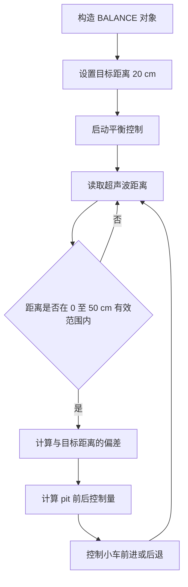
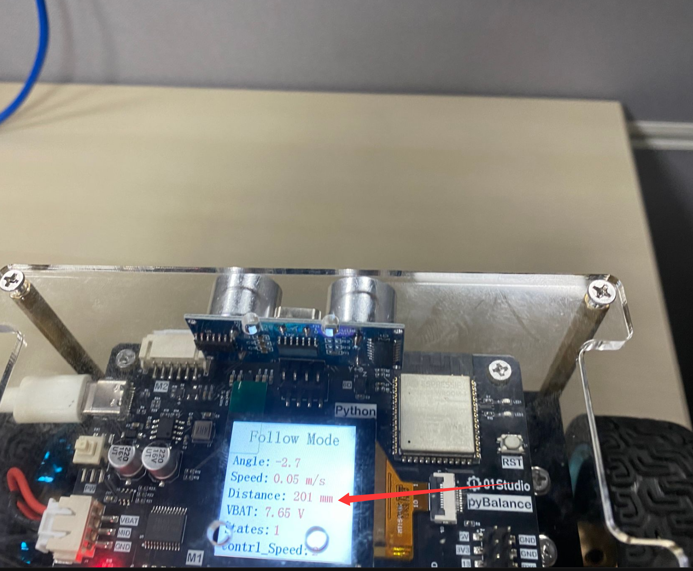

# 超声波跟随

## 前言

在上一节中，我们完成了六轴传感器的校准。本节将在小车保持直立平衡的基础上，实现前后运动，并结合超声波传感器完成跟随功能。

## 实验平台

pyBalance。


## 实验目的 

编程实现小车在保持直立平衡的状态下进行超声波跟随。当检测距离在0~50cm有效范围内时，小车根据当前距离与目标距离 20 cm 的偏差自动前进或后退，使小车保持在目标距离附近。

## 实验讲解

平衡小车需要持续进行姿态检测、电机控制和超声波测距，对控制实时性要求较高。因此，pyBalance 将直立平衡、电机控制以及超声波数据采集等功能集成在固件底层，并通过 MicroPython 提供相应接口。

用户无需自行编写底层控制和传感器驱动程序，只需读取 pyBalance 返回的距离数据，并根据目标距离计算前后运动控制量，即可实现超声波跟随。

下面介绍本实验中使用到的 pyBalance 对象及相关控制方法。

## BALANC对象

### 构造函数
```python
b = pyBalance.BALANCE()
```
构建pyBalance对象。

### 使用方法
```python
b.start()
```
启动平衡控制，使能电机输出。调用后，小车进入自平衡工作状态。

<br></br>

```python
b.stop()
```
停止平衡控制，关闭电机输出，用于突发情况停止或结束运行。

<br></br>

```python
b.speed(value=5)
```
设置小车运动控制的输出档位，范围为 [1, 5]，默认为 5。数值越大，控制前进、后退和转向时的电机输出越大，小车运动速度越快；数值越小，输出越小，运动速度越慢。

<br></br>

```python
b.control(pit=0, yaw=0)
```
控制平衡小车的前后运动和左右转向。

- ``pit``：前后运动控制量，范围为 -100 ~ 100。正值控制小车前进，负值控制小车后退，绝对值越大，前后运动的目标输出越大。
- ``yaw``：左右转向控制量，范围为 -100 ~ 100。正值控制小车向右转动，负值控制小车向左转动，绝对值越大，转向的目标输出越大。

<br></br>

```python
b.read_states()
```
读取平衡小车状态信息。返回8个数据的元组。

1、	倾斜角，范围：-1800 ~ 1800 ；角度10倍。

2、	小车实时速度， 单位 :mm/s。

3、	超声波距离，单位：mm ，范围：20mm ~ 4500mm 。

4、	电池电量，单位：10mv 。  

5、	小车启动状态：启动：1，停止：0。 

6、	小车遥控运动速度：[1-5]。  

7、	遥控器pitch控制量，范围：-100 ~100 。

8、	遥控器yaw控制量，范围：-100 ~ 100 。

<br></br>

设置超声波有效检测范围为 0 ~ 50 cm，目标跟随距离为 20 cm。启动小车平衡控制后，根据超声波测得的距离与目标距离计算前后运动控制量，实现自动跟随。代码编写流程如下：



## 参考代码

运行参考代码前，要先完成 QMI8658A 六轴传感器校准。未校准的传感器误差会影响姿态计算，从而导致小车无法稳定保持平衡。

```python
'''
实验名称：超声波跟随
版本：v1.0
日期：2026.8
作者：01Studio
说明：小车在保持直立平衡的状态下进行超声波跟随。
'''
from machine import Pin
from tftlcd import LCD15
import pyBalance
import time

b = pyBalance.BALANCE() #构建平衡小车对象

speed_value = 2 #速度值,范围[1,5] ,5最快
b.speed(speed_value) #设置小车速度

########################
# 构建1.5寸LCD对象并初始化
########################
d = LCD15(portrait=2) #默认方向竖屏

#定义红、绿、蓝、白、黑五种颜色
RED=(255,0,0)
GREEN=(0,255,0)
BLUE=(0,0,255)
WHITE=(255,255,255)
BLACK=(0,0,0)

d.fill(WHITE)

target = 200 #跟随墓碑距离200mm
count = 0

b.start() #启动平衡控制
while True:

    data = b.read_states()
    #print(data)
    if count == 10: #定时刷新
        d.printStr('Follow Mode', 35, 10, BLACK, size=3)
        d.printStr('Angle:', 10, 60, BLUE, size=2)
        d.printStr(str(data[0]/10)+ ' '*5, 90, 60, RED, size=2)
        d.printStr('Speed:', 10, 90, BLUE, size=2)
        d.printStr(str('%.2f'%(data[1]/1000))+' m/s'+' '*3, 90, 90, RED, size=2)
        d.printStr('Distance:', 10, 120, BLUE, size=2)
        d.printStr(str(data[2])+' mm'+' '*3, 130, 120, RED, size=2)
        d.printStr('VBAT:', 10, 150, BLUE, size=2)
        d.printStr(str('%.2f'%(data[3]/100))+' V'+' '*3, 80, 150, RED, size=2)
        d.printStr('States:', 10, 180, BLUE, size=2)
        d.printStr(str(data[4]), 100, 180, RED, size=2)
        d.printStr('Contrl_Speed:', 10, 210, BLUE, size=2)
        d.printStr(str(data[5]), 170, 210, RED, size=2)
        count = 0

    count = count + 1 
    distance = data[2]

    if distance > 0 and distance < 500: #有效运动范围
        error = distance - target
            
        pit = int(error * 0.6)  

        if pit > 100:
            pit = 100

        if pit < -100:
            pit = -100

        b.control(pit=pit, yaw=0)                       
    else:
        b.control(pit=0, yaw=0)
    
    time.sleep_ms(10)
```

## 实验结果

运行参考代码前，请先完成 [QMI8658A 六轴传感器校准](./cail.md)。

将 **示例程序 → 综合实验 → 超声波跟随** 中的 `main.py` 发送到 pyBalance。

将平衡小车扶正，并将目标物体放置在小车前方 `50 cm` 的有效检测范围内。打开电池供电开关后，小车进入直立平衡状态。


小车会根据超声波测得的距离自动前进或后退，并尽量保持与目标物体约 `20 cm` 的距离，同时 LCD 会实时显示当前的超声波测距数据。当目标物体超出 `0 ~ 50 cm` 的有效检测范围时，小车停止跟随，并继续保持直立平衡。



实际使用时，可根据地面情况通过 `b.speed()` 调整小车前后运动的输出档位，范围为 `[1, 5]`。当地面阻力较大时，可适当增大输出档位；当地面较光滑时，可适当减小输出档位。

由于超声波测距存在一定的刷新周期，如果小车运动速度过快，可能在新的距离数据更新前超过目标位置，出现前后过冲的现象。因此，在较光滑的地面上建议适当降低 `b.speed()` 的设置值，使跟随过程更加平稳。

> **注意：** 当小车的 Pitch（俯仰角）绝对值超过 `60°` 时会触发保护机制，系统判断小车已经失去平衡，并立即停止电机输出。