# 视觉巡线

## 前言

本节我们结合机器视觉的机器人巡线（实线）CyberCAM作为上位机，平衡小车做为下位机会来实现小车巡线行驶。

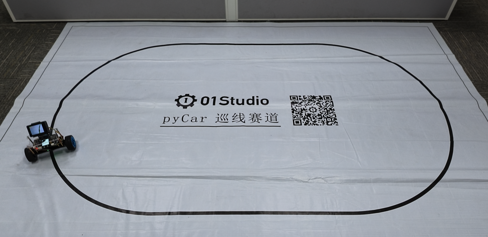

## 实验平台

CyberCAM和pyBalance

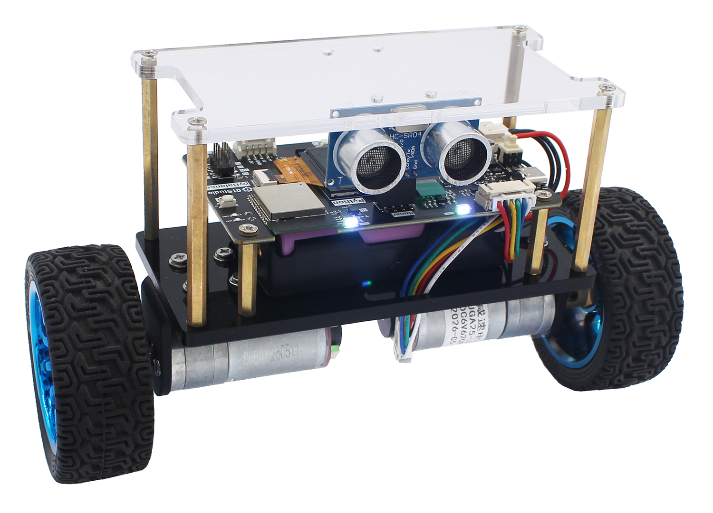

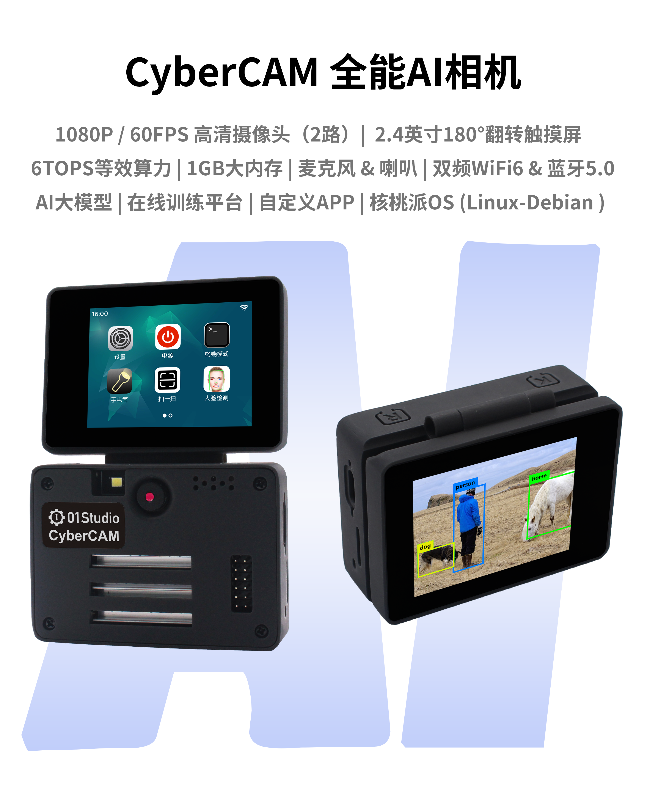

## 实验目的

编程实现CyberCAM K230视觉巡线平衡小车。

## 组装

将上位机固定支架安装到车顶的亚克力板上，并调整上位机角度，使摄像头朝前下方倾斜约 45°。

组装前请先检查以下配件是否齐全：

- 固定支架x1
- M2*10长螺丝x2
- M3*8十字平头螺丝x2
- 套管x2

先将 pyBalance 车顶亚克力板上的 4 颗固定螺丝拧下。

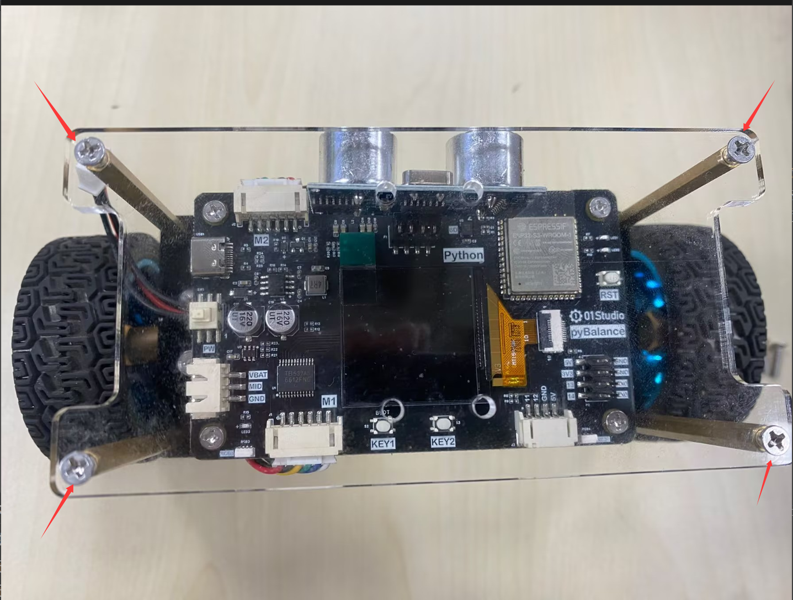

pyBalance 车顶亚克力板中间有 4 个安装孔，前后两组位置对称。由于 CyberCAM 开发板有一定重量，建议选择靠近车体中心的一组安装孔，使开发板整体尽量靠内安装，从而减小对小车重心和平衡状态的影响。

由于亚克力板后续还需要重新安装到车体上，因此此时前后方向不用特别区分，安装时只需保证 CyberCAM 开发板尽量靠近车体中心即可。安装时先放置套管，再使用 M3×8 十字平头螺丝将支架固定在亚克力板上。

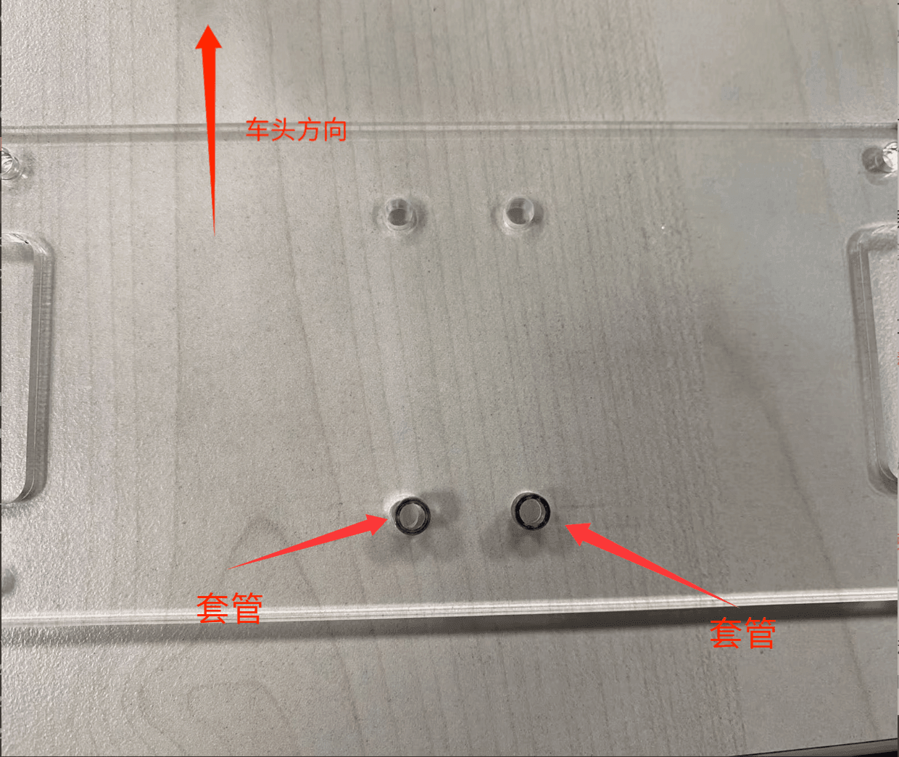

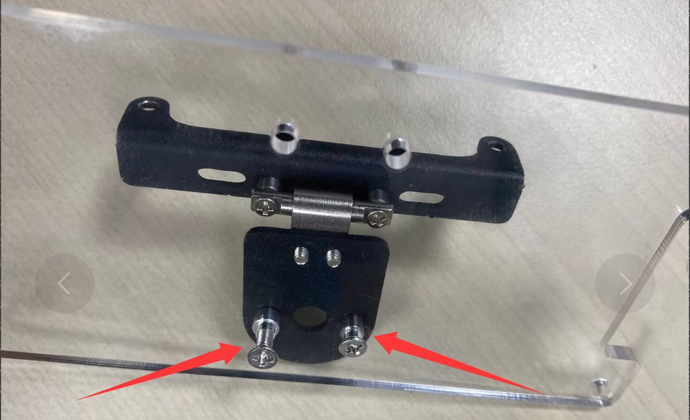

cybercam 开发板配套的M2*5螺丝拧下来：

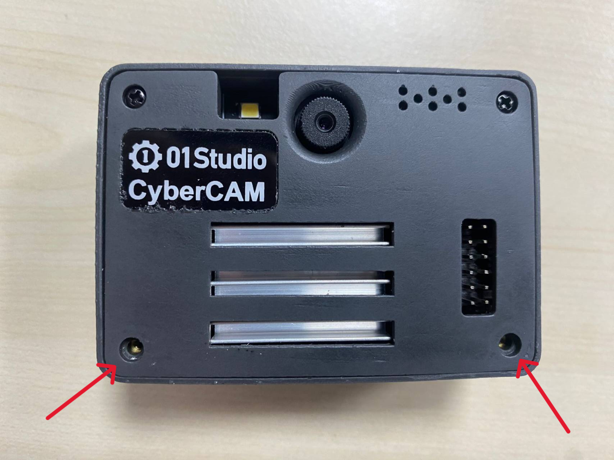

将支架固定孔对准开发板固定孔，使用M2*10长螺丝拧紧。

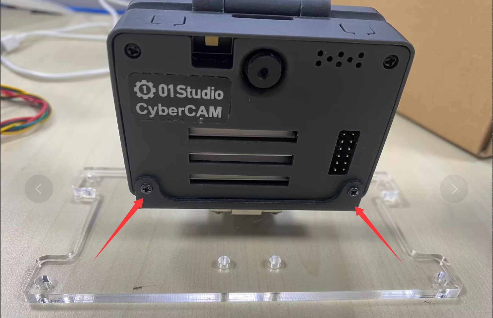

把亚克力板安装回pyBalance 车顶，摄像头方向对应的就是车头方向。

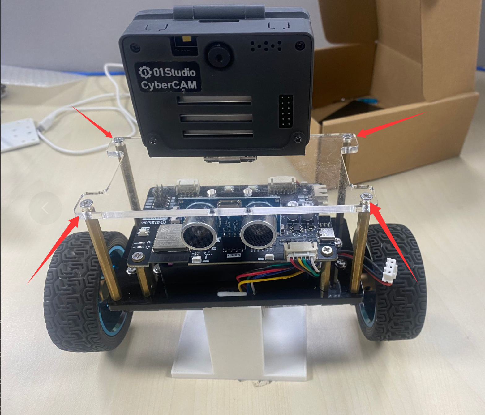

把支架固定外前压，让摄像头朝前下方倾斜约 45°完整安装

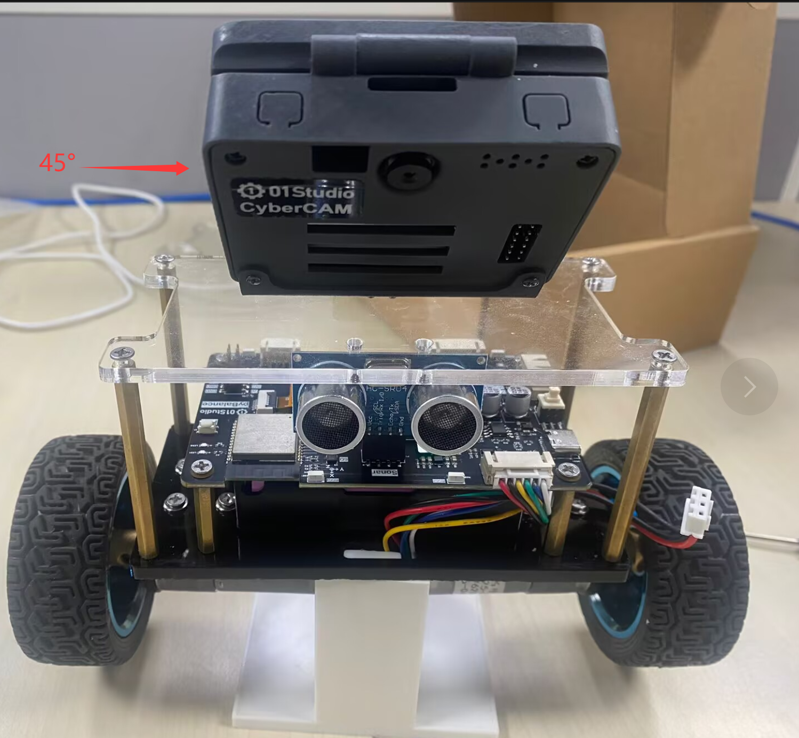

## 接线

使用PH2.0 转 2.54 mm连接线（30 cm）连接 CyberCAM 与 pyBalance。CyberCAM 由 pyBalance 供电，连接接口中提供 5.0 V 电源和 GND，同时通过串口进行数据通信。

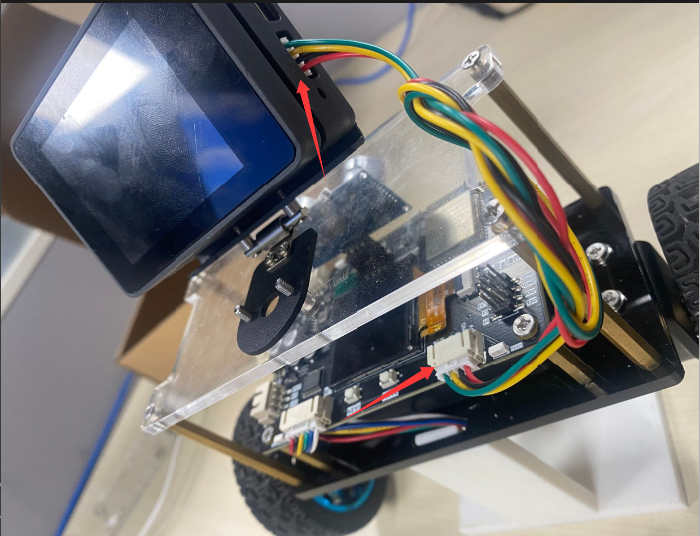

## 实验讲解

关于01Studio CyberCAM学习教程见：https://wiki.01studio.cc/docs/cybercam

本节巡线案例基于 CyberCAM 颜色识别中的机器人巡线案例实现。其原理是通过摄像头采集道路图像，检测巡线轨迹的位置，并根据轨迹相对图像中心的偏移量计算偏离角度。随后通过串口将偏离角度发送给下位机 pyBalance，pyBalance 根据偏离角度调整左右轮的运动输出，使小车沿轨迹行驶，实现自动巡线。

本实验使用01Studio巡线赛道 [**点击购买>>**](https://item.taobao.com/item.htm?id=663173309335)，自己有类似的赛道也可以使用。


本实验用的其它相关教程请参考下方链接，这里不再重复：

- <a href="../../cybercam/machine_vision/color_recognition/line_follow" target="_blank">机器人巡线（实线）>></a>

- <a href="../../cybercam/basic_examples/uart" target="_blank">CybberCAM UART（串口通讯）>></a>

- <a href="../basic_examples/uart" target="_blank">pyBalance UART（串口通讯）>></a>

根据上述讲解，总结出代码编写流程图如下:

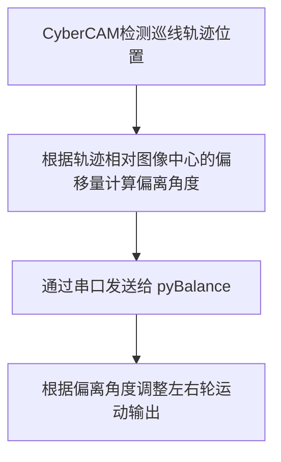
```mermaid
graph TD
    A[CyberCAM检测巡线轨迹位置] --> B[根据轨迹相对图像中心的偏移量计算偏离角度]
    B --> C[通过串口发送给 pyBalance]
    C --> D[根据偏离角度调整左右轮运动输出]
```

## 参考代码

### CyberCAM（上位机）代码

- `main.py`代码

```python
'''
实验名称：机器人巡线（实线）
实验平台：01Studio CyberCAM K230
教程：wiki.01studio.cc

# 黑色灰度线巡线跟踪示例
#
#做一个跟随机器人的机器人需要很多的努力。这个示例脚本
#演示了如何做机器视觉部分的线跟随机器人。你
#可以使用该脚本的输出来驱动一个差分驱动机器人
#跟着一条线走。这个脚本只生成一个表示的旋转值（偏离角度）
#你的机器人向左或向右。
#
# 为了让本示例正常工作，你应该将摄像头对准一条直线（实线）
#并将摄像头调整到水平面45度位置。请保证画面内只有1条直线。
'''
import time,busio,board,sys,os,cv2, math
import numpy as np
import serial
from walnutpi import Sensor, Display, direction, IDE

# 初始化显示屏
Display.init()

# 初始化摄像头，分辨率640x480
cap = Sensor.Sensor(640, 480)

# 检查摄像头是否打开
if not cap.isOpened():
    print("Cannot open camera")
    exit()

#获取当前显示屏方向，0表示默认，2表示180度翻转。
lcd_dir=direction.get_lcd() 
#print(lcd_dir) 

# 判断显示屏是否翻转，如果翻转，则设置显示旋转180°，摄像头同时设置为前置模式（水平镜像）
if lcd_dir == 2: #翻转了
    Display.set_rotation(2)
    cap.set_hmirror(1)

# ========== FPS计算 ==========
frame_count = 0       # 帧数计数器
start_time = time.time()
fps = 0.0

# 配置串口
com = serial.Serial("/dev/ttyS2", 115200)

# =========================================================
# 图像参数
# =========================================================

IMAGE_WIDTH = 640
IMAGE_HEIGHT = 480

# 黑线灰度范围，对应 CanMV 的 [(0, 95)]
BLACK_MIN = 0
BLACK_MAX = 60

# ROI：(x, y, width, height, weight)
# 图像下方权重最大，因为下方黑线距离小车更近
ROIS = [
    (0, 400, 640, 60, 0.50),
    (0, 200, 640, 60, 0.30),
    (0,   0, 640, 60, 0.20),
]

# 连通域过滤条件
MIN_PIXELS = 150
MIN_WIDTH = 5
MIN_HEIGHT = 5

# 形态学处理内核
open_kernel = np.ones((3, 3), dtype=np.uint8)
close_kernel = np.ones((5, 5), dtype=np.uint8)

# 持续采集和显示图像
while True:

    # 读取图像帧
    ret, img = cap.read()

    # 转换为灰度图
    gray = cv2.cvtColor(img, cv2.COLOR_BGR2GRAY)

    centroid_sum = 0.0

    # 只累计实际检测到黑线的 ROI 权重
    detected_weight_sum = 0.0

    blob_detected = False

    # 用于绘制不同 ROI 中检测到的中心点
    detected_points = []

    roi_center_x_list = [None, None, None]
    
    for roi_index, roi in enumerate(ROIS):

        roi_x, roi_y, roi_w, roi_h, weight = roi

        # 取出 ROI 灰度图
        gray_roi = gray[
            roi_y:roi_y + roi_h,
            roi_x:roi_x + roi_w
        ]

        # 提取灰度值 0～95 的黑色区域
        mask = cv2.inRange(gray_roi, BLACK_MIN, BLACK_MAX)

        # 去除小噪声
        mask = cv2.morphologyEx(mask, cv2.MORPH_OPEN, open_kernel)

        # 连接黑线中较小的断裂
        mask = cv2.morphologyEx(mask, cv2.MORPH_CLOSE, close_kernel)

        # 连通域检测
        num_labels, labels, stats, centroids = cv2.connectedComponentsWithStats(mask, connectivity=8, ltype=cv2.CV_16U)
        
        largest_label = -1
        largest_pixels = 0

        # 从 1 开始，0 是背景
        for label_index in range(1, num_labels):

            pixels = int(stats[label_index, cv2.CC_STAT_AREA])
            width = int(stats[label_index, cv2.CC_STAT_WIDTH])
            height = int(stats[label_index, cv2.CC_STAT_HEIGHT])

            # 减少碎块
            if pixels < MIN_PIXELS:
                continue

            # 过滤细长噪点
            if width < MIN_WIDTH or height < MIN_HEIGHT:
                continue

            if pixels > largest_pixels:
                largest_pixels = pixels
                largest_label = label_index

        # 当前 ROI 找到了有效黑线
        if largest_label >= 0:

            blob_detected = True

            blob_x = int(stats[largest_label, cv2.CC_STAT_LEFT])

            blob_y = int(stats[largest_label, cv2.CC_STAT_TOP])

            blob_w = int(stats[largest_label, cv2.CC_STAT_WIDTH])

            blob_h = int(stats[largest_label, cv2.CC_STAT_HEIGHT])

            # 连通域中心坐标是相对于 ROI 的
            center_x = int(centroids[largest_label][0])
            center_y = int(centroids[largest_label][1])

            # 转换为整张图像坐标
            global_center_x = roi_x + center_x
            global_center_y = roi_y + center_y

            global_blob_x = roi_x + blob_x
            global_blob_y = roi_y + blob_y

            # 按 ROI 权重累计黑线中心
            centroid_sum += global_center_x * weight
            detected_weight_sum += weight

            roi_center_x_list[roi_index] = global_center_x

            detected_points.append((global_center_x, global_center_y))

            # 绘制边框
            cv2.rectangle(img, (global_blob_x, global_blob_y), (global_blob_x + blob_w,global_blob_y + blob_h), (0, 255, 0), 2)

            # 绘制黑线中心
            cv2.drawMarker(img, (global_center_x, global_center_y), (0, 0, 255), markerType=cv2.MARKER_CROSS, markerSize=20, thickness=2)

    if blob_detected or detected_weight_sum > 0:

        center_pos = centroid_sum / detected_weight_sum
        # 计算黑线偏离角度
        # center_pos < 320：黑线在左侧，角度为正
        # center_pos > 320：黑线在右侧，角度为负
        deflection_angle = -math.atan((center_pos - IMAGE_WIDTH / 2)/ (IMAGE_HEIGHT / 2))

        deflection_angle = math.degrees( deflection_angle)

        ## 串口发送
        value = int(deflection_angle * 10)

        # 限制为 int16 范围
        if value > 32767:
            value = 32767
        elif value < -32768:
            value = -32768

        value += 32768

        state_buf = [None] * 2

        for i in range(1):
            for j in range(2):
                if j == 0:
                    state_buf[i * 2 + j] = value // 256
                else:
                    state_buf[i * 2 + j] = value % 256

        com.write(bytes(state_buf))
        
        # print("Turn Angle: %f" % deflection_angle)
        cv2.putText(img, f"Angle: {deflection_angle:.1f}", (10, 70), cv2.FONT_HERSHEY_COMPLEX, 1, (0, 0, 255), 2)

    # 每满1秒计算一次平均FPS
    frame_count += 1    
    current_time = time.time()
    if current_time - start_time >= 1.0:
        fps = frame_count / (current_time - start_time)
        frame_count = 0              # 重置帧数计数器
        start_time = current_time    # 重置计时起点
        print("FPS: ", fps)

    # 添加文字标签和FPS显示
    cv2.putText(img, f'FPS: {fps:.1f}', (10, 30), cv2.FONT_HERSHEY_COMPLEX, 1, (0, 255, 0), 2)

    Display.show(img) #显示到屏幕上
    IDE.show(img) # 发送到ide窗口内显示

```

### pyBalance（下位机）代码

- `main`代码

```python
'''
实验名称：pyBalance平衡小车蓝牙遥控（pyBalance代码）
日期：2026.8
作者：01Studio
说明：pyController做蓝牙主机，pyBalance做从机，手柄搜索到'pyBal'后发起连接，然后控制。
'''
from machine import Pin
from tftlcd import LCD15
import pyBalance
from machine import UART
import time

b = pyBalance.BALANCE() #构建平衡小车对象

speed_value = 4 #速度值,范围[1,5] ,5最快
b.speed(speed_value) #设置小车速度

########################
# 构建1.5寸LCD对象并初始化
########################
d = LCD15(portrait=2) #默认方向竖屏

#定义红、绿、蓝三种颜色
RED=(255,0,0)
GREEN=(0,255,0)
BLUE=(0,0,255)
WHITE=(255,255,255)
BLACK=(0,0,0)

#按键1
KEY1=Pin(0,Pin.IN,Pin.PULL_UP) #构建KEY对象
key1_node = 0

def key1(KEY1):
    
    global key1_node
    
    if KEY1.value()==0: #确认按键被按下    
        time.sleep_ms(10) #消除抖动
        if KEY1.value()==0: #确认按键被按下
            print('KEY1')
            key1_node = 1
            
            while not KEY1.value(): #松开检测
                pass

KEY1.irq(key1,Pin.IRQ_FALLING) #定义中断，下降沿触发


#按键2
KEY2=Pin(21,Pin.IN,Pin.PULL_UP) #构建KEY对象
key2_node = 0

def key2(KEY2):
    
    global key2_node
    
    if KEY2.value()==0: #确认按键被按下
        time.sleep_ms(10) #消除抖动
        if KEY2.value()==0: #确认按键被按下
            print('KEY2')
            key2_node = 1
            
            while not KEY2.value(): #松开检测
                pass

KEY2.irq(key2,Pin.IRQ_FALLING) #定义中断，下降沿触发


item = 0 #项目

#判断是否已经校准，如果未校准，则进入校准模式。
#校准说明：将平衡车水平于地方放置，按下按键KEY2即可校准。相关数据会保存到根目录cal_data.txt文件
if not b.cal_states(): 
    
    item = 2
    key2_node = 1
    d.Picture(0,0,"/picture/calibrate.jpg")
    time.sleep_ms(1000)

else:
    
    d.Picture(0,0,"/picture/normal.jpg")    

raw_angle = 0
while True:

    if key1_node: #按键1按下
        
        key1_node = 0 #清除按键标志位
        
        #项目加1
        item = item + 1
        if item == 3:
            item = 0
        
        if item == 0: 
            
            d.Picture(0,0,"/picture/normal.jpg")

        if item == 1:
            
            d.Picture(0,0,"/picture/line.jpg")
        
        if item == 2:
            
            d.Picture(0,0,"/picture/calibrate.jpg")
    
    if key2_node: #确认键按下
        
        key2_node = 0 #清除按键标志位
        
        d.fill(WHITE)
        
        if item == 0: #普通模式
            
            b.speed(4)
            b.start() #启动
            
            while True:
    
                data = b.read_states()
                #print(data)
                d.printStr('Normal Mode', 35, 10, BLACK, size=3)
                d.printStr('Angle:', 10, 60, BLUE, size=2)
                d.printStr(str(data[0]/10)+ ' '*5, 90, 60, RED, size=2)
                d.printStr('Speed:', 10, 90, BLUE, size=2)
                d.printStr(str('%.2f'%(data[1]/1000))+' m/s'+' '*3, 90, 90, RED, size=2)
                d.printStr('Distance:', 10, 120, BLUE, size=2)
                d.printStr(str(data[2])+' mm'+' '*3, 130, 120, RED, size=2)
                d.printStr('VBAT:', 10, 150, BLUE, size=2)
                d.printStr(str('%.2f'%(data[3]/100))+' V'+' '*3, 80, 150, RED, size=2)
                d.printStr('States:', 10, 180, BLUE, size=2)
                d.printStr(str(data[4]), 100, 180, RED, size=2)
                d.printStr('Contrl_Speed:', 10, 210, BLUE, size=2)
                d.printStr(str(data[5]), 170, 210, RED, size=2)
                time.sleep_ms(100)
                
                if key1_node: #返回
                   
                    item = item - 1 #返回功能页
                    
                    b.stop()
                    
                    break 

        elif item == 1: #其他模式
            #设置串口
            uart=UART(2,115200,rx=11,tx=12)
            #其他模式时运动速度调为3
            b.speed(3)
            b.start()
            run = 1
            count = 0
            while True:
    
                data = b.read_states()
                #print(data)
                if count == 10: #定时刷新
                    d.printStr('Line Mode', 35, 10, BLACK, size=3)
                    d.printStr('Angle:', 10, 60, BLUE, size=2)
                    d.printStr(str(data[0]/10)+ ' '*5, 90, 60, RED, size=2)
                    d.printStr('Speed:', 10, 90, BLUE, size=2)
                    d.printStr(str('%.2f'%(data[1]/1000))+' m/s'+' '*3, 90, 90, RED, size=2)
                    d.printStr('Distance:', 10, 120, BLUE, size=2)
                    d.printStr(str(data[2])+' mm'+' '*3, 130, 120, RED, size=2)
                    d.printStr('VBAT:', 10, 150, BLUE, size=2)
                    d.printStr(str('%.2f'%(data[3]/100))+' V'+' '*3, 80, 150, RED, size=2)
                    d.printStr('States:', 10, 180, BLUE, size=2)
                    d.printStr(str(data[4]), 100, 180, RED, size=2)
                    d.printStr('Contrl_Speed:', 10, 210, BLUE, size=2)
                    d.printStr(str(data[5]), 170, 210, RED, size=2)
                    count = 0

                count = count + 1
                   
                # 处理串口数据
                if uart.any() >=2:
                    v = uart.read(2)
                    if v and len(v) == 2:
                        states_out = [None] * 1
                        for i in range(1):
                            states_out[i] = v[i*2]*256 + v[i*2+1] - 32768
                            
                        # 拿到第一个数据（整数形式），并除以 10.0 瞬间还原小数！
                        angle = float(states_out[0] / 10.0)
                        
                        yaw = int(0 - angle * 0.70)
                        if yaw > 100:
                            yaw = 100
                        if yaw < -100:
                            yaw = -100
                        #print(angle)
                        b.control(pit=70,yaw=yaw)
                        
                if key1_node: #返回

                    item = item - 1 #返回功能页
                    
                    b.stop()
                    
                    break 
                

        elif item == 2: #校准模式
            
            while True:
                
                cal_data = b.read_cal_data()
                print(cal_data)
                d.printStr('Calibrate', 45, 10, BLACK, size=3)
                d.printStr('Angle: '+str('%.1f'%(cal_data[0]/10))+'   ', 10, 60, BLUE, size=2)
                d.printStr('GY(Offset): '+str('%.1f'%(cal_data[1]/10))+'   ', 10, 100, BLUE, size=2)
                d.printStr('Keep the Car Level', 10, 160, BLACK, size=2)
                d.printStr('Press KEY2 Confirm!', 10, 200, RED, size=2)
                time.sleep_ms(20)
                    
                if key2_node: #确认键按下
        
                    key2_node = 0 #清除按键标志位
                    
                    b.confirm_cal() #执行校准
                    
                    d.printStr('Success! Exit...   ', 10, 200, RED, size=2)
                    
                    time.sleep(2)
                    
                    #校准完成返回普通模式
                    item = item - 1 #返回功能页
                    key1_node = 1 
                    
                    break
                
                if key1_node: #返回
                   
                    item = item - 1 #返回功能页
                    
                    break 
```

## 实验结果

运行代码前，需要将资料包示例程序中上位机文件夹内的 `pyBalance-line-follow` 文件夹整体拷贝到 CyberCAM 的 `/data/app` 目录下。

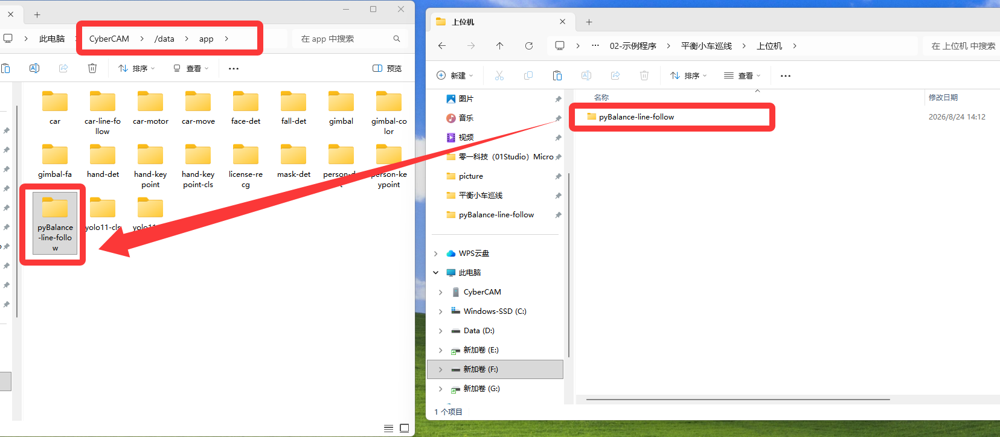

在CyberCAM 终端输入下面指令确认UART2开启情况：
```bash
gpio pins
```
出现下图表示开启成功：

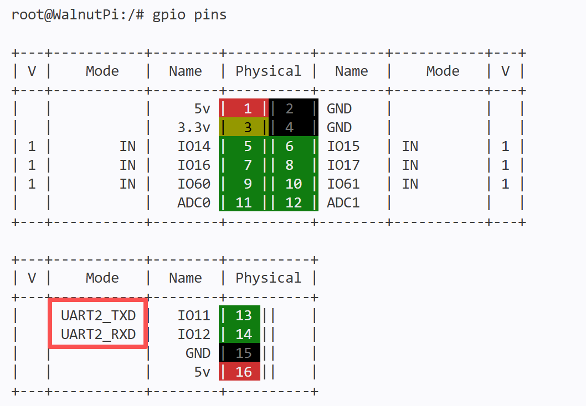

如果 UART2 未开启，请先完成 UART2 配置后再运行程序。具体配置方法可参考：- <a href="../../cybercam/basic_examples/uart#开启串口2" target="_blank">CyberCAM UART（串口通信）>></a>

下位机文件夹中的所有程序文件通过 Thonny 上传到 pyBalance 文件系统中。

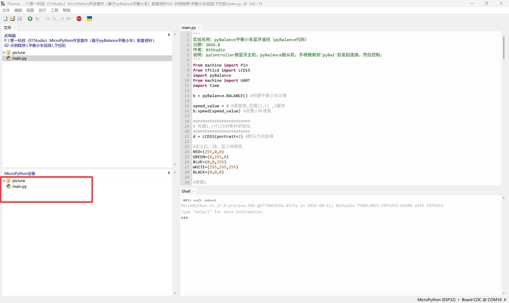

pyBalance 作为下位机，集成了六轴传感器校准、直立平衡和巡线功能，并配有相应的图形化操作界面。

小车上电后会首先检测是否存在有效的 `cal_data.txt` 校准文件。如果未检测到校准数据，则自动进入六轴传感器校准界面。

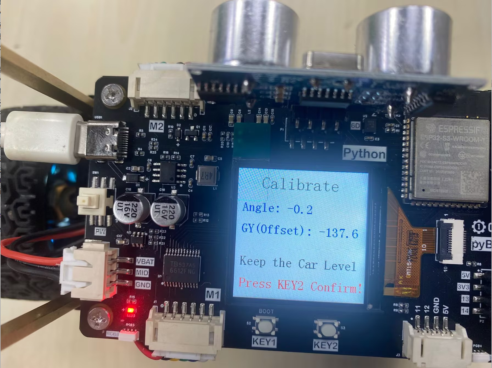

由于安装 CyberCAM 后小车重心会向车头方向偏移，校准时需要将小车扶稳并适当向后倾斜，而不是保持完全直立。待数据稳定后按下 KEY2，确认并保存校准数据。完成后会自动返回功能选择界面，并停留在“六轴传感器校准”选项。

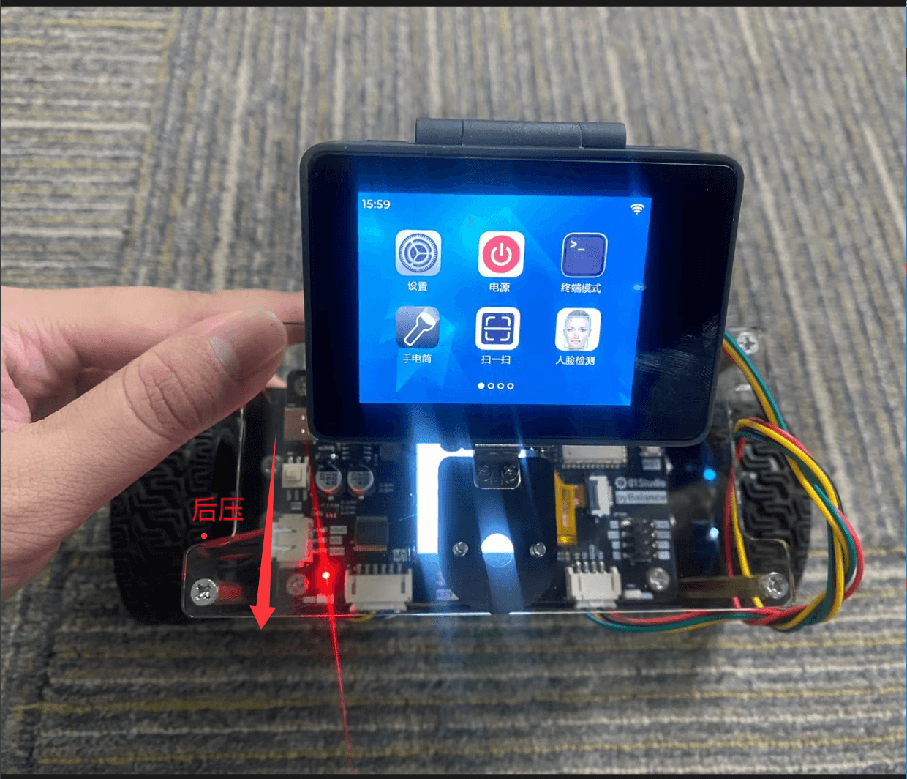

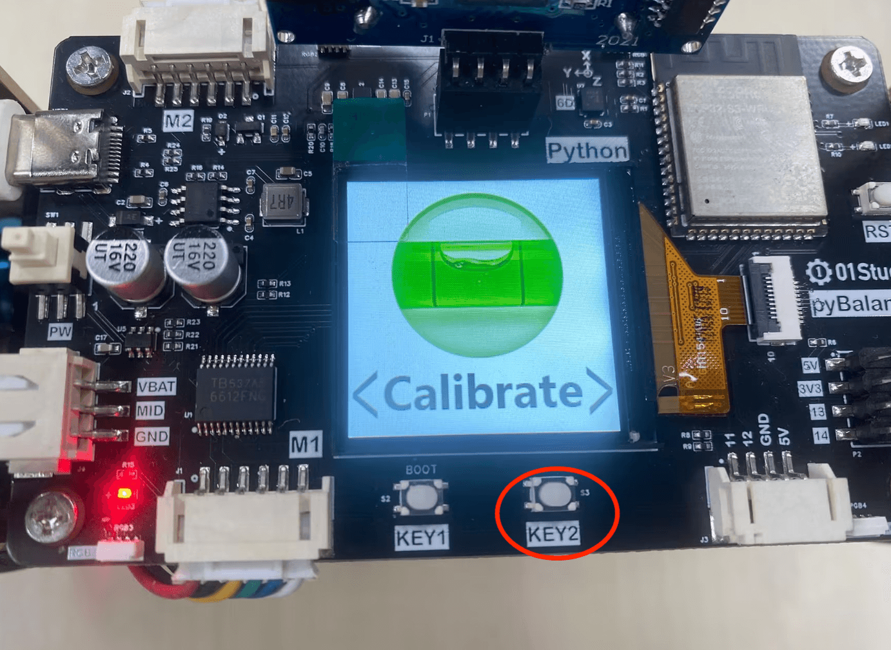

在功能选择界面中，按下 KEY1 可以在 直立模式 → 巡线 → 六轴传感器校准 之间循环切换，按下 KEY2 确认并进入当前选择的功能。

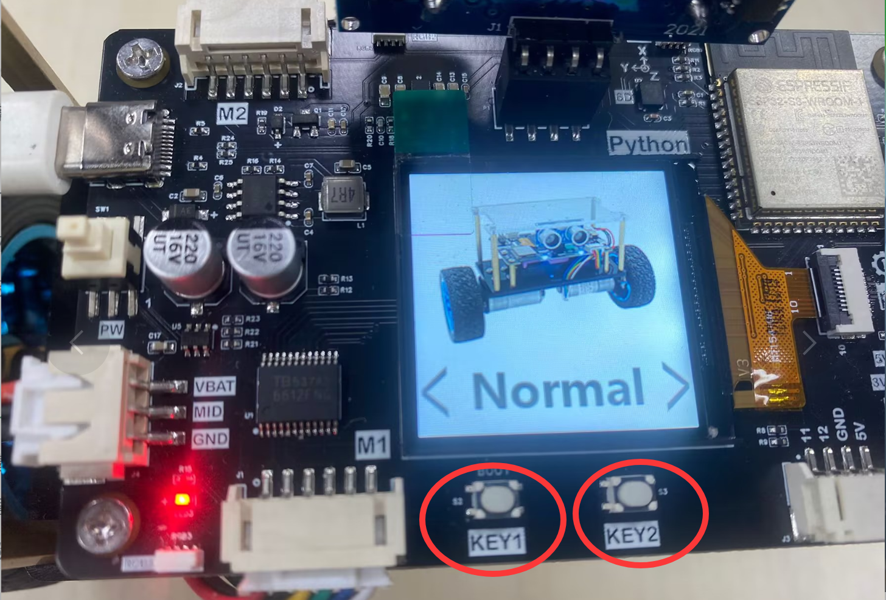

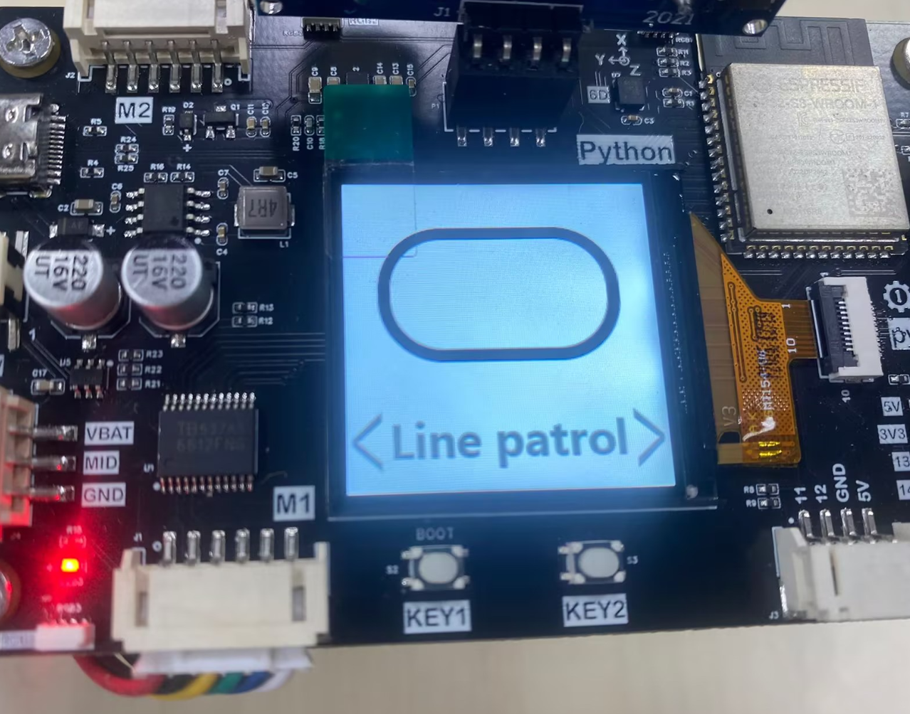

完成上述操作并确认小车能够稳定直立后，在 CyberCAM 上启动 巡线 应用，运行巡线识别程序并通过串口发送识别数据。

随后在 pyBalance 功能选择界面切换到“巡线”模式，按下 KEY2 进入巡线界面。此时下位机会根据 CyberCAM 发送的偏离数据控制小车运动，开始自动巡线。


