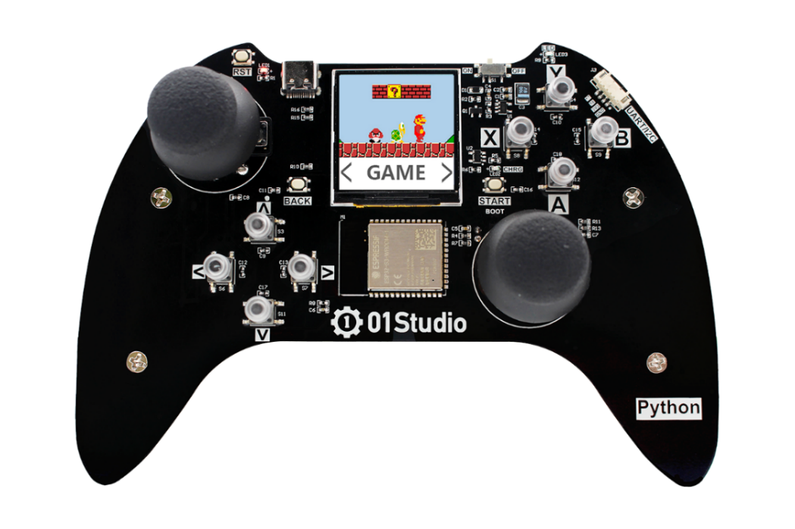
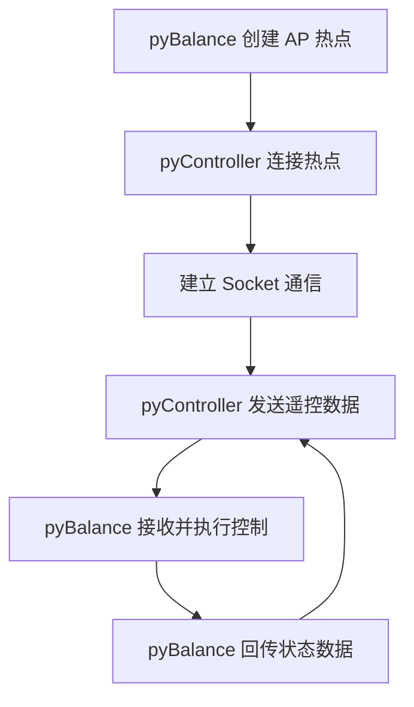
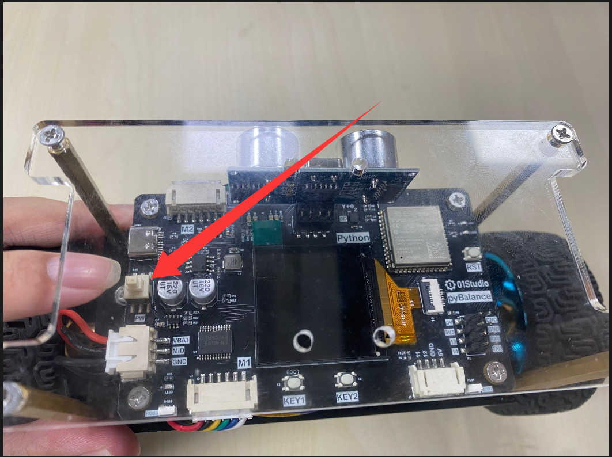
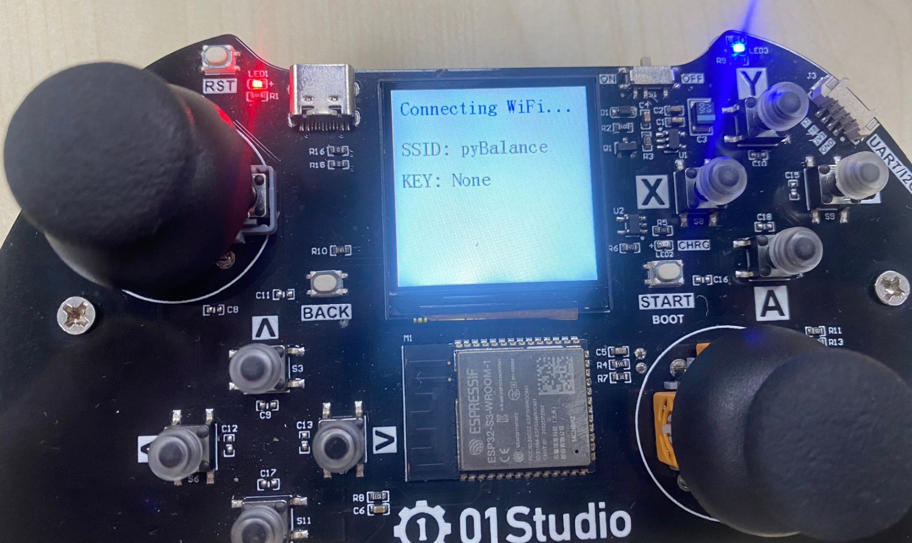
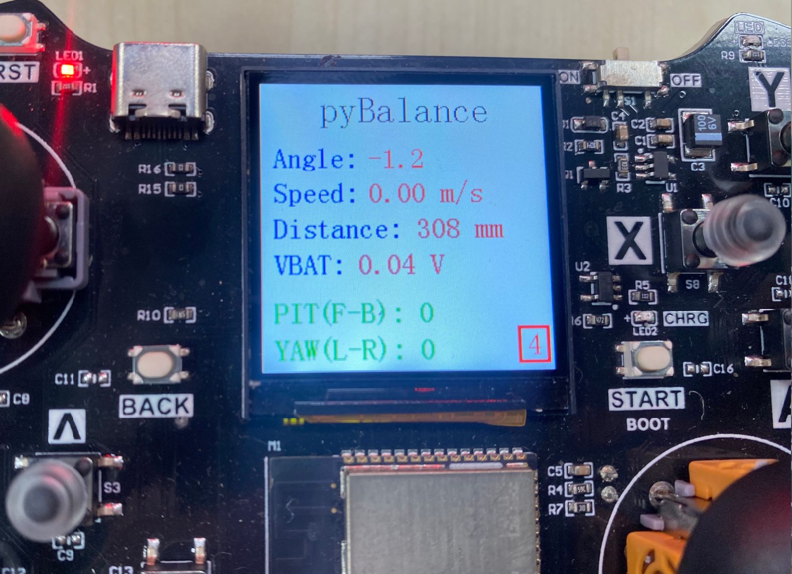

# WiFi控制

## 前言

上一节使用蓝牙方式实现了 pyBalance 的无线遥控，适合设备之间近距离直接连接。本节将介绍 WiFi 控制方式，通过无线网络实现一定距离内的远程通信和控制，使 pyBalance 的控制方式更加灵活。

## 实验平台

pyDrone和pyController手柄。




## 实验目的 

编程实现手柄通过pyController手柄WiFi方式控制pyBalance。

## 实验讲解

关于 01Studio pyController 遥控/游戏手柄的使用方法，可参考官方教程：  
https://download.01studio.cc/zh_CN/latest/project/pyController/pyController.html

上一节已经介绍了蓝牙遥控方式，WiFi 遥控的整体控制逻辑基本相同，主要区别在于数据传输方式不同，传输的控制数据和小车控制原理保持不变。

本节主要介绍遥控过程中使用到的 Socket 对象及数据收发方法，同时回顾 pyBalance BALANCE 对象中相关的控制接口。更多 Socket 相关内容可参考[Socket 通信教程](../network/socket.md)，WiFi 连接方法可参考 [连接无线路由器教程](../network/connect_wifi.md)

下面先介绍 Socket 对象的创建方法。

## socket对象

### 构造函数
```python
s=usocket.socket(af=AF_INET, type=SOCK_STREAM,proto=IPPROTO_TCP)
```
构建socket对象。
- `af`: IPV类型
    - `AF_INET`: IPV4；
    - `AF_INET6`: IPV6；

- `type`: 
    - `SCOK_STREAM`: TCP；
    - `SOCK_DGRAM`: UDP;

- `proto`:  
    - `IPPROTO_TCP`: TCP协议;
    - `IPPROTO_UDP`: UDP协议;

（如果要构建TCP连接，可以使用默认参数配置，即不输入任何参数。）

### 使用方法
```python
addr=usocket.getaddrinfo('https://www.walnutpi.com', 80)[0][-1]
```
获取Socket通信格式地址。返回：('106.52.127.213', 80)
<br></br>

```python
s.connect(address)
```
创建连接。
- `address` :地址格式为IP+端口。例：('192.168.1.115',10000)    

<br></br>

```python
s.send(bytes)
```
发送数据。
- `bytes`：发送内容格式为字节。

<br></br>

```python
s.recv(bufsize)
```
接收数据。
- `bufsize`：单次最大接收字节个数。

<br></br>

```python
s.bind(address)
```
绑定，用于服务器角色。

<br></br>

```python
s.listen([backlog])
```
监听，用于服务器角色。
- `backlog`: 允许连接个数，必须大于0。

<br></br>

```python
s.accept()
```
接受连接，用于服务器角色。

<br></br>

更多用法请阅读官方文档：<br></br>
https://docs.micropython.org/en/latest/library/socket.html#module-socket

## BALANC对象

### 构造函数
```python
b = pyBalance.BALANCE()
```
构建pyBalance对象。

### 使用方法
```python
b.start()
```
启动平衡控制，使能电机输出。调用后，小车进入自平衡工作状态。

<br></br>

```python
b.stop()
```
停止平衡控制，关闭电机输出，用于突发情况停止或结束运行。

<br></br>

```python
b.speed(value=5)
```
设置小车运动控制的输出档位，范围为 [1, 5]，默认为 5。数值越大，控制前进、后退和转向时的电机输出越大，小车运动速度越快；数值越小，输出越小，运动速度越慢。

<br></br>

```python
b.control(pit=0, yaw=0)
```
控制平衡小车的前后运动和左右转向。

- ``pit``：前后运动控制量，范围为 -100 ~ 100。正值控制小车前进，负值控制小车后退，绝对值越大，前后运动的目标输出越大。
- ``yaw``：左右转向控制量，范围为 -100 ~ 100。正值控制小车向右转动，负值控制小车向左转动，绝对值越大，转向的目标输出越大。

<br></br>

```python
b.read_states()
```
读取平衡小车状态信息。返回8个数据的元组。

1、	倾斜角，范围：-1800 ~ 1800 ；角度10倍。

2、	小车实时速度， 单位 :mm/s。

3、	超声波距离，单位：mm ，范围：20mm ~ 4500mm 。

4、	电池电量，单位：10mv 。  

5、	小车启动状态：启动：1，停止：0。 

6、	小车控制运动输出比例：[1-5]。  

7、	遥控器pitch控制量，范围：-100 ~100 。

8、	遥控器yaw控制量，范围：-100 ~ 100 。

<br></br>

ESP32-S3 固件集成了 WiFi 功能。本实验将平衡小车设置为 AP 模式，创建名称为 pyBalance 的 WiFi 热点，无需密码即可连接。pyController 手柄工作在 STA 模式，上电后自动搜索并连接 pyBalance 创建的热点。

WiFi 连接成功后，手柄通过 Socket 定时发送遥控数据，pyBalance 接收控制指令并控制小车运动，同时将自身的状态数据回传给手柄。

结合上述讲解，总结出代码编写流程图如下：



## 参考代码

### pyBalance（AP）代码

```python
'''
实验名称：WiFi遥控平衡小车（pyBalance代码）
版本：v1.0
日期：2026.8
作者：01Studio
说明：通过Socket UDP连接，周期接收手柄发来的控制信息，并回传自身状态信息。
'''

#导入相关模块
from neopixel import NeoPixel
import network,socket,time
from machine import Timer,Pin
import _thread
from tftlcd import LCD15
import pyBalance

b = pyBalance.BALANCE() #构建平衡小车对象

speed_value = 4 #速度值,范围[1,5] ,5最快
b.speed(speed_value) #设置小车速度

########################
# 构建1.5寸LCD对象并初始化
########################
d = LCD15(portrait=2) #默认方向竖屏

#定义红、绿、蓝、白、黑五种颜色
RED=(255,0,0)
GREEN=(0,255,0)
BLUE=(0,0,255)
WHITE=(255,255,255)
BLACK=(0,0,0)

#定义RGB灯珠
pin = Pin(45, Pin.OUT)
NUM_LEDS = 4
np = NeoPixel(pin, NUM_LEDS)

#普通车灯模式，车头灯白色，车尾灯红色。
def rgb_normal(): 

    np[0]=WHITE 
    np[1]=WHITE
    np[2]=RED 
    np[3]=RED
    np.write()

rgb_normal()

# ---------------- 全局控制 ----------------

running = True                   # 线程运行标志

# ---------------- 工具函数 ----------------

def hsv_to_rgb(h, s=1.0, v=1.0):
    """HSV转RGB，h范围0~1，返回0~255的(r,g,b)元组"""
    i = int(h * 6.0)
    f = h * 6.0 - i
    p = v * (1.0 - s)
    q = v * (1.0 - s * f)
    t = v * (1.0 - s * (1.0 - f))
    i = i % 6
    if   i == 0: r, g, b = v, t, p
    elif i == 1: r, g, b = q, v, p
    elif i == 2: r, g, b = p, v, t
    elif i == 3: r, g, b = p, q, v
    elif i == 4: r, g, b = t, p, v
    else:        r, g, b = v, p, q
    return (int(r * 255), int(g * 255), int(b * 255))

# ---------------- 彩虹线程函数 ----------------

def rainbow_thread():
    speed = 0.01
    offset = 0.0
    while running:                          # 检查标志位
        for i in range(NUM_LEDS):
            hue = ((i / NUM_LEDS) + offset) % 1.0
            np[i] = hsv_to_rgb(hue, 1.0, 1.0)
        np.write()
        offset = (offset + 1.0 / 256) % 1.0
        time.sleep(speed)
    # 线程退出前熄灭灯珠
    np.fill((0, 0, 0))
    np.write()

# ---------------- 线程启停控制函数 ----------------

def start_rainbow():
    """启动彩虹线程"""
    global running
    running = True
    _thread.start_new_thread(rainbow_thread, ())
    print("彩虹线程已启动")

def stop_rainbow():
    """终止彩虹线程（等其自行退出）"""
    global running
    running = False                        # 置标志位
    time.sleep(0.1)                        # 等待线程检测到并退出
    print("彩虹线程已停止")

fl_node = 0
bl_node = 0
no_key = 0
rgb_node = 0

#开启AP热点
def startAP():
    
    wlan_ap = network.WLAN(network.AP_IF)
    
    print('Connect pyBalance AP to Config WiFi.')

    #启动热点，名称为pyBalance，不加密。
    wlan_ap.active(True)
    wlan_ap.config(essid='pyBalance',authmode=0)

    while not wlan_ap.isconnected(): #等待AP接入
        
        pass

#启动AP
startAP()

#创建socket UDP接口。
s=socket.socket(socket.AF_INET, socket.SOCK_DGRAM)
s.bind(('0.0.0.0', 2390)) #本地IP：192.168.4.1;端口:2390

#等待设备Socket接入，获取对方IP地址和端口
data,addr = s.recvfrom(128)
print(addr)

#连接对方IP地址和端口
s.connect(addr)
s.setblocking(False) #非阻塞模式

#Socket接收数据
def Socket_fun(tim):
    
    try:
        global fl_node,bl_node,speed_value,no_key,rgb_node
        
        text=s.recv(128) #单次最多接收128字节
        control_data = [None]*2

        #接收的wifi数据
        print("RX:", text)

        #对收到的手柄8字节数据进行判断
        for i in range(len(text)):
            print(i,text[i])
            
        #将摇杆值转化为飞控控制值。      
        for i in range(2):
            if  100 < text[i+2] < 155 :
                control_data[i] = 0
                
            elif text[i+2] <= 100 :      
                control_data[i] = text[i+2] - 100
                
            else:
                control_data[i] = text[i+2] - 155

        print('control:',control_data)
                
        #rol:[-100:100],rol:[-100:100],yaw:[-100:100],thr:[-100:100]
        b.control(pit = control_data[0], yaw = control_data[1])

        #控制速度调试
        if text[5] ==  0: #上键按下
            
            
            if no_key == 1:
                
                no_key = 0 
                
                speed_value = speed_value + 1
                if speed_value > 5:
                    speed_value = 5
                
                b.speed(speed_value) #调速
                
        #控制速度调试
        if text[5] ==  4: #下键按下
            
            if no_key == 1:
                
                no_key = 0 
                
                speed_value = speed_value - 1
                
                if speed_value < 1:
                    speed_value = 1
                    
                b.speed(speed_value) #调速    


        #检测X/Y/A/B按键
        if text[5] == 24: #Y键按下
            
            print('Y')
            b.start() #启动                 

            
        if text[5] == 72: #A键按下
            
            print('A')
            
            if no_key == 1:
                
                no_key = 0
                
                bl_node = not bl_node #灯光取反变化
                
                if bl_node:
            
                    np[2]=RED 
                    np[3]=RED
                    np.write()
                
                else:
                    
                    np[2]=BLACK 
                    np[3]=BLACK
                    np.write()                    

        if text[5] == 40: #B键按下，可以自己添加功能。
            
            print('B')
            
            if no_key == 1:
                
                no_key = 0
                    
                rgb_node = rgb_node + 1
                if rgb_node > 2:
                    rgb_node = 0
                
                if rgb_node == 0:
                    rgb_normal()                
                    
                elif rgb_node == 1:
                    start_rainbow()                
                
                elif rgb_node == 2:
                    stop_rainbow()
                            

            
        if text[5] == 136: #X键按下,紧急停止
            print('X')
            #降落，不允许control
            b.stop()
            
        if text[5] ==  8: #无按键按下
            
            no_key = 1
            
        #读取平衡小车状态信息
        states = b.read_states()
        print('states: ',states)
        state_buf = [None]*16
        for i in range(8):
            for j in range(2):
                if j == 0:
                    state_buf[i*2+j] = int((states[i]+32768)/256)
                else:
                    state_buf[i*2+j] = int((states[i]+32768)%256)
                        
        s.send(bytes(state_buf)) #WiFi回传数据
    except OSError:
        pass

#开启定时器,周期50ms，执行socket通信接收任务
tim = Timer(1)
tim.init(period=50, mode=Timer.PERIODIC,callback=Socket_fun)

d.fill(WHITE) #设置屏幕的背景是白色

b.start() #启动

while True:
    
    data = b.read_states()
    #print(data)
    d.printStr('Control Mode', 25, 10, BLACK, size=3)
    d.printStr('Angle:', 10, 60, BLUE, size=2)
    d.printStr(str(data[0]/10)+ ' '*5, 90, 60, RED, size=2)
    d.printStr('Speed:', 10, 90, BLUE, size=2)
    d.printStr(str('%.2f'%(data[1]/1000))+' m/s'+' '*3, 90, 90, RED, size=2)
    d.printStr('Distance:', 10, 120, BLUE, size=2)
    d.printStr(str(data[2])+' mm'+' '*3, 130, 120, RED, size=2)
    d.printStr('VBAT:', 10, 150, BLUE, size=2)
    d.printStr(str('%.2f'%(data[3]/100))+' V'+' '*3, 80, 150, RED, size=2)
    d.printStr('States:', 10, 180, BLUE, size=2)
    d.printStr(str(data[4]), 100, 180, RED, size=2)
    d.printStr('Contrl_Speed:', 10, 210, BLUE, size=2)
    d.printStr(str(data[5]), 170, 210, RED, size=2)
    time.sleep_ms(100)
```

### pyController遥控手柄（sta）代码

```python
'''
实验名称：WiFi遥控四轴飞行器（pyController手柄代码）
版本：v1.0
日期：2022.6
作者：01Studio
说明：通过Socket UDP连接四轴，周期发送控制信息，将接收到四轴的姿态信息显示在LCD屏。
'''

#导入相关模块
import network,usocket,time,controller
from machine import Pin,Timer
import tftlcd

# # 公司WiFi热点、IP和端口信息。
SSID = 'pyDrone'
PASSWORD = ''
addr=('192.168.4.1',2390) #服务器IP和端口

#自身IP
ip_local = ''

#构建手柄对象
gamepad = controller.CONTROLLER()

#LCD初始化
l = tftlcd.LCD15()

#定义常用颜色
RED = (255,0,0)
GREEN = (0,255,0)
BLUE = (0,0,255)
BLACK = (0,0,0)
WHITE = (255,255,255)
DEEPGREEN = (0,139,0)

#清屏，白色
l.fill(WHITE)

#WIFI连接函数
def WIFI_Connect():
    
    global ip_local
    
    WIFI_LED=Pin(46, Pin.OUT) #初始化WIFI指示灯

    wlan = network.WLAN(network.STA_IF) #STA模式
    wlan.active(True)                   #激活接口
    start_time=time.time()              #记录时间做超时判断

    if not wlan.isconnected():
        print('Connecting to network...')
        l.printStr('Connecting WiFi...',10,10,color=BLUE,size=2)
        l.printStr('SSID: pyDrone',10,60,color=BLACK,size=2)
        l.printStr('KEY: None',10,100,color=BLACK,size=2)
        wlan.connect(SSID,PASSWORD) #输入WIFI账号密码

        while not wlan.isconnected():

            #LED闪烁提示
            WIFI_LED.value(1)
            time.sleep_ms(300)
            WIFI_LED.value(0)
            time.sleep_ms(300)

            #超时判断,15秒没连接成功判定为超时
            if time.time()-start_time > 15 :
                print('WIFI Connected Timeout!')
                wlan.active(False)
                break

    if wlan.isconnected():
        #LED点亮
        WIFI_LED.value(1)

        #串口打印信息
        print('network information:', wlan.ifconfig())
        
        ip_local = wlan.ifconfig()[0]
        
        return True

    else:
        return False

#判断WIFI是否连接成功
while not WIFI_Connect():
    
    pass

#清屏，白色
l.fill(WHITE)

#创建socket UDP接口。
s=usocket.socket(usocket.AF_INET, usocket.SOCK_DGRAM)
s.bind((ip_local, 2390)) #本地端口2390
s.setblocking(False) #非阻塞模式
s.connect(addr)

#Socket接收数据
def Socket_fun(tim):

    try:
        text = s.recv(128) #单次最多接收128字节
#         print(text)
        
        state_buf = [None]*9
        
        #解码接收到的9个数据
        for i in range(9):
                
                state_buf[i] = text[i*2]*256+text[i*2+1] - 32768
                
        print(state_buf)
        
        #飞控姿态 ROL、PIT、YAW数据显示。
        l.printStr('ROL: '+str('%.2f'%(state_buf[0]/100))+'  ',10,10,color=BLACK,size=2)
        l.printStr('PIT: '+str('%.2f'%(state_buf[1]/100))+'  ',10,40,color=BLACK,size=2)
        l.printStr('YAW: '+str('%.2f'%(state_buf[2]/100))+'  ',10,70,color=BLACK,size=2)

        #遥控器控制量显示 ROL、PIT、YAW、THRUST
        l.printStr('ROL: '+str(int(state_buf[3]/10))+'   ',10,110,color=BLUE,size=2)
        l.printStr('PIT: '+str(int(state_buf[4]/10))+'   ',130,110,color=BLUE,size=2)
        l.printStr('YAW: '+str(int(state_buf[5]/200))+'   ',10,140,color=BLUE,size=2)
        l.printStr('THR: '+str(state_buf[6]*2-100)+'   ',130,140,color=BLUE,size=2)

        #四轴相对高度
        l.printStr('ALT: ' + str('%.2f'%(state_buf[8]/100))+' M   ',10,180,color=DEEPGREEN,size=2)
        
        #电池电量显示，低于3.1V表示低电量，红色字体显示。
        if state_buf[7] > 310 :
            l.printStr('BAT: '+str('%.2f'%(state_buf[7]/100))+' V      ',10,210,color=DEEPGREEN,size=2)
            
        else: #低电量
            l.printStr('BAT: '+str('%.2f'%(state_buf[7]/100))+' V (LOW)',10,210,color=RED,size=2)
            
    except OSError:
        pass


#开启定时器，周期50ms，执行socket通信接收任务
tim = Timer(1)
tim.init(period=50, mode=Timer.PERIODIC,callback=Socket_fun)


while True:
    
    v = gamepad.read() #获取手柄数据
    
    s.send(bytes(v)) #Socket发送数据
    
    time.sleep_ms(50) #发送间隔
```

## 实验结果

离线运行参考代码前，要先完成小车上 [QMI8658A 六轴传感器校准](./cail.md)。未校准的传感器误差会影响姿态计算，从而导致小车无法稳定保持平衡。

将上述代码改成`main.py`文件分别发送到pyController和pyBalance。

接着将平衡小车扶正，打开电池供电开关。



然后启动 pyController 手柄，可以看到手柄正在搜索并连接 pyBalance 创建的 WiFi 热点。



WiFi 连接成功后，pyBalance 启动直立平衡控制，LCD实时显示小车当前的运行状态同时点亮前后灯珠，表示手柄与小车已成功建立通信。LCD 实时显示小车当前的运行状态，各项数据含义如下：

- **倾斜角**：表示小车当前的前后倾斜姿态。
- **实时速度**：表示小车当前的运动速度。
- **超声波距离**：表示小车与前方目标物体之间的距离。
- **电池电压**：表示当前电池电压。
- **平衡状态**：`1` 表示平衡控制已启动，`0` 表示平衡控制已停止。
- **运动控制档位**：表示当前运动输出档位，范围为 `[1, 5]`。


此时，pyController 显示屏会显示由 pyBalance 回传的实时状态信息。



LCD 从上到下依次显示标题及小车当前状态，包括倾斜角、实时速度、超声波测距值、电池电压、PIT 前后控制量和 YAW 转向控制量。右下侧边框中的数值表示当前小车的运动控制输出档位。


这时即可通过手柄遥控平衡小车。WiFi 遥控的按键功能和摇杆控制方式与蓝牙遥控一致，具体说明如下图所示：


**启动平衡**：启动平衡控制并使能电机输出。正常情况下，小车扶正后上电即可自动进入平衡状态，因此一般无需手动启动。该功能主要用于小车已停止平衡控制后重新启动，例如将小车斜靠放置且倾斜角度未超过 `60°` 时，可通过该按键重新进入平衡控制状态。

> **注意：** 当小车倾斜角度超过 60° 触发保护机制后，电机输出会被关闭，此时启动平衡按键不能绕过该保护。需要先将小车扶回允许的倾斜范围内，再重新启动平衡控制。

**停止平衡**：停止平衡控制，同时关闭电机输出。

**氛围灯切换**：循环切换前后灯珠颜色及关闭状态。

**警示尾灯**：开启或关闭车尾红色警示灯，用于提醒后方。由于警示尾灯与氛围灯共用车尾灯珠，使用警示尾灯时建议先将氛围灯切换至关闭状态，避免灯光显示冲突。

**控制输出档位加一**：每按一次，运动控制输出档位增加 1，最高为 5。

**控制输出档位减一**：每按一次，运动控制输出档位减少 1，最低为 1。

> **注意：** 控制输出档位对应 `b.speed()` 的设置值，用于调整小车运动控制的输出比例，并不表示小车的实际速度。

**左摇杆**：向前推动控制小车前进，向后推动控制小车后退；左右推动不参与控制。

**右摇杆**：向左推动控制小车左转，向右推动控制小车右转；前后推动不参与控制

> **注意：** 当小车的 Pitch（俯仰角）绝对值超过 `60°` 时，系统会判断小车已经失去平衡，并立即关闭电机输出。此时启动平衡按键无法绕过保护，需要先将小车扶回允许的倾斜范围内，再重新启动平衡控制。

**总结：** 平衡小车对控制实时性要求较高，pyBalance 将核心控制功能集成在固件底层，并通过 MicroPython 提供简单的控制接口。使用 WiFi 可以实现无线遥控以及小车状态数据的实时回传，相比蓝牙提供了另一种网络通信方式，但通信功耗相对较高。